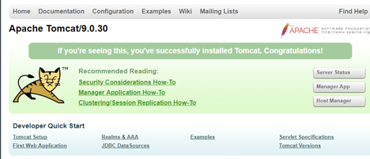

## Goal

- Setup development environment for the first project on your local laptop/desktop.
- Create and start a tomcat server on your local.
- Create a web project and add it to your tomcat server.

## Local Development Environment Setup

### Install Java

1. Step 1, **If you already have Java 8 or higher version, you can skip this**. Open this page: [ http://www.oracle.com/technetwork/java/javase/downloads/jdk8-downloads-2133151.html](http://www.oracle.com/technetwork/java/javase/downloads/jdk8-downloads-2133151.html)

2. Step 2, Accept the License Agreement and choose the right version for your OS.
   
3. Step 3, Download the package and install based on the instruction. Oracle may ask you to register an account before downloading.
4. Step 4: After installation, open a terminal or cmd to verify your java version is 1.8 or higher.

### Install Eclipse

1. Step 1, Open Eclipse Download page: https://www.eclipse.org/downloads/, Choose ‘Download Packages’
2. Step 2, Choose Eclipse for Enterprise Java Developers and download the archive based on your OS.
   
3. Step 3, After download, just unzip the archive to a directory you can remember, and then you can launch it from there.

### Install Apache Tomcat

1. Step 1 Open the official download page:http://tomcat.apache.org/download-90.cgi
2. Step 2, Choose the right version under Binary Distributions.
   
3. Step 3, Unzip the package to a directory you can remember. You’ll use that directory when you setup your server in Eclipse.

### Install Postman

1. Step 1, Open your chrome browser and search for Postman.
   

2. Step 2, Download and install it as a desktop application.
   

### Register AWS Account

[Homework] Create a personal account at http://aws.amazon.com.

## Recap of Last Lesson

### Web Application Introduction

- Client: user interface

- - A user interface is for users to interact with web services. UI can provide an easy way for you to send requests to backend service, and show you the corresponding response. It usually runs in the browser, but can be provided by mobile apps.

- Web Server: host web service

- - Service is a program that can receive different requests from different clients and return correct results, a web service is a service offered by a device to others over the internet.

- Database Server: host a database

- - A database is an organized collection of data, stored and accessed electronically.

- Internet

- - Make connections between client and server so that client can successfully send request to server, and the server can successfully send response to client.

  - - Make sure request/response destination is correct.
    - Make sure delivering connections are open for data transportation.
    - Make sure the data format is understandable.

### How to build a web application

**Three tier architecture**


#### **Presentation tier**

It’s the tier that users can access directly. It provides the application’s user interface. For example, how to show nearby positions in the browser, how to provide an easy way for users to send requests to backend.

Language: HTML, CSS, Javascript, ...

Again, this part will be covered by frontend lessons.

#### **Data tier**

Mostly we don’t need to create a database system ourselves, we just need to use an existing one like MySQL, or MongoDB. What we need to do is tell the database system how to store our data. For example, what does each table look like, what’s the relationship between each other.

Language: SQL

This part will be covered by database lessons.

#### **Logic tier**

Maintain the business logic of the application, sitting between presentation tier and data tier, receive request from presentation tier, make correct database operation, and return the final result back to the presentation tier.

Language: C++, Java, Go, Python, …

Overview of our project

### Overview of our project

**Job+: AWS based Web Service Development – Job Recommendation**

The project aims to use personalization to improve ticket search and recommendation

- Created Java servlets with **RESTful** APIs to handle HTTP requests and responses
- Built **MySQL** database on **Amazon RDS** to store position data from Github API
- Designed algorithms (e.g., **content-based** recommendation) to improve job recommendation based on search history and favorite records)
- Deployed server to **Amazon EC2** to handle 150 queries per second tested by Apache JMeter.

Demo website:


Project Structure:


    

## Difference between Web Application vs Web Server

1. A web server is a server that serves web pages to users via http.
2. A web application is one program that supports an individual business logic.
3. A web server can host multiple web applications (Job recommendation, Social Network, etc.)

## Setup Tomcat Server

### Tomcat

Apache Tomcat, often referred to as Tomcat Server, is an open-source Java Servlet Container developed by the Apache Software Foundation (ASF). Tomcat implements several Java EE specifications including Java Servlet, JavaServer Pages (JSP), Java EL, and WebSocket, and provides a "pure Java" HTTP web server environment in which Java code can run.

- RPC(Remote Procedure Call): a function call to a remote server.
- Java Servlet: Java class to handle RPC on server side.
- Tomcat is an environment to run your web service, it provides low level support such as making TCP connection, receiving request from client, finding the correct service to handle that request, and sending response back.
- If you want to create a web service based on Tomcat Server, all you need to do is implement the logic to handle certain HTTP requests.

Why do we use Tomcat in this project?

- One major Java framework (another one is Spring)
- Easy to learn and the concepts (servlets/handlers) have been used in many different frameworks

1. Step 1, create a new Workspace. Open Eclipse. In ‘File’ -> ‘Switch Workspace -> ‘Other’. Choose an empty folder.

   

   

   Your path can be different

2. Step 2, (optional) reset view. In ‘Window’->’Reset Perspective…’

3. Step 3, In the ‘Servers’ window, click ‘No servers are available. If you cannot find ‘Servers’, go to ‘Window’->’Show View’->’Servers’ and then ‘Servers’ would show up.

4. Step 4, Choose ‘Apache’->’Tomcat v9.0 Server’ and click Next. If you cannot find Tomcat v9.0 Server, it’s because the Eclipse version is too old. Either use a newer version of Eclipse or download an older version of Tomcat.

   

5. Step 5, Click ‘Browse’ and choose the ‘apache-tomcat-9.0.xxx’ that you have just downloaded and unzipped, click ‘Open’.

6. Step 6, Click ‘Finish’ and then you will find ‘Tomcat v9.0 Server at localhost ...’ in ‘Servers’ window

   

7. Step 7, Update Server configuration. Double Click ‘Tomcat v9.0 Server at localhost’ in Server window. In ‘Server Locations’, click ‘Use Tomcat installation ...’. **Save this file (Click the window to save + Mac:Command-S, Windows: Ctrl-S).**

   

8. Step 8, Right click ‘Tomcat v9.0 Server at localhost’, choose ‘Properties’. Click ‘Switch Location’ to change the location to /Servers/Tomcat v9.0 Server at localhost.server.

   

   

9. Step 9, To start the Tomcat Server, right click on ‘Tomcat v9.0 Server at localhost’ and click ‘Start’.

   

10. Step 10, Open your chrome browser, in the address bar, type [http://localhost:8080](http://localhost:8080/). Make sure you can view the start page.

    

    Now think about this question: what happened when I type http://localhost:8080 in browser?

## Run Your Project under Tomcat

**Maven**:

- What is Maven? Maven is a build automation tool used primarily for Java projects.
- Why do we use Maven? To simplify the dependency management for our Tomcat server. (Otherwise you have to manually import many jar files)
- Other dependency management tools? So many, python: PIP, go: dep, go module, etc.

### Create a new Web Project

1. Step 1, go to ‘File’ ->’New’->’**Maven Project**’

   

2. Step 2, Simply click Next on the first page, you don’t need to change anything.

   

3. Step 3, Under Archetype selection page, type webapp in the filter bar and select the only result(maven-archetype-webapp), then click Next.

   

4. Step 4, Choose a group id, an artifact id and a version number you like, it’ll be the name of your project, then click Finish. **Do not customize these names for now, otherwise it will be very difficult to debug**.

   

5. Step 5, Verify that your project is created. You don’t need to worry about the error from index.jsp file since it’ll be fixed in the next course.

   

6. Step 6, Right click the jupiter project under Project Explorer window, and click Configure Build Path under Build Path.

   

7. Step 7, Under Libraries tab, if the default Java library version is under java 1.8, you need to click Edit to update it. Why do we need to configure Java version and JRE?

   

8. Step 8, Under JRE System Library window, choose Execution Environment and find JavaSE-1.8, then click Finish.

   

9. Step 9, Expand your project and delete the index.jsp file under src/webapp folder since we’ll create our own frontend code in the future.

   

### Add Your Project to Tomcat

1. Step 1, right click on your ‘Tomcat v9.0 server at localhost’ and choose ‘Add and Remove’

   

2. Step 2, move Jupiter from left to right and click finish. What will happen if I have multiple web projects?

   

3. Step 3, Open pom.xml file, set java version and add Tomcat library as dependency of your project.

   

   ```xml
   <project xmlns="http://maven.apache.org/POM/4.0.0"
   	xmlns:xsi="http://www.w3.org/2001/XMLSchema-instance"
   	xsi:schemaLocation="http://maven.apache.org/POM/4.0.0 http://maven.apache.org/maven-v4_0_0.xsd">
   	<modelVersion>4.0.0</modelVersion>
   	<groupId>laiproject</groupId>
   	<artifactId>jupiter</artifactId>
   	<packaging>war</packaging>
   	<version>1.0</version>
   	<name>jupiter Maven Webapp</name>
   	<url>http://maven.apache.org</url>
   	<properties>
   		<javaVersion>1.8</javaVersion>
   		<maven.compiler.source>1.8</maven.compiler.source>
   		<maven.compiler.target>1.8</maven.compiler.target>
   	</properties>
   	<dependencies>
   		<dependency>
   			<groupId>junit</groupId>
   			<artifactId>junit</artifactId>
   			<version>3.8.1</version>
   			<scope>test</scope>
   		</dependency>
   		<dependency>
   			<groupId>org.apache.tomcat</groupId>
   			<artifactId>tomcat-catalina</artifactId>
   			<version>9.0.30</version>
   		</dependency>
   	</dependencies>
   	<build>
   		<finalName>jupiter</finalName>
   	</build>
   </project>
   ```

4. Step 4, **SAVE** your pom.xml change and right click your project under Project Explorer. Under Run As, click Maven Install to let Maven rebuild your project.

   

5. Step 5, Make sure you can see a successful result from the console.

   

### Test Your Project

1. Step 1, Restart your tomcat server and make sure there’s no error.

   

2. Step 2, Open a new tab in your, in the address bar, type http://localhost:8080/jupiter. Make sure you can view the start page.

   

3. Step 3, Go back to Eclipse and stop your tomcat server.

   

## Summary

- What is a web server vs a web application?
- How to setup your environment?
  - Start/Stop/Restart server
  - Add/Remove a web application from a server
