## Goal

* Recap basic concept about HTTP request and response

* Create your first servlet to implement a simple service

  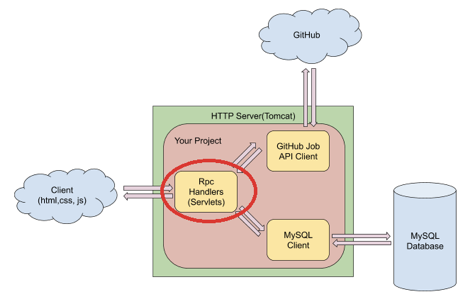

## Recap of Previous Lessons

### Tomcat Server

Apache Tomcat, often referred to as Tomcat Server, is an open-source Java Servlet Container developed by the Apache Software Foundation (ASF). Tomcat implements several Java EE specifications including Java Servlet, JavaServer Pages (JSP), Java EL, and WebSocket, and provides a "pure Java" HTTP web server environment in which Java code can run.

- RPC(Remote Procedure Call): a function call to a remote server. 
- Java Servlet: Java class to handle RPC on server side.
- Tomcat is an environment to run your web service, it provides low level support such as making TCP connection, receiving request from client, finding the correct service to handle that request, and sending response back.
- If you want to create a web service based on Tomcat Server, all you need to do is implement the logic to handle certain HTTP request.


### HTTP request and response


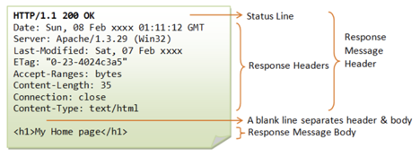

#### HTTP request method

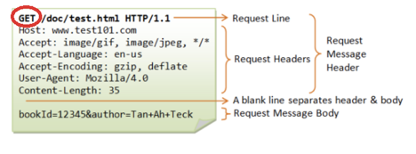

HTTP supports all CRUD (Create/Read/Update/Delete) operations. Two commonly used methods are:

**GET - Request** data from server.

**POST - Update** data on server. 

There are also other methods like delete, put, etc. In our application, we’ll use http methods directly to indicate what kind of operation a client wants to take. 

#### Resource Path

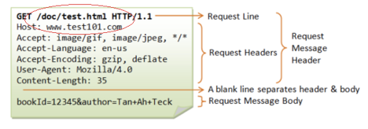

A URL is used to uniquely identify a resource over the web. URL has the following syntax:

*protocol://**hostname**:**port**/resource_path?query*

Examples:

http://www.laioffer.com:80/index.html

https://www.youtube.com/results?search_query=laioffer


#### HTTP request/response body

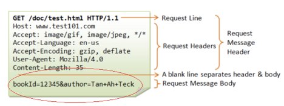

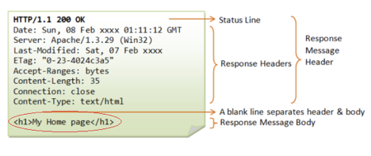

A message body is the one which carries the actual HTTP request data (including form data and uploaded etc.) and HTTP response data from the server ( including files, images etc). Normally we don’t return static HTML code to frontend directly because it should be created by frontend developer. We just need to return correct data that should be displayed by frontend. In our project, we’ll use JSON as for body format.

```java
teacher = {
  String class = "Laiproject",
  String name = “Vincent”
}
```

JSON(JavaScript Object Notation)
```json
"{
  “teacher”: {
     "class": "Laiproject",
     "name": “Vincent”,
  }, 
“Students”:[

],  
}"
```

## Create Java Servlet

1. Step 1, Open Eclipse and make sure your project is still there.

   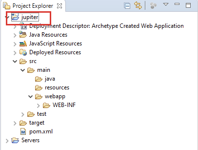

2. Step 2, Right click your project and create a new Servlet.

   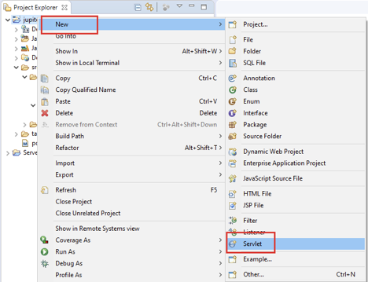

3. Step 3, Under Create Servlet window, use **SearchItem** as the Class name and **rpc** as Java package, then click Next.

   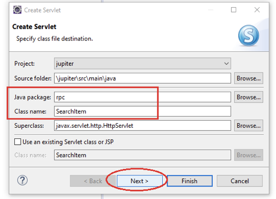

4. Step 4, Double click /SearchItem under URL mappings and update it to /search, then click OK to close the popup window.

   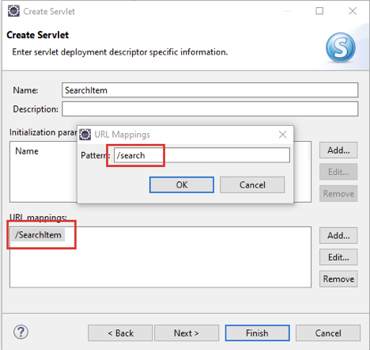

5. Step 5, Click Finish and Eclipse will create a Java class called SearchItem for you.

   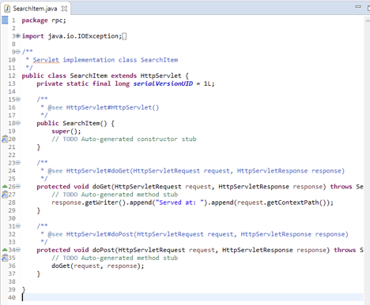

6. Step 6, Repeat the previous three steps to create another Servlet called **RecommendItem**. Make sure you use the same **rpc** package, and rename the URL mapping to **/recommendation**.

   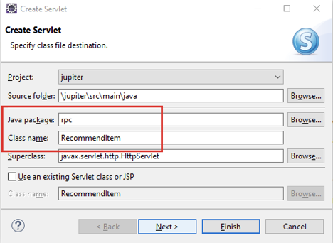

   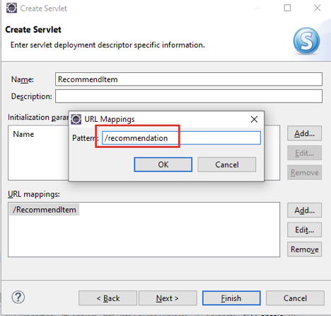

## Implement Your First Java Servlet

1. Step 1, Open SearchItem in your Eclipse and make sure there’s no error in your code.

   

2. Step 2, Right click ‘Tomcat v9.0 Server at localhost’ and click ‘Start’.

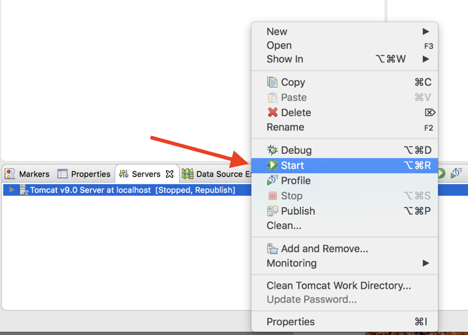

3. Step 3, Open your Chrome browser and type the following URL in the address bar: http://localhost:8080/jupiter/search, make sure you can see the similar result.

   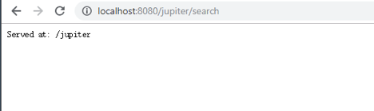

4. Step 4, Go back to your Eclipse and open pom.xml file, then add org.json as a dependency of your project.

   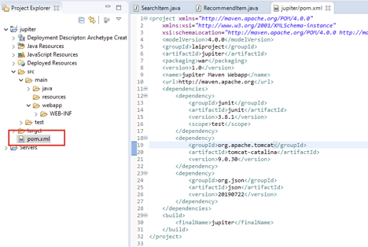

   ```xml
   <project xmlns="http://maven.apache.org/POM/4.0.0"
   	xmlns:xsi="http://www.w3.org/2001/XMLSchema-instance"
   	xsi:schemaLocation="http://maven.apache.org/POM/4.0.0 http://maven.apache.org/maven-v4_0_0.xsd">
   	<modelVersion>4.0.0</modelVersion>
   	<groupId>laiproject</groupId>
   	<artifactId>jupiter</artifactId>
   	<packaging>war</packaging>
   	<version>1.0</version>
   	<name>jupiter Maven Webapp</name>
   	<url>http://maven.apache.org</url>
   	<dependencies>
   		<dependency>
   			<groupId>junit</groupId>
   			<artifactId>junit</artifactId>
   			<version>3.8.1</version>
   			<scope>test</scope>
   		</dependency>
   		<dependency>
   			<groupId>org.apache.tomcat</groupId>
   			<artifactId>tomcat-catalina</artifactId>
   			<version>9.0.30</version>
   		</dependency>
   		<dependency>
   			<groupId>org.json</groupId>
   			<artifactId>json</artifactId>
   			<version>20190722</version>
   		</dependency>
   	</dependencies>
   	<build>
   		<finalName>jupiter</finalName>
   	</build>
   </project>
   ```

5. Step 5, Save your changes in pom.xml and rerun Maven Install to download the new json library.

   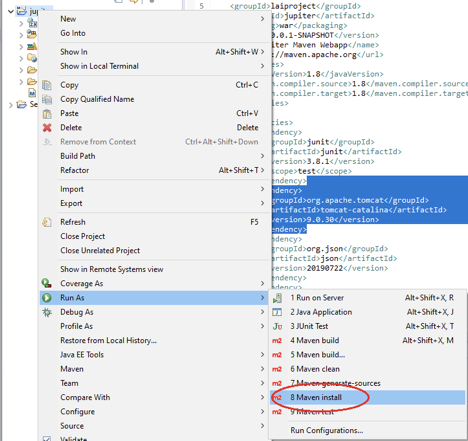

6. Step 6, Go back to SearchItem and update doGet() to return json format data as response. You also need to import three new libraries in your code.

   ```java
   package rpc;
   
   import java.io.IOException;
   import java.io.PrintWriter;
   
   import javax.servlet.ServletException;
   import javax.servlet.http.HttpServlet;
   import javax.servlet.http.HttpServletRequest;
   import javax.servlet.http.HttpServletResponse;
   
   import org.json.JSONException;
   import org.json.JSONObject;
   
   /**
    * Servlet implementation class SearchItem
    */
   public class SearchItem extends HttpServlet {
   	private static final long serialVersionUID = 1L;
   
   	/**
   	 * @see HttpServlet#HttpServlet()
   	 */
   	public SearchItem() {
   		super();
   		// TODO Auto-generated constructor stub
   	}
   
   	/**
   	 * @see HttpServlet#doGet(HttpServletRequest request, HttpServletResponse
   	 *      response)
   	 */
   	protected void doGet(HttpServletRequest request, HttpServletResponse response)
   			throws ServletException, IOException {
   		response.setContentType("application/json");
   		PrintWriter writer = response.getWriter();
   		JSONObject obj = new JSONObject();
   		try {
   			obj.put("username", "abcd");
   		} catch (JSONException e) {
   			e.printStackTrace();
   		}
   		writer.print(obj);
   	}
   
   	/**
   	 * @see HttpServlet#doPost(HttpServletRequest request, HttpServletResponse
   	 *      response)
   	 */
   	protected void doPost(HttpServletRequest request, HttpServletResponse response)
   			throws ServletException, IOException {
   		// TODO Auto-generated method stub
   		doGet(request, response);
   	}
   }
   ```

   

7. Step 7, save your changes and restart your Tomcat server.

   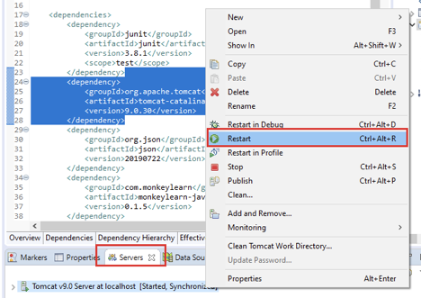

8. Step 8, Use the same URL http://localhost:8080/jupiter/search to test your service. Make sure you can see the following result.

   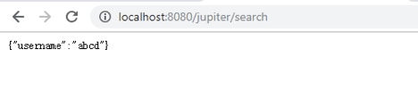

9. Step 9, Since our project should project dynamic services to users, it should be able to return different results based on different parameters from user input. Update the code in doGet() method to make the code check username parameter from user request.

   ```java
   package rpc;
   
   import java.io.IOException;
   import java.io.PrintWriter;
   
   import javax.servlet.ServletException;
   import javax.servlet.http.HttpServlet;
   import javax.servlet.http.HttpServletRequest;
   import javax.servlet.http.HttpServletResponse;
   
   import org.json.JSONException;
   import org.json.JSONObject;
   
   /**
    * Servlet implementation class SearchItem
    */
   public class SearchItem extends HttpServlet {
   	private static final long serialVersionUID = 1L;
   
   	/**
   	 * @see HttpServlet#HttpServlet()
   	 */
   	public SearchItem() {
   		super();
   		// TODO Auto-generated constructor stub
   	}
   
   	/**
   	 * @see HttpServlet#doGet(HttpServletRequest request, HttpServletResponse
   	 *      response)
   	 */
   	protected void doGet(HttpServletRequest request, HttpServletResponse response)
   			throws ServletException, IOException {
   		response.setContentType("application/json");
   		PrintWriter writer = response.getWriter();
   		if (request.getParameter("username") != null) {
   			JSONObject obj = new JSONObject();
   			String username = request.getParameter("username");
   			try {
   				obj.put("username", username);
   			} catch (JSONException e) {
   				e.printStackTrace();
   			}
   			writer.print(obj);
   		}
   	}
   
   	/**
   	 * @see HttpServlet#doPost(HttpServletRequest request, HttpServletResponse
   	 *      response)
   	 */
   	protected void doPost(HttpServletRequest request, HttpServletResponse response)
   			throws ServletException, IOException {
   		// TODO Auto-generated method stub
   		doGet(request, response);
   	}
   }
   ```

10. Step 10, Save the change and open a new tab in your browser. Put

    http://localhost:8080/jupiter/search?username=1234 in the address bar and make sure you can see a similar result.

    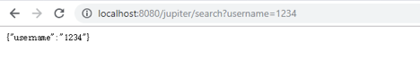

11. Step 11, Now update your doGet() method again to return a JSONArray format data in response. JSONArrray is the structure which contains a series of JSONObject. Again, don’t forget to import org.json.JSONArray in your code.

    ```java
    package rpc;
    
    import java.io.IOException;
    import java.io.PrintWriter;
    
    import javax.servlet.ServletException;
    import javax.servlet.http.HttpServlet;
    import javax.servlet.http.HttpServletRequest;
    import javax.servlet.http.HttpServletResponse;
    
    import org.json.JSONArray;
    import org.json.JSONException;
    import org.json.JSONObject;
    
    /**
     * Servlet implementation class SearchItem
     */
    public class SearchItem extends HttpServlet {
    	private static final long serialVersionUID = 1L;
    
    	/**
    	 * @see HttpServlet#HttpServlet()
    	 */
    	public SearchItem() {
    		super();
    		// TODO Auto-generated constructor stub
    	}
    
    	/**
    	 * @see HttpServlet#doGet(HttpServletRequest request, HttpServletResponse
    	 *      response)
    	 */
    	protected void doGet(HttpServletRequest request, HttpServletResponse response)
    			throws ServletException, IOException {
    		response.setContentType("application/json");
    		PrintWriter writer = response.getWriter();
    		
    		JSONArray array = new JSONArray();
    		try {
    			array.put(new JSONObject().put("username", "abcd"));
    			array.put(new JSONObject().put("username", "1234"));
    		} catch (JSONException e) {
    			// TODO Auto-generated catch block
    			e.printStackTrace();
    		}
    		writer.print(array);
    	}
    
    	/**
    	 * @see HttpServlet#doPost(HttpServletRequest request, HttpServletResponse
    	 *      response)
    	 */
    	protected void doPost(HttpServletRequest request, HttpServletResponse response)
    			throws ServletException, IOException {
    		// TODO Auto-generated method stub
    		doGet(request, response);
    	}
    }
    ```

12. Step 12, Save the changes and go back to your browser, then use the following URL to test:

    http://localhost:8080/jupiter/search

    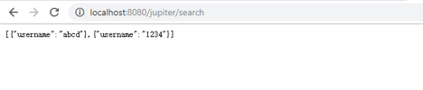

## Implement The Second Servlet

1. Step 1, Similar to SearchItem, open RecommendItem in Eclipse and try to update doGet() to return the following JSON Array in response body.

   ```json
   [
     {
   	“name”: “abcd ”,
   	“address”: “san francisco”,
   	“time”: “01/01/2017”
     },
     {
   	“name”: “1234 ”,
   	“address”: “san jose”,
   	“time”: “01/02/2017”
     }
   ]
   ```

   ```java
   package rpc;
   
   import java.io.IOException;
   import java.io.PrintWriter;
   
   import javax.servlet.ServletException;
   import javax.servlet.http.HttpServlet;
   import javax.servlet.http.HttpServletRequest;
   import javax.servlet.http.HttpServletResponse;
   
   import org.json.JSONArray;
   import org.json.JSONException;
   import org.json.JSONObject;
   
   /**
    * Servlet implementation class RecommendItem
    */
   public class RecommendItem extends HttpServlet {
   	private static final long serialVersionUID = 1L;
          
   	/**
   	* @see HttpServlet#HttpServlet()
   	*/
   	public RecommendItem() {
   		super();
   		// TODO Auto-generated constructor stub
   	}
   
   	/**
   	 * @see HttpServlet#doGet(HttpServletRequest request, HttpServletResponse response)
   	 */
   	protected void doGet(HttpServletRequest request, HttpServletResponse response) throws ServletException, IOException {
   		response.setContentType("application/json");
   		PrintWriter writer = response.getWriter();
   		
   		JSONArray array = new JSONArray();
   		try {
   			array.put(new JSONObject().put("name", "abcd").put("address", "San Francisco").put("time", "01/01/2017"));
   			array.put(new JSONObject().put("name", "1234").put("address", "San Jose").put("time", "01/01/2017"));
   		} catch (JSONException e) {
   			e.printStackTrace();
   		}
   		writer.print(array);
   	}
   
   	/**
   	 * @see HttpServlet#doPost(HttpServletRequest request, HttpServletResponse response)
   	 */
   	protected void doPost(HttpServletRequest request, HttpServletResponse response) throws ServletException, IOException {
   		// TODO Auto-generated method stub
   		doGet(request, response);
   	}
   }
   ```

2. Step 2, Save your changes and restart your server, then use the following URL to test the result: http://localhost:8080/jupiter/recommendation. 

   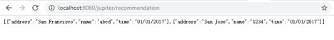

## Add RpcHelper Utility Class

1. Step 1, to reduce some duplicate codes, add a new utility class called RpcHelper to handle all rpc parsing codes. Right click on package ‘rpc’ and choose New->Class. **Careful, choose class instead of servlet.**

   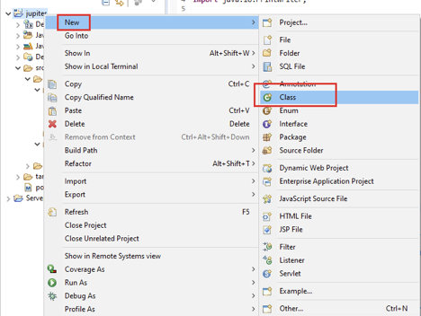

2.Step 2, Use rpc as package name and RpcHelper as class name, and then click Finish.

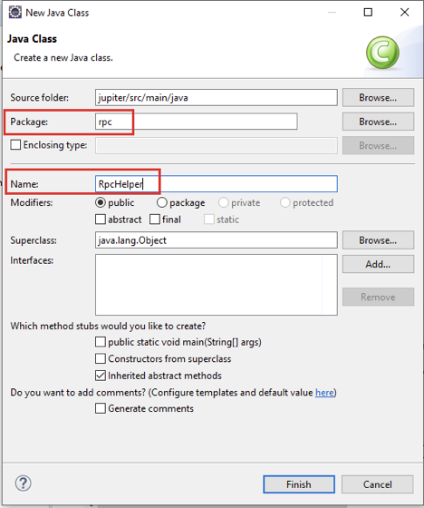

 3. Step 3, Create two functions in this class, named writeJsonObject and writeJsonArray.

    ```java
    package rpc;
    
    import java.io.IOException;
    import javax.servlet.http.HttpServletResponse;
    import org.json.JSONArray;
    import org.json.JSONObject;
    
    public class RpcHelper {
    	// Writes a JSONArray to http response.
    	public static void writeJsonArray(HttpServletResponse response, JSONArray array) throws IOException{
    	}
    
      // Writes a JSONObject to http response.
    	public static void writeJsonObject(HttpServletResponse response, JSONObject obj) throws IOException {		
    	}
    }
    ```

	4. Step 4, Update both writeJsonObject() and writeJsonArray().

    ```java
    public class RpcHelper {
    	// Writes a JSONArray to http response.
    	public static void writeJsonArray(HttpServletResponse response, JSONArray array) throws IOException {
    		response.setContentType("application/json");
    		response.getWriter().print(array);
    	}
    
    	// Writes a JSONObject to http response.
    	public static void writeJsonObject(HttpServletResponse response, JSONObject obj) throws IOException {
    		response.setContentType("application/json");
    		response.getWriter().print(obj);
    	}
    }
    ```

	5. Step 5, (Optional) Update doGet() method of SearchItem.java to use the new utility function.

    ```java
    protected void doGet(HttpServletRequest request, HttpServletResponse response)
    			throws ServletException, IOException {
    		
    		JSONArray array = new JSONArray();
    		try {
    			array.put(new JSONObject().put("username", "abcd"));
    			array.put(new JSONObject().put("username", "1234"));
    		} catch (JSONException e) {
    			// TODO Auto-generated catch block
    			e.printStackTrace();
    		}
    		RpcHelper.writeJsonArray(response, array);
    	}
    ```

	6. Step 6, (Optional) Similar update for doGet() in RecommendItem.java.

    ```java
    protected void doGet(HttpServletRequest request, HttpServletResponse response)
    			throws ServletException, IOException {
    		
    		JSONArray array = new JSONArray();
    		try {
    			array.put(new JSONObject().put("name", "abcd").put("address", "San Francisco").put("time", "01/01/2017"));
    			array.put(new JSONObject().put("name", "1234").put("address", "San Jose").put("time", "01/01/2017"));
    		} catch (JSONException e) {
    			e.printStackTrace();
    		}
    
    		RpcHelper.writeJsonArray(response, array);
    	}
    ```

## Design of Backend Services(RESTful)

Several ideas we’ve already mentioned earlier

- Using HTTP methods to indicate what kind of operation a client wants to take.
- Using HTTP url to indicate which service and data a client wants to use and what kind of data they request.
- Every request is separated, there is no support for doing one post request in several post requests, or doing a delete in a pair of get and post requests.

Why do we want to do that?

- Operations are directly based on HTTP methods, so that server don’t need to parse extra thing
- URL clearly indicates which resources a client wants, easy for client side users to understand.
- Server is running in stateless mode, improving scalability.

## Summary

* Recap basic concept about HTTP request and response
* Create your first servlet to implement a simple service