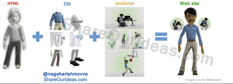
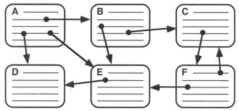
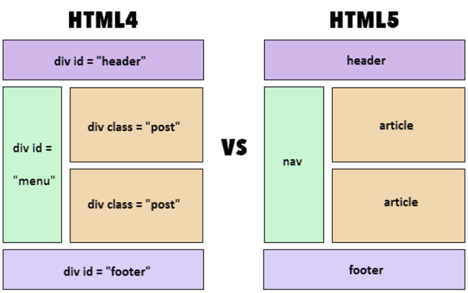
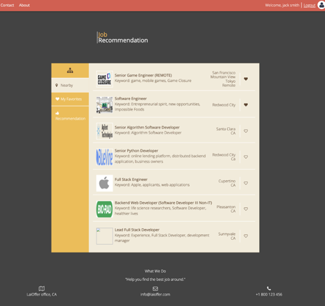

## Goal

* Basic Web Technologies
* HTML Structure
* HTML Tags
* HTML Semantic Tags
* Project HTML demo

### Basic Web Technologies

* HTML - 页面**结构**

* CSS - 页面的样式**表现**

* JavaScript - 交互**行为**

  

### HTML 发展历史

* HTML 1.0 超文本标记语言(第一版) -- 在1993年6月发为互联网工程工作小组(IETF)工作草案发布(并非标准)
* HTML 2.0 -- 1995年11月作为RFC 1866发布,在RFC 2854于2000年6月发布之后被宣布已经过时
* HTML 3.2 -- 1996年1月14日,W3C推荐标准
* HTML 4.0 -- 1997年12月18日,W3C推荐标准
* XHTML 1.0 -- 发布于2000年1月26日,是W3C推荐标准,后来经过修订于2002年8月1日重新发布
* XHTML 1.1 -- 于2001年5月31日发布
* **HTML 5.0 -- 2014年10月29日，该标准规范终于制定完成**

**Note: XHTML - 可扩展超文本标记语言XHTML（eXtensible HyperText Markup Language），是HTML 4.01的第一个修订版本**

### HTML Structure

What is HTML?

Hypertext Markup Language (中文：超文本标记语言)



What is HTML structure?

最简单的HTML

```html
<!DOCTYPE html>
<html>
   <head></head>
   <body></body>
</html>
```

标签的分类

```html
单标签：<br />   
双标签：<p></p>    <div></div>
```

标签的属性

```html
<a href=”xxx” target=”_blank”>link</a>
```

### HTML Tags

The syntax

```html
<tagname>content goes here...</tagname>
```

Tags(标签)

1. <!DOCTYPE> (声明)
   
   </!doctype>

2. \<html>

3. \<body>

4. \<ul>

5. \<div>

6. \<span>

7. \<a>

8. \

9. \<header>

10. \<nav>

11. \<section>

12. \<aside>

13. 
    \</footer>

#### <!DOCTYPE>标签

* <!DOCTYPE> declaration is **not** an HTML tag 

*  it is an instruction to the web browser about what version of HTML the page is written in and how to render the content

* always add the <!DOCTYPE> declaration to your HTML documents.

* html5的声明是<!DOCTYPE html> ( for more info: [https://www.w3schools.com/tags/tag_doctype.asp](https://www.w3schools.com/tags/tag_doctype.asp）) )

#### \<html>标签

* \<html> element represents the root (top-level element) of an HTML document
* all other elements must be descendants of this element
* \<html>是html的开始，\</html>是html的结束，之间是html文档的\<head>和\<body>

#### \<head>标签

* provides general information (metadata) about the document,including its title and links to its scripts and style sheets.

* after \<html> tag

* only 1 pair of <head> tag in a html document

* contains:

  * 标题标签 \<h1> - \<h6>
  * 段落标签 \<p>
  * 注释标签 <!-- comment -- >
  * 水平线标签 \<hr>
  * 换行标签 \<br>
  * 文本节标签 \<span>

  * ...

#### \<ul>标签 - 无序列表标签

* represents an unordered list of items
* typically rendered as a bulleted list
* uses with \<li>

#### \<ol>标签 - 有序 列表标签

*  represents an ordered list of items

*  An ordered list can be numerical or alphabetical.

* uses with \<li>


#### \<li>标签

*  represent an item in a list.

* must be contained in a parent element: an ordered list (\<ol>), an unordered list (\<ul>), or a menu (\<menu>).


#### \<a>标签 - 超级链接标签

* creates a hyperlink to other web pages, files, locations within the same page, email addresses, or any other URL.

* \<a href="[https://www.google.com](https://www.google.com/)" target="_blank">Google</a>

* href attribute: contains a URL or a URL fragment that the hyperlink points to.

* #: link to an element with a specified id within the page (like href="#top")

* target attribute: _blank vs. _self


#### \标签 - 图片标签

* defines an image in an HTML page.
* has two required attributes: src and alt: \
* has no end tag(self-closing tag).
* for more info: https://www.w3schools.com/tags/tag_comment.asp

### Block Elements vs Inline Elements

#### \<div> 标签

* the generic container for flow content and does not inherently represent anything.
* use it to group elements for purposes.

#### recall \<span>标签

* a generic inline container for phrasing content.
* does not inherently represent anything.
* use it to group elements for purposes.

### HTML Semantic Tags

A semantic element clearly describes its meaning to both the browser and the developer.

* examples of **non-semantic** elements: \<div> and \<span> - tells nothing about its content.
* examples of **semantic** elements: \<form>, \<table>, and \<article> - clearly defines its content.



Semantic elements

* \<header> 页眉:

 represents a container for introductory content or a set of navigational links.

* \<section> 区块: 

represents a standalone section of functionality contained within an HTML document, typically with a heading, which doesn't have a more specific semantic element to represent it.

* \<aside> 侧边栏: 

represents a section of a document with content connected tangentially to the main content of the document (often presented as a sidebar).

* \<nav> 导航: 

represents a section of a page whose purpose is to provide navigation links, either within the current document or to other documents. Common examples of navigation sections are menus, tables of contents, and indexes.

* \<footer> 页脚: 

defines a footer for a document or section which contain information about its containing element.

### Project HTML demo



1. Step 1: Structure

   ```html
   <!DOCTYPE html>
   <html>
      <head>
      </head>
      <body>
          <header>
    
          </header>
         
          <div>
    
          </div>
         
          <footer>
             
          </footer>
      </body>
   </html>
   ```

2. Step 2: Header

   ```html
   			<header>
              <nav>
                  <a href="">Home</a>
                  <a href=”#name">Contact</a>
                  <a href="">About</a>
              </nav>
         </header>
   ```

3. Step 3: Footer

   ```html
         <footer>
              <p>What We Do</p>
              <p>"Help you find the best place around."</p>
              <ul>
                  <li>
                      <p>LaiOffer office, CA</p>
                  </li>
                  <li>
                      <p>info@laioffer.com</p>
                  </li>
                  <li>
                      <p>+1 800 123 456</p>
                  </li>
              </ul>
         </footer>
   ```

4. Step 4: Main section

   ```html
   		<div>
              <header>
                  <p>
                      <span>Item</span>
                      <br/> Recommendation
                  </p>
              </header>
    
              <section>
                  <aside>
                      <nav>
                          <a href="#">Nearby</a>
                          <a href="#">My Favorites</a>
                          <a href="#">Recommendation</a>
                      </nav>
                  </aside>
    
                  <ul>
                      <li>
                          
                          <div>
                              <a href="#">Job</a>
                              <p>Senior Software Engineer</p>
                          </div>
                          <p>699 Calderon Ave<br/>Mountain View<br/> CA</p>
                      </li>
                  </ul>
              </section>
          </div>
   ```

5. Step 5: metadata

   ```html
   		<head>
          <meta charset="UTF-8">
          <meta name="description" content="Item Recommendation">
          <meta name="author" content="Your Name">
          <title>Item Recommendation Final</title>
      </head>
   ```

   Below is our html page, it’s super simple, nothing fancy, but we will style it

   **This is the final HTML of this lesson:**

   https://jsbin.com/watomewoto/edit?html,output

### What Are the Differences?

class, id attributes: css & JavScript

\<i>: The HTML \<i> element represents a range of text that is set off from the normal text for some reason, for example, technical terms, foreign language phrases, or fictional character thoughts. It is typically displayed in italic type.

fa: http://fontawesome.io/

Resources:

https://developer.mozilla.org/en-US/docs/Web/HTML/Element

https://jsbin.com/?html,output

Chrome Developer Tool

###  HTML 面试资料整理

1. http://www.toptal.com/html5/interview-questions (HTML5)
2. http://blog.teamtreehouse.com/to-close-or-not-to-close-tags-in-html5