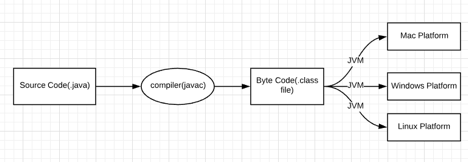
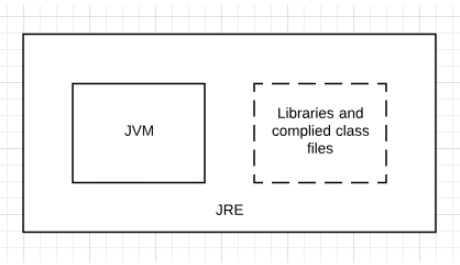
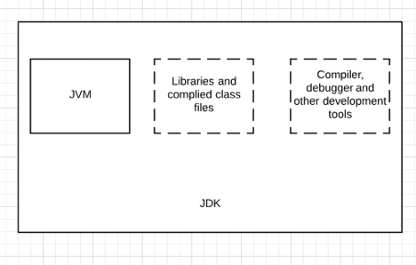
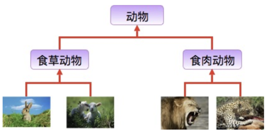

## Outline & Goals

1. Java是如何work的，编译语言和解释性语言的区别编译语言 vs. 解释语言： JavaScript， Python， In the middle: Java 开发效率 vs performance ？JVM，JRE， JDK的概念
2. 什么是面向对象编程？OOP的4大原则
3. Java 这门语言本身的一些比较关键的语法和性质

### Difference between JDK, JRE & JVM



**JVM** (Java Virtual Machine) is an abstract machine. It provides the runtime environment in which Java bytecode can be executed.


* What

  Java Virtual Machine, a program that load the .class java files, interpret and run the Java Application (JDK = JRE + Developing tools such as javac, JRE = JVM + core class library)

Three main components:

	1. Class Loader Subsystem 
 	2. JVM Memory Space 
 	3. Execution Engine 
 	4. JNI

* Class Loader Subsystem

  The main task is to load .class files into the memory, do some verification, and initialize the static variables.

1. Loading: for each .class files, store class and class members’ information to the method area, also create an object of Type class in the heap. For an object of this class, we can invoke getClass() to get class information for this object.
2. Linking: Verify if .class byte-code files are properly formatted and generated, and initialize the memory space
3. Initialization: all static variables are assigned with their values defined in the code or static block, store all static variables in the permanent generation

* JVM memory space

1. Method area: shared, one per JVM, store all classes’ information, and all class members’ information
2. Stack area: not shared, each thread has a run-time stack in this area, will be destroyed after thread terminate. store the local variables and function calls for a thread.
3. Heap area (young/old/permanent): shared, one per JVM, all static variables, all objects are stored here, and monitored by GC.
4. PC register: store the program counter for each thread.
5. Native Method Stack: store the native method information for each thread

* Execution Engine

1. Interpreter: read the .class bytecode line by line and interpret to machine code that can be understood by machine.
2. Just-In-Time Compiler (JIT): for repeated .class bytecode, compile the .class bytecode further to machine code can be understood by CPU, therefore, every time the interpreter see a repeated method calls, JIT just provide the machine code, speed up the performance about ~ 50%
3. Garbage Collector

* JNI + Native Method Libraries

  Provide the interfaces that allow JVM to call C/C++ libraries, and to be called.

**JRE** is the environment within which the java virtual machine runs. JRE contains the Java Virtual Machine(JVM), class libraries, and other files excluding development tools such as compiler and debugger.



**JDK** is a superset of the JRE, it contains everything that JRE has along with development tools such as compiler, debugger etc.



What is the classpath

**Classpath** is a parameter in the Java Virtual Machine or the Java compiler that specifies the location of user-defined classes and packages.

### OOP features

* **Encapsulation**: Wrapping object state(fields) and behavior(methods) into a single unit. If you are creating a class, you are doing encapsulation.

* **Inheritance**: The process by which one class acquires the properties and functionalities of another class is called inheritance. Inheritance provides the idea of reusability of code and each subclass defines only those features that are unique to it, the rest of the features can be inherited from the parent class.



* **Polymorphism:** It performs a single action in different ways.

* **Abstraction:** Design level: abstract class and interface.

#### Abstract class

A class that is declared with the **abstract** keyword is known as an abstract class in Java. It can have abstract and non-abstract methods (method with the body). It needs to be extended by implementing all abstract methods. It **CAN NOT** be instantiated.

#### Interface

An interface is a blueprint of a class, which can be declared by using **interface** keyword. Interfaces can contain only constants and abstract methods (methods with only signatures no body).Like abstract classes, Interfaces cannot be instantiated, they can only be implemented by classes or extended by other interfaces. 

#### Abstract class vs Interface

| Abstract class                                               | Interface                                                    |
| ------------------------------------------------------------ | ------------------------------------------------------------ |
| Abstract class doesn't support multiple inheritance, it can extend only one class or one abstract class at a time | Interface supports multiple inheritance, it can extend any number of interfaces at a time |
| Abstract class can have final, non-final, static and non-static variables with any access specifier | Interface has only static, public and final variables        |
| An abstract class can have both abstract and concrete methods | An interface can have only abstract methods. Since Java 8, it can have default and static methods also |
| The **abstract** keyword is used to declare abstract class   | The **interface** keyword is used to declare interface       |
| An abstract class can be extended using keyword "extends"    | An interface class can be implemented using keyword "implements" |

When and which one to use? 

1. Abstract class is good if you want to provide a common base class for derived class. 
2. Abstract class is also good if you want to have non-public methods. All methods must be public in interface.
3. Abstract class is good if you will need to add methods in the future. If you add a method to an interface, then all classes implement the interface need to be changed.
4. If you think the API will not change for a while, and you want a meaning as ‘has an ability to do something’, you can use interface

#### Abstraction vs Encapsulation in Java

Abstraction is more about hiding the details at the design level, Encapsulation is more about hiding the details at implementation level. For example, we have a vehicle, we know it can move, it might move using tiers, it might fly, all we need to know is it can move. Then for encapsulation, for example, when we implement a HashMap, to solve the collision, we either use a linked list, or we use a red-black tree for each bucket. We can change the internal implementation without affecting the clients who use the HashMap.

#### Overloading vs Overriding

| Overloading                                                  | Overriding                                                   |
| ------------------------------------------------------------ | ------------------------------------------------------------ |
| The binding of overloaded method call to its definition has happens at compile-time | The binding of overridden method call to its definition happens at runtime |
| Static methods can be overloaded which means a class can have more than one static method of the same name | Static methods cannot be overridden                          |
| Method overloading is performed within class                 | Method overriding occurs in two classes that have IS-A (inheritance) relationships |
| Argument list should be different while doing method overloading | Argument list should be same in method Overriding            |
| Return type of method does not matter in case of method overloading, it can be the same or different | In case of method overriding the overriding method can have more specific return type |

### Java Syntax and some important features

#### What is class object / instances & reference?

List<Integer> list = new ArrayList<>();

A class is a group of objects which have common properties. It is a template or blueprint from which objects are created. A class in java can contain fields, methods, constructors, blocks, nested class. 

What is An entity that has state and behavior is known as an object. An object is an instance of a class.

#### Data Types in Java

Primitives vs Reference Type

#### Functions & Constructor

(access modifier) (static/non-static) (return type) (name) (parameter) {}

What is constructor

In Java, a constructor is a block of code similar to the method. It is called when an instance of the object is created, and memory is allocated for the object. 

super keyword

The super keyword in Java is a reference variable which is used to refer to immediate parent class object. Whenever you create the instance of subclass, an instance of the parent class is created implicitly which is referred by super reference variable.

#### Static vs non-static

Static keyword can be used with class, variable, method and block. Static members belong to the class instead of a specific instance, this means if you make a member static, you can access it without object.

- **Static block**: Static block is used for initializing the static variables.This block gets executed when the class is loaded in the memory.
- **Static variable**: A static variable is common to all the instances (or objects) of the class because it is a class level variable.
- **Static method**: A static method belongs to the class rather than the object of a class, it can be invoked without the need for creating an instance of a class and can access static data member and can change the value of it.
- **Static class**: A class can be made **static** only if it is a nested class. https://blog.csdn.net/iispring/article/details/46490319

#### final / finally / finalize

The final keyword in java is used to restrict the user, it can be used in many contexts, such as variable, method and class.

- **Java final variable**

A final variable that have no value it is called blank final variable or uninitialized final variable. It can be initialized in the constructor only. The blank final variable can be static also which will be initialized in the static block only.

- **Java final method**

If you make any method as final, you cannot override it.

* **Java final class**

If you make any class as final, you cannot extend it.

#### Access modifier

There are **four types** of access specifiers in java:

- **public:** Accessible to all. Other objects can also access this member variable or function.
- **private:** Not accessible by other objects. Private members can be accessed only by the methods in the same class. **Object accessible only in class in which they are declared.**
- **protected:** The scope of a protected variable is within the class which declares it and in the class which inherits from the class (Scope is class and subclass). Protected method can be accessed via subclass and classes in the same package or different package.
- **Default:** Scope is Package Level. We do not need to explicitly mention default as when we do not mention any access specifier it is considered as default.

```java
package JavaBasic.pack1;

public class C {
	protected int x = 1;
	
	protected void msg() {
		System.out.println("Hello C");
	}
}

package JavaBasic.pack2;

import JavaBasic.pack1.*;

class B extends C {
	public static void main(String args[]) {
		C c = new C();
		c.msg(); // compile error
		
		B b = new B();
		b.msg(); // Since B extends C, it can see the protected method
	}
}
```

```java
package JavaBasic.pack1;

public class D {
           // default method
	void msg() {
		System.out.println("Hello D");
	}
}

package JavaBasic.pack1;

public class A {
	public static void main(String[] args) {
		D d = new D();
		d.msg(); // since D has same package with D, so d can see the default method
	}
}

package JavaBasic.pack2;

import JavaBasic.pack1.D;
public class E {
	public static void main(String[] args) {
		D d = new D();
		d.msg() // compile error, since E and D in different packages
	}
}
```

