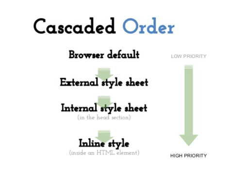
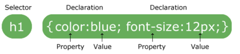
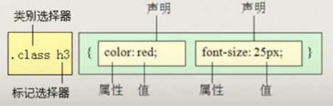
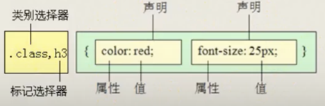
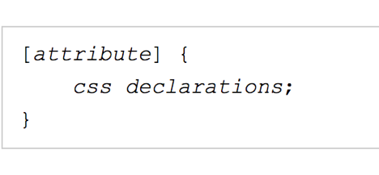
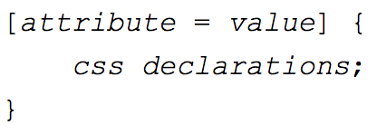
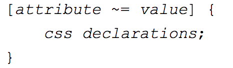

## Goals

1. What is CSS
2. CSS Syntax
3. CSS Selectors
4. CSS Priorities
5. CSS Cascading and Inheritance
6. CSS Specificity

### What is CSS

1. What is CSS?

   1. CSS stands for Cascading Style Sheets.

   2. describes how HTML elements (titles, images, paragraph...) are to be displayed on screen, paper, or in other media

   3. CSS Versions： 2.1 -> 3.0

   4. Popular browsers：

      

   5. Three useful links: https://www.w3schools.com/cssref/css3_browsersupport.asp (only CSS)

   6. [https://www.caniuse.com](https://www.caniuse.com/) (HTML, CSS, JavaScript...)

   7. The usage share of web browsers: http://gs.statcounter.com/

2. How to add CSS to HTML?

   1. Inline Styles (Highest priority)

      ```html
      <h1 style="color:blue;">This is a heading</h1>
      ```

   2. Internal Style (Priority lower than inline style)

      ```html
      <head>
        <style>
          h1 {	color: maroon;   }
        </style>
      </head>
      ```

   3. External Style (Priority lower than internal style)

      * Each page must include a reference to the external style sheet file inside the \<link> element. 
      * The \<link> element goes inside the \<head> section:

      ```html
      <head>
        <link rel="stylesheet" type="text/css" href="mystyle.css">
      </head>
      ```

      Frequently used attributes for \<link> tag:

      type attr: specifies the media type of the linked document 

      rel：specifies the relationship between the current document and the linked document

      href：specifies the location of the linked document

   4. default style

      All tags have default styles. Default style has lowest priority has can been seen in the diagram below.

      

   

### CSS Syntax and Selectors



The selector 

* points to the HTML element you want to style. 

The declaration block 

* contains one or more declarations separated by semicolons.

* each declaration includes a CSS property name and a value, separated by a colon.

* always ends with a semicolon

* declaration blocks are surrounded by curly braces.

#### Commonly used CSS properties

width - (宽度)， unit: px（像素）

height - (高度)

color - (前景色， 也就是文字的颜色)

background-color - (背景色)

font-size - (字体的大小)

In class exercise 1:

```html
<!-- set h1 tag font color as red, using inline style-->
<h1 style=”color:red;”>I like web development</h1>

<!-- set p tag background color to blue, using internal style-->
<p style=”background-color:blue”>I am a paragraph</p>

<!-- set span font size to 24px, using internal style-->
<span style=”font-size:24px;”>I am a span</span>
```

https://jsbin.com/tarofazuyi/edit?html,output

#### CSS Comments

* syntax 

```css
/* comments */
```


* multiple comment lines

```css
/* comment 1 
	   Comment 2 */

	/* comment 1
             * comment 2
	 * comment 3 
	 */
```

#### CSS Selectors

1. all elements *
2. element
3. \#id 
4. .class
5. element element
6. element, element
7. element > element
8. [attribute]
9. pseudo classes
10. pseudo elements

The above are commonly used selectors, for more info please refer to link below

https://www.w3schools.com/cssref/css_selectors.asp


all elements *****

```css
* {
  color: blue;
}
```

element

* The element selector selects elements based on the element name.
* e. g. p selects all \<p> elements

```css
p {
  color: blue;
}
```

id #

* The id selector uses the id attribute of an HTML element to select a specific element.
* The id of an element should be unique within a page, so the id selector is used to select one unique element!
* To select an element with a specific id, write a hash (#) character, followed by the id of the element.
* Must contain at least one character.
* Must not contain any space characters.

e.g. #firstname - selects the element with id="firstname"

```css
<li id="li-ca">CA</li> 

#li-ca {
  color: blue;
}
```

.class

* The class selector selects elements with a specific class attribute.
* To select elements with a specific class, write a period (.) character, followed by the name of the class.

e.g. .intro - selects all elements with class="intro"

Exercise 2

```html
<!-- h1 - set font to 30px， font size to 30px-->
<!-- date - set font color to purple， font size to 24px -->
<!-- author - set font color to green， font size to 24px -->
<!-- news content - set font color to blue， font size to 18px-->


<h1>Amazon picks 20 finalists for its second headquarters</h1>
<p>by Kaya Yurieff from cnn January 18, 2018: 10:44 AM ET </p>
<p>Amazon has released a "short" list of cities it's considering for its second headquarters.</p>
<p>The 20 potential cities are Atlanta; Austin; Boston; Chicago; Columbus, Ohio; Dallas; Denver; Indianapolis; Los Angeles; Miami; Montgomery County, Maryland; Nashville; Newark; New York City; Northern Virginia; Philadelphia; Pittsburgh; Raleigh; Toronto and Washington, D.C.</p>
```

https://jsbin.com/vuvefuroye/edit?html,css

Combinator

A CSS selector can contain more than one simple selector

https://www.w3schools.com/css/css_combinators.asp

Element - "descendant selector (后代选择器)"

The descendant selector matches all elements that are descendants of a specified element.

e.g. div p - selects all <p> elements inside <div> elements

https://www.w3schools.com/cssref/tryit.asp?filename=trycss_sel_element_element



element 并集选择器

e.g. div, p - selects all <div> elements and all <p> elements

https://www.w3schools.com/cssref/tryit.asp?filename=trycss_sel_element_comma



element - “child selector (子元素选择器)"

The child selector selects all elements that are the immediate children of a specified element.

e.g. div > p - selects all <p> elements where the parent is a <div> element

https://www.w3schools.com/cssref/tryit.asp?filename=trycss_sel_element_gt

attribute

1. selects all elements with a given attribute

* https://www.w3schools.com/cssref/tryit.asp?filename=trycss_sel_attribute

  

2. Selects all elements with attribute = value

   https://www.w3schools.com/cssref/tryit.asp?filename=trycss_sel_attribute_value

   

3. select elements with an attribute value containing a specified word.

   https://www.w3schools.com/cssref/tryit.asp?filename=trycss_sel_attribute_value_contains

   

Pseudo Classes

pseudo classes:  pseudo-class is used to define a special **state** of an element.

:hover - (div:hover) selects links on mouse over

:first-child - (p:first-child) selects every <p> element that is the first child of its parent

https://jsbin.com/bapewicowo/1/edit?html,css,output


Pseudo elements

pseudo elements:  is a keyword added to a selector that lets you style a specific part of the selected element(s)

https://www.w3schools.com/cssref/tryit.asp?filename=trycss_sel_before

it can be used to:

- Style the first letter, or line, of an element
- Insert content before, or after, the content of an element

::first-element (does not work on inline elements, such as span)

### CSS Cascade and Inheritance

#### Inheritance

* some property values applied to an element will be inherited by that element's children, and some won't.
*  font-family and color to be inherited, as that makes it easy for you to set a site-wide base font by applying a font-family to the \<html> element; 

#### CSS Cascade

At some point in your work, you'll find yourself in the situation where multiple CSS rules will have selectors matching the same element. In such cases, which CSS rule "wins", and ends up being the one that is finally applied to the element? This is controlled by a mechanism called the Cascade

What selectors win out in the cascade depends on the three factors(these are listed in order of weight - **earlier ones will overrule laters ones**):

​	1. Important (don’t recommend to use it)

​	2. Specificity

​	3. Source order

In CSS, there is a special piece of syntax you can use to make sure that a certain declaration will *always* win over all others: !important. For example:

```css
a { color: blue !important; }
.nav a { color: red; }
```

https://jsbin.com/bogugakako/2/edit?html,css,output

#### Specificity（优先级）

**Specificity: Which Style Wins**

Specificity is basically a measure of how specific a selector is — how many elements it *could* match.

Specificity - CSS provides a formula for determining a style’s specificity that’s based on a value assigned to the style’s selector - a tag selector, class selector, ID selector, and so on. Here’s how the system works:

- A tag selector is worth one - specificity = 0,0,0,1.
- A class selector is worth ten - specificity = 0,0,1,0.
- An ID selector is worth hundreds - specificity = 0,1,0,0.
- An inline style is worth thousands - specificity = 1,0,0,0.

Now let’s try this exercise together, who’s interested in finishing this specificity form with me?

Note: A **pseudo-element (like ::before)** is treated like a tag selector and is worth one. A **pseudo-class (:link)** is treated like a class and is worth ten.

!important: positive infinite

| ***selector***                    | **ID** **hundreds (0100)** | ***Class*** ***tens* (0010)** | ***Tag*** ***ones* (0001)** | ***total\*** |
| --------------------------------- | -------------------------- | ----------------------------- | --------------------------- | ------------ |
| p                                 |                            |                               | 1                           | 1            |
| .byline                           |                            | 1                             |                             | 10           |
| p.byline                          |                            | 1                             | 1                           | 11           |
| #banner                           | 1                          |                               |                             | 100          |
| #banner p                         | 1                          |                               | 1                           | 101          |
| #banner .byline                   | 1                          | 1                             |                             | 110          |
| a:link                            |                            | 1                             | 1                           | 11           |
| h2 strong                         |                            |                               | 2                           | 2            |
| #wrapper #content .byline a:hover | 2                          | 2                             | 1                           | 221          |

#### Source Order

As mentioned above, if multiple competing selectors have the same importance *and* specificity, the third factor that comes into play to help decide which rule wins is source order — later rules will win over earlier rules

* margin, padding, border, and background-image to NOT be inherited

### 总结

就近原则：本层的style比继承的style强

评分原则(Specificity): 分高的比分低的强

加载原则：后load比先load的rule强

1. Default CSS → 2. Inherited CSS → 3. Selectors Specified CSS 

   3.1 多个选择器给elements的rule有重复，Check Seletor Sepecificity 

   3.2 如果Sepecificity 一样，看加载顺序

!important 无视以上顺序(Do not use)


*More info:*

https://css-tricks.com/specifics-on-css-specificity/

https://developer.mozilla.org/en-US/docs/Web/HTML/Element/link