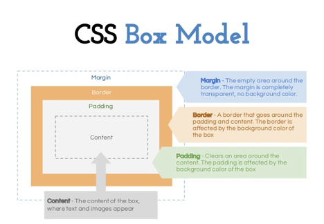
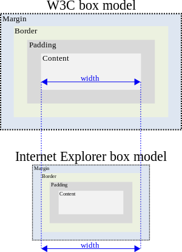
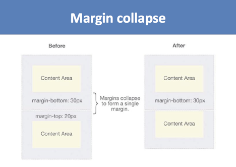
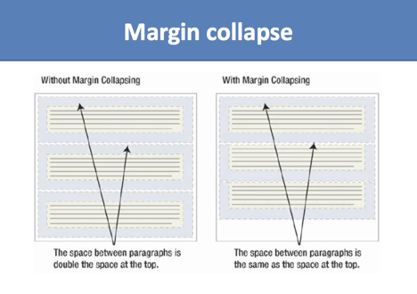
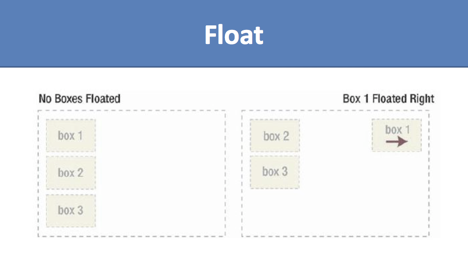
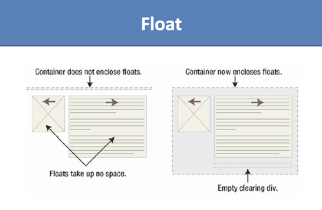
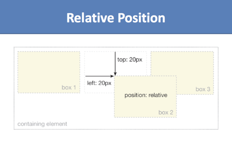
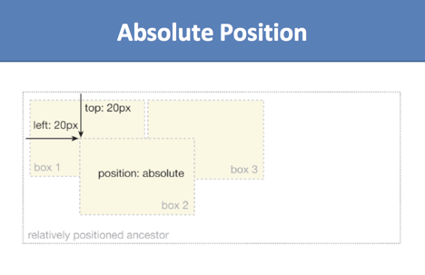
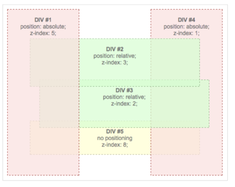
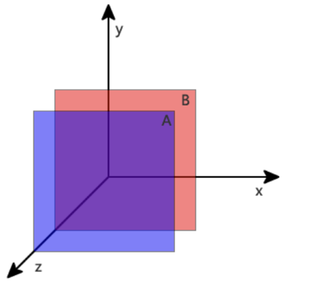

## Goals

1. Box Model
2. CSS Layout (Float/Display/Position/Z-index)
3. Flex box
4. Project Demo

### Box Model



box-sizing is a super important property in CSS3, when we talk about box model, a lot of designers feel confused, if we don’t understand box model, it’s hard to make pixel-perfect design.

There are actually two types of box model, one is W3C standard, the other is IE model. Basically they all calculate the element width and height based on the content width, content height, padding and border, but their formula are different:

1. **W3C standard**

<u>outer box (element space size)</u>

​	Element space width = content width + padding + border + margin

​	Element space height = content height + padding + border + margin

<u>inner box (element size)</u>

​	Element width = content width + padding + border

​	Element height = content height + padding + border

2. **IE box model**

<u>*outer box (element space size)*</u>

​	Element space width = content width + margin 

​	Element space height = content height + margin

​		(content width including padding and border)



In order to make sure we apply the same box model to all browsers, CSS3 provides us with the new box-sizing property:

box-sizing: content-box || border-box || inherit

Box model demo: https://jsbin.com/kekikiseco/edit?html,css,output

### Margin Collapsing





Test Margin Collapse

https://css-tricks.com/what-you-should-know-about-collapsing-margins/

Demo: https://jsbin.com/hegisig/edit?html,css,output

### Layout

#### Float

Floating plays an important role in layout the pages. Before CSS3 (which brings new Flexbox), websites use floating technique to organize the layout of the content. Bootstrap uses grid layout system which is very similar to the table layout except that it supports responsive design better.


block element无法识别float demo:

https://jsbin.com/yusoxux/1/edit?html,css,output


Recommended Video:

[CSS Float and Clear Explained - How does CSS float and clear work?](https://www.youtube.com/watch?v=xara4Z1b18I)


**Important facts**

1. float first

When a container has multiple elements, some of them are floating, some of them are 

not, remember to put all the floating elements in front of the non-floating ones! Browsers

try to figure out the spacing for those floating ones first.



2. clear

The clear property specifies on which sides of an element floating elements are not allowed to float.

```css
.clear { clear: both; /* it can be left|right|both */ }
```



### Display

**block**: A block-level element starts on a new line and stretches out to the left and right as far as it can.

**inline**: An inline element can wrap some text inside a paragraph without disrupting the flow of that paragraph.

**inline-block**

Floating works great, but as you see we need to apply the .clear to clear out the floating even for a block element. There is another way to achieve the floating effect, that is to use inline-block display.

similar to inline, inline-block allows multiple elements to layout on the same line, the beauty of it is that elements can automatically wrap around if the wrapper container is too small, and if you add a block element right after an inline-block element, we don’t need to use the ugly .clear fix.

### Position

**static (default)**

Default value, means the element is **not positioned**! A static element is said to be not positioned and an element with its position set to anything else is said to be positioned.

**relative**

The top, right, bottom and left properties of a relatively-positioned element will cause it to be adjusted away from **its original position**. Other content will not be adjusted to fit into any gap left by the element.



**Absolute**

How to use Absolute Demo: https://jsbin.com/kilukam/edit?html,css,output

The top, right, bottom and left properties of an absolute-positioned element will cause it to be positioned relatively to **the nearest positioned ancestor**.



**fixed**

A fixed element is positioned **relative to the viewport**, which means it always stays in the same place even if the page is scrolled. 

Position Example

http://jsbin.com/xepegoh/5/edit?html,css,output

More readings: 

http://learnlayout.com/position-example.html

### Z-index

The z-index property specifies the stack order of an element. An element with greater stack order is always in front of an element with a lower stack order.

Demo: https://jsbin.com/vedimoh/edit?html,css,output

**Important**: **z-index only works on positioned elements** 

**(position:absolute, relative, fixed).**





### Flexbox

Flexbox is another important concept we used in CSS to help layout the page. Basically we have a flex container and flex items.

Flexbox Demo:

https://jsbin.com/mucageb/edit?html,css,output

https://css-tricks.com/snippets/css/a-guide-to-flexbox/


### Codes

https://jsbin.com/nusisaq/edit?html,css,output