## Goal

- Overview of GitHub Job API.
- Call GitHub Job API with Java code.
- Connect GitHub Job API with SearchItem servlet.

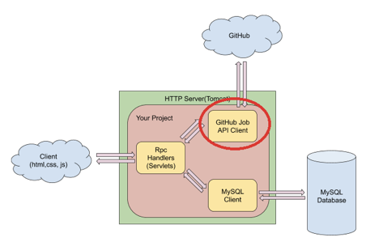

### Add RpcHelper Utility Class

1. Step 1, to reduce some duplicate codes, add a new utility class called RpcHelper to handle all RPC parsing codes. Right-click on package ‘rpc’ and choose New->Class. **Careful, choose class instead of servlet.**

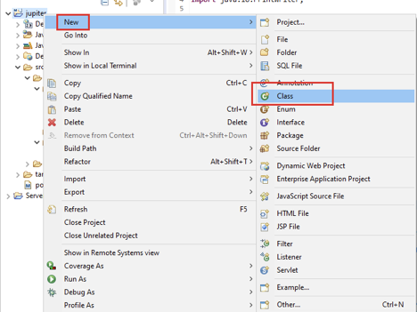

2. Step 2, Use rpc as package name and RpcHelper as the class name and then click Finish.

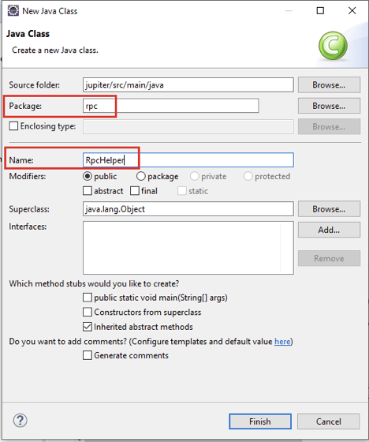

3. Step 3, Create two functions in this class, named writeJsonObject and writeJsonArray.

```java
package rpc;

import java.io.IOException;
import javax.servlet.http.HttpServletResponse;
import org.json.JSONArray;
import org.json.JSONObject;

public class RpcHelper {
	// Writes a JSONArray to http response.
	public static void writeJsonArray(HttpServletResponse response, JSONArray array) throws IOException{

	}

              // Writes a JSONObject to http response.
	public static void writeJsonObject(HttpServletResponse response, JSONObject obj) throws IOException {		
	}
}
```

4. Step 4, Update both writeJsonObject() and writeJsonArray().

```java
public class RpcHelper {
	// Writes a JSONArray to http response.
	public static void writeJsonArray(HttpServletResponse response, JSONArray array) throws IOException {
		response.setContentType("application/json");
		response.getWriter().print(array);
	}

	// Writes a JSONObject to http response.
	public static void writeJsonObject(HttpServletResponse response, JSONObject obj) throws IOException {
		response.setContentType("application/json");
		response.getWriter().print(obj);
	}
}
```

5. Step 5, (Optional) Update doGet() method of SearchItem.java to use the new utility function.

```java
protected void doGet(HttpServletRequest request, HttpServletResponse response)
			throws ServletException, IOException {

		
		JSONArray array = new JSONArray();
		try {
			array.put(new JSONObject().put("username", "abcd"));
			array.put(new JSONObject().put("username", "1234"));
		} catch (JSONException e) {
			// TODO Auto-generated catch block
			e.printStackTrace();
		}

		RpcHelper.writeJsonArray(response, array);
	}
```

6. Step 6, (Optional) Similar update for doGet() in RecommendItem.java.

```java
protected void doGet(HttpServletRequest request, HttpServletResponse response)
			throws ServletException, IOException {
		
		JSONArray array = new JSONArray();
		try {
			array.put(new JSONObject().put("name", "abcd").put("address", "San Francisco").put("time", "01/01/2017"));
			array.put(new JSONObject().put("name", "1234").put("address", "San Jose").put("time", "01/01/2017"));
		} catch (JSONException e) {
			e.printStackTrace();
		}
		RpcHelper.writeJsonArray(response, array);
	}
```

### GitHub Job API Introduction

GitHub Job API is a web-based API provided by GitHub so that clients can get real jobs data from the GitHub server. You cannot see the source code of it, but you can refer to the documentation to figure out how to use the interface to make connections by sending requests to its backend. 

Official Documentation: https://jobs.github.com/api

#### Request highlight

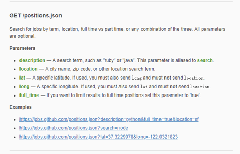

**Http method: GET**

URL of discover API (*protocol://**hostname**:**port**/resource_path**?query*) :

- protocol: https

- hostname: jobs.github.com

- resource path: /positions.json

- query:

- - description: search a specific kind of jobs
  - lat/long: lat/long since our search is based on client location


https://jobs.github.com/positions.json?description=developer&lat=37&long=-122

#### Response Highlight

Open your browser or postman, put the above URL in the address bar, hit Enter and check the response from GitHub.

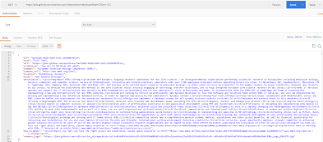

Response Status: Should be 200 if you have a valid request.

Response body: jobs are returned in a format of JSONArray, each object in the array is a specific job with some detailed information.

### Connect to GitHub Job API

1. Step 1, Go back to your Eclipse and open pom.xml file, then add org.json as a dependency of your project.

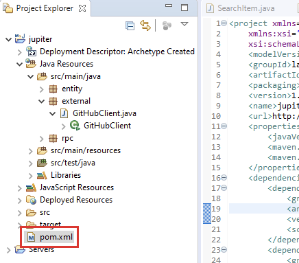

```xml
<project xmlns="http://maven.apache.org/POM/4.0.0"
	xmlns:xsi="http://www.w3.org/2001/XMLSchema-instance"
	xsi:schemaLocation="http://maven.apache.org/POM/4.0.0 http://maven.apache.org/maven-v4_0_0.xsd">
	<modelVersion>4.0.0</modelVersion>
	<groupId>laiproject</groupId>
	<artifactId>jupiter</artifactId>
	<packaging>war</packaging>
	<version>1.0</version>
	<name>jupiter Maven Webapp</name>
	<url>http://maven.apache.org</url>
	<dependencies>
		<dependency>
			<groupId>junit</groupId>
			<artifactId>junit</artifactId>
			<version>3.8.1</version>
			<scope>test</scope>
		</dependency>
		<dependency>
			<groupId>org.apache.tomcat</groupId>
			<artifactId>tomcat-catalina</artifactId>
			<version>9.0.30</version>
		</dependency>
		<dependency>
			<groupId>org.json</groupId>
			<artifactId>json</artifactId>
			<version>20190722</version>
		</dependency>
		<dependency>
			<groupId>org.apache.httpcomponents</groupId>
			<artifactId>httpclient</artifactId>
			<version>4.5.10</version>
		</dependency>
	</dependencies>
	<build>
		<finalName>jupiter</finalName>
	</build>
</project>
```

2. Step 2, Save your changes in pom.xml and rerun Maven Install to download the new json library.


3. Step 3, Open your jupiter project in Eclipse, right-click the project name and select New -> Class.

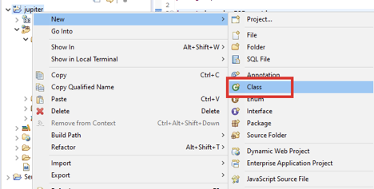

4. Step 4, Under the class create window, put external as package name and GitHubClient as the class name, then click Finish.

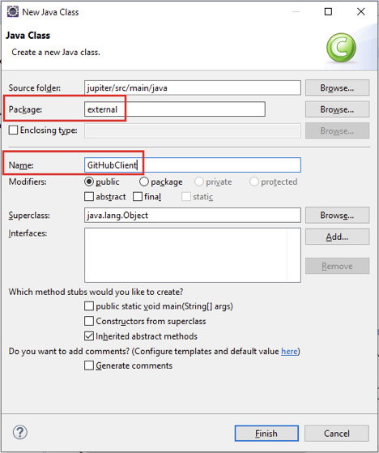

5. Step 5, Add some constants to the GitHubClient class. Replace “YOUR_API_KEY” with your own key. You can also copy all import lines that we’ll use in the next step.

```java
package external;

import java.io.BufferedReader;
import java.io.IOException;
import java.io.InputStreamReader;
import java.io.UnsupportedEncodingException;
import java.net.URLEncoder;

import org.apache.http.HttpEntity;
import org.apache.http.client.ClientProtocolException;
import org.apache.http.client.methods.CloseableHttpResponse;
import org.apache.http.client.methods.HttpGet;
import org.apache.http.impl.client.CloseableHttpClient;
import org.apache.http.impl.client.HttpClients;
import org.json.JSONArray;
import org.json.JSONObject;

public class GitHubClient {
	private static final String URL_TEMPLATE = "https://jobs.github.com/positions.json?description=%s&lat=%s&long=%s";
	private static final String DEFAULT_KEYWORD = "developer";
}
```

6. Step 6, add a new search method which calls GitHub Job API and returns the jobs information.

```java
package external;
...

public class GitHubClient {
	private static final String URL_TEMPLATE = "https://jobs.github.com/positions.json?description=%s&lat=%s&long=%s";
	private static final String DEFAULT_KEYWORD = "developer";

	public JSONArray search(double lat, double lon, String keyword) {
		if (keyword == null) {
			keyword = DEFAULT_KEYWORD;
		}
		try {
			keyword = URLEncoder.encode(keyword, "UTF-8");
		} catch (UnsupportedEncodingException e) {
			e.printStackTrace();
		}
		String url = String.format(URL_TEMPLATE, keyword, lat, lon);
		CloseableHttpClient httpClient = HttpClients.createDefault();
		try {
			CloseableHttpResponse response = httpClient.execute(new HttpGet(url));
			if (response.getStatusLine().getStatusCode() != 200) {
				return new JSONArray();
			}
			HttpEntity entity = response.getEntity();
			if (entity == null) {
				return new JSONArray();
			}
			BufferedReader reader = new BufferedReader(new InputStreamReader(entity.getContent()));
			StringBuilder responseBody = new StringBuilder();
			String line = null;
			while ((line = reader.readLine()) != null) {
				responseBody.append(line);
			}
			return new JSONArray(responseBody.toString());
		} catch (ClientProtocolException e) {
			e.printStackTrace();
		} catch (IOException e) {
			e.printStackTrace();
		}
		return new JSONArray();
	}
}
```

7. Step 7, To test the result, create a main function to call your search function.

```java
package external;
...

public class GitHubClient {

              public JSONArray search(double lat, double lon, String keyword) {
                             ...
              }

	public static void main(String[] args) {
		GitHubClient client = new GitHubClient();
		JSONArray jobs = client.search(37.38, -122.08, null);
		try {
			for (int i = 0; i < jobs.length(); ++i) {
				JSONObject job = jobs.getJSONObject(i);
				System.out.println(jobs.toString(2));
			}
		} catch (Exception e) {
			e.printStackTrace();
		}
	}
}
```

8. Step 8, Save your changes. Right click GitHubClient.java and select “Run As Java Application”. Make sure your console in Eclipse can print something like below.

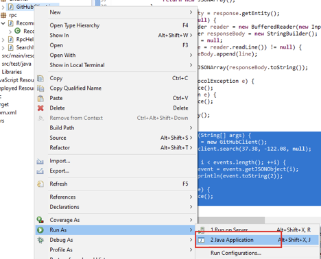

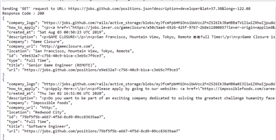

### Connect GitHub Job API with SearchItem Servlet

1. Step 1, Update doGet() method in rpc/SearchItems.java to use the GitHubClient.

```java
package rpc;

import java.io.IOException;

import javax.servlet.ServletException;
import javax.servlet.http.HttpServlet;
import javax.servlet.http.HttpServletRequest;
import javax.servlet.http.HttpServletResponse;

import external.GitHubClient;

public class SearchItem extends HttpServlet {
              ...
	protected void doGet(HttpServletRequest request, HttpServletResponse response)
			throws ServletException, IOException {
		double lat = Double.parseDouble(request.getParameter("lat"));
		double lon = Double.parseDouble(request.getParameter("lon"));

		GitHubClient client = new GitHubClient();
		RpcHelper.writeJsonArray(response, client.search(lat, lon, null));
	}
              ...
}
```

2. Step 2, Save your changes and start the Tomcat server. Open your browser(or postman) and put the following URL: http://localhost:8080/jupiter/search?lat=37.38&lon=-122.08 in the address bar.

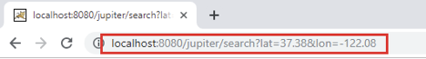

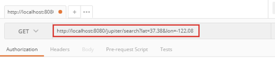

3. Step 3, Verify that job information is included in the response.

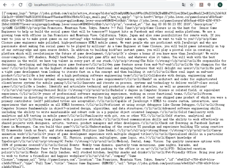

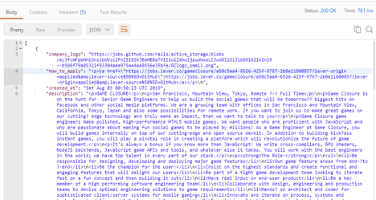

## Summary

* Overview of GitHub Job API
* Call GitHub Job API with Java code
* Connect GitHub Job API with SearchItem servlet