## Goal

* Understand how to create objects with a builder pattern.
* Purify jobs data returned from GitHub Job API to only have the information we need.

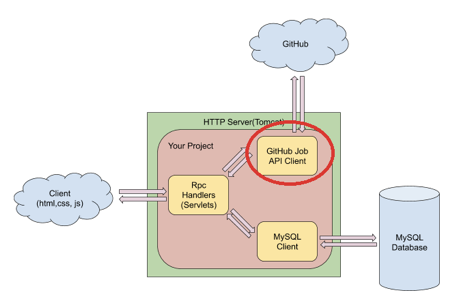

## Recap of the last lesson

### Calling Github Job API with Java code.

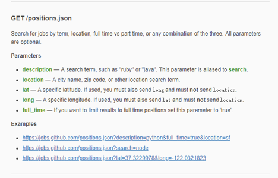

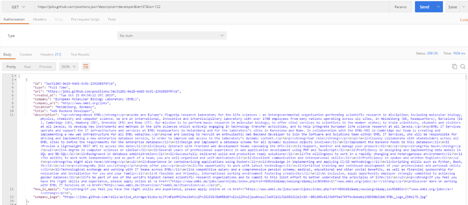

## Purify Data from GitHub

GitHub Job API response is dirty. We’ll try to find and save fields that are needed by our project.

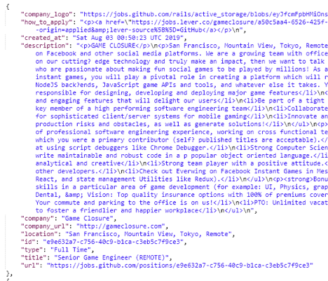

### Create an Item class to hold data fields that are needed for our project

1. Step 1, Open your jupiter project in Eclipse, right-click the project name and select New -> Class.

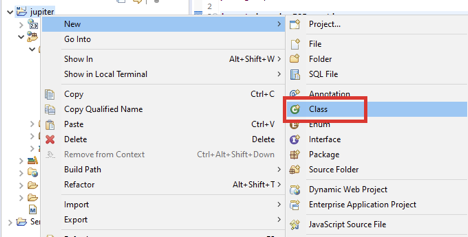

2. Step 2, Under the class create window, put external as package name and GitHubClient as the class name, then click Finish.

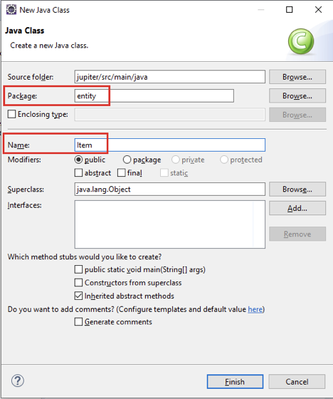

3. Step 3, Copy the following private fields into Item class.

```java
package entity;

import java.util.Set;

public class Item {
	private String itemId;
	private String name;
	private String address;
	private Set<String> keywords;
	private String imageUrl;
	private String url;

}
```

4. Step 4, to make data fields can be accessed by others, normally we need Getter and Setter for each of them. In this case, we just need Getters because we don’t want to change an item instance once it’s constructed.

   

   Eclipse provides a way to add Getters quickly. Click Source and choose Generate Getters and Setters.

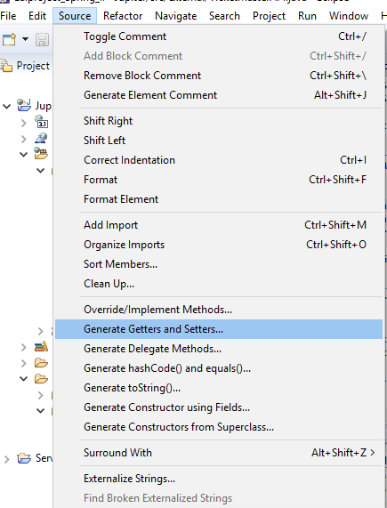

Choose “Select Getters”. Click OK. Eclipse will automatically generate all the getters. 

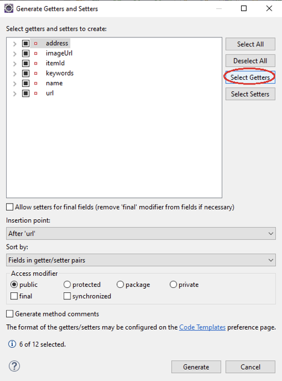

5. Step 5, Add toJSONObject() method which can convert an Item object to a JSONObject instance because, in our application, the frontend code cannot understand Java objects, it can only understand JSON format data.

```java
package entity;

import java.util.Set;

import org.json.JSONArray;
import org.json.JSONException;
import org.json.JSONObject;

public class Item {
	private String itemId;
	private String name;
	private String address;
	private Set<String> keywords;
	private String imageUrl;
	private String url;

	public String getItemId() {
		return itemId;
	}

	public String getName() {
		return name;
	}

	public String getAddress() {
		return address;
	}

	public Set<String> getKeywords() {
		return keywords;
	}

	public String getImageUrl() {
		return imageUrl;
	}

	public String getUrl() {
		return url;
	}

	public JSONObject toJSONObject() {
		JSONObject obj = new JSONObject();
		try {
			obj.put("item_id", itemId);
			obj.put("name", name);
			obj.put("address", address);
			obj.put("keywords", new JSONArray(keywords));
			obj.put("image_url", imageUrl);
			obj.put("url", url);
		} catch (JSONException e) {
			e.printStackTrace();
		}
		return obj;
	}

}
```

6. Step 6, to create an instance of Item, we need to have constructors.

   

   Builder pattern builds a complex object using simple objects and using a step by step approach. It separates the construction of a complex object from its representation so that the same construction process can create different representations. We can also make the object to build immutable. 

   

   For example,

   Developers need to write a set of constructors:

   Item(String itemId);

   Item(String name);

   Item(String itemId, String name);

   …

   

   Item item = new Item(itemId, name);

   

   An easier way:

   Clients construct the instance flexibly:

   Item item = new ItemBuilder().setItemId().setName().set....build();

   

   1. Step 6.1, Add static class ItemBuilder in Item class. Copy all fields from Item to ItemBuilder.

```java
package entity;

...

public class Item {
              …

public JSONObject toJSONObject() {
    ...
}

public static class ItemBuilder {
    private String itemId;
    private String name;
    private String address;
    private String imageUrl;
    private String url;
    private Set<String> keywords;
}

}
```

   2. Step 6.2 Generate Setters for all data fields in ItemBuilder

```java
package entity;

...

public class Item {
              …

public JSONObject toJSONObject() {
    ...
}

public static class ItemBuilder {
    private String itemId;
    private String name;
    private String address;
    private String imageUrl;
    private String url;
    private Set<String> keywords;

    public void setItemId(String itemId) {
        this.itemId = itemId;
    }

    public void setName(String name) {
        this.name = name;
    }

    public void setAddress(String address) {
        this.address = address;
    }

    public void setImageUrl(String imageUrl) {
        this.imageUrl = imageUrl;
    }

    public void setUrl(String url) {
        this.url = url;
    }

    public void setKeywords(Set<String> keywords) {
        this.keywords = keywords;
    }

}

}
```

   3. Step 6.3 Define a build function to create a ItemBuilder object from Item object.

```java
package entity;

...

public class Item {
              …

public JSONObject toJSONObject() {
    ...
}

public static class ItemBuilder {
    private String itemId;
    private String name;
    private String address;
    private String imageUrl;
    private String url;
    private Set<String> keywords;

    public void setItemId(String itemId) {
        this.itemId = itemId;
    }

    public void setName(String name) {
        this.name = name;
    }

    public void setAddress(String address) {
        this.address = address;
    }

    public void setImageUrl(String imageUrl) {
        this.imageUrl = imageUrl;
    }

    public void setUrl(String url) {
        this.url = url;
    }

    public void setKeywords(Set<String> keywords) {
        this.keywords = keywords;
    }

    public Item build() {
        return new Item(this);
    }
}
```

   4. Step 6.4 Create a private constructor to use builder pattern.

```java
package entity;

...

public class Item {
private String itemId;
private String name;
private String address;
private Set<String> keywords;
private String imageUrl;
private String url;

private Item(ItemBuilder builder) {
    this.itemId = builder.itemId;
    this.name = builder.name;
    this.address = builder.address;
    this.imageUrl = builder.imageUrl;
    this.url = builder.url;
    this.keywords = builder.keywords;
}

public String getItemId() {
    return itemId;
}

public String getName() {
    return name;
}

public String getAddress() {
    return address;
}

public Set<String> getKeywords() {
    return keywords;
}

public String getImageUrl() {
    return imageUrl;
}

public String getUrl() {
    return url;
}
              ...
}
```

   Final version of Item.java:

```java
package entity;

import java.util.Set;

import org.json.JSONArray;
import org.json.JSONException;
import org.json.JSONObject;

public class Item {
private String itemId;
private String name;
private String address;
private Set<String> keywords;
private String imageUrl;
private String url;

private Item(ItemBuilder builder) {
    this.itemId = builder.itemId;
    this.name = builder.name;
    this.address = builder.address;
    this.imageUrl = builder.imageUrl;
    this.url = builder.url;
    this.keywords = builder.keywords;
}

public String getItemId() {
    return itemId;
}

public String getName() {
    return name;
}

public String getAddress() {
    return address;
}

public Set<String> getKeywords() {
    return keywords;
}

public String getImageUrl() {
    return imageUrl;
}

public String getUrl() {
    return url;
}

public JSONObject toJSONObject() {
    JSONObject obj = new JSONObject();
    try {
        obj.put("item_id", itemId);
        obj.put("name", name);
        obj.put("address", address);
        obj.put("keywords", new JSONArray(keywords));
        obj.put("image_url", imageUrl);
        obj.put("url", url);
    } catch (JSONException e) {
        e.printStackTrace();
    }
    return obj;
}

public static class ItemBuilder {
    private String itemId;
    private String name;
    private String address;
    private String imageUrl;
    private String url;
    private Set<String> keywords;

    public void setItemId(String itemId) {
        this.itemId = itemId;
    }

    public void setName(String name) {
        this.name = name;
    }

    public void setAddress(String address) {
        this.address = address;
    }

    public void setImageUrl(String imageUrl) {
        this.imageUrl = imageUrl;
    }

    public void setUrl(String url) {
        this.url = url;
    }

    public void setKeywords(Set<String> keywords) {
        this.keywords = keywords;
    }
    
    public Item build() {
        return new Item(this);
    }
}
}
```

### Use Item class in GitHubSlient to get clean data

1. Step 1, add purify method in GitHubClient.java to convert JSONArray to a list of items.

```java
package external;

...

public class GitHubClient {
              …
	public JSONArray search(double lat, double lon, String keyword) {
                …
              }

	private List<Item> getItemList(JSONArray array) {
		List<Item> itemList = new ArrayList<>();
		for (int i = 0; i < array.length(); ++i) {
			JSONObject object = array.getJSONObject(i);
			ItemBuilder builder = new ItemBuilder();
			
			builder.setItemId(getStringFieldOrEmpty(object, "id"));
			builder.setName(getStringFieldOrEmpty(object, "title"));
			builder.setAddress(getStringFieldOrEmpty(object, "location"));
			builder.setUrl(getStringFieldOrEmpty(object, "url"));
			builder.setImageUrl(getStringFieldOrEmpty(object, "company_logo"));
			
			Item item = builder.build();
			itemList.add(item);
		}
		
		return itemList;
	}
	
	private String getStringFieldOrEmpty(JSONObject obj, String field) {
		return obj.isNull(field) ? "" : obj.getString(field);
	}

	public static void main(String[] args) {
		...
	}
              ...
}
```

2. Step 2, Modify search function to use getItemList and return a list of Item instead of JSONArray. 

```java
public class GitHubClient {

	public List<Item> search(double lat, double lon, String keyword) {
		if (keyword == null) {
			keyword = DEFAULT_KEYWORD;
		}
		try {
			keyword = URLEncoder.encode(keyword, "UTF-8");
		} catch (UnsupportedEncodingException e) {
			e.printStackTrace();
		}
		String url = String.format(URL_TEMPLATE, keyword, lat, lon);
		CloseableHttpClient httpClient = HttpClients.createDefault();
		try {
			CloseableHttpResponse response = httpClient.execute(new HttpGet(url));
			if (response.getStatusLine().getStatusCode() != 200) {
				return new ArrayList<>();
			}
			HttpEntity entity = response.getEntity();
			if (entity == null) {
				return new ArrayList<>();
			}
			BufferedReader reader = new BufferedReader(new InputStreamReader(entity.getContent()));
			StringBuilder responseBody = new StringBuilder();
			String line = null;
			while ((line = reader.readLine()) != null) {
				responseBody.append(line);
			}
			JSONArray array = new JSONArray(responseBody.toString());
			return getItemList(array);
		} catch (ClientProtocolException e) {
			e.printStackTrace();
		} catch (IOException e) {
			e.printStackTrace();
		}
		return new ArrayList<>();
	}
	...
}
```

3. Step 3, Update main function accordingly to print item list.

```java
public class GitHubClient {
      
              ...
	public static void main(String[] args) {
		GitHubClient githubClient = new GitHubClient();
		List<Item> list = githubClient.search(37.38, -122.08, null);
		for (Item item : list) {
			JSONObject jsonObject = item.toJSONObject();
			System.out.println(jsonObject);
		}
	}
}
```

4. Step 4, Save your changes. Right click GitHubClient.java and select “Run As Java Application”. Make sure your console in Eclipse can print something like below.

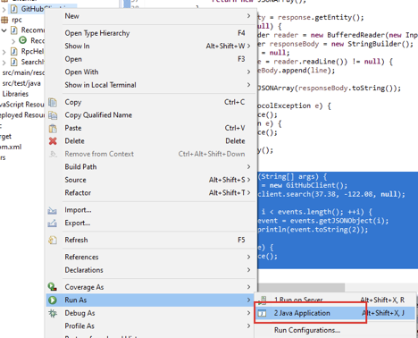

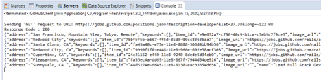


## Update SearchItem Servlet

1. Step 1, Update doGet() method in SearchItems.java to use handled item list returned from GitHubClient.

```java
package rpc;

...

public class SearchItem extends HttpServlet {
	protected void doGet(HttpServletRequest request, HttpServletResponse response)
			throws ServletException, IOException {
		double lat = Double.parseDouble(request.getParameter("lat"));
		double lon = Double.parseDouble(request.getParameter("lon"));

		GitHubClient client = new GitHubClient();
		List<Item> items = client.search(lat, lon, null);
		JSONArray array = new JSONArray();
		for (Item item : items) {
			array.put(item.toJSONObject());
		}
		RpcHelper.writeJsonArray(response, array);
	}
              ...
}
```

2. Step 2, Save your changes and start Tomcat server. Open your browser(or postman) and put the following URL: http://localhost:8080/jupiter/search?lat=37.38&lon=-122.08 in the address bar.

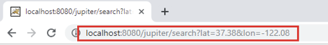

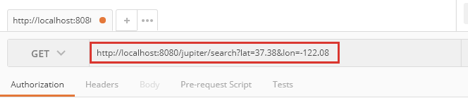

3. Step 3, Verify that job information is included in the response.

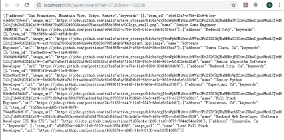

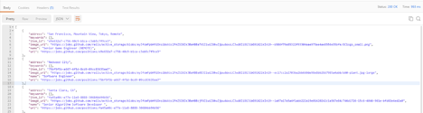


## Homework

1. Register AWS account
2. Download and install MySQL Workbench

## Summary

* Understand how to create objects with a builder pattern.
* Purify jobs data returned from GitHub Job API to only have the information we need.

## Codes

https://jsbin.com/nusisaq/edit?html,css,output

