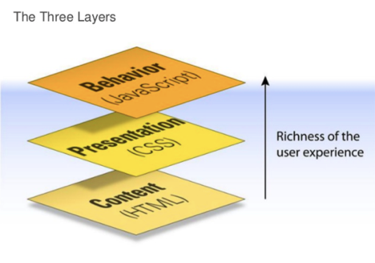

### Three Layers



## Data types

Number, String, Boolean, Object, Function, **Null, Undefined**

```javascript
var length = 16;                               // number
var name = 'John';                             // string
name = 123;                                    // dynamic typing
var p = {firstName:'John', lastName:'Doe'};    // object
var isGood = true;                             // boolean
var isPlenty = true;                           // boolean
var isGoodAndPlenty = isGood && isPlenty;      // boolean
var arr = [1, 2, 3];                           // array
var arr1 = [1, 2, 3, 'John', 'richard', 'bob'];// array
// function
function say() { 
  return 'I am a function'; 
}  
// function
var say = function() { 
  return 'I am a function'; 
};  
var o = null; 
typeof o; // object
var u; 
typeof u // undefined
```

### Null & Undefined

**null** is a special value meaning "no value". **null** is a special object because **typeof null** returns 'object'. On the other hand, **undefined** means that the variable has not been declared, or has not been given a value.

## Equality and Comparisons

JavaScript has two different ways of comparing the values of objects for equality.

### The Equality Operator (double equal ==)

JavaScript features weak typing. This means that the equality operator **coerces** types in order to compare them.

```javascript
""           ==   "0";           // false
0            ==   "";            // true
0            ==   "0";           // true
false        ==   "false";       // false
false        ==   "0";           // true why?
false        ==   undefined;     // false
false        ==   null;          // false
null         ==   undefined;     // true
" \t\r\n"    ==   0             // true
```

### The Strict Equality Operator(triple equal ===)

It works like the normal equality operator, except that strict equality operator does **NOT** perform type coercion between its operands.

```javascript
""           ===   "0";           // false
0            ===   "";            // false
0            ===   "0";           // false
false        ===   "false";       // false
false        ===   "0";           // false
false        ===   undefined;     // false
false        ===   null;          // false
null         ===   undefined;     // false
" \t\r\n"    ===   0             // false
```

### Object Comparison

While both == and === are called equality operators, they behave differently when at least one of their operands is an Object.

```javascript
{} === {}                   // false
String('foo') === 'foo'; // false
Number(10) === 10;       // false
var foo = {};
foo === foo;                 // true
```

Here, both operators compare for identity and not equality; that is, they will compare for the same instance of the object, much like is in Python and pointer comparison in C.

### Conclusion

It is highly recommended to only use the **strict equality operator**. In cases where types need to be coerced, it should be done explicitly and not left to the language's complicated coercion rules.

## Object & this context

In JavaScript, **this** pointer is another difficult topic, to tackle this topic, we just have to understand the following rules. **this** always points to the object that calls current function.

```javascript

(function() {
  // object literal
  var person = {
    name: 'John Doe',
    age: '20',
    greeting: function(greet) {
      console.log(greet + ' I am ' + this.name + 
                  ' and I am ' + this.age + ' years old.');
    },
    speak: function(a, b) {
      console.log('I am ' + this.name + ', ' + a + ' ' + b);
    }
  };
  
  person.greeting('Hi');
  
  // new operator
  function Person(name, age) {
    this.name = name;
    this.age = age;
    this.greeting = function(greet) {
      console.log(greet + ' I am ' + this.name + 
                  ' and I am ' + this.age + ' years old.');
    };
    
    this.speak = function(a, b) {
      console.log('I am ' + this.name + ', ' + a + ' ' + b);
    };
  }
  
  var bob = new Person('Bob', '18');
  var alice = new Person('Alice', '17');
  bob.greeting('Hello');
  alice.greeting('Hi there');
  
  // context
  var grt = bob.greeting;
  grt('Hi');
  
  // call apply bind
  grt.call(bob, 'Hi');
  grt.call(alice, 'Hi there');
  
  var spk = bob.speak;
  spk.apply(bob, ['Good', 'morning']);
  spk.apply(alice, ['Nice', 'day']);
  
  grt = bob.greeting.bind(bob);
  grt('Bind haha ');
  
})();

```

JSBin Sample

http://jsbin.com/kowunab/7/edit?js,console

## Function

In JavaScript, function is **first-class citizen**, just like any value or object. Specifically, this means JavaScript supports 

- **assigning** functions **to variables.** 
- **storing** functions **in data structures**.
- **passing** functions **as arguments** to other functions. 
- **returning** functions **as the values** from other functions.

## Scopes (变量的作用域)

In JavaScript there are 3 types of scope made available when a function executes: 

- **Global scope** 

  The **window** object

- **Local scope**

  Normal stack based local scope, released after function call 

- **Closure scope** 

  Scope object of outer function retained by inner function to serve its future invocations. Note that scope object of the outer function is created per call

JavaScript has function based local scope: Each function creates a new local scope. Scope determines the accessibility (visibility) of these variables. Variable defined inside a function are not accessible (visible) from outside the function.

```javascript
// Understanding JS Scope
var a = 1; // global
b = 2; // global
function func() {
  var c = 3; // func local
  d = 4; // global
  if (d == 4) {
    var e = 6; // func local
    f = 7; // global
  }
  console.log(b);
  console.log(window.b);
}
func();
```

http://jsbin.com/kudixo/5/edit?js,console

## Loop & High Order Function

3 ways to do for loop

```javascript
  var arr = ['a', 'b', 'c', 'd'];
  for (var i = 0; i < 4; i++) {
    console.log(arr[i]);
  }
  for (var index in arr) {
    console.log(arr[index]);
  }
  arr.forEach(function(item) { 
    console.log(item);
  });
```

The **map**() method on Array object creates a new array with the results of calling a provided function on every element in the calling array. [使用例子](https://developer.mozilla.org/en-US/docs/Web/JavaScript/Reference/Global_Objects/Array/map)

```javascript
var arr = [1, 2, 3];
var f = function(v) {
  return v * 2;
};
arr.map(f);
arr.map(function(v) {
  return v * 2;
});
```

## Closure(闭包) Web Front End & Full Stack 面试必考

**A closure is a function defined within another scope that has access to all the variables within the outer scope.**

**Closure = Function + Closure Scope Object (also called Lexical Environment)**

Normally it’s impossible to access the local variable from the outside of a function, for example:

```javascript
function f() {
  var a = 5;
}
f();
console.log(a); // undefined
```

However, an inner function can access both global variable and the local variable in the outer function, for example:

```javascript

// Understand scope object
function example1() {
  // JS Runtime found inner is using example1’s local variables
  // A scope object scope_example1 = { a: _ } is created
  var a = 5;
  function inner() { // defined inner which references scope_example1
    console.log(a);
  }
  inner();
}

example1();

// Only one scope object is created per funcntion invocation
function example11() {
  // JS Runtime found inner & inner1 are using example1’s local variables
  // A scope object scope_example11 = { a: _ } is created
  var a = 5;
  function inner() { // defined inner which references scope_example11
    console.log(a++);
  }
  function inner1() { // defined inner1 which references scope_example11
    console.log(a++);
  }
  inner();
  inner1();
}

example11();


// Create a function that can be invoked at any time in future
function generate(num) {
  // JS Runtime found func is using generate’s local variables
  // A scope object scope_generate = { message: _, num: _ } is created
  var message = "num is: ";
  var func = function() { // defined func which references scope_generate
    console.log(message + num);
  };
  return func;
}


// Functions return different result because of closure scope difference
function example2() {
  var fArr = [];
  // generate 10 functions, each with a different closure scope
  for (var i = 0; i < 5; i++) {
    var f = generate(i);
    fArr.push(f);
  }
  for (i = 0; i < 5; i++) {
    fArr[i]();
  }
}

//example2();
```

http://jsbin.com/sinimuf/3/edit?js,console

Example:

```javascript

function ex1() {
 // JS Runtime found f is using ex1's local variables
 // A scope object scope_ex1 = { i: _ } is created
 for (var i = 0; i < 10; i++) {
   // Define a new function f EVERY ITERATION which references scope_ex1
   var f = function () {
     console.log(i);
   };
   // Tell JS Runtime to call f after 1 second, this operation is non-blocking
   setTimeout(f, 1000);
 }
}

console.log('before ex1');
ex1();
console.log('after ex1');
```

How to fix it?

```javascript

function createFunc(val) {
 return function() {
   console.log(val);
 };
}

function ex2() {
 for (var i = 0; i < 10; i++) {
   var f = createFunc(i); // f is a new closure with closure scope { val: i }
   setTimeout(f, 1000);
 }
}

ex2();
```

## Great Article Explaining Details of Javascript

http://bonsaiden.github.io/JavaScript-Garden/