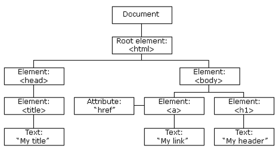
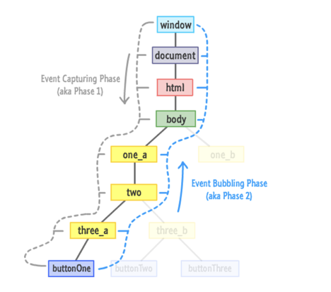
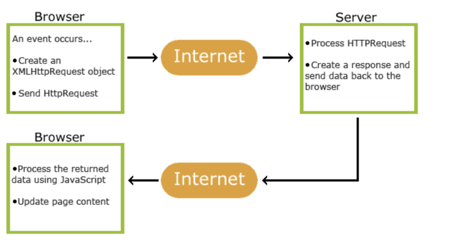
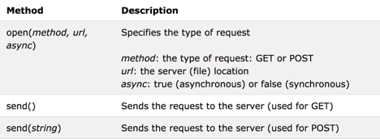

## Goal

* DOM
* Event
* Ajax

### DOM



The **Document Object Model (DOM)** connects web pages to scripts or programming languages. Usually that means JavaScript. The DOM model represents a document with a **logical tree**. DOM methods **allow programmatic access to the tree**; with them you can change the document's structure, style or content. DOM nodes can have event handlers attached to them. Once an event is triggered, the event handlers get executed.

```html
<html>
 <body>
 <p id="demo"></p>
 <script>
   var node = document.getElementById("demo");           
   node.innerHTML = "Hello World!";
 </script>
 </body>
</html>
```

Search HTML Elements

| **Method**                              | **Description**                       |
| --------------------------------------- | ------------------------------------- |
| document.getElementById(*id*)           | Find an element by element id         |
| document.getElementsByTagName(*name*)   | Find elements by tag name(array like) |
| document.getElementsByClassName(*name*) | Find elements by class name           |

**Modify HTML Elements**


| **Method**                                 | **Description**                               |
| ------------------------------------------ | --------------------------------------------- |
| *element*.innerHTML = *new html content*   | Change the inner HTML of an element           |
| *element*.setAttribute*(attribute, value)* | Change the attribute value of an HTML element |
| *element*.style.*property = new style*     | Change the style of an HTML element           |

**Create & Delete Elements**


| **Method**                        | **Description**                   |
| --------------------------------- | --------------------------------- |
| document.createElement(*element*) | Create an HTML element            |
| document.removeChild(*element*)   | Remove an HTML element            |
| document.appendChild(*element*)   | Add an HTML element               |
| document.write(*text*)            | Write into the HTML output stream |

**Examples**

[Find DOM Elements](https://www.w3schools.com/js/js_htmldom_elements.asp)

[ChangeDOMElements](https://www.w3schools.com/js/js_htmldom_html.asp)

[ChangeElementCSS](https://www.w3schools.com/js/js_htmldom_css.asp)

**Resources**

[W3School DOM Examples](https://www.w3schools.com/js/js_htmldom.asp)

[MDN Web Docs](https://developer.mozilla.org/en-US/)

### Event

HTML events are "things" that happen to HTML elements. When JavaScript is used in HTML pages, JavaScript can "react" on these events.


Reacting to Events

Examples of HTML events:

- When a user clicks the mouse
- When a web page has loaded
- When the mouse moves over an element
- When an input field is changed
- When a user strokes a key


A JavaScript can be executed when an event occurs, like when a user clicks on an HTML element. To execute code when a user clicks on an element, add JavaScript code to an HTML event attribute

```html
<button onclick=”JavaScript; Expression” />
```

or assign a function to corresponding DOM attribute

```html
element.onclick = function() { … }
```

or call **addEventListener**() method to attach an event handler to the specified element.

```html
element.addEventListener(event, function, useCapture);
```

[addEventListener Examples](https://www.w3schools.com/js/js_htmldom_eventlistener.asp)

[addEventListener our Example](https://jsbin.com/zulagibahe/1/edit?html,output)

1. Capturing phase – the event goes down to the element.
2. Bubbling phase – the event bubbles up from the element.



To catch an event on the capturing phase, we need to set the **3rd argument** of addEventListener to true. There are two possible values for that optional last argument:

- If it’s false (default), then the handler is set on the bubbling phase.
- If it’s true, then the handler is set on the capturing phase.

JSBin Sample http://jsbin.com/quruceg/6/edit?html,css,js,console,output

### AJAX

AJAX is not a programming language.

AJAX just uses a combination of:

- A browser built-in XMLHttpRequest object (to request data from a web server)
- JavaScript and HTML DOM (to display or use the data)

#### **How AJAX Works**



#### How to use AJAX

The keystone of AJAX is the XMLHttpRequest object.

1. creating an XMLHttpRequest object

   var xhttp = new XMLHttpRequest();

2. send a request to a server, we use the open() and send() methods of the XMLHttpRequest object

   xhttp.open("GET", "ajax_info.txt", true);

   xhttp.send();



### GET or POST?

GET is simpler and faster than POST, and can be used in most cases.

However, always use POST requests when:

- A cached file is not an option (update a file or database on the server).
- Sending a large amount of data to the server (POST has no size limitations).
- Sending user input (which can contain unknown characters), POST is more robust and secure than GET.