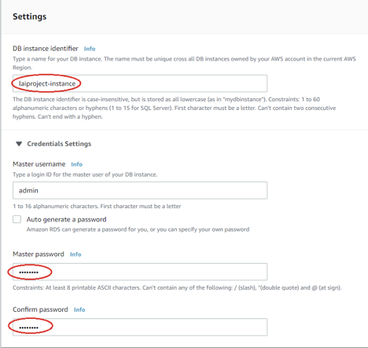
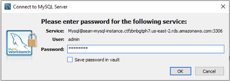

## Goal 

* Introduce the basic concepts of the database management system and MySQL.
* Start MySQL instance on Amazon RDS.
* Create tables in MySQL with Java.

    

## Database and Database Management System

### What is a Database?

A database is an organized collection of data.

### What is a Database Management System?

A database management system (DBMS) is a computer-software application that interacts with end-users, other applications, and the database itself to capture and analyze data. A general-purpose DBMS allows the definition, creation, querying, update, and administration of databases. 

### Why do we need a Database?

We need to store some data set, a list of jobs with id, name, address, and date. What will you do? Text File? Excel?

1. The size of list is large( > 1 million users).
2. Add some constraints to some data, such as the ID of each user should be different.
3. Create relations between different kinds of data, such as users saved some jobs before.
4. Quickly retrieve data based on a given condition, such as retrieve all jobs in San Francisco.
5. Quickly update or delete data based on given condition, such as update all favorite jobs for a given user.
6. Need access control on the data, meaning only authorized users can have access to the data set.
7. Allow multiple users access(add, search, update, delete) the data set at the same time.

A DBMS allows you to fulfill all requirements above easily.

## MySQL

[MySQL](https://en.wikipedia.org/wiki/MySQL) is an open-source relational database management system (RDBMS).

### Basic Concepts

* Table: a collection of attributions. Similar to what you’ve seen in an excel chart. Each column is an attribute of an entity, and each row is a record/instance of an entity. 
* Row: a single, implicitly structured data item in a table
* Column: a set of data values of a particularly simple type, one for each row of the table
* Schema: the blueprint of how the table is constructed.
* SQL: a programming language that is used to communicate with the DBMS.

### Tables for Jupiter project

    

### Entity Relation Diagram

* **Entity**, which are represented by rectangles. An entity is an object or concept about which you want to store information.

* **Actions**, which are represented by rectangles. An entity is an object or concept about which you want to store information.

* **Attributes**, which are represented by ovals. A key attribute is the unique, distinguishing characteristic of the entity. For example, an employee's social security number might be the employee's key attribute.

* users - store user information.

  | user_id | password | first_name | last_name |
  | ------- | -------- | ---------- | --------- |
  | 1111    | abcd     | Rick       | Sun       |
  | 2222    | efgh     | Matt       | Yan       |

* Items - store item information.

  | Item_id | name           | address | image_url | url  |
  | ------- | -------------- | ------- | --------- | ---- |
  | abcd    | laioffer宣讲会 | ...     | ...       | ...  |
  | efgh    | laioffer校友会 | ...     | ...       | ...  |

* keyword - store item-keyword relationship

* It’s an implementation detail, we could save keywords in the item table, but there will be more string join/split manipulations in our code, so let’s save them in a separate table.

  | item_id | keyword |
  | ------- | ------- |
  | abcd    | party   |
  | efgh    | party   |
  | efgh    | sports  |

  * Primary key = item_id + keyword
  * Foreign key = item_id => item(item_id)

* history - store user favorite history

  | item_id | keyword |
  | ------- | ------- |
  | abcd    | party   |
  | efgh    | party   |
  | efgh    | sports  |

  * Primary key = item_id + user_id
  * Foreign key = user_id => users(user_id)
  * Foreign key = item_id => items(item_id)

### A few more concept

* Primary key: Also a key that is unique for each record. It cannot be NULL and used as a unique identifier.
* Foreign key: a key used to link two tables together. A FOREIGN KEY is a field (or collection of fields) in one table that refers to the PRIMARY KEY in another table.

## Amazon Relational Database Service (Amazon RDS)

Amazon Relational Database Service (Amazon RDS) makes it easy to set up, operate, and scale a relational database in the cloud.

### Create a Security Group for RDS

1. Step 1, Go to [http://aws.amazon.com](http://aws.amazon.com/), sign into your account and then open the EC2 dashboard. 

   

2. Step 2, Under the EC2 dashboard, click Security Group in the menu on the left.

   

3. Step 3, Click the Create Security Group at the top of the page.

   

4. Step 4, In the Create Security Group popup window, choose a name for your group and then add a description for this group.

   

5. Step 5, Click the Add Rule button to add a new rule for your group.

   

6. Step 6, Choose MySQL/Aurora as the type of your rule and then make sure the port range is 3306 and source is 0.0.0.0/0.

   

7. Step 7, Finally click the Create button to create your security group.

   

### Create MySQL DB Instance on RDS

1. Step 1, go to [http://aws.amazon.com](http://aws.amazon.com/), sign into your account and then open the RDS dashboard.

   

2. Step 2, Under the RDS dashboard, click Create database.

   

3. Step 3, In the Engine options section, choose MySQL as your engine type and make sure MySQL version is at least 5.7.

   

4. Step 4, In Templates section, choose Free tier instead of Production for free trial.

   

5. Step 5, In the Settings section, enter a name for your database instance and then choose a password for the admin user of your database.

   

6. Step 6, In Connectivity section, select “Yes” for publicly accessible, and then add the security group you’ve just created under the VPC security group.

   

   

7. Step 7, Scroll down to the Additional configuration section, choose a name for your database.

   

8. Step 8, Finally scroll down to the bottom of the page and click Create database. Then you should be able to see your MySQL DB instance running on RDS.

   

   

## Create MySQL Table with Java Program

### Add MySQL JDBC library

JDBC (Java Database Connectivity) provides interfaces and classes for writing database operations. Technically speaking, JDBC is a standard API that defines how Java programs access database management systems. Since JDBC is a standard specification, one Java program that uses the JDBC API can connect to any database management system (DBMS), as long as a driver exists for that particular DBMS.

Official documentation of MySQL JDBC: https://dev.mysql.com/doc/connector-j/5.1/en/connector-j-usagenotes-connect-drivermanager.html

1. Step 1, Open your project in Eclipse and find pom.xml file, then add mysql-jdbc as a new dependency of your project.

   

   ```xml
   <project xmlns="http://maven.apache.org/POM/4.0.0"
   	xmlns:xsi="http://www.w3.org/2001/XMLSchema-instance"
   	xsi:schemaLocation="http://maven.apache.org/POM/4.0.0 http://maven.apache.org/maven-v4_0_0.xsd">
   	<modelVersion>4.0.0</modelVersion>
   	<groupId>laiproject</groupId>
   	<artifactId>jupiter</artifactId>
   	<packaging>war</packaging>
   	<version>1.0</version>
   	<name>jupiter Maven Webapp</name>
   	<url>http://maven.apache.org</url>
   	<properties>
   		<javaVersion>1.8</javaVersion>
   		<maven.compiler.source>1.8</maven.compiler.source>
   		<maven.compiler.target>1.8</maven.compiler.target>
   	</properties>
   	<dependencies>
   		<dependency>
   			<groupId>junit</groupId>
   			<artifactId>junit</artifactId>
   			<version>3.8.1</version>
   			<scope>test</scope>
   		</dependency>
   		<dependency>
   			<groupId>org.apache.tomcat</groupId>
   			<artifactId>tomcat-catalina</artifactId>
   			<version>9.0.30</version>
   		</dependency>
   		<dependency>
   			<groupId>org.json</groupId>
   			<artifactId>json</artifactId>
   			<version>20190722</version>
   		</dependency>
   		<dependency>
   			<groupId>org.apache.httpcomponents</groupId>
   			<artifactId>httpclient</artifactId>
   			<version>4.5.10</version>
   		</dependency>
   		<dependency>
   			<groupId>mysql</groupId>
   			<artifactId>mysql-connector-java</artifactId>
   			<version>8.0.18</version>
   		</dependency>
   	</dependencies>
   	<build>
   		<finalName>jupiter</finalName>
   	</build>
   	...
   </project>
   ```

2. Step 2, Save your changes in pom.xml and rerun Maven Install to download the new mysql-jdbc library.

   

### Create Tables in MySQL

1. Step 1, In your project, create a new class called MySQLDBUtil under a new package called db. 

   

2. Step 2, Add some constants into MySQLDBUtil.java. Remember to use your own instance address, database name, and password.

   ```java
   package db;
   
   public class MySQLDBUtil {
   	private static final String INSTANCE = "YOUR_INSTANCE_ADDRESS";
   	private static final String PORT_NUM = "3306";
   	public static final String DB_NAME = "YOUR_DB_NAME";
   	private static final String USERNAME = "admin";
   	private static final String PASSWORD = "YOUR_PASSWORD";
   	public static final String URL = "jdbc:mysql://"
   			+ INSTANCE + ":" + PORT_NUM + "/" + DB_NAME
   			+ "?user=" + USERNAME + "&password=" + PASSWORD
   			+ "&autoReconnect=true&serverTimezone=UTC";
   }
   ```

   Instance address can be found under RDS dashboard:

   

   Database name can be found under instance configuration page:

   

3. Step 3, Under the same package, create another class called MySQLTableCreation.java. 

   

4. Step 4, Copy the following main method to connect to MySQL through the JDBC connection. **Be careful, always use java.sql.\* when eclipse asks you to import DB related packages.** 

   ``` java
   package db;
   
   import java.sql.DriverManager;
   import java.sql.Statement;
   import java.sql.Connection;
   
   public class MySQLTableCreation {
   	// Run this as Java application to reset the database.
   	public static void main(String[] args) {
   		try {
   			// Step 1 Connect to MySQL.
   			System.out.println("Connecting to " + MySQLDBUtil.URL);
   			Class.forName("com.mysql.cj.jdbc.Driver").getConstructor().newInstance();
   			Connection conn = DriverManager.getConnection(MySQLDBUtil.URL);
   			
   			if (conn == null) {
   				return;
   			}
   			
   			conn.close();
   			System.out.println("Import done successfully");
   
   		} catch (Exception e) {
   			e.printStackTrace();
   		}
   	}
   }
   ```

5. Step 5, Step 5, In the same main method, after the connection is created, copy the following code to drop existing tables in the database. 

   

   Syntax for [DROP](https://www.w3schools.com/sql/sql_drop_table.asp). 

   ```sql
   DROP TABLE IF EXISTS table_name;
   ```

   ``` java
   package db;
   
   ...
   
   public class MySQLTableCreation {
   	// Run this as Java application to reset the database.
   	public static void main(String[] args) {
   		try {
   			// Step 1 Connect to MySQL.
   			System.out.println("Connecting to " + MySQLDBUtil.URL);
   			Class.forName("com.mysql.cj.jdbc.Driver").getConstructor().newInstance();
   			Connection conn = DriverManager.getConnection(MySQLDBUtil.URL);
   
   			if (conn == null) {
   				return;
   			}
   			
   			// Step 2 Drop tables in case they exist.
   			Statement statement = conn.createStatement();
   			String sql = "DROP TABLE IF EXISTS keywords";
   			statement.executeUpdate(sql);
   
   			sql = "DROP TABLE IF EXISTS history";
   			statement.executeUpdate(sql);
   
   			sql = "DROP TABLE IF EXISTS items";
   			statement.executeUpdate(sql);
   
   			sql = "DROP TABLE IF EXISTS users";
   			statement.executeUpdate(sql);
   
   			conn.close();
   			System.out.println("Import done successfully");
   
   		} catch (Exception e) {
   			e.printStackTrace();
   		}
   	}
   }
   ```

6. Step 6, After drop, copy the following code to create new tables for Jupiter project.

   

   Syntax for CREATE.

   ```sql
   CREATE TABLE table_name (
   	column1 datatype,
   	column2 datatype,
   	column3 datatype,
      ....
   );
   ```

   ```java
   package db;
   
   ...
   
   public class MySQLTableCreation {
   	// Run this as Java application to reset the database.
   	public static void main(String[] args) {
   		try {
   			// Step 1 Connect to MySQL.
   			System.out.println("Connecting to " + MySQLDBUtil.URL);
   			Class.forName("com.mysql.cj.jdbc.Driver").getConstructor().newInstance();
   			Connection conn = DriverManager.getConnection(MySQLDBUtil.URL);
   
   			if (conn == null) {
   				return;
   			}
   			
   			// Step 2 Drop tables in case they exist.
   			Statement statement = conn.createStatement();
   			String sql = "DROP TABLE IF EXISTS categories";
   			statement.executeUpdate(sql);
   
   			sql = "DROP TABLE IF EXISTS history";
   			statement.executeUpdate(sql);
   
   			sql = "DROP TABLE IF EXISTS items";
   			statement.executeUpdate(sql);
   
   			sql = "DROP TABLE IF EXISTS users";
   			statement.executeUpdate(sql);
   
   			// Step 3 Create new tables
   			sql = "CREATE TABLE items ("
   					+ "item_id VARCHAR(255) NOT NULL,"
   					+ "name VARCHAR(255),"
   					+ "address VARCHAR(255),"
   					+ "image_url VARCHAR(255),"
   					+ "url VARCHAR(255),"
   					+ "PRIMARY KEY (item_id)"
   					+ ")";
   			statement.executeUpdate(sql);
   
   			sql = "CREATE TABLE users ("
   					+ "user_id VARCHAR(255) NOT NULL,"
   					+ "password VARCHAR(255) NOT NULL,"
   					+ "first_name VARCHAR(255),"
   					+ "last_name VARCHAR(255),"
   					+ "PRIMARY KEY (user_id)"
   					+ ")";
   			statement.executeUpdate(sql);
   
   			sql = "CREATE TABLE keywords ("
   					+ "item_id VARCHAR(255) NOT NULL,"
   					+ "keyword VARCHAR(255) NOT NULL,"
   					+ "PRIMARY KEY (item_id, keyword),"
   					+ "FOREIGN KEY (item_id) REFERENCES items(item_id)"
   					+ ")";
   			statement.executeUpdate(sql);
   
   			sql = "CREATE TABLE history ("
   					+ "user_id VARCHAR(255) NOT NULL,"
   					+ "item_id VARCHAR(255) NOT NULL,"
   					+ "last_favor_time TIMESTAMP NOT NULL DEFAULT CURRENT_TIMESTAMP,"
   					+ "PRIMARY KEY (user_id, item_id),"
   					+ "FOREIGN KEY (user_id) REFERENCES users(user_id),"
   					+ "FOREIGN KEY (item_id) REFERENCES items(item_id)"
   					+ ")";
   			statement.executeUpdate(sql);
   
   			
   			conn.close();
   			System.out.println("Import done successfully");
   
   		} catch (Exception e) {
   			e.printStackTrace();
   		}
   	}
   }
   ```

7. Step 7, Since we don’t have register functions right now, we need to create a fake user for testing purposes. Copy the following code into the same main function to add user 1111 to Users table.

   

   Syntax for INSERT.

   ```sql
   INSERT INTO table_name (column1, column2, column3, ...)
   VALUES (value1, value2, value3, ...);
   ```

   ```java
   package db;
   
   import java.sql.DriverManager;
   import java.sql.Statement;
   import java.sql.Connection;
   
   public class MySQLTableCreation {
   	// Run this as Java application to reset the database.
   	public static void main(String[] args) {
   		try {
   			// Step 1 Connect to MySQL.
   			System.out.println("Connecting to " + MySQLDBUtil.URL);
   			Class.forName("com.mysql.cj.jdbc.Driver").getConstructor().newInstance();
   			Connection conn = DriverManager.getConnection(MySQLDBUtil.URL);
   
   			if (conn == null) {
   				return;
   			}
   			
   			// Step 2 Drop tables in case they exist.
   			Statement statement = conn.createStatement();
   			String sql = "DROP TABLE IF EXISTS categories";
   			statement.executeUpdate(sql);
   
   			sql = "DROP TABLE IF EXISTS history";
   			statement.executeUpdate(sql);
   
   			sql = "DROP TABLE IF EXISTS items";
   			statement.executeUpdate(sql);
   
   			sql = "DROP TABLE IF EXISTS users";
   			statement.executeUpdate(sql);
   
   			// Step 3 Create new tables
   			sql = "CREATE TABLE items ("
   					+ "item_id VARCHAR(255) NOT NULL,"
   					+ "name VARCHAR(255),"
   					+ "address VARCHAR(255),"
   					+ "image_url VARCHAR(255),"
   					+ "url VARCHAR(255),"
   					+ "PRIMARY KEY (item_id)"
   					+ ")";
   			statement.executeUpdate(sql);
   
   			sql = "CREATE TABLE users ("
   					+ "user_id VARCHAR(255) NOT NULL,"
   					+ "password VARCHAR(255) NOT NULL,"
   					+ "first_name VARCHAR(255),"
   					+ "last_name VARCHAR(255),"
   					+ "PRIMARY KEY (user_id)"
   					+ ")";
   			statement.executeUpdate(sql);
   
   			sql = "CREATE TABLE keywords ("
   					+ "item_id VARCHAR(255) NOT NULL,"
   					+ "keyword VARCHAR(255) NOT NULL,"
   					+ "PRIMARY KEY (item_id, keyword),"
   					+ "FOREIGN KEY (item_id) REFERENCES items(item_id)"
   					+ ")";
   			statement.executeUpdate(sql);
   
   			sql = "CREATE TABLE history ("
   					+ "user_id VARCHAR(255) NOT NULL,"
   					+ "item_id VARCHAR(255) NOT NULL,"
   					+ "last_favor_time TIMESTAMP NOT NULL DEFAULT CURRENT_TIMESTAMP,"
   					+ "PRIMARY KEY (user_id, item_id),"
   					+ "FOREIGN KEY (user_id) REFERENCES users(user_id),"
   					+ "FOREIGN KEY (item_id) REFERENCES items(item_id)"
   					+ ")";
   			statement.executeUpdate(sql);
   
   			// Step 4: insert fake user 1111/3229c1097c00d497a0fd282d586be050
   			sql = "INSERT INTO users VALUES('1111', '3229c1097c00d497a0fd282d586be050', 'John', 'Smith')";
   			statement.executeUpdate(sql);
   			
   			conn.close();
   			System.out.println("Import done successfully");
   
   		} catch (Exception e) {
   			e.printStackTrace();
   		}
   	}
   }
   ```

8. Step 8, Save your change and right click MySQLTableCreation class, select Run As Java Application. Make sure you can see “Import done successfully” in the Eclipse console.

   

   

### Verify Tables in MySQL

1. Step 1, Open MySQL Workbench on your local desktop/laptop, select Connect to Database from the top.

   

2. Step 2, Paste your RDS instance address to Hostname and change the username to admin. Then click OK.

   

3. Step 3, Enter the password in the popup window and then click OK. You should be able to connect to your MySQL database through MySQL Workbench.

   

   

4. Step 4, In the Query window, use the following command and then click Execute to print all tables in your database. **Remember to use your database name**.

   ```sql
   use YOUR_DB_NAME;
   show tables;
   ```

   

5. Step 5, (Optional) Copy the following command if you want to check the schema for tables. You can switch the table name to the other three(items, categories, history) to see different results.

   

6. Step 6, Copy the following command to check the fake user 1111 is added to your database.

   ```sql
   select * from users;
   ```

   