## Goal
* Create Java program to save/ read user favorite data to/from MySQL.
* Implement Item History servlet to serve history related requests.
* Make search results aware of favorite items.

    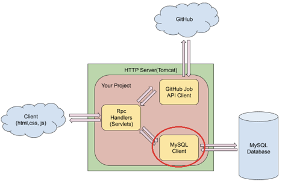

## Recap
### Database and Database Management System
* Database: A database is an organized collection of data.
* Database Management System: A database management system (DBMS) is a computer-software application that interacts 
with end-users, other applications, and the database itself to capture and analyze data.

### MySQL and Amazon RDS
* MySQL: MySQL is an open-source relational database management system (RDBMS).
* Amazon RDS: Amazon Relational Database Service (Amazon RDS) makes it easy to set up, operate, and scale a relational database in the cloud.
* Tables for Jupiter Project

    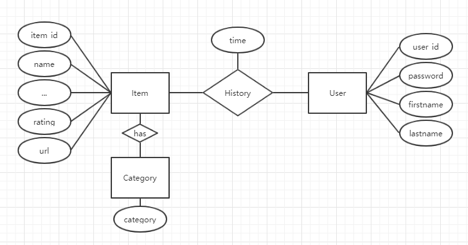

### Create MySQL Tables with Java
* JDBC: JDBC (Java Database Connectivity) provides interfaces and classes for writing database operations. Technically speaking, JDBC is a standard API that defines how Java programs access database management systems.
* SQL Syntax
  * Syntax for DROP. 
    * DROP TABLE IF EXISTS table_name;
  * Syntax for CREATE. 
    * CREATE TABLE table_name (column1 datatype, column2 datatype, ....);
  * Syntax for INSERT.
    * INSERT INTO table_name (column1, column2, column3, ...) VALUES (value1, value2, value3, ...);
    
## Save User Favorite Items to MySQLSample Request

**Sample Request**

**Post**

```json
{
"user_id": "1111",
"favorite": {
   "address": "San Francisco, Mountain View, Tokyo, Remote",
   "keywords": [],
   "item_id": "easdffawefqwefasdasd023-234129-kfhk",
   "image_url": "https://jobs.github.com/rails/active_storage/blobs/flliejlfkjlkdfjiwejflkasdjlfkjeijfowejflaksdjfljweoiajowefjalsdkfjoiwef/GClogo_small.png",
   "name": "Senior Game Engineer (REMOTE)",
   "favorite": false,
   "url": "https://jobx.github.com/positions/easdffawefqwefasdasd023-234129-kfhk"
		}
}
```

### Create Java Class to Connect to MySQL

1. Step 1, Open your project, create a new class called MYSQLConnection under db package.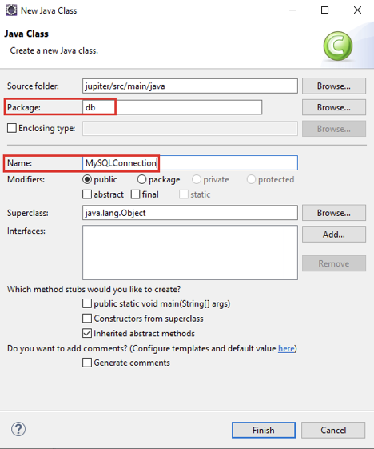

2. Step 2, Import the libraries that we’ll use for this class.

   ```java
   package db;
   
   import java.sql.Connection;
   import java.sql.DriverManager;
   import java.sql.PreparedStatement;
   import java.sql.ResultSet;
   import java.sql.SQLException;
   import java.util.HashSet;
   import java.util.Set;
   
   import entity.Item;
   import entity.Item.ItemBuilder;
   
   public class MySQLConnection {
   
   }
   ```

3. Step 3, In MySQLConnection class, we need to add two more methods. The constructor will help you create the connection to MySQL instance, and the close method will help you close the connection.

   ```java
   package db;
   
   ...
   
   public class MySQLConnection {
   	private Connection conn;
   
   	public MySQLConnection() {
   		try {
   			Class.forName("com.mysql.cj.jdbc.Driver").getConstructor().newInstance();
   			conn = DriverManager.getConnection(MySQLDBUtil.URL);
   
   		} catch (Exception e) {
   			e.printStackTrace();
   		}
   	}
   
   	public void close() {
   		if (conn != null) {
   			try {
   				conn.close();
   			} catch (Exception e) {
   				e.printStackTrace();
   			}
   		}
   	}
   }
   ```

4. Step 4, Implement setFavoriteItems, unsetFavoriteItems and saveItems.

   ```SQL
   INSERT INTO table_name (column1, column2, column3, ...)
   VALUES (value1, value2, value3, ...);
   ```

   ```sql
   DELETE FROM table_name WHERE condition;
   ```

   ```java
   package db;
   
   ...
   
   public class MySQLConnection {
   	private Connection conn;
   
   	public MySQLConnection() {
   		...
   	}
   
   	public void close() {
   		...
   	}
   
   	public void setFavoriteItems(String userId, Item item) {
   		if (conn == null) {
   			System.err.println("DB connection failed");
   			return;
   		}
   		saveItem(item);
   		String sql = "INSERT INTO history (user_id, item_id) VALUES (?, ?)";
   		try {
   			PreparedStatement statement = conn.prepareStatement(sql);
   			statement.setString(1, userId);
   			statement.setString(2, item.getItemId());
   			statement.executeUpdate();
   		} catch (SQLException e) {
   			e.printStackTrace();
   		}
   	}
   
   	public void unsetFavoriteItems(String userId, String itemId) {
   		if (conn == null) {
   			System.err.println("DB connection failed");
   			return;
   		}
   		String sql = "DELETE FROM history WHERE user_id = ? AND item_id = ?";
   		try {
   			PreparedStatement statement = conn.prepareStatement(sql);
   			statement.setString(1, userId);
   			statement.setString(2, itemId);
   			statement.executeUpdate();
   		} catch (SQLException e) {
   			e.printStackTrace();
   		}
   	}
   
   	public void saveItem(Item item) {
   		if (conn == null) {
   			System.err.println("DB connection failed");
   			return;
   		}
   		String sql = "INSERT IGNORE INTO items VALUES (?, ?, ?, ?, ?)";
   		try {
   			PreparedStatement statement = conn.prepareStatement(sql);
   			statement.setString(1, item.getItemId());
   			statement.setString(2, item.getName());
   			statement.setString(3, item.getAddress());
   			statement.setString(4, item.getImageUrl());
   			statement.setString(5, item.getUrl());
   			statement.executeUpdate();
   			
   			sql = "INSERT IGNORE INTO keywords VALUES (?, ?)";
   			statement.setString(1, item.getItemId());
   			for (String keyword : item.getKeywords()) {
   				statement.setString(2, keyword);
   				statement.executeUpdate();
   			}
   		} catch (SQLException e) {
   			e.printStackTrace();
   		}
   	}
   }
   ```

### Create ItemHistory Servlet to Handle Favorite Request

1. Step 1, Go to RpcHelper.java and add two methods to parse HTTP request body and save it as an Item object.

   ```java
   
   package rpc;
   
   import java.io.BufferedReader;
   import java.io.IOException;
   import java.util.HashSet;
   import java.util.Set;
   
   import javax.servlet.http.HttpServletRequest;
   import javax.servlet.http.HttpServletResponse;
   
   import org.json.JSONArray;
   import org.json.JSONObject;
   
   import entity.Item;
   import entity.Item.ItemBuilder;
   
   public class RpcHelper {
   	// Writes a JSONArray to http response.
   	public static void writeJsonArray(HttpServletResponse response, JSONArray array) throws IOException{
   		...
   	}
   
                 // Writes a JSONObject to http response.
   	public static void writeJsonObject(HttpServletResponse response, JSONObject obj) throws IOException {		...
   	}
   
   	// Parses a JSONObject from http request.
   	public static JSONObject readJSONObject(HttpServletRequest request) throws IOException {
   		BufferedReader reader = new BufferedReader(request.getReader());
   		StringBuilder requestBody = new StringBuilder();
   		String line = null;
   		while ((line = reader.readLine()) != null) {
   			requestBody.append(line);
   		}
   		return new JSONObject(requestBody.toString());
   	}
   
                 // Convert a JSON object to Item object
   	public static Item parseFavoriteItem(JSONObject favoriteItem) {
   		ItemBuilder builder = new ItemBuilder();
   		builder.setItemId(favoriteItem.getString("item_id"));
   		builder.setName(favoriteItem.getString("name"));
   		builder.setAddress(favoriteItem.getString("address"));
   		builder.setUrl(favoriteItem.getString("url"));
   		builder.setImageUrl(favoriteItem.getString("image_url"));
   		
   		Set<String> keywords = new HashSet<>();
   		JSONArray array = favoriteItem.getJSONArray("keywords");
   		for (int i = 0; i < array.length(); ++i) {
   			keywords.add(array.getString(i));
   		}
   		builder.setKeywords(keywords);
   		return builder.build();
   	}
   }
   ```

2. Step 2, Right click your project and create a new Servlet.

   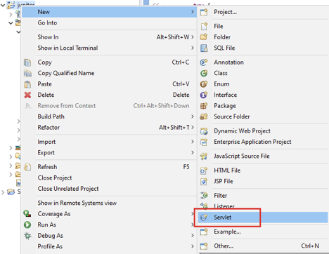

3. Step 3, Use rpc as the package name and ItemHistory as class name, then click next.

   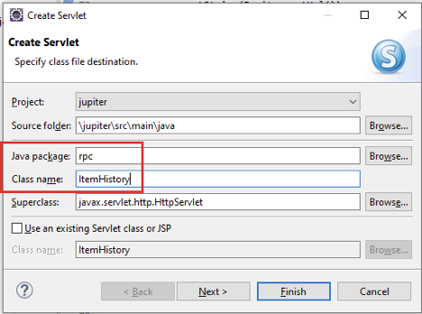

4. Step 4, Double click /ItemHistory under URL mappings and update it to /history, then click next.

   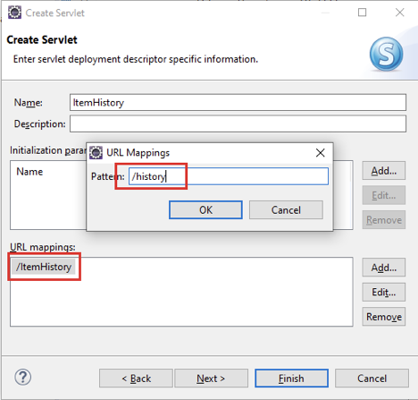

5. Step 5, Besides doGet and doPost, also check doDelete for ItemHistory and then click Finish.

   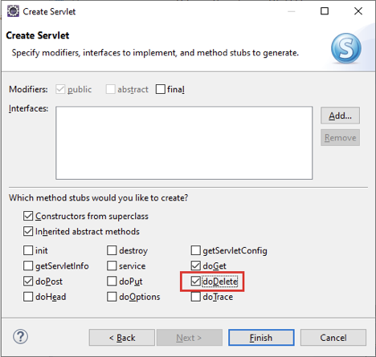

6. Step 6, Update doPost() method in ItemHistory.java. It will use the setFavoriteItem() method that you’ve just implemented in MySQLConnection.

   ``` java
   package rpc;
   
   ...
   
   public class ItemHistory extends HttpServlet {
   	…
   
   	protected void doGet(HttpServletRequest request, HttpServletResponse response)
   			throws ServletException, IOException {
   		...
   	}
   
   	protected void doPost(HttpServletRequest request, HttpServletResponse response)
   			throws ServletException, IOException {
   		MySQLConnection connection = new MySQLConnection();
   		JSONObject input = RpcHelper.readJSONObject(request);
   		String userId = input.getString("user_id");
   		Item item = RpcHelper.parseFavoriteItem(input.getJSONObject("favorite"));
   		
   		connection.setFavoriteItems(userId, item);
   		connection.close();
   		RpcHelper.writeJsonObject(response, new JSONObject().put("result", "SUCCESS"));
   	}
   
   	protected void doDelete(HttpServletRequest request, HttpServletResponse response)
   			throws ServletException, IOException {
   		...
   	}
   }
   ```

7. Step 7, Similarly update doDelete() method in ItemHistory to call unsetFavoritedItem() method.

   ```java
   package rpc;
   
   ...
   
   public class ItemHistory extends HttpServlet {
   	…
   
   	protected void doGet(HttpServletRequest request, HttpServletResponse response)
   			throws ServletException, IOException {
   		...
   	}
   
   	protected void doPost(HttpServletRequest request, HttpServletResponse response)
   			throws ServletException, IOException {
   		...
   	}
   
   	protected void doDelete(HttpServletRequest request, HttpServletResponse response)
   			throws ServletException, IOException {
   		MySQLConnection connection = new MySQLConnection();
   		JSONObject input = RpcHelper.readJSONObject(request);
   		String userId = input.getString("user_id");
   		Item item = RpcHelper.parseFavoriteItem(input.getJSONObject("favorite"));
   		
   		connection.unsetFavoriteItems(userId, item.getItemId());
   		connection.close();
   		RpcHelper.writeJsonObject(response, new JSONObject().put("result", "SUCCESS"));
   	}
   }
   ```

### Test Set and Unset Favorite Item Functions

1. Step 1, Save your changes and restart your Tomcat server.

   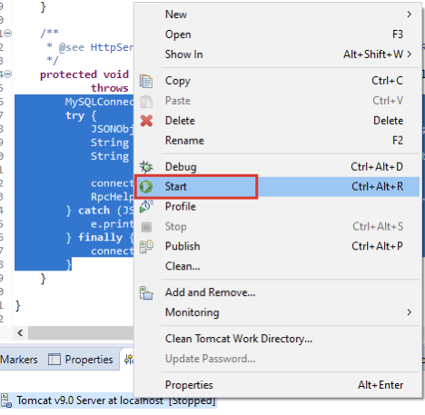

2. Step 2, Open a new window in Postman and put http://localhost:8080/jupiter/search?lat=37.38&lon=-122.08 in the address bar, then click send.

   

   Make sure you can see some search results in response. We’ll use them in next step.

    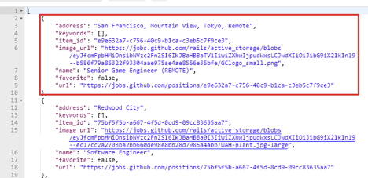

3. Step 3, Open another window in Postman and put http://localhost:8080/jupiter/history in the address bar, then change the HTTP method to Post.

   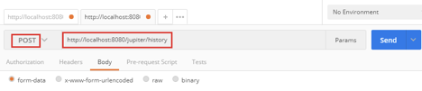

4. Step 4, Under the Body tab, copy the following JSON data and replace the **item_details** with an Item that you can find in the previous search result.

   ```json
   {
     "user_id": "1111",
     "favorite": {
           "item_details" : "asdfasdf"
     }
   }
   ```

   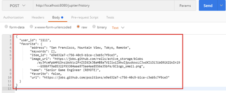

5. Step 5, Click Send and make sure you can see the successful response.

   

6. Step 6,  Repeat the previous two steps to save some other items, make sure the item_id for each item is different.

    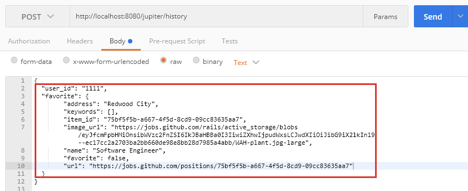

    

7. Step 7, Open MySQL Wordbench and connect to your MySQL instance on RDS.

   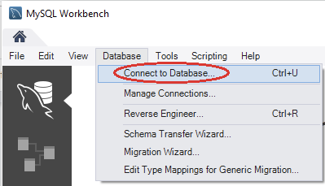

   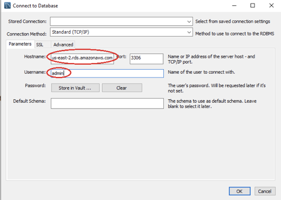

   

   

8. Step 8, In the Query window, use the following command and then click Execute. Make sure you can see the data you’ve just posted from Postman. **Remember to use your database name**.

   ```java
   use YOUR_DB_NAME;
   select * from history where user_id = 1111;
   select * from items;
   ```

   

   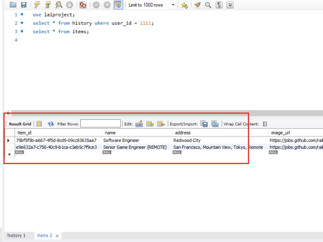

9. Step 9, Go back to your Postman and open a new window. Put http://localhost:8080/jupiter/history in the address bar, then change the HTTP method to Delete.

   

10. Step 10, Under the Body tab, copy the following JSON data and replace the **ITEM_ID** with the real item_id you can see in your history table.

    ``` json
    {
      "user_id": "1111",
      "favorite": {
            "item_id": "ITEM_ID",
      }
    }
    ```

    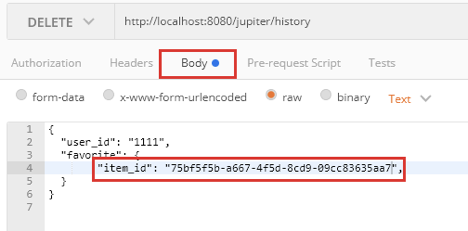

11. Step 11, Click Send and make sure you can see the successful response.

    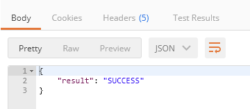

12. Step 12, Go back to MySQL Workbench and execute the same query. Make sure you can see one favorite item is removed from history table.

    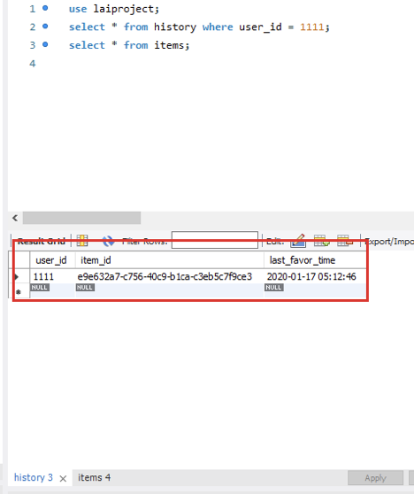

## Read User favorited Items from MySQL

**Sample request**

    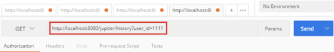

### Update MySQLConnection and ItemHistory to Read Favorite Items

1. Step 1, Open MySQLConnection in Eclipse, Implement getFavoritedItemIds() method which reads data from history table.

   Syntax for [SELECT](https://www.w3schools.com/sql/sql_select.asp). 

   ```sql
   SELECT column1, column2, … FROM table_name;
   ```

   ``` java
   package db;
   
   ...
   
   public class MySQLConnection {
   	private Connection conn;
   
   	public MySQLConnection() {
   		...
   	}
   
   	public void close() {
   		...
   	}
   
   	public void setFavoriteItems(String userId, Item item) {
   		...
   	}
   
   	public void unsetFavoriteItems(String userId, String itemId) {
   		...
   	}
   
   	public void saveItem(Item item) {
   		...
   	}
   
   	public Set<String> getFavoriteItemIds(String userId) {
   		if (conn == null) {
   			System.err.println("DB connection failed");
   			return new HashSet<>();
   		}
   
   		Set<String> favoriteItems = new HashSet<>();
   
   		try {
   			String sql = "SELECT item_id FROM history WHERE user_id = ?";
   			PreparedStatement statement = conn.prepareStatement(sql);
   			statement.setString(1, userId);
   			ResultSet rs = statement.executeQuery();
   			while (rs.next()) {
   				String itemId = rs.getString("item_id");
   				favoriteItems.add(itemId);
   			}
   		} catch (SQLException e) {
   			e.printStackTrace();
   		}
   		return favoriteItems;
   	}
   }
   ```

2. Step 2, Implement getFavoriteItems() and getCategories() methods to read detailed data for a given item.

   ```java
   package db;
   
   ...
   
   public class MySQLConnection {
   	private Connection conn;
   
   	public MySQLConnection() {
   		...
   	}
   
   	public void close() {
   		...
   	}
   
   	public void setFavoriteItems(String userId, Item item) {
   		...
   	}
   
   	public void unsetFavoriteItems(String userId, String itemId) {
   		...
   	}
   
   	public void saveItem(Item item) {
   		...
   	}
   
   	public Set<String> getFavoriteItemIds(String userId) {
   		...
   	}
   
   	public Set<Item> getFavoriteItems(String userId) {
   		if (conn == null) {
   			System.err.println("DB connection failed");
   			return new HashSet<>();
   		}
   		Set<Item> favoriteItems = new HashSet<>();
   		Set<String> favoriteItemIds = getFavoriteItemIds(userId);
   
   		String sql = "SELECT * FROM items WHERE item_id = ?";
   		try {
   			PreparedStatement statement = conn.prepareStatement(sql);
   			for (String itemId : favoriteItemIds) {
   				statement.setString(1, itemId);
   				ResultSet rs = statement.executeQuery();
   
   				ItemBuilder builder = new ItemBuilder();
   				if (rs.next()) {
   					builder.setItemId(rs.getString("item_id"));
   					builder.setName(rs.getString("name"));
   					builder.setAddress(rs.getString("address"));
   					builder.setImageUrl(rs.getString("image_url"));
   					builder.setUrl(rs.getString("url"));
   					builder.setKeywords(getKeywords(itemId));
   					favoriteItems.add(builder.build());
   				}
   			}
   		} catch (SQLException e) {
   			e.printStackTrace();
   		}
   		return favoriteItems;
   	}
   
   	public Set<String> getKeywords(String itemId) {
   		if (conn == null) {
   			System.err.println("DB connection failed");
   			return null;
   		}
   		Set<String> keywords = new HashSet<>();
   		String sql = "SELECT keyword from keywords WHERE item_id = ? ";
   		try {
   			PreparedStatement statement = conn.prepareStatement(sql);
   			statement.setString(1, itemId);
   			ResultSet rs = statement.executeQuery();
   			while (rs.next()) {
   				String keyword = rs.getString("keyword");
   				keywords.add(keyword);
   			}
   		} catch (SQLException e) {
   			e.printStackTrace();
   		}
   		return keywords;
   	}
   }
   ```

3. Step 3, Go back to ItemHistory.java, update the doGet() method to handle get request from clients.

   ``` java
   package rpc;
   
   ...
   
   public class ItemHistory extends HttpServlet {
   	…
   
   	protected void doGet(HttpServletRequest request, HttpServletResponse response)
   			throws ServletException, IOException {
   		String userId = request.getParameter("user_id");
   		
   		MySQLConnection connection = new MySQLConnection();
   		Set<Item> items = connection.getFavoriteItems(userId);
   		connection.close();
   		
   		JSONArray array = new JSONArray();
   		for (Item item : items) {
   			JSONObject obj = item.toJSONObject();
   			obj.put("favorite", true);
   			array.put(obj);
   		}
   		RpcHelper.writeJsonArray(response, array);
   	}
   
   	protected void doPost(HttpServletRequest request, HttpServletResponse response)
   			throws ServletException, IOException {
   		...
   	}
   
   	protected void doDelete(HttpServletRequest request, HttpServletResponse response)
   			throws ServletException, IOException {
   		...
   	}
   }
   ```

### Test Get Favorite Item Functions

1. Step 1, Save your changes and restart your Tomcat server.

   

2. Step 2, Open a new window in Postman. Put http://localhost:8080/Jupiter/history?user_id=1111 in the address bar.

   

3. Step 3, Click Send and make sure you can see the favorited items returned in response.

   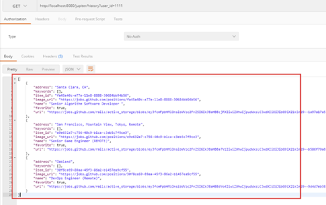

## Make Search Result Aware of Favorited Items

In ItemHistory.doGet(), we add an extra key-value pair to JSON output to indicate the corresponding item object is favorited by the user. Our frontend code will make a solid heart based on this data.

```java
protected void doGet(HttpServletRequest request, HttpServletResponse response)
			throws ServletException, IOException {
		String userId = request.getParameter("user_id");
		JSONArray array = new JSONArray();
		
		MySQLConnection connection = new MySQLConnection();
		Set<Item> items = connection.getFavoriteItems(userId);
		connection.close();
		
		for (Item item : items) {
			JSONObject obj = item.toJSONObject();
			obj.put("favorite", true);
			array.put(obj);
		}
		RpcHelper.writeJsonArray(response, array);
	}
```

In SearchItem, we need to have the same logic so that frontend code can decide whether to show an empty or solid heart.

```java
package rpc;

…

public class SearchItem extends HttpServlet {
	...

	protected void doGet(HttpServletRequest request, HttpServletResponse response)
			throws ServletException, IOException {
		String userId = request.getParameter("user_id");
		double lat = Double.parseDouble(request.getParameter("lat"));
		double lon = Double.parseDouble(request.getParameter("lon"));

		GitHubClient client = new GitHubClient();
		List<Item> items = client.search(lat, lon, null);

		MySQLConnection connection = new MySQLConnection();
		Set<String> favoritedItemIds = connection.getFavoriteItemIds(userId);
		connection.close();

		JSONArray array = new JSONArray();
		for (Item item : items) {
			JSONObject obj = item.toJSONObject();
			obj.put("favorite", favoritedItemIds.contains(item.getItemId()));
			array.put(obj);
		}
		RpcHelper.writeJsonArray(response, array);
	}
}
```


