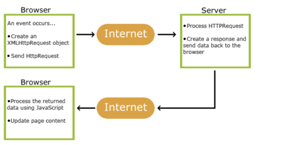
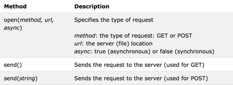
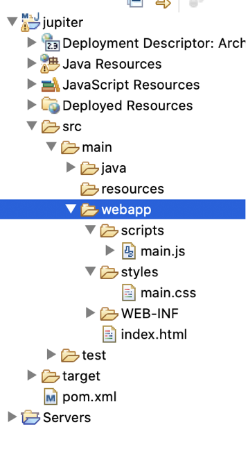
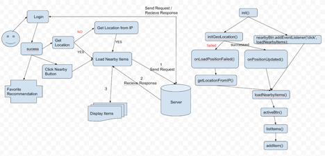

## Goal

* What is AJAX
* How AJAX works
* How to use AJAX
* Project

### What is AJAX?

Asynchronous JavaScript and XML

AJAX is not a programming language.

AJAX just uses a combination of:

- A browser built-in XMLHttpRequest object (to request data from a web server)
- JavaScript and HTML DOM (to display or use the data)

### How AJAX Works



### How to use AJAX

The keystone of AJAX is the XMLHttpRequest object.

1. creating an XMLHttpRequest object

   var xhttp = new XMLHttpRequest();

2. send a request to a server, we use the open() and send() methods of the XMLHttpRequest object

   xhttp.open("GET", "ajax_info.txt", true);

   xhttp.send();

   

GET or POST?

GET is simpler and faster than POST, and can be used in most cases.

However, always use POST requests when:

- A cached file is not an option (update a file or database on the server).
- Sending a large amount of data to the server (POST has no size limitations).
- Sending user input (which can contain unknown characters), POST is more robust and secure than GET.


Project

The demo of our web applications: http://34.211.21.63/Titan/ username:1111, password: 2222 

The code of our web applications: https://jsbin.com/besutixebi/edit?html,css,js

访问： http://localhost:8080/jupiter

https://jsbin.com/qojulusiqi/edit?html,css,output

Folders and files





1. Step 1: 

index.html

```html
<body>
    ………….
    <script src="scripts/utils.js"></script>
    <script src="scripts/main.js"></script>
</body>
```

main.js

```javascript
(function(){
         function init(){
              console.log(1);
         }	
         init();
})();
```

2. Step 2:

show login form and hide the rest

main.js

```javascript
(function(){

        // entry 
        function init(){
		validateSession();
	}
	
	//check session
	function validateSession(){
		onSessionInvalid();
	}
	
	// hide register form, logout button, dummy data, etc
	// show login form
	function onSessionInvalid(){
	    var loginForm = document.querySelector('#login-form');
	    var registerForm = document.querySelector('#register-form');
	    var itemNav = document.querySelector('#item-nav');
	    var itemList = document.querySelector('#item-list');
	    var avatar = document.querySelector('#avatar');
	    var welcomeMsg = document.querySelector('#welcome-msg');
	    var logoutBtn = document.querySelector('#logout-link');
	    
	    hideElement(itemNav);
	    hideElement(itemList);
	    hideElement(avatar);
	    hideElement(logoutBtn);
	    hideElement(welcomeMsg);
	    hideElement(registerForm);

	    clearLoginError();
	    showElement(loginForm);
	}
	    
        init();
})();
```

utils.js

```javascript
 function hideElement(element) {
	    element.style.display = 'none';
        }

	function showElement(element, style) {
	    var displayStyle = style ? style : 'block';
	    element.style.display = displayStyle;
	}
	
	function clearLoginError() {
	    document.querySelector('#login-error').innerHTML = '';
	}
```

index.html

```html
  <script src="scripts/utils.js"></script>
  <script src="scripts/step.js"></script>
```

3. Step 3:

main.js - switch between register form and login form

```javascript

(function(){
	function init(){
document.querySelector('#login-form-btn').addEventListener('click', onSessionInvalid);

document.querySelector('#register-form-btn').addEventListener('click', showRegisterForm);
	    
		validateSession();
	}
	
	function validateSession(){
		onSessionInvalid();
	}
	
	function onSessionInvalid(){
                 var loginForm = document.querySelector('#login-form');
	        var registerForm = document.querySelector('#register-form');
	        var itemNav = document.querySelector('#item-nav');
	        var itemList = document.querySelector('#item-list');
	        var avatar = document.querySelector('#avatar');
	        var welcomeMsg = document.querySelector('#welcome-msg');
	        var logoutBtn = document.querySelector('#logout-link');
	    
	        hideElement(itemNav);
	        hideElement(itemList);
	        hideElement(avatar);
	        hideElement(logoutBtn);
	        hideElement(welcomeMsg);
	        hideElement(registerForm);

	        clearLoginError();
	        showElement(loginForm);
	}
	
	// show register form
	function showRegisterForm() {
	        var loginForm = document.querySelector('#login-form');
	        var registerForm = document.querySelector('#register-form');
	        var itemNav = document.querySelector('#item-nav');
	        var itemList = document.querySelector('#item-list');
	        var avatar = document.querySelector('#avatar');
	        var welcomeMsg = document.querySelector('#welcome-msg');
	        var logoutBtn = document.querySelector('#logout-link');

	        hideElement(itemNav);
	        hideElement(itemList);
	        hideElement(avatar);
	        hideElement(logoutBtn);
	        hideElement(welcomeMsg);
	        hideElement(loginForm);
	    
	        clearRegisterResult();
	        showElement(registerForm);
	  }  
	
	init();
})();
```

utils.js

```javascript
 function hideElement(element) {
	    element.style.display = 'none';
        }

	function showElement(element, style) {
	    var displayStyle = style ? style : 'block';
	    element.style.display = displayStyle;
	}
	
	function clearLoginError() {
	    document.querySelector('#login-error').innerHTML = '';
	}

        function clearRegisterResult() {
	    document.querySelector('#register-result').innerHTML = '';
	}
```

4. Step 4:

main.js - Add login feature

```javascript

(function(){
	function init(){
                     document.querySelector('#login-form-btn').addEventListener('click', onSessionInvalid);
                     document.querySelector('#register-form-btn').addEventListener('click', showRegisterForm);
                     document.querySelector('#login-btn').addEventListener('click', login);
	        validateSession();
	}
	
	function validateSession(){
                     onSessionInvalid();
	}
	
	function onSessionInvalid(){
	    var loginForm = document.querySelector('#login-form');
	    var registerForm = document.querySelector('#register-form');
	    var itemNav = document.querySelector('#item-nav');
	    var itemList = document.querySelector('#item-list');
	    var avatar = document.querySelector('#avatar');
	    var welcomeMsg = document.querySelector('#welcome-msg');
	    var logoutBtn = document.querySelector('#logout-link');
	    
	    hideElement(itemNav);
	    hideElement(itemList);
	    hideElement(avatar);
	    hideElement(logoutBtn);
	    hideElement(welcomeMsg);
	    hideElement(registerForm);

	    clearLoginError();
	    showElement(loginForm);
	}
	
	function login() {
	    var username = document.querySelector('#username').value;
	    var password = document.querySelector('#password').value;
	    password = md5(username + md5(password));

	    // The request parameters
	    var url = './login';
	    var req = JSON.stringify({
	      user_id : username,
	      password : password,
	    });

	    ajax('POST', url, req,
	      // successful callback
	      function(res) {
	        var result = JSON.parse(res);

	        // successfully logged in
	        if (result.status === 'OK') {
	        	   console.log(result);
	        }
	      },
	      // error
	      function() {
	        showLoginError();
	      });
	  }
	  
	function showRegisterForm() {
	    var loginForm = document.querySelector('#login-form');
	    var registerForm = document.querySelector('#register-form');
	    var itemNav = document.querySelector('#item-nav');
	    var itemList = document.querySelector('#item-list');
	    var avatar = document.querySelector('#avatar');
	    var welcomeMsg = document.querySelector('#welcome-msg');
	    var logoutBtn = document.querySelector('#logout-link');

	    hideElement(itemNav);
	    hideElement(itemList);
	    hideElement(avatar);
	    hideElement(logoutBtn);
	    hideElement(welcomeMsg);
	    hideElement(loginForm);
	    
	    clearRegisterResult();
	    showElement(registerForm);
	  }  
	
	init();
})();
```

utils.js

```javascript
  function hideElement(element) {
	    element.style.display = 'none';
        }

	function showElement(element, style) {
	    var displayStyle = style ? style : 'block';
	    element.style.display = displayStyle;
	}
	
	function clearLoginError() {
	    document.querySelector('#login-error').innerHTML = '';
	}

        function clearRegisterResult() {
	    document.querySelector('#register-result').innerHTML = '';
	}
function showLoginError() {
	document.querySelector('#login-error').innerHTML = 'Invalid username or password';
}


			/**
	   * AJAX helper
	   * @param method - GET|POST|PUT|DELETE
	   * @param url - API end point
	   * @param data - request payload data
	   * @param successCallback - Successful callback function
	   * @param errorCallback - Error callback function
	   */
	  function ajax(method, url, data, successCallback, errorCallback) {
	    var xhr = new XMLHttpRequest();

	    xhr.open(method, url, true);

	    xhr.onload = function() {
	      if (xhr.status === 200) {
	        successCallback(xhr.responseText);
	      } else {
	        errorCallback();
	      }
	    };

	    xhr.onerror = function() {
	      console.error("The request couldn't be completed.");
	      errorCallback();
	    };

	    if (data === null) {
	      xhr.send();
	    } else {
	      xhr.setRequestHeader("Content-Type",
	        "application/json;charset=utf-8");
	      xhr.send(data);
	    }
	  }
```

5. Step 5:

Session validation

main.js

```javascript

(function(){
	function init(){

      document.querySelector('#login-form-btn').addEventListener('click', onSessionInvalid);

      document.querySelector('#register-form-btn').addEventListener('click', showRegisterForm);
	    
      document.querySelector('#login-btn').addEventListener('click', login);
		validateSession();
	}
	
	function validateSession(){
	    onSessionInvalid();
		
	    // The request parameters
	    var url = './login';
	    var req = JSON.stringify({});

	    // display loading message
	    showLoadingMessage('Validating session...');

	    // make AJAX call
	    ajax('GET', url, req,
	      // session is still valid
	      function(res) {
	        var result = JSON.parse(res);

	        if (result.status === 'OK') {
	        	// case2: session valid
	        	   console.log('ok')
	        }
	      }, function(){
	    	 // case1: session invalid
	    	  console.log('session is invalid');
	      });
	}
	
	function onSessionInvalid(){
	    var loginForm = document.querySelector('#login-form');
	    var registerForm = document.querySelector('#register-form');
	    var itemNav = document.querySelector('#item-nav');
	    var itemList = document.querySelector('#item-list');
	    var avatar = document.querySelector('#avatar');
	    var welcomeMsg = document.querySelector('#welcome-msg');
	    var logoutBtn = document.querySelector('#logout-link');
	    
	    hideElement(itemNav);
	    hideElement(itemList);
	    hideElement(avatar);
	    hideElement(logoutBtn);
	    hideElement(welcomeMsg);
	    hideElement(registerForm);

	    clearLoginError();
	    showElement(loginForm);
	}
	
	function login() {
	    var username = document.querySelector('#username').value;
	    var password = document.querySelector('#password').value;
	    password = md5(username + md5(password));

	    // The request parameters
	    var url = './login';
	    var req = JSON.stringify({
	      user_id : username,
	      password : password,
	    });

	    ajax('POST', url, req,
	      // successful callback
	      function(res) {
	        var result = JSON.parse(res);

	        // successfully logged in
	        if (result.status === 'OK') {
	        	   console.log(result);
	        }
	      },
	      // error
	      function() {
	        showLoginError();
	      });
	  }
	
	  function ajax(method, url, data, successCallback, errorCallback) {
	    var xhr = new XMLHttpRequest();

	    xhr.open(method, url, true);

	    xhr.onload = function() {
	      if (xhr.status === 200) {
	        successCallback(xhr.responseText);
	      } else {
	        errorCallback();
	      }
	    };

	    xhr.onerror = function() {
	      console.error("The request couldn't be completed.");
	      errorCallback();
	    };

	    if (data === null) {
	      xhr.send();
	    } else {
	      xhr.setRequestHeader("Content-Type",
	        "application/json;charset=utf-8");
	      xhr.send(data);
	    }
	  }
	  
	function showRegisterForm() {
	    var loginForm = document.querySelector('#login-form');
	    var registerForm = document.querySelector('#register-form');
	    var itemNav = document.querySelector('#item-nav');
	    var itemList = document.querySelector('#item-list');
	    var avatar = document.querySelector('#avatar');
	    var welcomeMsg = document.querySelector('#welcome-msg');
	    var logoutBtn = document.querySelector('#logout-link');

	    hideElement(itemNav);
	    hideElement(itemList);
	    hideElement(avatar);
	    hideElement(logoutBtn);
	    hideElement(welcomeMsg);
	    hideElement(loginForm);
	    
	    clearRegisterResult();
	    showElement(registerForm);
	  }  
			
	init();
})();
```

utils.js

```javascript
 function hideElement(element) {
	    element.style.display = 'none';
        }

	function showElement(element, style) {
	    var displayStyle = style ? style : 'block';
	    element.style.display = displayStyle;
	}
	
	function clearLoginError() {
	    document.querySelector('#login-error').innerHTML = '';
	}

        function clearRegisterResult() {
	    document.querySelector('#register-result').innerHTML = '';
	}

         function showLoadingMessage(msg) {
	    var itemList = document.querySelector('#item-list');
	    itemList.innerHTML = '<p class="notice"><i class="fa fa-spinner fa-spin"></i> ' +
	      msg + '</p>';
	  }


          /**
	   * AJAX helper
	   * @param method - GET|POST|PUT|DELETE
	   * @param url - API end point
	   * @param data - request payload data
	   * @param successCallback - Successful callback function
	   * @param errorCallback - Error callback function
	   */
	  function ajax(method, url, data, successCallback, errorCallback) {
	    var xhr = new XMLHttpRequest();

	    xhr.open(method, url, true);

	    xhr.onload = function() {
	      if (xhr.status === 200) {
	        successCallback(xhr.responseText);
	      } else {
	        errorCallback();
	      }
	    };

	    xhr.onerror = function() {
	      console.error("The request couldn't be completed.");
	      errorCallback();
	    };

	    if (data === null) {
	      xhr.send();
	    } else {
	      xhr.setRequestHeader("Content-Type",
	        "application/json;charset=utf-8");
	      xhr.send(data);
	    }
	  }
```

6. Step 6:

Add session valid feature

main.js

```javascript

(function(){
	function init(){
document.querySelector('#login-form-btn').addEventListener('click', onSessionInvalid);
	    document.querySelector('#register-form-btn').addEventListener('click', showRegisterForm);
	    
	    document.querySelector('#login-btn').addEventListener('click', login);
	     validateSession();
	}
	
	function validateSession(){
		onSessionInvalid();
		
		// The request parameters
	    var url = './login';
	    var req = JSON.stringify();

	    // display loading message
	    showLoadingMessage('Validating session...');

	    // make AJAX call
	    ajax('GET', url, req,
	      // session is still valid
	      function(res) {
	        var result = JSON.parse(res);

	        if (result.status === 'OK') {
	        	// case2: session validate
	        	onSessionValid(result);
	        }
	      }, function(){
	    	 // case1: session invalid
	    	  console.log('session is invalid');
	      });
	}
	
	function onSessionInvalid(){
	    var loginForm = document.querySelector('#login-form');
	    var registerForm = document.querySelector('#register-form');
	    var itemNav = document.querySelector('#item-nav');
	    var itemList = document.querySelector('#item-list');
	    var avatar = document.querySelector('#avatar');
	    var welcomeMsg = document.querySelector('#welcome-msg');
	    var logoutBtn = document.querySelector('#logout-link');
	    
	    hideElement(itemNav);
	    hideElement(itemList);
	    hideElement(avatar);
	    hideElement(logoutBtn);
	    hideElement(welcomeMsg);
	    hideElement(registerForm);

	    clearLoginError();
	    showElement(loginForm);
	}
	
	function onSessionValid(result) {
	    user_id = result.user_id;
	    user_fullname = result.name;

	    var loginForm = document.querySelector('#login-form');
	    var registerForm = document.querySelector('#register-form');
	    var itemNav = document.querySelector('#item-nav');
	    var itemList = document.querySelector('#item-list');
	    var avatar = document.querySelector('#avatar');
	    var welcomeMsg = document.querySelector('#welcome-msg');
	    var logoutBtn = document.querySelector('#logout-link');

	    welcomeMsg.innerHTML = 'Welcome, ' + user_fullname;

	    showElement(itemNav);
	    showElement(itemList);
	    showElement(avatar);
	    showElement(welcomeMsg);
	    showElement(logoutBtn, 'inline-block');
	    hideElement(loginForm);
	    hideElement(registerForm);
	  }
	
	function login() {
	    var username = document.querySelector('#username').value;
	    var password = document.querySelector('#password').value;
	    password = md5(username + md5(password));

	    // The request parameters
	    var url = './login';
	    var req = JSON.stringify({
	      user_id : username,
	      password : password,
	    });

	    ajax('POST', url, req,
	      // successful callback
	      function(res) {
	        var result = JSON.parse(res);

	        // successfully logged in
	        if (result.status === 'OK') {
	            onSessionValid(result);
	        }
	      },
	      // error
	      function() {
	        showLoginError();
	      });
	  }

	function showRegisterForm() {
	    var loginForm = document.querySelector('#login-form');
	    var registerForm = document.querySelector('#register-form');
	    var itemNav = document.querySelector('#item-nav');
	    var itemList = document.querySelector('#item-list');
	    var avatar = document.querySelector('#avatar');
	    var welcomeMsg = document.querySelector('#welcome-msg');
	    var logoutBtn = document.querySelector('#logout-link');

	    hideElement(itemNav);
	    hideElement(itemList);
	    hideElement(avatar);
	    hideElement(logoutBtn);
	    hideElement(welcomeMsg);
	    hideElement(loginForm);
	    
	    clearRegisterResult();
	    showElement(registerForm);
	  }  
		
	init();
})();
```

7. Step 7:

add fetch geolocation

main.js

```javascript

(function(){
	function init(){
	 document.querySelector('#login-form-btn').addEventListener('click', onSessionInvalid);

      document.querySelector('#register-form-btn').addEventListener('click', showRegisterForm); 

	    document.querySelector('#login-btn').addEventListener('click', login);
		validateSession();
	}
	
	function validateSession(){
		onSessionInvalid();
		// The request parameters
	    var url = './login';
	    var req = JSON.stringify();
	    
	    // display loading message
	    showLoadingMessage('Validating session...');

	    // make AJAX call
	    ajax('GET', url, req,
	      // session is still valid
	      function(res) {
	        var result = JSON.parse(res);

	        if (result.status === 'OK') {
	        	// case2: session validate
	        	onSessionValid(result);
	        }
	      }, function(){
	    	 // case1: session invalid
	    	  console.log('session is invalid');
	      });
	}
	
	function onSessionInvalid(){
	    var loginForm = document.querySelector('#login-form');
	    var registerForm = document.querySelector('#register-form');
	    var itemNav = document.querySelector('#item-nav');
	    var itemList = document.querySelector('#item-list');
	    var avatar = document.querySelector('#avatar');
	    var welcomeMsg = document.querySelector('#welcome-msg');
	    var logoutBtn = document.querySelector('#logout-link');
	    
	    hideElement(itemNav);
	    hideElement(itemList);
	    hideElement(avatar);
	    hideElement(logoutBtn);
	    hideElement(welcomeMsg);
	    hideElement(registerForm);

	    clearLoginError();
	    showElement(loginForm);
	}
	
	function onSessionValid(result) {
	    user_id = result.user_id;
	    user_fullname = result.name;

	    var loginForm = document.querySelector('#login-form');
	    var registerForm = document.querySelector('#register-form');
	    var itemNav = document.querySelector('#item-nav');
	    var itemList = document.querySelector('#item-list');
	    var avatar = document.querySelector('#avatar');
	    var welcomeMsg = document.querySelector('#welcome-msg');
	    var logoutBtn = document.querySelector('#logout-link');

	    welcomeMsg.innerHTML = 'Welcome, ' + user_fullname;

	    showElement(itemNav);
	    showElement(itemList);
	    showElement(avatar);
	    showElement(welcomeMsg);
	    showElement(logoutBtn, 'inline-block');
	    hideElement(loginForm);
	    hideElement(registerForm);

	    initGeoLocation();
	  }
	
	function initGeoLocation() {
	    if (navigator.geolocation) {
	      navigator.geolocation.getCurrentPosition(
	        onPositionUpdated,
	        onLoadPositionFailed, {
	          maximumAge: 60000
	        });
	      showLoadingMessage('Retrieving your location...');
	    } else {
	      onLoadPositionFailed();
	    }
	  }
	
	function onPositionUpdated(position) {
	    lat = position.coords.latitude;
	    lng = position.coords.longitude;
             console.log(lat, lng);
	}

	function onLoadPositionFailed() {
	    console.warn('navigator.geolocation is not available');
	}
	
         function getLocationFromIP() {
             // get location from http://ipinfo.io/json
             var url = 'http://ipinfo.io/json';
             var data = null;

             ajax('GET', url, data, function(res) {
                    var result = JSON.parse(res);
                    if ('loc' in result) {
                          var loc = result.loc.split(',');
                          lat = loc[0];
                          lng = loc[1];
                    } else {
                          console.warn('Getting location by IP failed.');
                    }
           });
        }

	function login() {
	    var username = document.querySelector('#username').value;
	    var password = document.querySelector('#password').value;
	    password = md5(username + md5(password));

	    // The request parameters
	    var url = './login';
	    var req = JSON.stringify({
	      user_id : username,
	      password : password,
	    });

	    ajax('POST', url, req,
	      // successful callback
	      function(res) {
	        var result = JSON.parse(res);

	        // successfully logged in
	        if (result.status === 'OK') {
	        	console.log(result);
	            onSessionValid(result);
	        }
	      },
	      // error
	      function() {
	        showLoginError();
	      });
	  }
	 
	function showRegisterForm() {
	    var loginForm = document.querySelector('#login-form');
	    var registerForm = document.querySelector('#register-form');
	    var itemNav = document.querySelector('#item-nav');
	    var itemList = document.querySelector('#item-list');
	    var avatar = document.querySelector('#avatar');
	    var welcomeMsg = document.querySelector('#welcome-msg');
	    var logoutBtn = document.querySelector('#logout-link');

	    hideElement(itemNav);
	    hideElement(itemList);
	    hideElement(avatar);
	    hideElement(logoutBtn);
	    hideElement(welcomeMsg);
	    hideElement(loginForm);
	    
	    clearRegisterResult();
	    showElement(registerForm);
	  }  

	init();
})();
```

8. Step 8:

Add load nearby item feature

main.js

```javascript
(function() {
	function init() {
document.querySelector('#login-form-btn').addEventListener('click',
				onSessionInvalid);
document.querySelector('#register-form-btn').addEventListener('click',
				showRegisterForm);
		
		document.querySelector('#login-btn').addEventListener('click', login);
		validateSession();
	}


	function validateSession() {
		onSessionInvalid();
		// The request parameters
		var url = './login';
		var req = JSON.stringify();

		// display loading message
		showLoadingMessage('Validating session...');

		// make AJAX call
		ajax('GET', url, req,
		// session is still valid
		function(res) {
			var result = JSON.parse(res);

			if (result.status === 'OK') {
				// case2: session validate
				onSessionValid(result);
			}
		}, function() {
			// case1: session invalid
			console.log('session is invalid');
		});
	}

	function onSessionInvalid() {
		var loginForm = document.querySelector('#login-form');
		var registerForm = document.querySelector('#register-form');
		var itemNav = document.querySelector('#item-nav');
		var itemList = document.querySelector('#item-list');
		var avatar = document.querySelector('#avatar');
		var welcomeMsg = document.querySelector('#welcome-msg');
		var logoutBtn = document.querySelector('#logout-link');

		hideElement(itemNav);
		hideElement(itemList);
		hideElement(avatar);
		hideElement(logoutBtn);
		hideElement(welcomeMsg);
		hideElement(registerForm);

		clearLoginError();
		showElement(loginForm);
	}

	function onSessionValid(result) {
		user_id = result.user_id;
		user_fullname = result.name;

		var loginForm = document.querySelector('#login-form');
		var registerForm = document.querySelector('#register-form');
		var itemNav = document.querySelector('#item-nav');
		var itemList = document.querySelector('#item-list');
		var avatar = document.querySelector('#avatar');
		var welcomeMsg = document.querySelector('#welcome-msg');
		var logoutBtn = document.querySelector('#logout-link');

		welcomeMsg.innerHTML = 'Welcome, ' + user_fullname;

		showElement(itemNav);
		showElement(itemList);
		showElement(avatar);
		showElement(welcomeMsg);
		showElement(logoutBtn, 'inline-block');
		hideElement(loginForm);
		hideElement(registerForm);

		initGeoLocation();
	}

	function initGeoLocation() {
		if (navigator.geolocation) {
			navigator.geolocation.getCurrentPosition(onPositionUpdated,
					onLoadPositionFailed, {
						maximumAge : 60000
					});
			showLoadingMessage('Retrieving your location...');
		} else {
			onLoadPositionFailed();
		}
	}

	function onPositionUpdated(position) {
		lat = position.coords.latitude;
		lng = position.coords.longitude;

		loadNearbyItems();
	}

	function onLoadPositionFailed() {
		console.warn('navigator.geolocation is not available');
		getLocationFromIP();
	}

	function getLocationFromIP() {
		// get location from http://ipinfo.io/json
		var url = 'http://ipinfo.io/json';
		var data = null;

		ajax('GET', url, data, function(res) {
			var result = JSON.parse(res);
			if ('loc' in result) {
				var loc = result.loc.split(',');
				lat = loc[0];
				lng = loc[1];
			} else {
				console.warn('Getting location by IP failed.');
			}
			loadNearbyItems();
		});
	}
	
	function login() {
		var username = document.querySelector('#username').value;
		var password = document.querySelector('#password').value;
		password = md5(username + md5(password));

		// The request parameters
		var url = './login';
		var req = JSON.stringify({
			user_id : username,
			password : password,
		});

		ajax('POST', url, req,
		// successful callback
		function(res) {
			var result = JSON.parse(res);

			// successfully logged in
			if (result.status === 'OK') {
				console.log(result);
				onSessionValid(result);
			}
		},
		// error
		function() {
			showLoginError();
		});
	}

	function showRegisterForm() {
		var loginForm = document.querySelector('#login-form');
		var registerForm = document.querySelector('#register-form');
		var itemNav = document.querySelector('#item-nav');
		var itemList = document.querySelector('#item-list');
		var avatar = document.querySelector('#avatar');
		var welcomeMsg = document.querySelector('#welcome-msg');
		var logoutBtn = document.querySelector('#logout-link');

		hideElement(itemNav);
		hideElement(itemList);
		hideElement(avatar);
		hideElement(logoutBtn);
		hideElement(welcomeMsg);
		hideElement(loginForm);

		clearRegisterResult();
		showElement(registerForm);
	}

	init();
})();
```

Create apis.js

```javascript
/**
	 * API #1 Load the nearby items API end point: [GET]
	 * /search?user_id=1111&lat=37.38&lon=-122.08
	 */
	function loadNearbyItems() {
		console.log('loadNearbyItems');
		activeBtn('nearby-btn');

		// The request parameters
		var url = './search';
		var params = 'user_id=' + user_id + '&lat=' + lat + '&lon=' + lng;
		var data = null;

		// display loading message
		showLoadingMessage('Loading nearby items...');

		// make AJAX call
		ajax('GET', url + '?' + params, data,
		// successful callback
		function(res) {
			var items = JSON.parse(res);
			if (!items || items.length === 0) {
				showWarningMessage('No nearby item.');
			} else {
				console.log(items);
			}
		},
		// failed callback
		function() {
			showErrorMessage('Cannot load nearby items.');
		});
	}
```

utils.js

```javascript

/**
 * A helper function that makes a navigation button active
 * 
 * @param btnId -
 *            The id of the navigation button
 */
function activeBtn(btnId) {
	var btns = document.querySelectorAll('.main-nav-btn');

	// deactivate all navigation buttons
	for (var i = 0; i < btns.length; i++) {
		btns[i].className = btns[i].className.replace(/\bactive\b/, '');
	}

	// active the one that has id = btnId
	var btn = document.querySelector('#' + btnId);
	btn.className += ' active';
}

/**
 * AJAX helper
 * 
 * @param method -
 *            GET|POST|PUT|DELETE
 * @param url -
 *            API end point
 * @param data -
 *            request payload data
 * @param successCallback -
 *            Successful callback function
 * @param errorCallback -
 *            Error callback function
 */
function ajax(method, url, data, successCallback, errorCallback) {
	var xhr = new XMLHttpRequest();

	xhr.open(method, url, true);

	xhr.onload = function() {
		if (xhr.status === 200) {
			successCallback(xhr.responseText);
		} else {
			errorCallback();
		}
	};

	xhr.onerror = function() {
		console.error("The request couldn't be completed.");
		errorCallback();
	};

	if (data === null) {
		xhr.send();
	} else {
		xhr.setRequestHeader("Content-Type", "application/json;charset=utf-8");
		xhr.send(data);
	}
}

function hideElement(element) {
	element.style.display = 'none';
}

function showElement(element, style) {
	var displayStyle = style ? style : 'block';
	element.style.display = displayStyle;
}

function clearLoginError() {
	document.querySelector('#login-error').innerHTML = '';
}

function clearRegisterResult() {
	document.querySelector('#register-result').innerHTML = '';
}

function showLoadingMessage(msg) {
	var itemList = document.querySelector('#item-list');
	itemList.innerHTML = '<p class="notice"><i class="fa fa-spinner fa-spin"></i> '
			+ msg + '</p>';
}

function showLoginError() {
	document.querySelector('#login-error').innerHTML = 'Invalid username or password';
}

function clearLoginError() {
	document.querySelector('#login-error').innerHTML = '';
}
```

index.html

```html
<script src="scripts/utils.js"></script>
<script src="scripts/apis.js"></script>
<script src="scripts/step.js"></script>
```

9. Step 9:

Display nearby items

apis.js

```javascript
/**
 * API #1 Load the nearby items API end point: [GET]
 * /search?user_id=1111&lat=37.38&lon=-122.08
 */
function loadNearbyItems() {
	console.log('loadNearbyItems');
	activeBtn('nearby-btn');

	// The request parameters
	var url = './search';
	var params = 'user_id=' + user_id + '&lat=' + lat + '&lon=' + lng;
	var data = null;

	// display loading message
	showLoadingMessage('Loading nearby items...');

	// make AJAX call
	ajax('GET', url + '?' + params, data,
	// successful callback
	function(res) {
		var items = JSON.parse(res);
		if (!items || items.length === 0) {
			showWarningMessage('No nearby item.');
		} else {
			listItems(items);
		}
	},
	// failed callback
	function() {
		showErrorMessage('Cannot load nearby items.');
	});
}
```

utils.js

```javascript
/**
 * List recommendation items base on the data received
 * 
 * @param items -
 *            An array of item JSON objects
 */
function listItems(items) {
	var itemList = document.querySelector('#item-list');
	itemList.innerHTML = ''; // clear current results

	for (var i = 0; i < items.length; i++) {
		addItem(itemList, items[i]);
	}
}

/**
 * Add a single item to the list
 * 
 * @param itemList -
 *            The
 *            <ul id="item-list">
 *            tag (DOM container)
 * @param item -
 *            The item data (JSON object)
 * 
 * <li class="item"> 
 * <div> <a class="item-name" href="#" target="_blank">Item</a>
 * <p class="item-keyword">
 * Vegetarian
 * </p>
 * </div>
 * <p class="item-address">
 * 699 Calderon Ave<br/>Mountain View<br/> CA
 * </p>
 * <div class="fav-link"> <i class="fa fa-heart"></i> </div> </li>
 */
function addItem(itemList, item) {
	var item_id = item.item_id;

	// create the <li> tag and specify the id and class attributes
	var li = $create('li', {
		id : 'item-' + item_id,
		className : 'item'
	});

	// set the data attribute ex. <li data-item_id="G5vYZ4kxGQVCR"
	// data-favorite="true">
	li.dataset.item_id = item_id;
	li.dataset.favorite = item.favorite;

	// item image
	if (item.image_url) {
		li.appendChild($create('img', {
			src : item.image_url
		}));
	} else {
		li.appendChild($create('img', {
			src : 'https://via.placeholder.com/100'
		}));
	}
	// section
	var section = $create('div');

	// title
	var title = $create('a', {
		className : 'item-name',
		href : item.url,
		target : '_blank'
	});
	title.innerHTML = item.name;
	section.appendChild(title);

	// keyword
	var keyword = $create('p', {
		className : 'item-keyword'
	});
	keyword.innerHTML = 'Keyword: ' + item.keywords.join(', ');
	section.appendChild(keyword);

	li.appendChild(section);

	// address
	var address = $create('p', {
		className : 'item-address'
	});

	// ',' => '<br/>', '\"' => ''
	address.innerHTML = item.address.replace(/,/g, '<br/>').replace(/\"/g, '');
	li.appendChild(address);

	// favorite link
	var favLink = $create('p', {
		className : 'fav-link'
	});

	favLink.onclick = function() {
		changeFavoriteItem(item);
	};

	favLink.appendChild($create('i', {
		id : 'fav-icon-' + item_id,
		className : item.favorite ? 'fa fa-heart' : 'fa fa-heart-o'
	}));

	li.appendChild(favLink);
	itemList.appendChild(li);
}

/**
 * A helper function that creates a DOM element <tag options...>
 * 
 * @param tag
 * @param options
 * @returns {Element}
 */
function $create(tag, options) {
	var element = document.createElement(tag);
	for ( var key in options) {
		if (options.hasOwnProperty(key)) {
			element[key] = options[key];
		}
	}
	return element;
}

/**
 * A helper function that makes a navigation button active
 * 
 * @param btnId -
 *            The id of the navigation button
 */
function activeBtn(btnId) {
	var btns = document.querySelectorAll('.main-nav-btn');

	// deactivate all navigation buttons
	for (var i = 0; i < btns.length; i++) {
		btns[i].className = btns[i].className.replace(/\bactive\b/, '');
	}

	// active the one that has id = btnId
	var btn = document.querySelector('#' + btnId);
	btn.className += ' active';
}

/**
 * AJAX helper
 * 
 * @param method -
 *            GET|POST|PUT|DELETE
 * @param url -
 *            API end point
 * @param data -
 *            request payload data
 * @param successCallback -
 *            Successful callback function
 * @param errorCallback -
 *            Error callback function
 */
function ajax(method, url, data, successCallback, errorCallback) {
	var xhr = new XMLHttpRequest();

	xhr.open(method, url, true);

	xhr.onload = function() {
		if (xhr.status === 200) {
			successCallback(xhr.responseText);
		} else {
			errorCallback();
		}
	};

	xhr.onerror = function() {
		console.error("The request couldn't be completed.");
		errorCallback();
	};

	if (data === null) {
		xhr.send();
	} else {
		xhr.setRequestHeader("Content-Type", "application/json;charset=utf-8");
		xhr.send(data);
	}
}

function hideElement(element) {
	element.style.display = 'none';
}

function showElement(element, style) {
	var displayStyle = style ? style : 'block';
	element.style.display = displayStyle;
}

function clearLoginError() {
	document.querySelector('#login-error').innerHTML = '';
}

function clearRegisterResult() {
	document.querySelector('#register-result').innerHTML = '';
}

function showLoadingMessage(msg) {
	var itemList = document.querySelector('#item-list');
	itemList.innerHTML = '<p class="notice"><i class="fa fa-spinner fa-spin"></i> '
			+ msg + '</p>';
}

function showLoginError() {
	document.querySelector('#login-error').innerHTML = 'Invalid username or password';
}

function clearLoginError() {
	document.querySelector('#login-error').innerHTML = '';
}
```

10. Step 10:

Add change favorite items	

apis.js

```javascript

/**
 * API #1 Load the nearby items API end point: [GET]
 * /search?user_id=1111&lat=37.38&lon=-122.08
 */
function loadNearbyItems() {
	console.log('loadNearbyItems');
	activeBtn('nearby-btn');

	// The request parameters
	var url = './search';
	var params = 'user_id=' + user_id + '&lat=' + lat + '&lon=' + lng;
	var data = null;

	// display loading message
	showLoadingMessage('Loading nearby items...');

	// make AJAX call
	ajax('GET', url + '?' + params, data,
	// successful callback
	function(res) {
		var items = JSON.parse(res);
		if (!items || items.length === 0) {
			showWarningMessage('No nearby item.');
		} else {
			console.log(items);
			listItems(items);
		}
	},
	// failed callback
	function() {
		showErrorMessage('Cannot load nearby items.');
	});
}

/**
 * API #4 Toggle favorite (or visited) items
 * 
 * @param item -
 *            The item from the list
 * 
 * API end point: [POST]/[DELETE] /history request json data: { user_id: 1111,
 * favorite: item }
 */
function changeFavoriteItem(item) {
	// check whether this item has been visited or not
	var li = document.querySelector('#item-' + item.item_id);
	var favIcon = document.querySelector('#fav-icon-' + item.item_id);
	var favorite = !(li.dataset.favorite === 'true');

	// request parameters
	var url = './history';
	var req = JSON.stringify({
		user_id : user_id,
		favorite : item
	});
	var method = favorite ? 'POST' : 'DELETE';

	ajax(method, url, req,
	// successful callback
	function(res) {
		var result = JSON.parse(res);
		if (result.status === 'OK' || result.result === 'SUCCESS') {
			li.dataset.favorite = favorite;
			favIcon.className = favorite ? 'fa fa-heart' : 'fa fa-heart-o';
		}
	});
}
```

11. Step 11:

Add select nearby, favorite, and recommend feature	

main.js

```javascript

(function() {
	function init() {
document.querySelector('#login-form-btn').addEventListener('click', onSessionInvalid);

document.querySelector('#register-form-btn').addEventListener('click', showRegisterForm);

document.querySelector('#login-btn').addEventListener('click', login);
		
document.querySelector('#nearby-btn').addEventListener('click', loadNearbyItems);

document.querySelector('#fav-btn').addEventListener('click', loadFavoriteItems);
	    document.querySelector('#recommend-btn').addEventListener('click', loadRecommendedItems);
	    
		validateSession();
	}

	// check session
	function validateSession() {
		// hide register form
		onSessionInvalid();
		// The request parameters
		var url = './login';
		var req = JSON.stringify();

		// display loading message
		showLoadingMessage('Validating session...');

		// make AJAX call
		ajax('GET', url, req,
		// session is still valid
		function(res) {
			var result = JSON.parse(res);

			if (result.status === 'OK') {
				// case2: session validate
				onSessionValid(result);
			}
		}, function() {
			// case1: session invalid
			console.log('session is invalid');
		});
	}

	function onSessionInvalid() {
		var loginForm = document.querySelector('#login-form');
		var registerForm = document.querySelector('#register-form');
		var itemNav = document.querySelector('#item-nav');
		var itemList = document.querySelector('#item-list');
		var avatar = document.querySelector('#avatar');
		var welcomeMsg = document.querySelector('#welcome-msg');
		var logoutBtn = document.querySelector('#logout-link');

		hideElement(itemNav);
		hideElement(itemList);
		hideElement(avatar);
		hideElement(logoutBtn);
		hideElement(welcomeMsg);
		hideElement(registerForm);

		clearLoginError();
		showElement(loginForm);
	}

	function onSessionValid(result) {
		user_id = result.user_id;
		user_fullname = result.name;

		var loginForm = document.querySelector('#login-form');
		var registerForm = document.querySelector('#register-form');
		var itemNav = document.querySelector('#item-nav');
		var itemList = document.querySelector('#item-list');
		var avatar = document.querySelector('#avatar');
		var welcomeMsg = document.querySelector('#welcome-msg');
		var logoutBtn = document.querySelector('#logout-link');

		welcomeMsg.innerHTML = 'Welcome, ' + user_fullname;

		showElement(itemNav);
		showElement(itemList);
		showElement(avatar);
		showElement(welcomeMsg);
		showElement(logoutBtn, 'inline-block');
		hideElement(loginForm);
		hideElement(registerForm);

		initGeoLocation();
	}

	function initGeoLocation() {
		if (navigator.geolocation) {
			navigator.geolocation.getCurrentPosition(onPositionUpdated,
					onLoadPositionFailed, {
						maximumAge : 60000
					});
			showLoadingMessage('Retrieving your location...');
		} else {
			onLoadPositionFailed();
		}
	}

	function onPositionUpdated(position) {
		lat = position.coords.latitude;
		lng = position.coords.longitude;

		loadNearbyItems();
	}

	function onLoadPositionFailed() {
		console.warn('navigator.geolocation is not available');
		getLocationFromIP();
	}

	function getLocationFromIP() {
		// get location from http://ipinfo.io/json
		var url = 'http://ipinfo.io/json';
		var data = null;

		ajax('GET', url, data, function(res) {
			var result = JSON.parse(res);
			if ('loc' in result) {
				var loc = result.loc.split(',');
				lat = loc[0];
				lng = loc[1];
			} else {
				console.warn('Getting location by IP failed.');
			}
			loadNearbyItems();
		});
	}
	
	function login() {
		var username = document.querySelector('#username').value;
		var password = document.querySelector('#password').value;
		password = md5(username + md5(password));

		// The request parameters
		var url = './login';
		var req = JSON.stringify({
			user_id : username,
			password : password,
		});

		ajax('POST', url, req,
		// successful callback
		function(res) {
			var result = JSON.parse(res);

			// successfully logged in
			if (result.status === 'OK') {
				console.log(result);
				onSessionValid(result);
			}
		},
		// error
		function() {
			showLoginError();
		});
	}


	function showRegisterForm() {
		var loginForm = document.querySelector('#login-form');
		var registerForm = document.querySelector('#register-form');
		var itemNav = document.querySelector('#item-nav');
		var itemList = document.querySelector('#item-list');
		var avatar = document.querySelector('#avatar');
		var welcomeMsg = document.querySelector('#welcome-msg');
		var logoutBtn = document.querySelector('#logout-link');

		hideElement(itemNav);
		hideElement(itemList);
		hideElement(avatar);
		hideElement(logoutBtn);
		hideElement(welcomeMsg);
		hideElement(loginForm);

		clearRegisterResult();
		showElement(registerForm);
	}

	init();
})();
```

apis.js

```javascript
/**
 * API #2 Load favorite (or visited) items API end point: [GET]
 * /history?user_id=1111
 */
function loadFavoriteItems() {
	activeBtn('fav-btn');

	// request parameters
	var url = './history';
	var params = 'user_id=' + user_id;
	var req = JSON.stringify({});

	// display loading message
	showLoadingMessage('Loading favorite items...');

	// make AJAX call
	ajax('GET', url + '?' + params, req, function(res) {
		var items = JSON.parse(res);
		if (!items || items.length === 0) {
			showWarningMessage('No favorite item.');
		} else {
			listItems(items);
		}
	}, function() {
		showErrorMessage('Cannot load favorite items.');
	});
}

/**
 * API #3 Load recommended items API end point: [GET]
 * /recommendation?user_id=1111
 */
function loadRecommendedItems() {
	activeBtn('recommend-btn');

	// request parameters
	var url = './recommendation' + '?' + 'user_id=' + user_id + '&lat=' + lat
			+ '&lon=' + lng;
	var data = null;

	// display loading message
	showLoadingMessage('Loading recommended items...');

	// make AJAX call
	ajax(
			'GET',
			url,
			data,
			// successful callback
			function(res) {
				var items = JSON.parse(res);
				if (!items || items.length === 0) {
					showWarningMessage('No recommended item. Make sure you have favorites.');
				} else {
					listItems(items);
				}
			},
			// failed callback
			function() {
				showErrorMessage('Cannot load recommended items.');
			});
}

/**
 * API #1 Load the nearby items API end point: [GET]
 * /search?user_id=1111&lat=37.38&lon=-122.08
 */
function loadNearbyItems() {
	console.log('loadNearbyItems');
	activeBtn('nearby-btn');

	// The request parameters
	var url = './search';
	var params = 'user_id=' + user_id + '&lat=' + lat + '&lon=' + lng;
	var data = null;

	// display loading message
	showLoadingMessage('Loading nearby items...');

	// make AJAX call
	ajax('GET', url + '?' + params, data,
	// successful callback
	function(res) {
		var items = JSON.parse(res);
		if (!items || items.length === 0) {
			showWarningMessage('No nearby item.');
		} else {
			console.log(items);
			listItems(items);
		}
	},
	// failed callback
	function() {
		showErrorMessage('Cannot load nearby items.');
	});
}

/**
 * API #4 Toggle favorite (or visited) items
 * 
 * @param item -
 *            The item from the list
 * 
 * API end point: [POST]/[DELETE] /history request json data: { user_id: 1111,
 * favorite: item }
 */
function changeFavoriteItem(item) {
	// check whether this item has been visited or not
	var li = document.querySelector('#item-' + item.item_id);
	var favIcon = document.querySelector('#fav-icon-' + item.item_id);
	var favorite = !(li.dataset.favorite === 'true');

	// request parameters
	var url = './history';
	var req = JSON.stringify({
		user_id : user_id,
		favorite : item
	});
	var method = favorite ? 'POST' : 'DELETE';

	ajax(method, url, req,
	// successful callback
	function(res) {
		var result = JSON.parse(res);
		if (result.status === 'OK' || result.result === 'SUCCESS') {
			li.dataset.favorite = favorite;
			favIcon.className = favorite ? 'fa fa-heart' : 'fa fa-heart-o';
		}
	});
}
```

utils.js

```javascript
/**
 * List recommendation items base on the data received
 * 
 * @param items -
 *            An array of item JSON objects
 */
function listItems(items) {
	var itemList = document.querySelector('#item-list');
	itemList.innerHTML = ''; // clear current results

	for (var i = 0; i < items.length; i++) {
		addItem(itemList, items[i]);
	}
}

/**
 * Add a single item to the list
 * 
 * @param itemList -
 *            The
 *            <ul id="item-list">
 *            tag (DOM container)
 * @param item -
 *            The item data (JSON object)
 * 
 * <li class="item"> 
 * <div> <a class="item-name" href="#" target="_blank">Item</a>
 * <p class="item-keyword">
 * Vegetarian
 * </p>
 * </div>
 * <p class="item-address">
 * 699 Calderon Ave<br/>Mountain View<br/> CA
 * </p>
 * <div class="fav-link"> <i class="fa fa-heart"></i> </div> </li>
 */
function addItem(itemList, item) {
	var item_id = item.item_id;

	// create the <li> tag and specify the id and class attributes
	var li = $create('li', {
		id : 'item-' + item_id,
		className : 'item'
	});

	// set the data attribute ex. <li data-item_id="G5vYZ4kxGQVCR"
	// data-favorite="true">
	li.dataset.item_id = item_id;
	li.dataset.favorite = item.favorite;

	// item image
	if (item.image_url) {
		li.appendChild($create('img', {
			src : item.image_url
		}));
	} else {
		li.appendChild($create('img', {
			src : 'https://via.placeholder.com/100'
		}));
	}
	// section
	var section = $create('div');

	// title
	var title = $create('a', {
		className : 'item-name',
		href : item.url,
		target : '_blank'
	});
	title.innerHTML = item.name;
	section.appendChild(title);

	// keyword
	var keyword = $create('p', {
		className : 'item-keyword'
	});
	keyword.innerHTML = 'Keyword: ' + item.keywords.join(', ');
	section.appendChild(keyword);

	li.appendChild(section);

	// address
	var address = $create('p', {
		className : 'item-address'
	});

	// ',' => '<br/>', '\"' => ''
	address.innerHTML = item.address.replace(/,/g, '<br/>').replace(/\"/g, '');
	li.appendChild(address);

	// favorite link
	var favLink = $create('p', {
		className : 'fav-link'
	});

	favLink.onclick = function() {
		changeFavoriteItem(item);
	};

	favLink.appendChild($create('i', {
		id : 'fav-icon-' + item_id,
		className : item.favorite ? 'fa fa-heart' : 'fa fa-heart-o'
	}));

	li.appendChild(favLink);
	itemList.appendChild(li);
}

/**
 * A helper function that creates a DOM element <tag options...>
 * 
 * @param tag
 * @param options
 * @returns {Element}
 */
function $create(tag, options) {
	var element = document.createElement(tag);
	for ( var key in options) {
		if (options.hasOwnProperty(key)) {
			element[key] = options[key];
		}
	}
	return element;
}

/**
 * A helper function that makes a navigation button active
 * 
 * @param btnId -
 *            The id of the navigation button
 */
function activeBtn(btnId) {
	var btns = document.querySelectorAll('.main-nav-btn');

	// deactivate all navigation buttons
	for (var i = 0; i < btns.length; i++) {
		btns[i].className = btns[i].className.replace(/\bactive\b/, '');
	}

	// active the one that has id = btnId
	var btn = document.querySelector('#' + btnId);
	btn.className += ' active';
}

/**
 * AJAX helper
 * 
 * @param method -
 *            GET|POST|PUT|DELETE
 * @param url -
 *            API end point
 * @param data -
 *            request payload data
 * @param successCallback -
 *            Successful callback function
 * @param errorCallback -
 *            Error callback function
 */
function ajax(method, url, data, successCallback, errorCallback) {
	var xhr = new XMLHttpRequest();

	xhr.open(method, url, true);

	xhr.onload = function() {
		if (xhr.status === 200) {
			successCallback(xhr.responseText);
		} else {
			errorCallback();
		}
	};

	xhr.onerror = function() {
		console.error("The request couldn't be completed.");
		errorCallback();
	};

	if (data === null) {
		xhr.send();
	} else {
		xhr.setRequestHeader("Content-Type", "application/json;charset=utf-8");
		xhr.send(data);
	}
}

function hideElement(element) {
	element.style.display = 'none';
}

function showElement(element, style) {
	var displayStyle = style ? style : 'block';
	element.style.display = displayStyle;
}

function clearLoginError() {
	document.querySelector('#login-error').innerHTML = '';
}

function clearRegisterResult() {
	document.querySelector('#register-result').innerHTML = '';
}

function showWarningMessage(msg) {
	var itemList = document.querySelector('#item-list');
	itemList.innerHTML = '<p class="notice"><i class="fa fa-exclamation-triangle"></i> '
			+ msg + '</p>';
}

function showLoadingMessage(msg) {
	var itemList = document.querySelector('#item-list');
	itemList.innerHTML = '<p class="notice"><i class="fa fa-spinner fa-spin"></i> '
			+ msg + '</p>';
}

function showLoginError() {
	document.querySelector('#login-error').innerHTML = 'Invalid username or password';
}

function clearLoginError() {
	document.querySelector('#login-error').innerHTML = '';
}
```

12. Step 12:

Add register feature

main.js

```javascript
(function() {
	function init() {
	
document.querySelector('#login-form-btn').addEventListener('click',
				onSessionInvalid);
	document.querySelector('#register-form-btn').addEventListener('click',
				showRegisterForm);
document.querySelector('#login-btn').addEventListener('click', login);

		document.querySelector('#register-btn').addEventListener('click',
				register);
		document.querySelector('#nearby-btn').addEventListener('click',
				loadNearbyItems);
		document.querySelector('#fav-btn').addEventListener('click',
				loadFavoriteItems);
		document.querySelector('#recommend-btn').addEventListener('click',
				loadRecommendedItems);

		validateSession();
	}

	function validateSession() {
		onSessionInvalid();
		var url = './login';
		var req = JSON.stringify();

		// display loading message
		showLoadingMessage('Validating session...');

		// make AJAX call
		ajax('GET', url, req,
		// session is still valid
		function(res) {
			var result = JSON.parse(res);

			if (result.status === 'OK') {
				// case2: session validate
				onSessionValid(result);
			}
		}, function() {
			// case1: session invalid
			console.log('session is invalid');
		});
	}

	function onSessionInvalid() {
		var loginForm = document.querySelector('#login-form');
		var registerForm = document.querySelector('#register-form');
		var itemNav = document.querySelector('#item-nav');
		var itemList = document.querySelector('#item-list');
		var avatar = document.querySelector('#avatar');
		var welcomeMsg = document.querySelector('#welcome-msg');
		var logoutBtn = document.querySelector('#logout-link');

		hideElement(itemNav);
		hideElement(itemList);
		hideElement(avatar);
		hideElement(logoutBtn);
		hideElement(welcomeMsg);
		hideElement(registerForm);

		clearLoginError();
		showElement(loginForm);
	}

	function onSessionValid(result) {
		user_id = result.user_id;
		user_fullname = result.name;

		var loginForm = document.querySelector('#login-form');
		var registerForm = document.querySelector('#register-form');
		var itemNav = document.querySelector('#item-nav');
		var itemList = document.querySelector('#item-list');
		var avatar = document.querySelector('#avatar');
		var welcomeMsg = document.querySelector('#welcome-msg');
		var logoutBtn = document.querySelector('#logout-link');

		welcomeMsg.innerHTML = 'Welcome, ' + user_fullname;

		showElement(itemNav);
		showElement(itemList);
		showElement(avatar);
		showElement(welcomeMsg);
		showElement(logoutBtn, 'inline-block');
		hideElement(loginForm);
		hideElement(registerForm);

		initGeoLocation();
	}

	function initGeoLocation() {
		if (navigator.geolocation) {
			navigator.geolocation.getCurrentPosition(onPositionUpdated,
					onLoadPositionFailed, {
						maximumAge : 60000
					});
			showLoadingMessage('Retrieving your location...');
		} else {
			onLoadPositionFailed();
		}
	}

	function onPositionUpdated(position) {
		lat = position.coords.latitude;
		lng = position.coords.longitude;

		loadNearbyItems();
	}

	function onLoadPositionFailed() {
		console.warn('navigator.geolocation is not available');
		getLocationFromIP();
	}

	function getLocationFromIP() {
		// get location from http://ipinfo.io/json
		var url = 'http://ipinfo.io/json';
		var data = null;

		ajax('GET', url, data, function(res) {
			var result = JSON.parse(res);
			if ('loc' in result) {
				var loc = result.loc.split(',');
				lat = loc[0];
				lng = loc[1];
			} else {
				console.warn('Getting location by IP failed.');
			}
			loadNearbyItems();
		});
	}

	function login() {
		var username = document.querySelector('#username').value;
		var password = document.querySelector('#password').value;
		password = md5(username + md5(password));

		// The request parameters
		var url = './login';
		var req = JSON.stringify({
			user_id : username,
			password : password,
		});

		ajax('POST', url, req,
		// successful callback
		function(res) {
			var result = JSON.parse(res);

			// successfully logged in
			if (result.status === 'OK') {
				console.log(result);
				onSessionValid(result);
			}
		},
		// error
		function() {
			showLoginError();
		});
	}

	function showRegisterForm() {
		var loginForm = document.querySelector('#login-form');
		var registerForm = document.querySelector('#register-form');
		var itemNav = document.querySelector('#item-nav');
		var itemList = document.querySelector('#item-list');
		var avatar = document.querySelector('#avatar');
		var welcomeMsg = document.querySelector('#welcome-msg');
		var logoutBtn = document.querySelector('#logout-link');

		hideElement(itemNav);
		hideElement(itemList);
		hideElement(avatar);
		hideElement(logoutBtn);
		hideElement(welcomeMsg);
		hideElement(loginForm);

		clearRegisterResult();
		showElement(registerForm);
	}

	function register() {
		var username = document.querySelector('#register-username').value;
		var password = document.querySelector('#register-password').value;
		var firstName = document.querySelector('#register-first-name').value;
		var lastName = document.querySelector('#register-last-name').value;

		if (username === "" || password == "" || firstName === ""
				|| lastName === "") {
			showRegisterResult('Please fill in all fields');
			return
		}

		if (username.match(/^[a-z0-9_]+$/) === null) {
			showRegisterResult('Invalid username');
			return
		}
		
		password = md5(username + md5(password));

		// The request parameters
		var url = './register';
		var req = JSON.stringify({
			user_id : username,
			password : password,
			first_name : firstName,
			last_name : lastName,
		});

		ajax('POST', url, req,
		// successful callback
		function(res) {
			var result = JSON.parse(res);

			// successfully logged in
			if (result.status === 'OK') {
				showRegisterResult('Succesfully registered');
			} else {
				showRegisterResult('User already existed');
			}
		},

		// error
		function() {
			showRegisterResult('Failed to register');
		}, true);
	}

	function showRegisterResult(registerMessage) {
		document.querySelector('#register-result').innerHTML = registerMessage;
	}

	function clearRegisterResult() {
		document.querySelector('#register-result').innerHTML = '';
	}

	init();
})();
```


