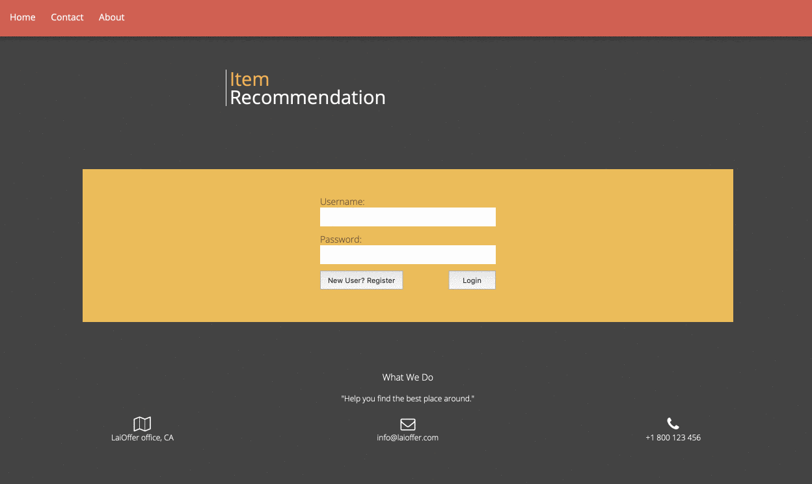
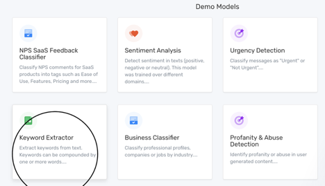
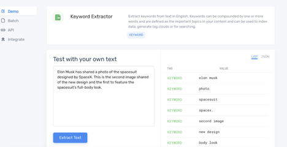
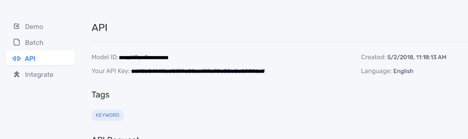
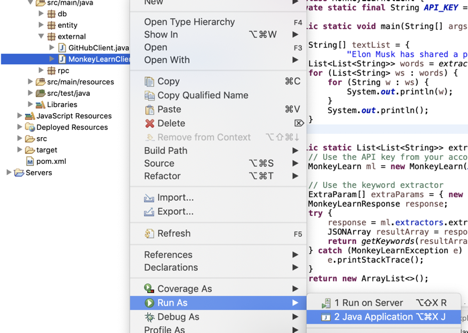
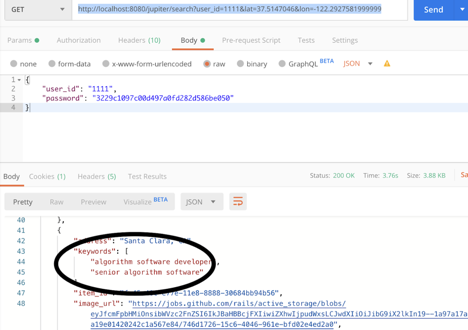

## Reacp

* In the last lesson, we fetch data from Github API and store the description in our database. 
* However, Content based recommendation requires some keywords/categories for better results. 
* In this lesson, we will learn the basic concepts of keyword extraction and use Monkey Learn API to achieve the results. 



Why can we show “algorithms, game development, distributed system”?

### Keyword extraction and TF-IDF

* Why do we need keyword extraction in this project? Github only returns a description of a job position but we need to generate a tag or a keyword. We then use keywords to improve recommendation results. 
* TF-IDF is one of the very common algorithms to extract keywords from text.
* MonkeyLearn API is one implementation of it.

[TF-IDF](http://www.ruanyifeng.com/blog/2013/03/tf-idf.html) algorithm tells you the ordered keywords in a text document (keyword extraction). TF (Term frequency) is the frequency of a word in a document. However, ‘a’, ‘the’, ‘is’ are common in every document and their TF values are high in almost every document which will overwhelm some real keywords. IDF (Inverse Document Frequency) is the importance of a word in general. IDF values are very low for these meaningless words. Final score is Final score = TF * IDF

Example 


唐僧：你想要啊？

唐僧: 你想要啊？悟空，你要是想要的话你就说话嘛，你不说我怎么知道你想要呢，虽然你很有诚意地看着我，可是你还是要跟我说你想要的。你真的想要吗？那你就拿去吧！你不是真的想要吧？难道你真的想要吗？…… 

TF (w=想要) = number of w in document / number of all words in document

IDF (w=想要) = log (number of all documents / number of documents have w + 1)

The reason why we add 1 is to avoid the case when w never exists in any doc. 

Assume we have a document like this

```
A maple tree is a tree.
```

First, calculate TF values:

TF(is) = 1/6

TF(maple) = 1/6

TF(tree) = 2/6

------

Second, calculate IDF values from Google search results (common sense)

IDF(is) = log ( 30 trillion / 25 billion + 1) = 3.079

IDF(maple) = log (30 trillion / 0.26 billion + 1) = 5.062

IDF(tree) = log (30 trillion / 1.5 billion + 1) = 4.301

------

Third, get their TF-IDF values (final score)

TF-IDF(tree) = 4.301 * 2/6 = 1.434

TF-IDF(maple) = 5.062 * 1/6 = 0.844 

TF-IDF (is) = 3.079 * 1/6 = 0.513 

------

Therefore, as keywords, tree > maple > is

### Monkey Learn API

Why choose Monkey Learn API

- One of the few keyword extraction APIs that are free
- Very detailed documentation and provide many client libraries
- However, it has data throttling so don’t try to do a load test on it or play it too frequently. If your account got blocked, apply for a new one. 

How to register a key?

Open https://app.monkeylearn.com/accounts/register/, use your own email to register


Choose ‘Keyword Extractor’ 



We may copy a paragraph for playing. 



Copy your own API key and Model ID (it depends)



Let’s go through the Java client libraries. 

https://monkeylearn.com/api/v3/#java

https://github.com/monkeylearn/monkeylearn-java

The Java examples provided by Monkey Learn API

```java
import com.monkeylearn.MonkeyLearn;
import com.monkeylearn.MonkeyLearnResponse;
import com.monkeylearn.MonkeyLearnException;
import com.monkeylearn.Tuple;
import com.monkeylearn.ExtraParam;

import org.json.simple.JSONObject;
import org.json.simple.JSONArray;

import java.util.ArrayList;

public class App {
    public static void main( String[] args ) throws MonkeyLearnException {

        // Use the API key from your account, similar to MySQLDBConnection
        MonkeyLearn ml = new MonkeyLearn("<YOUR API KEY HERE>");

        // Use the keyword extractor
        String[] textList = {"I love the movie", "I hate the movie"};
        ExtraParam[] extraParams = {new ExtraParam("max_keywords", "30")};
        MonkeyLearnResponse res = ml.extractors.extract("ex_y7BPYzNG", textList, extraParams);// the name of the model recently provided
        System.out.println( res.arrayResult );//print out the results
    }
}
```

### Implementation

1. Step 1: Update pom.xml

```xml
<project xmlns="http://maven.apache.org/POM/4.0.0"
	xmlns:xsi="http://www.w3.org/2001/XMLSchema-instance"
	xsi:schemaLocation="http://maven.apache.org/POM/4.0.0 http://maven.apache.org/maven-v4_0_0.xsd">
	<modelVersion>4.0.0</modelVersion>
	<groupId>laiproject</groupId>
	<artifactId>jupiter</artifactId>
	<packaging>war</packaging>
	<version>0.0.1-SNAPSHOT</version>
	<name>jupiter Maven Webapp</name>
	<url>http://maven.apache.org</url>
	<properties>
		<javaVersion>1.8</javaVersion>
		<maven.compiler.source>1.8</maven.compiler.source>
		<maven.compiler.target>1.8</maven.compiler.target>
	</properties>

	<dependencies>
		<dependency>
			<groupId>junit</groupId>
			<artifactId>junit</artifactId>
			<version>3.8.1</version>
			<scope>test</scope>
		</dependency>
		<dependency>
			<groupId>org.apache.tomcat</groupId>
			<artifactId>tomcat-catalina</artifactId>
			<version>9.0.30</version>
		</dependency>
		<dependency>
			<groupId>org.json</groupId>
			<artifactId>json</artifactId>
			<version>20190722</version>
		</dependency>
		<dependency>
			<groupId>mysql</groupId>
			<artifactId>mysql-connector-java</artifactId>
			<version>8.0.18</version>
		</dependency>
		<dependency>
			<groupId>com.monkeylearn</groupId>
			<artifactId>monkeylearn-java</artifactId>
			<version>0.1.5</version>
		</dependency>
		<dependency>
		    <groupId>com.googlecode.json-simple</groupId>
		    <artifactId>json-simple</artifactId>
		    <version>1.1.1</version>
		</dependency>
	</dependencies>
	<build>
		<finalName>jupiter</finalName>
	</build>
</project>
```

2. Step 2: add a MonkeyLearnClient.java in package external.

```java
package external;

import java.util.ArrayList;
import java.util.List;

import org.json.simple.JSONArray;
import org.json.simple.JSONObject;

import com.monkeylearn.ExtraParam;
import com.monkeylearn.MonkeyLearn;
import com.monkeylearn.MonkeyLearnException;
import com.monkeylearn.MonkeyLearnResponse;

public class MonkeyLearnClient {
	private static final String API_KEY = "YOUR_API_KEY";// make sure change it to your api key.
              	public static void main(String[] args) {
		
		String[] textList = {
				"Elon Musk has shared a photo of the spacesuit designed by SpaceX. This is the second image shared of the new design and the first to feature the spacesuit’s full-body look."};
		List<List<String>> words = extractKeywords(textList);
		for (List<String> ws : words) {
			for (String w : ws) {
				System.out.println(w);
			}
			System.out.println();
		}
	}

	public static List<List<String>> extractKeywords(String[] text) {
		// Use the API key from your account
		MonkeyLearn ml = new MonkeyLearn(API_KEY);

		// Use the keyword extractor
		ExtraParam[] extraParams = { new ExtraParam("max_keywords", "3") };
		MonkeyLearnResponse response;
		try {
			response = ml.extractors.extract("YOUR_MODEL_ID", text, extraParams);
			JSONArray resultArray = response.arrayResult;
			return getKeywords(resultArray);
		} catch (MonkeyLearnException e) {// it’s likely to have an exception
			e.printStackTrace();
		}
		return new ArrayList<>();
	}

	private static List<List<String>> getKeywords(JSONArray mlResultArray) {
		List<List<String>> topKeywords = new ArrayList<>();
		// Iterate the result array and convert it to our format.
		for (int i = 0; i < mlResultArray.size(); ++i) {
			List<String> keywords = new ArrayList<>();
			JSONArray keywordsArray = (JSONArray) mlResultArray.get(i);
			for (int j = 0; j < keywordsArray.size(); ++j) {
				JSONObject keywordObject = (JSONObject) keywordsArray.get(j);
				// We just need the keyword, excluding other fields.
				String keyword = (String) keywordObject.get("keyword");
				keywords.add(keyword);

			}
			topKeywords.add(keywords);
		}
		return topKeywords;
	}
}
```

3. Step 3, Run as Java Application to verify your api keys.



4. Expected results:

```
elon musk
second image
spacesuit
```

5. Step 5: Double check Item.java

```java
package entity;

import java.util.Set;

import org.json.JSONArray;
import org.json.JSONException;
import org.json.JSONObject;

public class Item {
	//...

	private Item(ItemBuilder builder) {
		// ...
	}

	public String getItemId() {
		return itemId;
	}

	public String getName() {
		return name;
	}

	public String getAddress() {
		return address;
	}

	public Set<String> getKeywords() {
		return keywords;
	}

	public String getImageUrl() {
		return imageUrl;
	}

	public String getUrl() {
		return url;
	}

	public void setKeywords(Set<String> keywords) {// why set?
		this.keywords = keywords;
	}

	public JSONObject toJSONObject() {
		// ...
	}

	//...

}
```

6. Step 6: Update GitHubClient.java

```java
package external;

import java.io.BufferedReader;
import java.io.InputStreamReader;
import java.io.UnsupportedEncodingException;
import java.net.URLEncoder;
import java.util.ArrayList;
import java.util.HashSet;
import java.util.List;

import org.apache.http.HttpEntity;
import org.apache.http.client.methods.CloseableHttpResponse;
import org.apache.http.client.methods.HttpGet;
import org.apache.http.impl.client.CloseableHttpClient;
import org.apache.http.impl.client.HttpClients;
import org.json.JSONArray;
import org.json.JSONException;
import org.json.JSONObject;

import entity.Item;
import entity.Item.ItemBuilder;

public class GitHubClient {
	private static final String URL_TEMPLATE = "https://jobs.github.com/positions.json?description=%s&lat=%s&long=%s";
	private static final String DEFAULT_KEYWORD = "developer";

	public List<Item> search(double lat, double lon, String keyword) {
		//...
	}

	private List<Item> getItemList(JSONArray array) throws JSONException {
		List<Item> itemList = new ArrayList<>();
		List<String> descriptionList = new ArrayList<>();

		for (int i = 0; i < array.length(); i++) {
			JSONObject object = array.getJSONObject(i);
			ItemBuilder builder = new ItemBuilder();
			builder.setItemId(object.getString("id"));
			builder.setName(object.getString("title"));
			builder.setAddress(object.getString("location"));
			builder.setUrl(object.getString("url"));
			builder.setImageUrl(object.isNull("company_logo") ? "" : object.getString("company_logo"));

			// We need to extract categories from description since GitHub API
			// doesn't return keywords.
			if (object.getString("description").equals("\n")) {
				descriptionList.add(object.getString("title"));
			} else {
				descriptionList.add(object.getString("description"));
			}
			
			Item item = builder.build();
			itemList.add(item);
		}

		// We need to get keywords from multiple text in one request since
		// MonkeyLearnAPI has a limitation on request per minute.
		String[] descriptionArray = descriptionList.toArray(new String[descriptionList.size()]); // Convert list to an array of the same type.
		List<List<String>> keywords = MonkeyLearnClient.extractKeywords(descriptionArray); // Call MonkeyLearn API.
		for (int i = 0; i < keywords.size(); ++i) {
			List<String> list = keywords.get(i);
			// Why do we use HashSet but List here?
			Set<String> set = new HashSet<String>(list);
			itemList.get(i).setKeywords(set);
		}

		return itemList;
	}

	public static void main(String[] args) {
		//...
	}
}
```

7. Step 7: Run the Server

Test Result

8. Step 8: Open Postman, Login first

   

   Call SearchItem

   URL: http://localhost:8080/jupiter/search?lat=37.5147046&lon=-122.2927581999999

   Method: GET

   Expected results:

   

   It's successful if you can see keywords in the returned results.

## Summary

* In this lesson, we need to understand the key concepts of TF-IDF
* We need to understand how to use Monkey Learn API
* In the next lesson, we will use these keywords to perform recommendation