## Goal

* Brief introduction to session based authentication process.
* Implement new methods to read/write user data from/to database.
* Create login, logout and register servlets to serve user requests.

## Authentication (Login/Logout)

Why do we need authentication/authorization?

* Access control: user can only access data that is authorized to that user.
* Logging: record user specific activity for book keeping, statistics, etc.

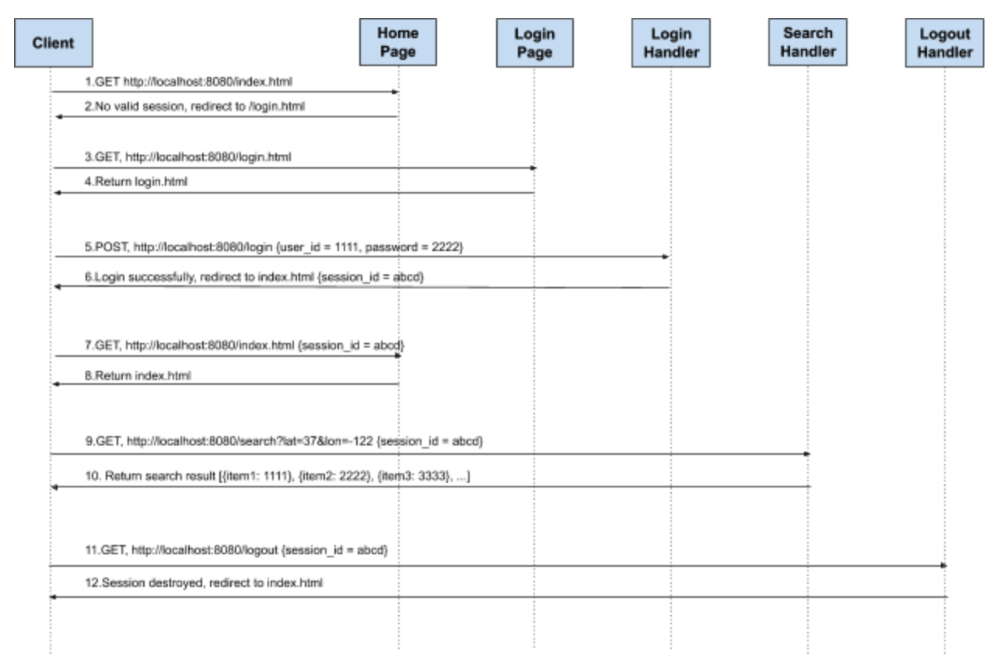

User Journey:

* For an application, some resources can only be accessed by an authenticated user. 
* Once a user is authenticated, the server uses a session to maintain his/her status. The session object is stored on the server side, only session ID is returned to the client side.
* Users need to provide session ID to access resources that require authentication.
* When a user logs out, the session is destroyed. Next time a user comes, he/she has to authenticate again to get a new session

### Read/Write User Data from/to database

1. Step 1, Open your project in Eclipse and navigate to MySQLDBConnection class.

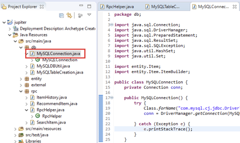

2. Step 2, Add three more methods to the class: verifyLogin, getFullname and addUser.

```java
package db;

...

public class MySQLConnection {
	private Connection conn;

	public MySQLConnection() {
		...
	}

	public void close() {
		...
	}

	public void setFavoriteItems(String userId, Item item) {
		...
	}

	public void unsetFavoriteItems(String userId, String itemId) {
		...
	}

	public void saveItem(Item item) {
		...
	}

	public Set<String> getFavoriteItemIds(String userId) {
		...
	}

	public Set<Item> getFavoriteItems(String userId) {
		...
	}

	public Set<String> getKeywords(String itemId) {
		...
	}

	public String getFullname(String userId) {
		if (conn == null) {
			System.err.println("DB connection failed");
			return "";
		}
		String name = "";
		String sql = "SELECT first_name, last_name FROM users WHERE user_id = ? ";
		try {
			PreparedStatement statement = conn.prepareStatement(sql);
			statement.setString(1, userId);
			ResultSet rs = statement.executeQuery();
			while (rs.next()) {
				name = rs.getString("first_name") + " " + rs.getString("last_name");
			}
		} catch (SQLException e) {
			System.out.println(e.getMessage());
		}
		return name;
	}

	public boolean verifyLogin(String userId, String password) {
		if (conn == null) {
			System.err.println("DB connection failed");
			return false;
		}
		String sql = "SELECT user_id FROM users WHERE user_id = ? AND password = ?";
		try {
			PreparedStatement stmt = conn.prepareStatement(sql);
			stmt.setString(1, userId);
			stmt.setString(2, password);
			ResultSet rs = stmt.executeQuery();
			if (rs.next()) {
				return true;
			}
		} catch (SQLException e) {
			System.out.println(e.getMessage());
		}
		return false;
	}

	public boolean addUser(String userId, String password, String firstname, String lastname) {
		if (conn == null) {
			System.err.println("DB connection failed");
			return false;
		}

		String sql = "INSERT IGNORE INTO users VALUES (?, ?, ?, ?)";
		try {
			PreparedStatement ps = conn.prepareStatement(sql);
			ps.setString(1, userId);
			ps.setString(2, password);
			ps.setString(3, firstname);
			ps.setString(4, lastname);

			return ps.executeUpdate() == 1;
		} catch (SQLException e) {
			e.printStackTrace();
		}
		return false;
	}

}
```

### Implement Login, Logout and Register servlet

1. Step 1, Right click your project and create a new Servlet.

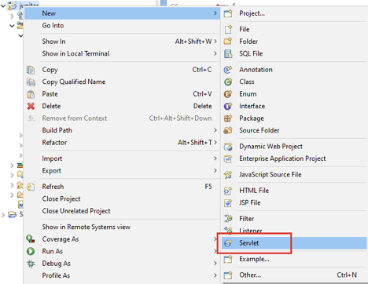

2. Step 2, Use rpc as the package name and Login as class name, then click next.

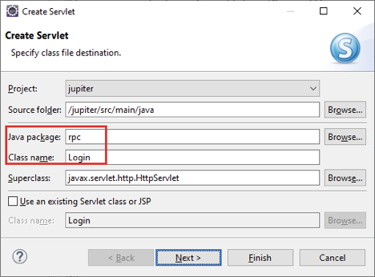

3. Step 3, Update url mapping to /login and then click Finish.

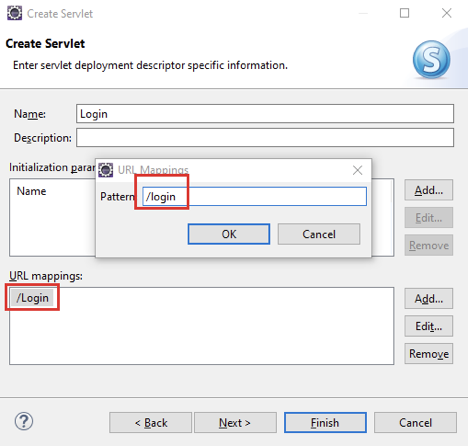

4. Step 4, Update doPost() method in Login class. The method will check the input credentials and create a session for a valid user.

   

   Sample request:

   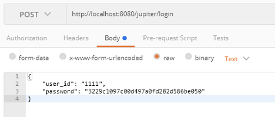

   ```java
   public class Login extends HttpServlet {
   	private static final long serialVersionUID = 1L;
   
   	/**
   	 * @see HttpServlet#HttpServlet()
   	 */
   	public Login() {
   		super();
   		// TODO Auto-generated constructor stub
   	}
   
   	/**
   	 * @see HttpServlet#doGet(HttpServletRequest request, HttpServletResponse
   	 *      response)
   	 */
   	protected void doGet(HttpServletRequest request, HttpServletResponse response)
   			throws ServletException, IOException {
   		...
   	}
   
   	/**
   	 * @see HttpServlet#doPost(HttpServletRequest request, HttpServletResponse
   	 *      response)
   	 */
   	protected void doPost(HttpServletRequest request, HttpServletResponse response)
   			throws ServletException, IOException {
   		MySQLConnection connection = new MySQLConnection();
   		try {
   			JSONObject input = RpcHelper.readJSONObject(request);
   			String userId = input.getString("user_id");
   			String password = input.getString("password");
   
   			JSONObject obj = new JSONObject();
   			if (connection.verifyLogin(userId, password)) {
   				HttpSession session = request.getSession();
   				session.setAttribute("user_id", userId);
   				session.setMaxInactiveInterval(600);
   				obj.put("status", "OK").put("user_id", userId).put("name", connection.getFullname(userId));
   			} else {
   				obj.put("status", "User Doesn't Exist");
   				response.setStatus(401);
   			}
   			RpcHelper.writeJsonObject(response, obj);
   
   		} catch (Exception e) {
   			e.printStackTrace();
   		} finally {
   			connection.close();
   		}
   	}
   }
   ```

5. Step 5, Update doGet() method in Login class. The method will only check the existence of the session id and verify whether the corresponding session is still alive.

   ```java
   public class Login extends HttpServlet {
   	private static final long serialVersionUID = 1L;
   
   	/**
   	 * @see HttpServlet#HttpServlet()
   	 */
   	public Login() {
   		super();
   		// TODO Auto-generated constructor stub
   	}
   
   	/**
   	 * @see HttpServlet#doGet(HttpServletRequest request, HttpServletResponse
   	 *      response)
   	 */
   	protected void doGet(HttpServletRequest request, HttpServletResponse response)
   			throws ServletException, IOException {
   		HttpSession session = request.getSession(false);
   		JSONObject obj = new JSONObject();
   		if (session != null) {
   			MySQLConnection connection = new MySQLConnection();
   			String userId = session.getAttribute("user_id").toString();
   			obj.put("status", "OK").put("user_id", userId).put("name", connection.getFullname(userId));
   			connection.close();
   		} else {
   			obj.put("status", "Invalid Session");
   			response.setStatus(403);
   		}
   		RpcHelper.writeJsonObject(response, obj);
   	}
   
   	/**
   	 * @see HttpServlet#doPost(HttpServletRequest request, HttpServletResponse
   	 *      response)
   	 */
   	protected void doPost(HttpServletRequest request, HttpServletResponse response)
   			throws ServletException, IOException {
   		...
   	}
   }
   ```

6. Step 6, Add another servlet named Logout under the same package and **change the url mapping to /logout**.

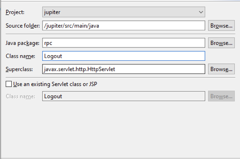

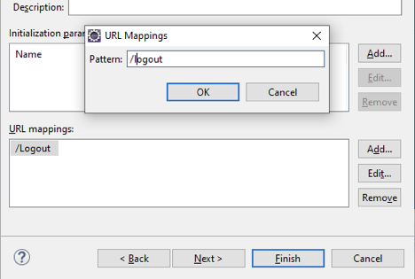

7. Step 7, Update doGet() method in Logout class to destroy the session if it’s still alive.

   ```java
   package rpc;
   
   import java.io.IOException;
   
   import javax.servlet.ServletException;
   import javax.servlet.http.HttpServlet;
   import javax.servlet.http.HttpServletRequest;
   import javax.servlet.http.HttpServletResponse;
   import javax.servlet.http.HttpSession;
   
   /**
    * Servlet implementation class Logout
    */
   public class Logout extends HttpServlet {
   	private static final long serialVersionUID = 1L;
   
   	/**
   	 * @see HttpServlet#HttpServlet()
   	 */
   	public Logout() {
   		super();
   		// TODO Auto-generated constructor stub
   	}
   
   	/**
   	 * @see HttpServlet#doGet(HttpServletRequest request, HttpServletResponse
   	 *      response)
   	 */
   	protected void doGet(HttpServletRequest request, HttpServletResponse response)
   			throws ServletException, IOException {
   		HttpSession session = request.getSession(false);
   		if (session != null) {
   			session.invalidate();
   		}
   		response.sendRedirect("index.html");
   	}
   
   	/**
   	 * @see HttpServlet#doPost(HttpServletRequest request, HttpServletResponse
   	 *      response)
   	 */
   	protected void doPost(HttpServletRequest request, HttpServletResponse response)
   			throws ServletException, IOException {
   		...
   	}
   
   }
   ```

8. Step 8, After Login and Logout, create the last servlet named Register in the same package, **and change the url mapping to /register.**

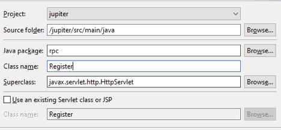

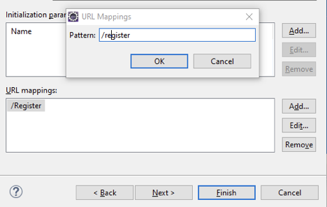

9. Step 9, Update doPost() method in Register class which will add a new user based on the input user information.

   Sample request:

   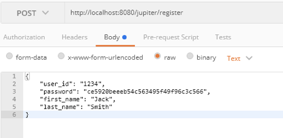

   ```java
   public class Register extends HttpServlet {
   	private static final long serialVersionUID = 1L;
   
   	/**
   	 * @see HttpServlet#HttpServlet()
   	 */
   	public Register() {
   		super();
   		// TODO Auto-generated constructor stub
   	}
   
   	/**
   	 * @see HttpServlet#doGet(HttpServletRequest request, HttpServletResponse
   	 *      response)
   	 */
   	protected void doGet(HttpServletRequest request, HttpServletResponse response)
   			throws ServletException, IOException {
   		...
   	}
   
   	/**
   	 * @see HttpServlet#doPost(HttpServletRequest request, HttpServletResponse
   	 *      response)
   	 */
   	protected void doPost(HttpServletRequest request, HttpServletResponse response)
   			throws ServletException, IOException {
   		MySQLConnection connection = new MySQLConnection();
   		JSONObject input = RpcHelper.readJSONObject(request);
   		String userId = input.getString("user_id");
   		String password = input.getString("password");
   		String firstname = input.getString("first_name");
   		String lastname = input.getString("last_name");
   
   		JSONObject obj = new JSONObject();
   		if (connection.addUser(userId, password, firstname, lastname)) {
   			obj.put("status", "OK");
   		} else {
   			obj.put("status", "User Already Exists");
   		}
   		connection.close();
   		RpcHelper.writeJsonObject(response, obj);
   	}
   }
   ```

10. Step 10, (Optional) Remove doGet() method in Register class since we don’t need it anymore.

    ```java
    public class Register extends HttpServlet {
    	private static final long serialVersionUID = 1L;
    
    	/**
    	 * @see HttpServlet#HttpServlet()
    	 */
    	public Register() {
    		super();
    		// TODO Auto-generated constructor stub
    	}
    
    	/**
    	 * @see HttpServlet#doPost(HttpServletRequest request, HttpServletResponse
    	 *      response)
    	 */
    	protected void doPost(HttpServletRequest request, HttpServletResponse response)
    			throws ServletException, IOException {
    		...
    	}
    }
    ```

### Test your Code

1. Step 1, Save all your changes and start your tomcat server.

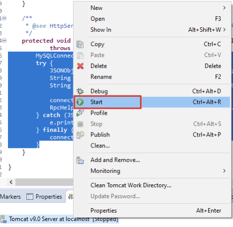

2. Step 2, Open http://localhost:8080/jupiter in your browser.

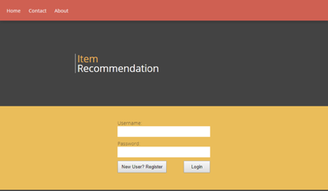

3. Step 3, Register a new user with any username/password you like.

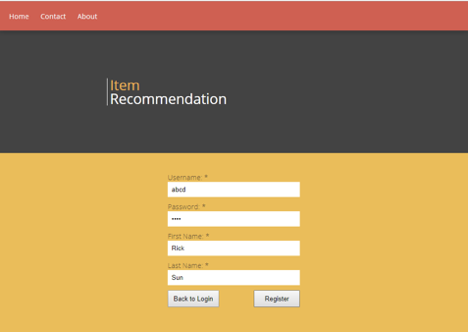

4. Step 4, Login with the user you’ve created in the last step and make sure you can see the search result page.


5. Step 5, Click logout button and make sure you’re redirected to the login page.


### Protect Your Services with Session Validation

To enforce the login process, we need to protect all the other servlets with a verification to see if the session is logged in or not.

1. Step 1, In SearchItem.java, add session validation at the beginning of the doGet() method.

   ```java
   public class SearchItem extends HttpServlet {
   	private static final long serialVersionUID = 1L;
   
   	/**
   	 * @see HttpServlet#HttpServlet()
   	 */
   	public SearchItem() {
   		super();
   		// TODO Auto-generated constructor stub
   	}
   
   	/**
   	 * @see HttpServlet#doGet(HttpServletRequest request, HttpServletResponse
   	 *      response)
   	 */
   	protected void doGet(HttpServletRequest request, HttpServletResponse response)
   			throws ServletException, IOException {
   		HttpSession session = request.getSession(false);
   		if (session == null) {
   			response.setStatus(403);
   			return;
   		}
   
   		String userId = request.getParameter("user_id");
   		double lat = Double.parseDouble(request.getParameter("lat"));
   		double lon = Double.parseDouble(request.getParameter("lon"));
   
   		GitHubClient client = new GitHubClient();
   		List<Item> items = client.search(lat, lon, null);
   
   		MySQLConnection connection = new MySQLConnection();
   		Set<String> favoritedItemIds = connection.getFavoriteItemIds(userId);
   		JSONArray array = new JSONArray();
   		for (Item item : items) {
   			JSONObject obj = item.toJSONObject();
   			try {
   				obj.put("favorite", favoritedItemIds.contains(item.getItemId()));
   			} catch (JSONException e) {
   				e.printStackTrace();
   			}
   			array.put(obj);
   		}
   		RpcHelper.writeJsonArray(response, array);
   	}
   
   	/**
   	 * @see HttpServlet#doPost(HttpServletRequest request, HttpServletResponse
   	 *      response)
   	 */
   	protected void doPost(HttpServletRequest request, HttpServletResponse response)
   			throws ServletException, IOException {
   		...
   	}
   }
   ```

2. Step 2, Similarly in ItemHistory.java ,but you need to add the same code to doGet(), doPost() and doDelete().

   ```java
   public class ItemHistory extends HttpServlet {
   	private static final long serialVersionUID = 1L;
   
   	/**
   	 * @see HttpServlet#HttpServlet()
   	 */
   	public ItemHistory() {
   		super();
   		// TODO Auto-generated constructor stub
   	}
   
   	/**
   	 * @see HttpServlet#doGet(HttpServletRequest request, HttpServletResponse
   	 *      response)
   	 */
   	protected void doGet(HttpServletRequest request, HttpServletResponse response)
   			throws ServletException, IOException {
   		HttpSession session = request.getSession(false);
   		if (session == null) {
   			response.setStatus(403);
   			return;
   		}
   
   		String userId = request.getParameter("user_id");
   		JSONArray array = new JSONArray();
   
   		MySQLConnection connection = new MySQLConnection();
   		Set<Item> items = connection.getFavoriteItems(userId);
   		connection.close();
   
   		for (Item item : items) {
   			JSONObject obj = item.toJSONObject();
   			try {
   				obj.append("favorite", true);
   			} catch (JSONException e) {
   				e.printStackTrace();
   			}
   			array.put(obj);
   		}
   		RpcHelper.writeJsonArray(response, array);
   	}
   
   	/**
   	 * @see HttpServlet#doPost(HttpServletRequest request, HttpServletResponse
   	 *      response)
   	 */
   	protected void doPost(HttpServletRequest request, HttpServletResponse response)
   			throws ServletException, IOException {
   		HttpSession session = request.getSession(false);
   		if (session == null) {
   			response.setStatus(403);
   			return;
   		}
   		
   		MySQLConnection connection = new MySQLConnection();
   		try {
   			JSONObject input = RpcHelper.readJSONObject(request);
   			String userId = input.getString("user_id");
   			Item item = RpcHelper.parseFavoriteItem(input.getJSONObject("favorite"));
   
   			connection.setFavoriteItems(userId, item);
   			RpcHelper.writeJsonObject(response, new JSONObject().put("result", "SUCCESS"));
   		} catch (JSONException e) {
   			e.printStackTrace();
   		} finally {
   			connection.close();
   		}
   	}
   
   	/**
   	 * @see HttpServlet#doDelete(HttpServletRequest, HttpServletResponse)
   	 */
   	protected void doDelete(HttpServletRequest request, HttpServletResponse response)
   			throws ServletException, IOException {
   		HttpSession session = request.getSession(false);
   		if (session == null) {
   			response.setStatus(403);
   			return;
   		}
   
   		MySQLConnection connection = new MySQLConnection();
   		try {
   			JSONObject input = RpcHelper.readJSONObject(request);
   			String userId = input.getString("user_id");
   			String itemId = input.getJSONObject("favorite").getString("item_id");
   
   			connection.unsetFavoriteItems(userId, itemId);
   			RpcHelper.writeJsonObject(response, new JSONObject().put("result", "SUCCESS"));
   		} catch (JSONException e) {
   			e.printStackTrace();
   		} finally {
   			connection.close();
   		}
   	}
   
   }
   ```

## Summary

* 