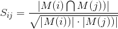
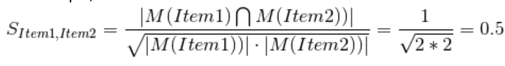
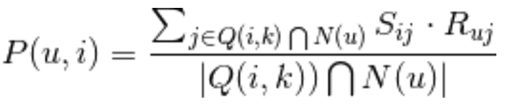
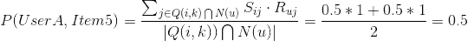
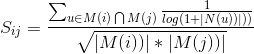
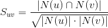
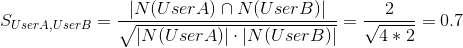
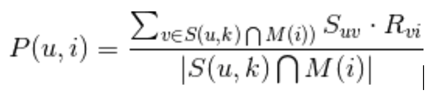
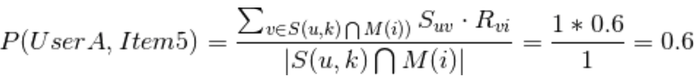
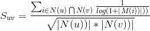

## Recap

* Authentication
* Keyword Extraction
* Postman Usages

All REST Apis in postman collection for sharing: https://www.postman.com/collections/2bfdc8cd22ae5daa963e

(Import in the app)

## Recommendation System

Q: Examples of recommendation system:

* Amazon search history, recommendations
* Google Ads
* YouTube recommendations
* [Netflix Price](https://en.wikipedia.org/wiki/Netflix_Prize) US$1 Million

Q: Why is a recommendation system important?

推荐系统是用来干什么的? 已知Users对某些Items的评价, 判断用户对其它Item的兴趣. 把“User-Item”的打分矩阵中的缺失值补齐.

|       | Item1 | Item2 | Item3 | Item4 | Item5 |
| ----- | ----- | ----- | ----- | ----- | ----- |
| UserA | 1     | 1     | 1     | 1     | -     |
| UserB | 1     | -     | 1     | -     | -     |
| UserC | -     | 1     | -     | -     | 1     |
| UserD | -     | -     | 1     | 1     | 1     |

### How to address this question

1. **Content-based Recommendation**

   Key point: You will like people or things of similar characteristics.

   Given item profiles (category, price, etc.) of your favorite, recommend items that are similar to what you liked before. This is what we’ll use in our application.

   - Content-based method是不同于Item-based method的推荐系统设计思想.
   - 它是通过物品”本身的特点”, 而不是“购买这个物品的用户的信息”, 来计算物品之间的相似度.
   - 在系统没有足够数据的时候, 一般先使用content-based method.

2.**Item-based method**

Filter based on the similarity of Items. 


Item A is liked by User A, User B, User C

Item B is liked by User B.

Item C is liked by User A, User B

=> Item A and Item C are alike

Item C is liked by users who like Item A, so recommend it to user C (another user who likes Item A). 

Step 1**,**计算物品之间相似度, M(i)表示喜欢物品i的用户的集合



通过分析用户的行为记录计算物品之间的相似度. 也就是说, item之间的相似性来自于user购买item的行为.

For example, 



|       | Item1 | Item2 | Item3 | Item4 | Item5 |
| ----- | ----- | ----- | ----- | ----- | ----- |
| UserA | **1** | **1** | 1     | 1     | -     |
| UserB | **1** | **-** | 1     | -     | -     |
| UserC | **-** | **1** | -     | -     | 1     |
| UserD | **-** | **-** | 1     | 1     | 1     |

|       | Item1   | Item2   | Item3 | Item4 | Item5 |
| ----- | ------- | ------- | ----- | ----- | ----- |
| Item1 | -       | **0.5** | -     | -     | -     |
| Item2 | **0.5** | -       | -     | -     | -     |
| Item3 | -       | -       | -     | -     | -     |
| Item4 | -       | -       | -     | -     | -     |
| Item5 | -       | -       | -     | -     | -     |

Final Result,

|       | Item1   | Item2   | Item3   | Item4   | Item5   |
| ----- | ------- | ------- | ------- | ------- | ------- |
| Item1 | 1       | **0.5** | **0.8** | **0.5** | **0**   |
| Item2 | **0.5** | 1       | **0.4** | **0.5** | **0.5** |
| Item3 | **0.8** | **0.4** | 1       | **0.8** | **0.4** |
| Item4 | **0.5** | **0.5** | **0.8** | 1       | **0.5** |
| Item5 | **0**   | **0.5** | **0.4** | **0.5** | 1       |

Step 2, 用“与物品x相似的前k个物品”, 以及当前用户对这些物品的评价加权值, 作为向当前用户对物品x的推荐.

Suppose we want to know user u’s interest on item i:

用“与物品x相似的前k个物品”, 以及当前用户对这些物品的评价加权值, 作为向当前用户对物品x的推荐.

Suppose we want to know user u’s interest on item i:



这里, Q(i, k)表示与物品i最相似的k个物品，N(u)是用户u喜欢的物品的集合. Sij是物品i和物品j的相似度，ruj代表用户u对物品j的兴趣.

For example, suppose we consider k = 2

|       | Item1 | Item2 | Item3 | Item4 | Item5 |
| ----- | ----- | ----- | ----- | ----- | ----- |
| UserA | **1** | **1** | **1** | **1** | -     |
| UserB | 1     | -     | 1     | -     | -     |
| UserC | -     | 1     | -     | -     | 1     |
| UserD | -     | -     | 1     | 1     | 1     |

|       | Item1 | Item2   | Item3 | Item4   | Item5 |
| ----- | ----- | ------- | ----- | ------- | ----- |
| Item1 | 1     | 0.5     | 0.8   | 0.5     | 0     |
| Item2 | 0.4   | 1       | 0.4   | 0.5     | 0.5   |
| Item3 | 0.8   | 0.4     | 1     | 0.8     | 0.4   |
| Item4 | 0.5   | 0.5     | 0.8   | 1       | 0.5   |
| Item5 | 0     | **0.5** | 0.4   | **0.5** | 1     |

N(userA) = {Item1, Item2, Item3, Item4}

Q(Item5, 2) = {Item2, Item4}

Q(Item5, 2) ∩ N(userA) = {Item2, Item4}

S(Item2, Item5) * R(userA, Item2) = 0.5 * 1 = 0.5

S(Item4, Item5) * R(userA, Item4) = 0.5 * 1 = 0.5




P(userD, Item2) = (0.5 + 0.5) / 2 = 0.5

N(userD) = {item3, item4, item5}

Q(item2, 2) = {item4, item5}

Q(item2, 2) ∩ N(userD) = {item4, item5} -> j -> {item4, item5}

S(item2, item4} * R(userD, item4} = 0.5 * 1 = 0.5

S(item2, item5} * R(userD, item5} = 0.5 * 1 = 0.5

|       | Item1 | Item2 | Item3 | Item4 | Item5   |
| ----- | ----- | ----- | ----- | ----- | ------- |
| UserA | 1     | 1     | 1     | 1     | **0.5** |
| UserB | 1     | -     | 1     | -     | -       |
| UserC | -     | 1     | -     | -     | 1       |
| UserD | -     | -     | 1     | 1     | 1       |

Final Result:

| UserA | 1       | 1       | 1     | 1        | **0.5** |
| ----- | ------- | ------- | ----- | -------- | ------- |
| UserB | 1       | **0.5** | 1     | **0.65** | **0**   |
| UserC | **0.5** | 1       | **0** | **0**    | 1       |
| UserD | **0.8** | **0.5** | 1     | 1        | 1       |

改进方法：Item-IUF (Inverse User Frequence)

基本思想是, 不活跃用户对于商品相似度的贡献, 应该大于活跃的用户对商品相似度的贡献.

处理方法: 利用用户活跃度，对表达式的分子添加一个惩罚项.



这里, |N(u)|表示用户u喜欢的物品的个数.

3. **User-based method**

   Filter based on the similarity of Users. 

   User A likes Item A, Item C.

   User B likes Item B.

   User C likes Item A, Item C, Item D.

   => User A shares similar preference as User C compared to User B. 

   User C also likes Item D

   => User A may like Item D. 

   

   Step 1**,** 计算用户之间的相似度, N(u)表示用户u喜欢的物品的集合.

   ​					

​		For example,

​		

|       | Item1 | Item2 | Item3 | Item4 | Item5 |
| ----- | ----- | ----- | ----- | ----- | ----- |
| UserA | **1** | **1** | **1** | **1** | -     |
| UserB | **1** | **-** | **1** | **-** | -     |
| UserC | -     | 1     | -     | -     | 1     |
| UserD | -     | -     | 1     | 1     | 1     |

|       | UserA   | UserB   | UserC | UserD |
| ----- | ------- | ------- | ----- | ----- |
| UserA | -       | **0.7** | -     | -     |
| UserB | **0.7** | -       | -     | -     |
| UserC | -       | -       | -     | -     |
| UserD | -       | -       | -     | -     |

​		Final result,

|       | UserA    | UserB   | UserC    | UserD   |
| ----- | -------- | ------- | -------- | ------- |
| UserA | 1        | **0.7** | **0.35** | **0.6** |
| UserB | **0.7**  | 1       | **0**    | **0.4** |
| UserC | **0.35** | **0**   | 1        | **0.4** |
| UserD | **0.6**  | **0.4** | **0.4**  | 1       |

Step 2**,** 用“前k个相似的用户中, 对某商品i有评价的用户”对商品i的评价值的加权值, 作为向当前用户对商品i的推荐。 p(u, i)代表用户u对物品i的兴趣。



这里, S(u, k)表示和用户u兴趣最接近的k个用户，M(i)是喜欢物品i的用户的集合. Suv是用户u和用户v的兴趣的相似度，Rvi代表用户v对物品i的兴趣.

For example, suppose we consider k = 2.

|       | Item1 | Item2 | Item3 | Item4 | Item5 |
| ----- | ----- | ----- | ----- | ----- | ----- |
| UserA | 1     | 1     | 1     | 1     | -     |
| UserB | 1     | -     | 1     | -     | -     |
| UserC | -     | 1     | -     | -     | **1** |
| UserD | -     | -     | 1     | 1     | **1** |

|       | UserA | UserB   | UserC | UserD   |
| ----- | ----- | ------- | ----- | ------- |
| UserA | 1     | **0.7** | 0.35  | **0.6** |
| UserB | 0.7   | 1       | 0     | 0.4     |
| UserC | 0.35  | 0       | 1     | 0.4     |
| UserD | 0.6   | 0.4     | 0.4   | 1       |

M(Item5) = {UserC, UserD}

S(UserA, 2) = {UserB, UserD}

M(Item5) ∩ S(UserA, 2) = {UserD}

S(UserA, UserD) * R(UserD, Item5) = 0.6 * 1 = 0.6



|       | Item1 | Item2 | Item3 | Item4 | Item5   |
| ----- | ----- | ----- | ----- | ----- | ------- |
| UserA | 1     | 1     | 1     | 1     | **0.6** |
| UserB | 1     | -     | 1     | -     | -       |
| UserC | -     | 1     | -     | -     | 1       |
| UserD | -     | -     | 1     | 1     | 1       |

Final result:

| UserA | 1        | 1       | 1         | 1         | **0.6** |
| ----- | -------- | ------- | --------- | --------- | ------- |
| UserB | 1        | **0.7** | 1         | **0.55**  | **0.4** |
| UserC | **0.35** | 1       | **0.375** | **0.375** | 1       |
| UserD | **0.5**  | **0.6** | 1         | 1         | 1       |

改进方法: User-IIF

原User-based算法的问题: 如果两个用户都对某个很popular的商品感兴趣, 并不能说明这两个用户很相似. 即, 两个用户对冷门商品有相同的兴趣才更能说明他们的兴趣的相似度.

处理方法: 利用共同感兴趣的商品的热门程度，对表达式的分子添加一个惩罚项.



这里|M(i)|表示的是, 喜欢商品i的用户的个数.

### Precision and Recall

Recommendation example

|                          | Human: Like | Human: Unlike |
| ------------------------ | ----------- | ------------- |
| Algorithm: Recommend     | A           | B             |
| Algorithm: Not Recommend | C           | D             |

Precision = A / (A + B)

所有推荐当中我喜欢的，查准率。

Recall = A / (A + C)

所有我喜欢的当中成功推荐了的，查全率。

Real world is full of noise. 

Assume transparent means algorithm marks as Spam

Precision ? = 4 / 4

Recall ? = 4 / 7

Precision ? = 7 / 9

Recall ? = 7 / 7

**Which one is important?** Recall vs. Precision. 

Example 1: Spam Email - Image you have a stupid algorithm that marks all offer emails as spam. 

Example 2: Terrorist detection - 宁可错杀一百..不能放过一个...

Engineering Design

Step 1, given a user, get all the events (ids) this user has visited.

```java
history: history_id, user_id, item_id, last_favor_time.
Set<String> itemIds = connection.getFavoriteItemIds(userId);
```

Step 2, given all these events, get their keywords and sort by count.

```java
keywords: item_id, keyword.
Set<String> keywords = connection.getKeywords(itemId);
```

Step 3, given these categories, use Github Job API with keyword, then filter out user favorited events.

```java
external API
List<Item> items = connection.searchItems(userId, lat, lon, keyword);
```


## Code Implementation

1. Step 1, Add a new package **src/recommendation.** Add Recommendation.java.

```java

package recommendation;

import java.util.ArrayList;
import java.util.Collections;
import java.util.HashMap;
import java.util.HashSet;
import java.util.List;
import java.util.Map;
import java.util.Map.Entry;
import java.util.Set;

import db.MySQLConnection;
import entity.Item;
import external.GitHubClient;

public class Recommendation {

	public List<Item> recommendItems(String userId, double lat, double lon) {
		List<Item> recommendedItems = new ArrayList<>();

		// Step 1, get all favorited itemids
		MySQLConnection connection = new MySQLConnection();
		Set<String> favoritedItemIds = connection.getFavoriteItemIds(userId);

		// Step 2, get all categories, sort by count
		// {"software engineer": 6, "backend": 4, "san francisco": 3, "remote": 1}
		Map<String, Integer> allKeywords = new HashMap<>();
		for (String itemId : favoritedItemIds) {
			Set<String> keywords = connection.getKeywords(itemId);
			for (String keyword : keywords) {
				allKeywords.put(keyword, allKeywords.getOrDefault(keyword, 0) + 1);
			}
		}
		connection.close();
		
		List<Entry<String, Integer>> keywordList = new ArrayList<>(allKeywords.entrySet());
		Collections.sort(keywordList, (Entry<String, Integer> e1, Entry<String, Integer> e2) -> {
			return Integer.compare(e2.getValue(), e1.getValue());
		});

		// Cut down search list only top 3
		if (keywordList.size() > 3) {
			keywordList = keywordList.subList(0, 3);
		}
		
		// Step 3, search based on keywords, filter out favorite items
		Set<String> visitedItemIds = new HashSet<>();
		GitHubClient client = new GitHubClient();
		
		for (Entry<String, Integer> keyword : keywordList) {
			List<Item> items = client.search(lat, lon, keyword.getKey());

			for (Item item : items) {
				if (!favoritedItemIds.contains(item.getItemId()) && !visitedItemIds.contains(item.getItemId())) {
					recommendedItems.add(item);
					visitedItemIds.add(item.getItemId());
				}
			}
		}
		return recommendedItems;
	}
}
```

2. Step 2, Go to src/rpc/RecommendItem.java, implement doGet() method.

```java

package rpc;

...

public class RecommendItem extends HttpServlet {
  private static final long serialVersionUID = 1L;

  ...

  /**
   * @see HttpServlet#doGet(HttpServletRequest request, HttpServletResponse response)
   */
	protected void doGet(HttpServletRequest request, HttpServletResponse response)
			throws ServletException, IOException {
		HttpSession session = request.getSession(false);
		if (session == null) {
			response.setStatus(403);
			return;
		}
		String userId = request.getParameter("user_id");

		double lat = Double.parseDouble(request.getParameter("lat"));
		double lon = Double.parseDouble(request.getParameter("lon"));

		Recommendation recommendation = new Recommendation();
		List<Item> items = recommendation.recommendItems(userId, lat, lon);
		JSONArray array = new JSONArray();
		for (Item item : items) {
			array.put(item.toJSONObject());
		}
		RpcHelper.writeJsonArray(response, array);	

	}
 ...
}
```

3. Step 3, Restart Tomcat Server and use http://localhost:8080/jupiter to test your recommendation result.

