## Goal

* Brief introduction to AWS EC2
* Setup a EC2 VM instance
* Deploy your Jupiter project to the EC2 VM with Docker

## Cloud Computing Introduction

Cloud computing is the delivery of on-demand computing resources—everything from applications to data centers—over the Internet on a pay-for-use basis.

- Since 2006 when Amazon introduced the Elastic Compute Cloud

## Service Models

IaaS (Infrastructure as a service)

- Offers virtual machines

PaaS (Platform as a service)

- computing platform including programming language execution environment, database and web server. Develop and run their software solutions on a cloud platform without the cost and complexity of buying and managing hardware and software layers.

SaaS (Software as a service)

- Users are provided access to application software and databases.
   

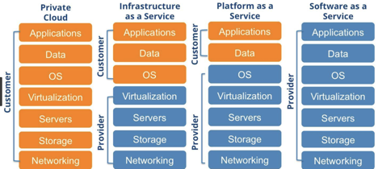

Amazon EC2

* Elastic Compute Cloud (EC2) : EC2 allows scalable deployment of applications by providing a Web service through which a user can boot an Amazon Machine Image to create a virtual machine, which Amazon calls an "instance", containing any software desired. A user can create, launch, and terminate server instances as needed, paying by the hour for active servers, hence the term "elastic".

## Launch an EC2 Instance

1. Step 1, go to [http://aws.amazon.com](http://aws.amazon.com/), sign into your account and then open the EC2 dashboard. Under the EC2 page, click Launch Instance.

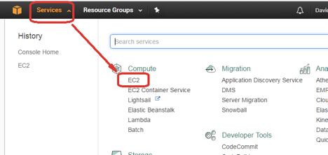

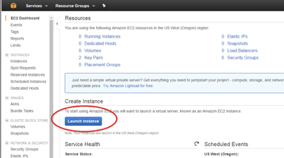

2. Step 2, Under choose AMI page, choose the “Ubuntu Server 18.04 LTS (HVM), SSD Volume Type” image.

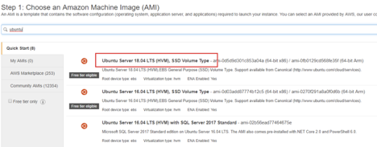

3. Step 3, Step 3, Under choose instance type page, choose t2.micro which is free tier eligible. Click next instead of launch.

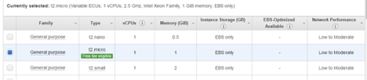

4. Step 4, Keep clicking next to configure security group page. Click the Add Rule button, then put 80 under the Port Range column and 0.0.0.0/0 under the Source column.

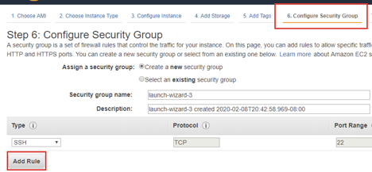

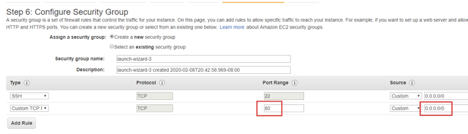

5. Step 5, Click Launch, you will be asked to create a new key pair and download the private key. You can name it as mykey.pem

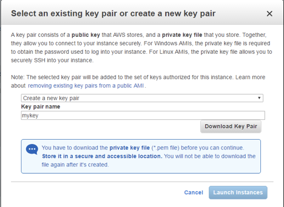

6. Step 6, After instance state is running, find the public IP of your instance. You’ll need it in the next step.

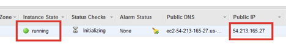

## Connect to the Instance

1. Step 1,  Open your terminal/git bash and run the following command. **You need to use your own path of mykey.pem and IP address of your instance.**

```unix
chmod 600 YOUR_PRIVATE_KEY_LOCATION
ssh -i YOUR_PRIVATE_KEY_LOCATION ubuntu@YOUR_INSTANCE_IP
```

For example:

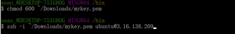

2. Step 2, If asked “Are you sure you want to continue connecting (yes/no)? ”, type “yes”, enter.

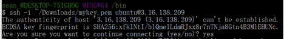

3. Step 3, Verify that you’ve successfully ssh’ed to your instance.

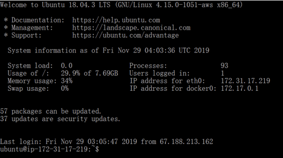

## Docker Introduction

### Viertual Machine (EC2)

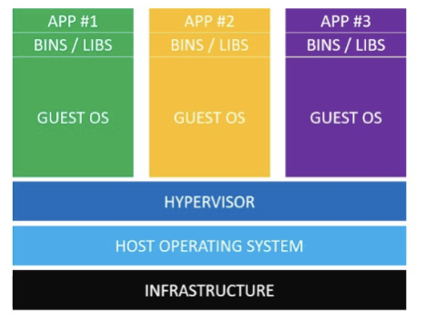

Hypervisor: Software that manages virtual machines(e.g. VMWare)

### Docker

What’s Docker?

- A platform for developers/sysadmins/etc to interact with Linux containers.
- Currently the most popular platform for handling Linux containers.

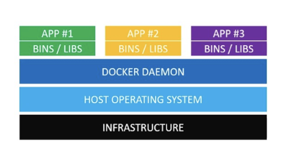

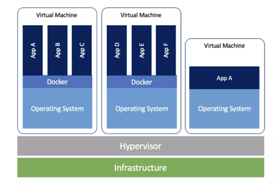

Why Docker?

- Powerful & Platform Agnostic
- Lightweight
- Trending

### Run Docker container on EC2 VM

#### Install Docker

We will use the EC2 instance as the platform to showcase how to build our own Docker application image and how to make it deployed as a production service. But as explained in previous section that Docker is platform-agnostic, the whole process should be very similar with that of MacOS/Windows.

1. Step 1, Go back to the ssh window of your EC2 instance. Use the following command to install Docker CE. For more background about Docker installation, you can refer to [https://docs.docker.com/install/linux/docker-ce/ubuntu](https://docs.docker.com/install/linux/docker-ce/ubuntu/).

   ```unix
   sudo apt-get update
   sudo apt-get install \
       apt-transport-https \
       ca-certificates \
       curl \
       gnupg-agent \
       software-properties-common
   curl -fsSL https://download.docker.com/linux/ubuntu/gpg | sudo apt-key add -
   sudo add-apt-repository \
      "deb [arch=amd64] https://download.docker.com/linux/ubuntu \
      $(lsb_release -cs) \
      stable"
   sudo apt-get update
   sudo apt-get install docker-ce docker-ce-cli containerd.io
   ```

2. Step 2,  Use the following command to verify Docker is installed correctly.

   ```unix
   sudo docker run hello-world
   ```

   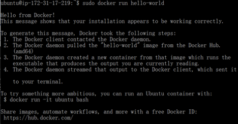

## Build Jupiter Archive and Upload to EC2

WAR file (or Web application Archive) is a JAR file used to distribute a collection of JavaServer Pages, Java Servlets, Java classes, XML files, tag libraries, static web pages (HTML and related files) and other resources that together constitute a web application.


1. Step 1, In Eclipse, select File -> Export -> Web, and choose WAR file under export window.

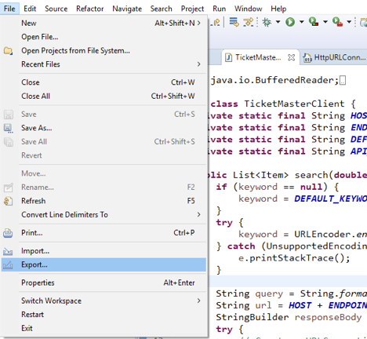

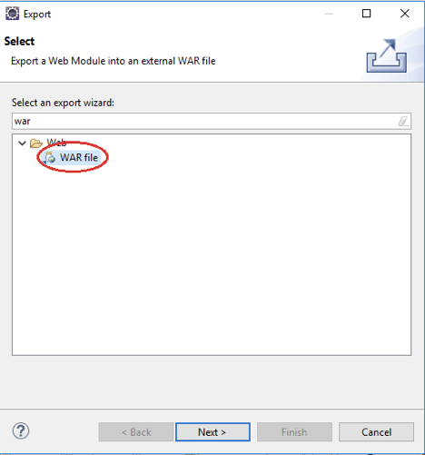

2. Step 2, Select the Jupiter project and choose an export destination that you can remember.

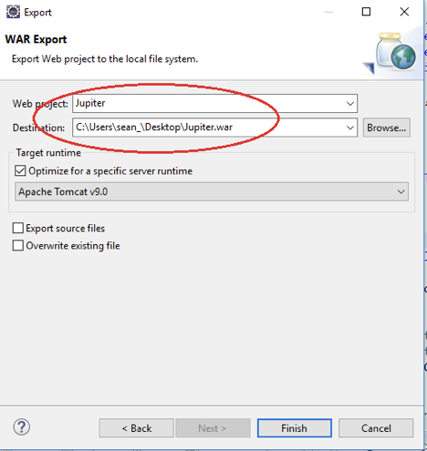

3. Step 3, Click Finish and make sure you can see find the .war file on your local desktop/laptop.

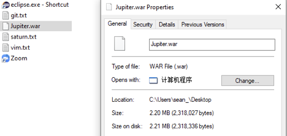

4. Step 4, Open a new terminal/git bash window and execute the following command, **use your own location and instance ip address in the command**. Close the terminal once upload is down.

```unix
scp -i YOUR_PRIVATE_KEY_LOCATION  
YOUR_JUPITER_WAR_LOCATION 
ubuntu@YOUR_INSTANCE_IP:~/
```

for example:

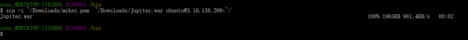

## Build a Docer Image

1. Step 1, In the ssh window of your EC2 instance, create a new file called Dockerfile. Your terminal will open the vim editor for you.

```unix
vim Dockerfile
```

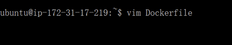

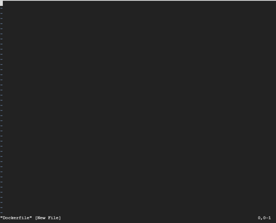

2. Step 2, Copy the following content into Dockerfile file. Replace the **maintainer** to your own email address.

```unix
FROM tomcat:9.0.24-jdk13-openjdk-oracle
MAINTAINER sean@laioffer.com

ADD ./Jupiter.war /usr/local/tomcat/webapps
EXPOSE 8080
CMD ["catalina.sh", "run"]
```

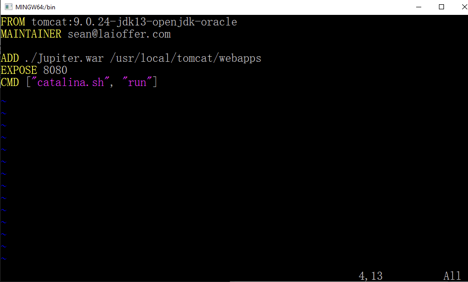

3. Step 3, Save and quit vim editor, and use the following command to make sure both Dockerfile and Jupiter.war are in the current directory.

```unix
ls
```

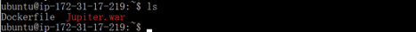

4. Step 4, Run the following command to build an image named jupiter.

```unix
sudo docker build -t jupiter .
```

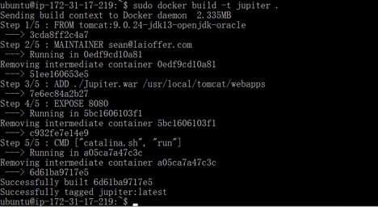

5. Step 5, (optional) you can use the following command to check existing images.

```unix
sudo docker images
```

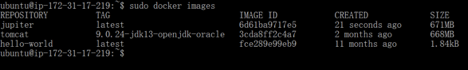

## Run a Docker container

1. Step 1, Use the following command to run your image locally.

```unix
sudo docker run -d -p 8080:8080 jupiter
```

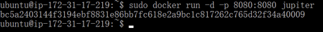

2. Step 2, (optional) you can use the following command to check running containers.

```unix
sudo docker ps
```


3. Step 3, Open a new tab in your browser and use [http://**YOUR_INSTANCE_IP**:8080/Jupiter](http://localhost:8080/Jupiter) to test your service. Remember to use your own IP address.


4. Step 4, (Optional) To check the log of a container, use the following command. You can find the container_id in step 2.

```unix
sudo docker logs <container_id>
```

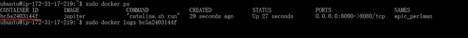

5. Step 5, (Optional) To stop your Docker container, use the following command. You can find the comtainer_id in step 2.

```unix
sudo docker stop <container_id>
```

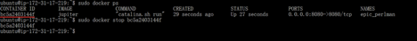

6. Step 6, (optional) You can also use the following command to remove an existing container or image.

```unix
sudo docker rm <container_id>
sudo docker rmi <image_name>
```

7. Step 7, (optional) Since port 80 is also open on your EC2 instance, you can map the instance’s port 80 to docker container’s port 8080 when you start the container. In this way, you don’t need to put :8080 in your URL.

```unix
sudo docker run -d -p 80:8080 jupiter
```

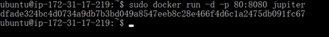

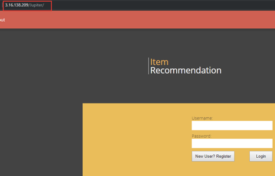

## Terminate Your Instance

To terminal your EC2 instance, go back to the EC2 dashboard and right click your instance. Select Terminate under Instance State. 

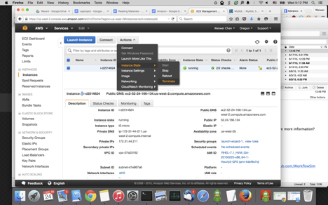

Once your instance is terminated, it’ll be fully destroyed so that you can’t restart it anymore. So if you want to restart the instance in the future, you may consider to choose Stop instead of Terminate, but AWS will keep charging you even if the instance is stopped. You'd better turn on the billing alert to prevent unnecessary cost: http://docs.aws.amazon.com/AmazonCloudWatch/latest/DeveloperGuide/gs_monitor_estimated_charges_with_cloudwatch.html#gs_turning_on_billing_metrics

## Summary

* Brief introduction of cloud computing.
* Setup a EC2 VM instance.
* Deploy your Jupiter project to the EC2 VM with Docker.