## What is a framework?

* Framework is a reusable component which encapsulates lots of prewritten code to solve a problem in a specific domain. As a user, I just need to add my own code into it.
* Example:
  * Java
    * Spring, Struts, Hibernate, etc.
  * Other
    * Ruby on Rails, Django.
* Framework vs library

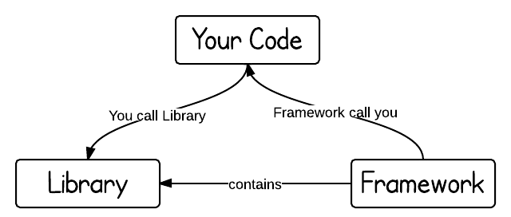

## What is the spring framework?

* Spring is the most widely used framework for the development of Java Enterprise Edition applications. 
* JavaEE is a set of specifications(aka, public API) which extends from Java SE for enterprise features such as distributed computing and web services. Servlet, JDBC are all part of JavaEE specifications.

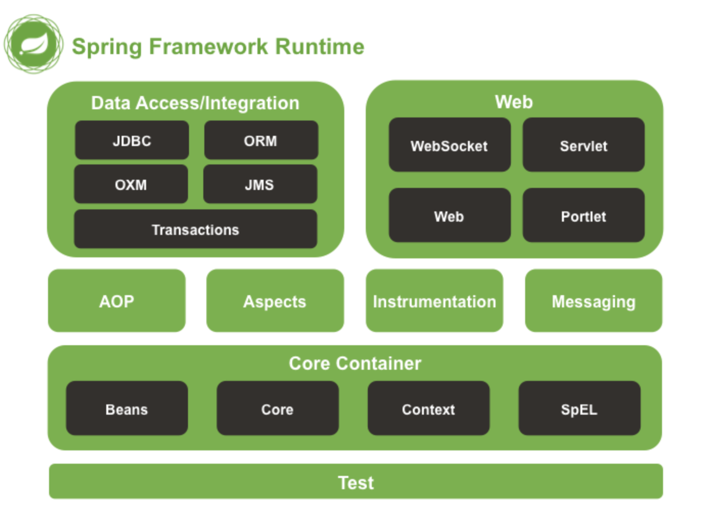

* **Core Container**: 核心模块, 包含Inversion of control(控制反转)、Dependency Injection(依赖注入)核心特性.
* **Web**: Spring MVC的实现. 主要为Web开发提供支持.
* **Database Access**: JDBC specification utils

## Spring Core

* What is Dependency

  * In software engineering, **coupling** is the degree of interdependence between software modules; a measure of how closely connected two routines or modules are;the strength of the relationships between modules. [Reference](https://en.wikipedia.org/wiki/Coupling_(computer_programming))
  * Coupling is usually contrasted with cohesion. Low coupling often correlates with high cohesion, and vice versa. 

  

  * Dependency Injection

  传统的代码, 每个对象负责管理自己依赖的对象, 导致如果需要切换依赖对象的实现类时,需要修改多处地方.

  ```java
  a = PaymentAction
  b = Logger
  
  PaymentAction has one dependency - Logger
  
  class PaymentAction {
           private Logger logger;
  
           Public PaymentAction() {
                This.logger = new Logger();
           }
  }
  ```

  Instead of maintaining dependencies by the PaymentAction object, it can be injected by someone else. This is called Dependency Injection. Here are 3 mainstream approaches as follows:

  1. 通过a的构造函数，把b传入；(constructor)

  ```java
  public PaymentAction(Logger logger) {
  	this.logger = logger;
  }
  ```

  2. 通过设置a的属性，把b传入；(setter method)

  ```java
  setLogger(Logger logger) {
          this.logger = logger;
  }
  ```

  3. Spring - @Autowired作用在成员变量上

  ```java
  @Component
  public class PaymentAction {
  	
               @Autowired
  	private Logger logger;
  
  	public void pay(BigDecimal payValue) {
  		logger.log("pay begin, payValue is " + payValue);
  		logger.log("pay end");
  	}
  }
  ```

* **Inverse of control(IOC)**

IoC inverts the flow of control as compared to traditional control flow. In IoC, custom-written portions of a computer program receive the flow of control from a generic framework.

Dependency Injection 是 IOC的实现。从 PaymentAction 的角度来看，PaymentAction只是想用logger的log方法，不在意其内部现实。PaymentAction希望someone（上游）来把logger实例化好在交给PaymentAction对象，就是用过Dependency Injection来实现的。

 依赖注入把对象的创造交给外部去管理,很好的解决了代码紧耦合(tight couple)的问题，是一种让代码实现松耦合(loose couple)的机制. 松耦合让代码更具灵活性，能更好地应对需求变动.

* **Ioc container(Spring 的本质)**

The Spring IoC container is at the core of the Spring Framework. The container will create the objects, wire them together, configure them, and manage their complete life cycle from creation till destruction. The configuration metadata is represented in either XML, annotations, or Java code. 

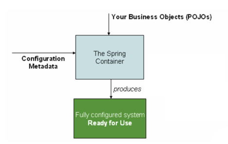

The diagram above is a high-level view of how Spring works. Your application classes are combined with configuration metadata so that after the ApplicationContext is created and initialized, you have a fully configured and executable system or application.

* **AnnotationConfigApplicationContext**: For standalone java applications using annotations based configuration.

* **ClassPathXmlApplicationContext**: For standalone java applications using XML based configuration. (We mainly use this one)

* **AnnotationConfigWebApplicationContext** and **XmlWebApplicationContext** for web applications.

* **Bean**
  Any normal java object that is initialized by Spring IoC container is called bean.

* **Bean Scope**

  | **Scope** | **Description**                                              |
  | --------- | ------------------------------------------------------------ |
  | singleton | 该作用域将 bean 的定义限制在每一个 Spring IoC 容器中的一个单一实例(默认). |
  | prototype | 该作用域将 bean 的定义限制在任意数量的对象实例。             |

  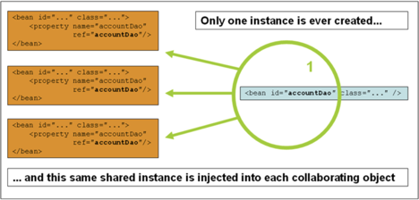

  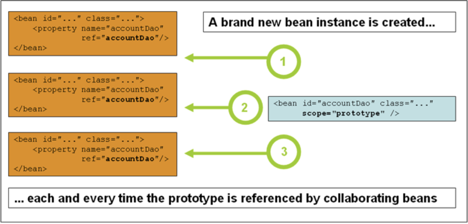

## How to configure a class as Spring Bean？

1) XML configuration

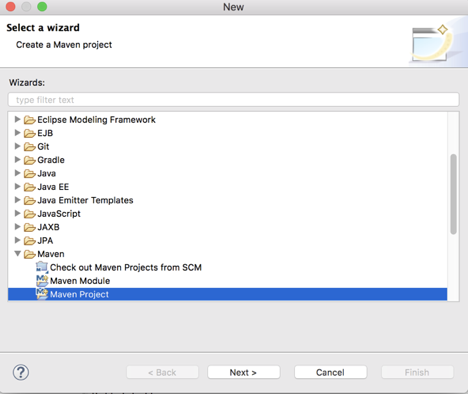

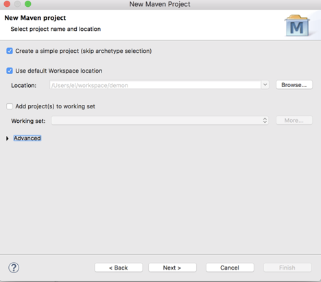

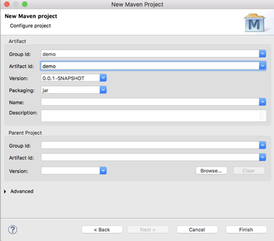

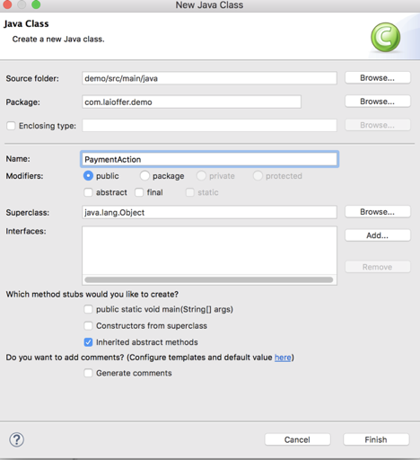

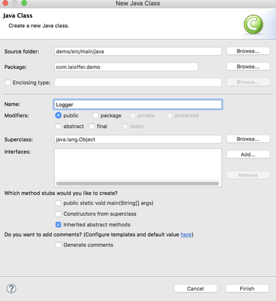

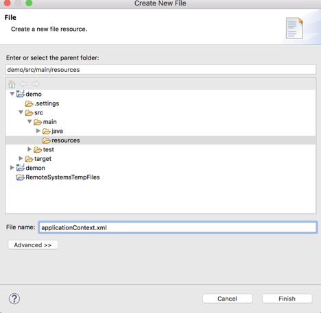

```xml
<project xmlns="http://maven.apache.org/POM/4.0.0" xmlns:xsi="http://www.w3.org/2001/XMLSchema-instance" xsi:schemaLocation="http://maven.apache.org/POM/4.0.0 https://maven.apache.org/xsd/maven-4.0.0.xsd">
  <modelVersion>4.0.0</modelVersion>
  <groupId>demo</groupId>
  <artifactId>demo</artifactId>
  <version>0.0.1-SNAPSHOT</version>
  <dependencies>
		<dependency>
			<groupId>org.springframework</groupId>
			<artifactId>spring-core</artifactId>
			<version>${spring.version}</version>
		</dependency>
		<dependency>
			<groupId>org.springframework</groupId>
			<artifactId>spring-context</artifactId>
			<version>${spring.version}</version>
		</dependency>
	</dependencies>
 
	<properties>
		<spring.version>3.2.3.RELEASE</spring.version>
	</properties>
</project>
```

Logger.java

```java
package com.laioffer.demo;

public class Logger {

	public void log(String info) {
		System.out.println(info);
	}
}
```

PaymentAction.java

```java
package com.laioffer.demo;

public class PaymentAction {
	
	private Logger logger;
	
	public PaymentAction(Logger logger) {
		this.logger = logger;
	}
	
	public void hello() {
		logger.log("Hello World");
	}
}
```

applicationContext.xml

```xml
<?xml version="1.0" encoding="UTF-8"?>
<beans xmlns="http://www.springframework.org/schema/beans"
  xmlns:xsi="http://www.w3.org/2001/XMLSchema-instance"
  xsi:schemaLocation="http://www.springframework.org/schema/beans http://www.springframework.org/schema/beans/spring-beans.xsd">
 
 	<bean id="logger"
		class="com.laioffer.demo.Logger">
	</bean>
	<bean id="paymentAction"
		class="com.laioffer.demo.PaymentAction">
		<constructor-arg ref="logger" />
	</bean>
</beans>
```

Main.java

```java
package com.laioffer.demo;
import org.springframework.context.ApplicationContext;
import org.springframework.context.support.ClassPathXmlApplicationContext;

public class Main {
	public static void main(String[] args) {
		ApplicationContext context = new ClassPathXmlApplicationContext(
				"applicationContext.xml");

		PaymentAction paymentAction = (PaymentAction) context.getBean(PaymentAction.class);
		paymentAction.hello();
	}
}
```

### 2. Annotation-based configuration

```java
@Component(name = “serverLogger”)
public class ServerLogger implements ILogger {
     public void log() {
     
     }
}

@Component(name = “fileLogger”)
public class FileLogger implements ILogger {
     public void log() {
     
     }
}

@Component
public class PaymentAction {
	
             @Autowired
             @Qualifer(name=“fileLogger”)
	private ILogger logger;

	public void pay(BigDecimal payValue) {
		logger.log("pay begin, payValue is " + payValue);
		logger.log("pay end");
	}
}
```

```xml
<?xml version="1.0" encoding="UTF-8"?>
<beans xmlns="http://www.springframework.org/schema/beans"
	xmlns:xsi="http://www.w3.org/2001/XMLSchema-instance" xmlns:context="http://www.springframework.org/schema/context"
	xmlns:mvc="http://www.springframework.org/schema/mvc"
	xsi:schemaLocation="http://www.springframework.org/schema/beans
 http://www.springframework.org/schema/beans/spring-beans.xsd
 http://www.springframework.org/schema/context
 http://www.springframework.org/schema/context/spring-context.xsd">

	<context:component-scan base-package="xxx" />
</beans>
```

```java
public class Application {
    public static void main(String[] args) {
        ApplicationContext context = new ClassPathXmlApplicationContext("payment.xml");
        PaymentAction paymentAction = (PaymentAction) context.getBean("paymentAction");
        paymentAction.pay(new BigDecimal(2)); 
     }
}
```

####  What “<context:component-scan base-package="...." />” mean?

- 在xml配置了这个标签后，spring可以自动去扫描base-package下面或者子包下面的java文件，如果扫描到有@Component @Controller @Service @Repository等这些注解的类，则把这些类注册为bean. 
- @Component是用来标记任何被Spring管理的组件。
- @Controller用来标记presentation层（比如web controller）。
- @Repository用来标记persistence层（比如DAO）。
- @Service用来标记service层。
- @Configuration:Indicates that a class declares one or more @Bean methods and may be processed by the Spring container to generate bean definitions.

### 3. Java-based configuration

```java
public class PaymentAction {	
  @Autowired
	private ILogger logger;

	public void pay(BigDecimal payValue) {
		logger.log("pay begin, payValue is " + payValue);
		logger.log("pay end");
	}
}
```

```java
@Configuration
public class Config {
    @Bean
    public ILogger getIlogger() {
        return new ServerLogger();
    }

    @Bean(name = “paymentAction”)
    public  PaymentAction getPaymentAction() {
         return new PaymentAction();
     }
}
```

```java
public class Application {
    public static void main(String[] args) {
        ApplicationContext context = 
                        new AnnotationConfigApplicationContext(Config.class);
        PaymentAction paymentAction = (PaymentAction) context.getBean("paymentAction");
        paymentAction.pay(new BigDecimal(2)); 
    }
}
```

## What are the benefits of using Spring?

- **Lightweight:** there is a slight overhead of using the framework in development
- **Inversion of Control (IoC):** Spring container takes care of wiring dependencies of various objects, instead of creating or looking for dependent objects
- **IoC container:** it manages Spring Bean life cycle and project specific configurations
- **Spring is non inclusive:** That means you no need to implement any interface or inherit any class from spring to your classes, so whenever you want to change from spring to any other technology then you no need to change the logic of your class.
- **End to End Development** **:** Spring supports all aspects of application development, Web aspects, Business aspects, Persistence aspects, etc, so we can develop a complete application using spring.


1. 什么是dependency? 类的成员变量
2. 什么是耦合度? 各个类之间的依赖关系
3. 什么是容器？生成Bean实例的工厂, 并且管理容器中的Bean
4. 什么是injection？容器将所需要的依赖注入到类中的过程
5. 什么是控制反转? 不在主动创建依赖, 而是通过向容器申请所需要的依赖
6. 为什么要用spring？ Maintainability

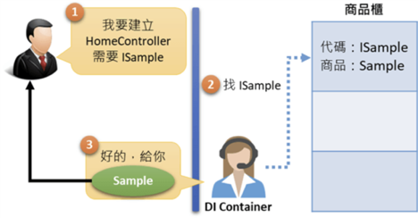