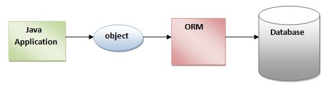
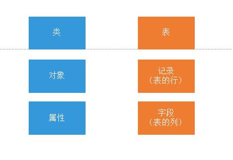
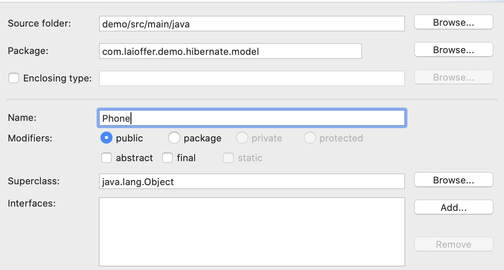
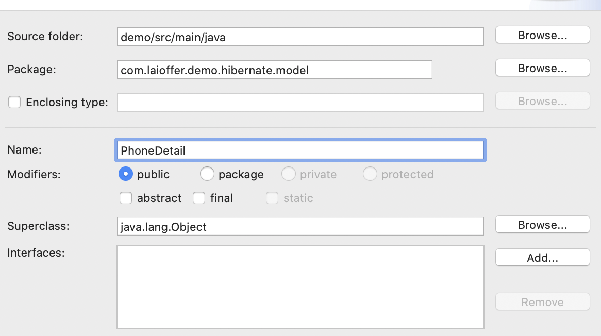
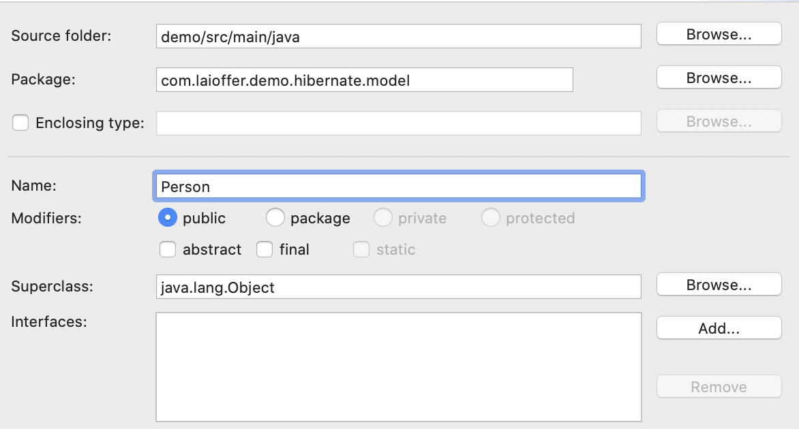
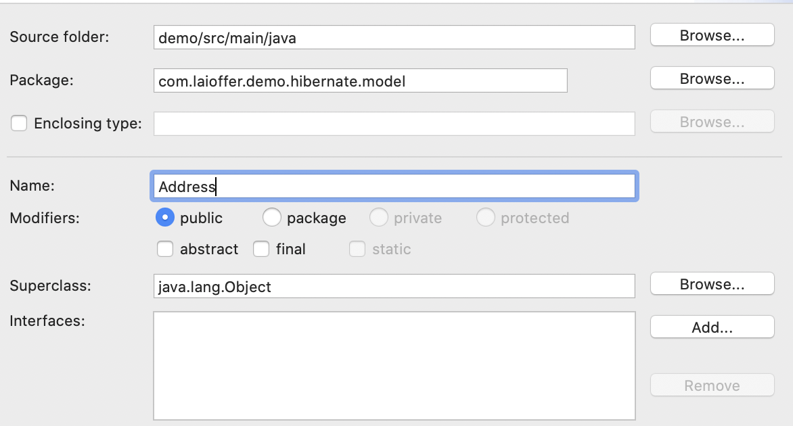
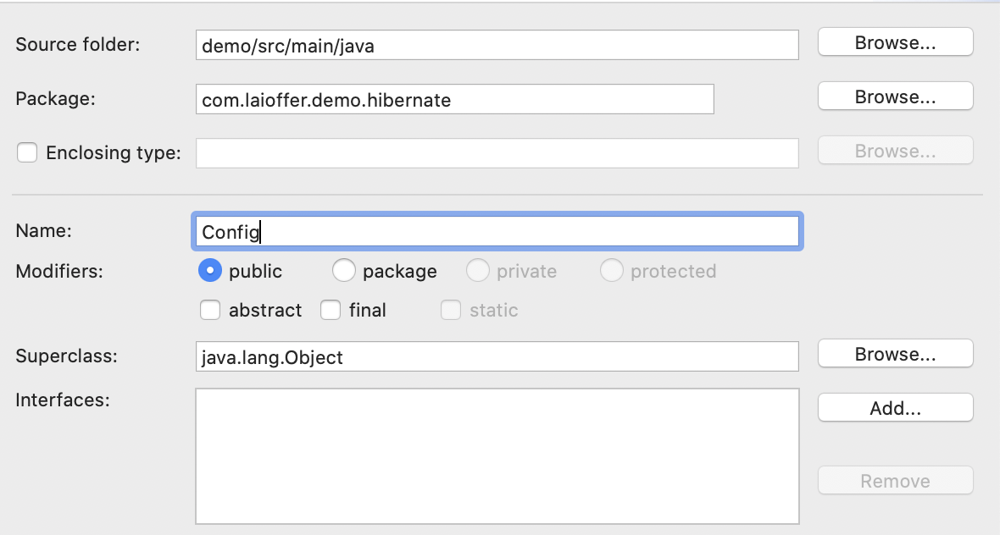
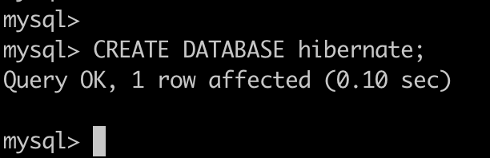

# What is Hibernate?

Hibernate is an object-relational mapping tool for the Java programming language which also implements the Java Persistence API. Hibernate's primary feature is mapping from Java classes to database tables, and mapping from Java data types to SQL data types. Hibernate provides data query and retrieval facilities.


# What is ORM (Object-Relational Mapping)?

[ORM](https://stackoverflow.com/questions/1279613/what-is-an-orm-and-where-can-i-learn-more-about-it) is a programming technique that lets you query and manipulate data from a database using object-oriented programming language.



Example:

Java:

```java
public class Course {
  private String id;
  private String name;
  private Set<Student> students;
  ….
}

public class Student {
  private String id;
  private String name;
  private Set<Course> courses;
  ….
}
```

SQL:

```sql

CREATE TABLE course (
  id VARCHAR(255) NOT NULL,
  name VARCHAR(255),
  PRIMARY KEY (id)
);

CREATE TABLE student (
  id VARCHAR(255) NOT NULL,
  name VARCHAR(255),
  PRIMARY KEY (id)
);

CREATE TABLE course_student {
  course_id VARCHAR(255) NOT NULL,
  student_id VARCHAR(255) NOT NULL,
  PRIMARY KEY (course_id, student_id),
  FOREIGN KEY (course_id) REFERENCES course(id),
  FOREIGN KEY (student_id) REFERENCES student(id)
}

```




## Pro:

- DRY (Don’t Repeat Yourself): model code in one place, and reusable for different DBMS.
- Doesn’t require too much SQL knowledge. Code in your favorite language.
- Apply OOP knowledge.

## Con:

- Set up can be cumbersome.
- Performance may not match better tweaked raw SQL.


## Popular ORM libraries:

- **Java: Hibernate.**
- PHP: Propel or Doctrine.
- Python: the Django ORM or SQLAlchemy.
- C#: NHibernate or Entity Framework.


# What is Java Persistence API (JPA)?

JPA is a specification that describes the management of relational data in applications using Java. JPA does not have an implementation, think of JPA as the guidelines that must be followed or an interface, while Hibernate's JPA implementation is code that meets the API as defined by the JPA specification and provides the under the hood functionality.

https://javaee.github.io/javaee-spec/javadocs/

https://stackoverflow.com/questions/27462185/jpa-vs-orm-vs-hibernate

总而言之, JPA是ORM规范, hibernate是ORM实现.

## Important Interfaces of Hibernate framework

- **SessionFactory**: SessionFactory is an [immutable](https://www.journaldev.com/129/how-to-create-immutable-class-in-java) thread-safe cache of compiled mappings for a single database. We need to initialize SessionFactory once and then we can cache and reuse it. SessionFactory instance is used to get the Session objects for database operations.
- **Session**: Session object is the interface between java application code and hibernate framework and provides methods for CRUD operations.
- **Transaction**: Transaction is a single-threaded, short-lived object used by the application to specify atomic units of work. 


In other words, SessionFactory maintains Session. We request Session from SessionFactory. Session performs transaction to operate data in DBMS.


## Important annotations used for mapping

- **javax.persistence.Entity**: Used with model class to specify that it is entity and mapped to a table in DB.

- **javax.persistence.Table**: Used with entity class to define the corresponding table name in database.

- **javax.persistence.Id**: Used to define the **primary key** in the entity class.

- **javax.persistence.Column**: Used to define the **column name** in database table.

- **javax.persistence.EmbeddedId**: Used to define **composite primary key** in the entity class. When a primary key consists of two or more columns, you define them in another POJO and use that POJO as EmbeddedId.

- **javax.persistence.GeneratedValue**: Used to define the strategy to be used for generation of primary key.

- **javax.persistence.OneToOne**: Used to define the one-to-one mapping between two entity classes. We have other similar annotations as OneToMany, ManyToOne and ManyToMany

- - **OneToOne**: Extension of information, e.g. Person <-> PersonDetails.
  - **ManyToOne**: Foreign Key. References property from another Entity.
  - **OneToMany**: The other direction of foreign key. List of referencing entities.

- **org.hibernate.annotations.Cascade**: Used to define the cascading between two entity classes, used with mappings. It works in conjunction with org.hibernate.annotations.CascadeType

- - When operating entities with mapping, the operation auto-propagates to the other entities.


## Basic type

http://docs.jboss.org/hibernate/orm/current/userguide/html_single/Hibernate_User_Guide.html#basic


## Embeddable types

A composition of values, embeddable types are used to group multiple basic types and reuse them across several entities.

```java
@Entity
public class Book {
    @Id
    @GeneratedValue
    private Long id;
    private String title;
    private String author;
    private Publisher publisher;
}

@Embeddable
public class Publisher {
    @Column(name = "publisher_name")
    private String name;
    @Column(name = "publisher_country")
    private String country;
}
```

 

### Identifiers(primary key)

**Simple identifiers**: single basic attribute and denoted using @Id

```java
@Entity
public class Book {
    @Id
    private Long id;

    private String title;
    private String author;
}
```

According to JPA only the following types can be used as identifier attribute types:

- any Java primitive type
- any primitive wrapper type
- java.lang.String
- java.util.Date 
- java.sql.Date
- java.math.BigDecimal
- java.math.BigInteger

**Composite identifiers**: the composite identifiers correspond to one or more persistent attributes.

- The composite identifier must be represented by a "primary key class", The primary key class may be defined using the @**EmbeddedId** or @IdClass
- The primary key class must be public and must have a public no-arg constructor.
- The primary key class must be serializable.
- The primary key class must define equals and hashCode methods

```java
Modeling a composite identifier using an EmbeddedId simply means defining an embeddable to be a composition for one or more attributes making up the identifier, and then exposing an attribute of that embeddable type on the entity.
@Entity
@Table(name = "history")
public class PersistentHistory {
	@EmbeddedId
	private HistoryId historyId;
	
	@Column(name = "last_favor_time")
	private Timestamp lastFavorTime;

	// Generated getters and setters...
}

@Embeddable
public class HistoryId implements Serializable {
	@Column(name = "item_id")
	private Integer itemId;

	@Column(name = "user_id")
	private Integer userId;
	
             public boolean equals(Object otherOb) {
             ...
             }

             public int hashCode() {
             …
             }
}
```


## Associations

- @**OneToOne**

```java
@Entity
@Table(name = “phone”)
public class Phone {

    @Id
    @GeneratedValue
    private Long id;
    private String number;

    @OneToOne
    @JoinColumn(name = "detail_id")
    private PhoneDetails details;
}

@Entity
@Table(name = "phone_details")
public class PhoneDetails {

    @Id
    @GeneratedValue
    private Long id;
    private String provider;
    private String technology;

    @OneToOne
    private Phone phone;
}
```


- @**ManyToOne == foreign key**

```java
@Entity
@Table(name = "person")
public class Person {
    @Id
    @GeneratedValue
    private Long id;
    private String name;
}

@Entity
@Table(name = "phone")
public class Phone {
    @Id
    @GeneratedValue
    private Long id;
    private String number;

    @ManyToOne
    @JoinColumn(name = "person_id")
     private Person person;

}
```


- @**OneToMany**

```java
@Entity
@Table(name = "person")
public class Person {

    @Id
    @GeneratedValue
    private Long id;

    private String name;

    @OneToMany(mappedBy = "person", cascade = CascadeType.ALL)
    private List<Phone> phones = new ArrayList<>();
}

@Entity
@Table(name = "phone")
public class Phone {

    @Id
    @GeneratedValue
    private Long id;

    @Column(name = "number", unique = true)
    private String number;

    @ManyToOne
    @JoinColumn(name = "person_id")
    private Person person;

}
```


- @**ManyToMany**

```java
@Entity
@Table(name = "person")
public class Person {

    @Id
    @GeneratedValue
    private Long id;

    private String registrationNumber;

    @ManyToMany(cascade = {CascadeType.PERSIST})
    private List<Address> addresses = new ArrayList<>();

}

@Entity
@Table(name = "address")
public class Address {

    @Id
    @GeneratedValue
    private Long id;

    private String street;

    @Column(name = "number")
    private String number;

    private String postalCode;

    @ManyToMany(mappedBy = "addresses")
    private List<Person> owners = new ArrayList<>();
}
```


## Demo code

update pom.xml file

```xml
<project xmlns="http://maven.apache.org/POM/4.0.0"
	xmlns:xsi="http://www.w3.org/2001/XMLSchema-instance"
	xsi:schemaLocation="http://maven.apache.org/POM/4.0.0 https://maven.apache.org/xsd/maven-4.0.0.xsd">
	<modelVersion>4.0.0</modelVersion>
	<groupId>demo</groupId>
	<artifactId>demo</artifactId>
	<version>0.0.1-SNAPSHOT</version>
	<dependencies>
		<dependency>
			<groupId>org.springframework</groupId>
			<artifactId>spring-core</artifactId>
			<version>${spring.version}</version>
		</dependency>
		<dependency>
			<groupId>org.springframework</groupId>
			<artifactId>spring-context</artifactId>
			<version>${spring.version}</version>
		</dependency>

		<dependency>
			<groupId>org.springframework</groupId>
			<artifactId>spring-orm</artifactId>
			<version>${spring.version}</version>
		</dependency>

		<dependency>
			<groupId>org.hibernate</groupId>
			<artifactId>hibernate-core</artifactId>
			<version>5.2.12.Final</version>
		</dependency>
		<dependency>
			<groupId>org.hibernate.javax.persistence</groupId>
			<artifactId>hibernate-jpa-2.1-api</artifactId>
			<version>1.0.0.Final</version>
		</dependency>

		<dependency>
			<groupId>org.hibernate</groupId>
			<artifactId>hibernate-validator</artifactId>
			<version>6.0.10.Final</version>
		</dependency>

		<dependency>
			<groupId>org.hibernate.common</groupId>
			<artifactId>hibernate-commons-annotations</artifactId>
			<version>5.0.1.Final</version>
		</dependency>

		<dependency>
			<groupId>mysql</groupId>
			<artifactId>mysql-connector-java</artifactId>
			<version>6.0.6</version>
		</dependency>
	</dependencies>


	<properties>
		<spring.version>5.2.3.RELEASE</spring.version>
	</properties>
</project>

```


**Add the Phone.java**




```java
package com.laioffer.demo.hibernate.model;

import javax.persistence.CascadeType;
import javax.persistence.Entity;
import javax.persistence.GeneratedValue;
import javax.persistence.Id;
import javax.persistence.JoinColumn;
import javax.persistence.ManyToOne;
import javax.persistence.OneToOne;
import javax.persistence.Table;

@Entity
@Table(name = "phone")
public class Phone {

	@Id
	@GeneratedValue
	private int id;

	private String number;

	@ManyToOne
	@JoinColumn(name = "person_id")
	private Person person;
	
            @OneToOne
            private PhoneDetail details;


	public PhoneDetail getDetails() {
		return details;
	}

	public void setDetails(PhoneDetail details) {
		this.details = details;
	}

	public int getId() {
		return id;
	}

	public void setId(int id) {
		this.id = id;
	}

	public String getNumber() {
		return number;
	}

	public void setNumber(String number) {
		this.number = number;
	}

	public Person getPerson() {
		return person;
	}

	public void setPerson(Person person) {
		this.person = person;
	}

}
```


Add the PhoneDetail.java



```java
package com.laioffer.demo.hibernate.model;

import javax.persistence.Entity;
import javax.persistence.GeneratedValue;
import javax.persistence.Id;
import javax.persistence.OneToOne;
import javax.persistence.Table;

@Entity
@Table(name = "phoneDetail")
public class PhoneDetail {
           @Id
           @GeneratedValue
           private Long id;
           private String provider;
           private String technology;

           @OneToOne
           private Phone phone;

	public Long getId() {
		return id;
	}

	public void setId(Long id) {
		this.id = id;
	}

	public String getProvider() {
		return provider;
	}

	public void setProvider(String provider) {
		this.provider = provider;
	}

	public String getTechnology() {
		return technology;
	}

	public void setTechnology(String technology) {
		this.technology = technology;
	}

	public Phone getPhone() {
		return phone;
	}

	public void setPhone(Phone phone) {
		this.phone = phone;
	}

}
```


Add Person.java



```java
package com.laioffer.demo.hibernate.model;

import java.util.ArrayList;
import java.util.List;

import javax.persistence.CascadeType;
import javax.persistence.Entity;
import javax.persistence.GeneratedValue;
import javax.persistence.Id;
import javax.persistence.ManyToMany;
import javax.persistence.OneToMany;
import javax.persistence.Table;

@Entity
@Table(name = "person")
public class Person {

	@Id
	@GeneratedValue
	private int id;
	
	private String name;
	
	@OneToMany(mappedBy = "person", cascade = CascadeType.ALL)
	private List<Phone> phone;
	
	
	@ManyToMany(cascade = CascadeType.ALL)
	private List<Address> addresses = new ArrayList<>();
	
	public Person() {
		phone = new ArrayList<Phone>();
	}

	public int getId() {
		return id;
	}

	public void setId(int id) {
		this.id = id;
	}

	public String getName() {
		return name;
	}

	public void setName(String name) {
		this.name = name;
	}

	public List<Phone> getPhone() {
		return phone;
	}

	public void setPhone(List<Phone> phone) {
		this.phone = phone;
	}

	public List<Address> getAddresses() {
		return addresses;
	}

	public void setAddresses(List<Address> addresses) {
		this.addresses = addresses;
	}

}
```


Add Address.java



```java
package com.laioffer.demo.hibernate.model;

import java.util.ArrayList;
import java.util.List;

import javax.persistence.Entity;
import javax.persistence.GeneratedValue;
import javax.persistence.Id;
import javax.persistence.ManyToMany;
import javax.persistence.Table;

@Entity
@Table(name = "address")
public class Address {
	
	@Id
	@GeneratedValue
	private int id;
	
	private String name;
	
	@ManyToMany(mappedBy = "addresses")
	private List<Person> persons = new ArrayList<Person>();

	public int getId() {
		return id;
	}

	public void setId(int id) {
		this.id = id;
	}

	public String getName() {
		return name;
	}

	public void setName(String name) {
		this.name = name;
	}

	public List<Person> getPersons() {
		return persons;
	}

	public void setPersons(List<Person> persons) {
		this.persons = persons;
	}

}
```


Add Config.java



```java
package com.laioffer.demo.hibernate;

import java.util.Properties;

import javax.sql.DataSource;

import org.springframework.context.annotation.Bean;
import org.springframework.context.annotation.Configuration;
import org.springframework.jdbc.datasource.DriverManagerDataSource;
import org.springframework.orm.hibernate5.LocalSessionFactoryBean;


@Configuration
public class Config {

	@Bean(name = "sessionFactory")
	public LocalSessionFactoryBean sessionFactory() {
		LocalSessionFactoryBean sessionFactory = new LocalSessionFactoryBean();
		sessionFactory.setDataSource(dataSource());
		sessionFactory.setPackagesToScan("com.laioffer.demo.hibernate.model");
		sessionFactory.setHibernateProperties(hibernateProperties());
		return sessionFactory;
	}
	
	@Bean(name = "dataSource")
	public DataSource dataSource() {
		DriverManagerDataSource dataSource = new DriverManagerDataSource();
		dataSource.setDriverClassName("com.mysql.jdbc.Driver");	
            // update the localhost to your remote aws rb instance ip, and change the usename and password

	dataSource.setUrl("jdbc:mysql://localhost:3306/hibernate?serverTimezone=UTC");
		dataSource.setUsername("root");
		dataSource.setPassword("root");

		return dataSource;
	}


	private final Properties hibernateProperties() {
		Properties hibernateProperties = new Properties();
		hibernateProperties.setProperty("hibernate.hbm2ddl.auto", "create-drop");
		hibernateProperties.setProperty("hibernate.dialect", "org.hibernate.dialect.MySQL5Dialect");
		hibernateProperties.setProperty("hibernate.show_sql", "true");
		return hibernateProperties;
	}
}

```


Login to your RDS instance


Create a new DB called hibernate




Update main.java

```java
package com.laioffer.demo;

import org.hibernate.Session;
import org.hibernate.SessionFactory;
import org.springframework.context.ApplicationContext;
import org.springframework.context.annotation.AnnotationConfigApplicationContext;

import com.laioffer.demo.hibernate.Config;
import com.laioffer.demo.hibernate.model.Address;
import com.laioffer.demo.hibernate.model.Person;
import com.laioffer.demo.hibernate.model.Phone;
import com.laioffer.demo.hibernate.model.PhoneDetail;

public class Main {
	public static void main(String[] args) {
		ApplicationContext context = new AnnotationConfigApplicationContext(Config.class);

		SessionFactory sessionFactory = (SessionFactory) context.getBean("sessionFactory");

		Session session = sessionFactory.openSession();

		session.beginTransaction();

		/*
		 * One to one mapping example
		 * 
		 * Phone phone = new Phone(); 
		 * phone.setNumber("123");
		 * 
		 * PhoneDetail detail = new PhoneDetail(); 
		 * detail.setProvider("ATT");
		 * 
		 * detail.setPhone(phone); 
		 * phone.setDetails(detail);
		 * 
		 * session.save(detail); 
		 * session.save(phone);
		 * 
		 * session.getTransaction().commit(); 
		 * session.close();
		 */

		/*
		 * One to Many example
		 * 
		 * Person person1 = new Person(); 
		 * Person person2 = new Person();
		 * 
		 * person1.setName("stefan"); 
		 * person2.setName("sean");
		 * 
		 * 
		 * Phone phone1 = new Phone(); 
		 * phone1.setNumber("123");
		 * 
		 * Phone phone2 = new Phone(); 
		 * phone2.setNumber("456");
		 * 
		 * Phone phone3 = new Phone(); 
		 * phone3.setNumber("789");
		 * 
		 *
		 * phone1.setPerson(person1); 
		 * phone2.setPerson(person1);
		 * phone3.setPerson(person2);
		 * 
		 * 
		 * person1.getPhone().add(phone1); 
		 * person1.getPhone().add(phone2);
		 * person2.getPhone().add(phone3);
		 * 
		 * session.save(person1); 
		 * session.save(person2);
		 * 
		 * 
		 * session.getTransaction().commit(); 
		 * session.close();
		 * 
		 * System.out.println("------------"); 
		 * session = sessionFactory.openSession();
		 * session.beginTransaction();
		 * 
		 * Phone phone4 = new Phone(); 
		 * phone4.setNumber("0000");
		 * 
		 * person1 = session.get(Person.class, 1); 
		 * phone4.setPerson(person1);
		 * person1.getPhone().add(phone4); 
		 * session.save(person1);
		 * 
		 * 
		 */

		/*
		 * Many to Many example
		 * 
		 * Person stefan = new Person();
		 * Person sean = new Person();
		 * 
		 * Address address1 = new Address();
		 * Address address2 = new Address();
		 * 
		 * address1.setName("san jose");
		 * address2.setName("sunnyvale");
		 * 
		 * stefan.getAddresses().add(address1);
		 * stefan.getAddresses().add(address2);
		 * 
		 * sean.getAddresses().add(address1);
		 * sean.getAddresses().add(address2);
		 * 
		 * address1.getPersons().add(stefan);
		 * address1.getPersons().add(sean);
		 * 
		 * address2.getPersons().add(stefan);
		 * address2.getPersons().add(sean);
		 * 
		 * session.save(address1);
		 * session.save(address2);
		 * session.save(stefan);
		 * session.save(sean);
		 * 
		 * session.getTransaction().commit();
		 * session.close();
		 */
			
	}
}
```

