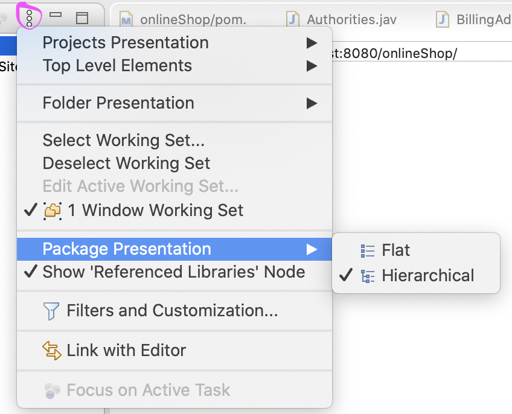

## Environment Setup

1. Create a maven project


2. Search webapp


3. Set group id and artifact id to "onlineShop", click finish


4. Right click project, select build path, "Add library" and select Server Runtime


5. Create package "onlineShop" under src/main/java


6. Create package "controller" under onlineShop package


7. Create package "dao" under onlineShop package


8. Create package "model" under onlineShop package


9. Create package "service" under onlineShop package


Change the package presentation to hierarchical (**OPTIONAL**)




10. Update pom.xml file

```xml
<project xmlns="http://maven.apache.org/POM/4.0.0"
	xmlns:xsi="http://www.w3.org/2001/XMLSchema-instance"
	xsi:schemaLocation="http://maven.apache.org/POM/4.0.0 http://maven.apache.org/maven-v4_0_0.xsd">
	<modelVersion>4.0.0</modelVersion>
	<groupId>onlineShop</groupId>
	<artifactId>onlineShop</artifactId>
	<packaging>war</packaging>
	<version>1.0</version>

	<properties>
		<springframework.version>5.2.3.RELEASE</springframework.version>
		<maven.compiler.source>1.8</maven.compiler.source>
		<maven.compiler.target>1.8</maven.compiler.target>
	</properties>

	<dependencies>
		<dependency>
			<groupId>javax.xml.bind</groupId>
			<artifactId>jaxb-api</artifactId>
			<version>2.3.0</version>
		</dependency>
		<dependency>
			<groupId>com.sun.xml.bind</groupId>
			<artifactId>jaxb-core</artifactId>
			<version>2.3.0</version>
		</dependency>
		<dependency>
			<groupId>com.sun.xml.bind</groupId>
			<artifactId>jaxb-impl</artifactId>
			<version>2.3.0</version>
		</dependency>
		<dependency>
			<groupId>javax.activation</groupId>
			<artifactId>javax.activation-api</artifactId>
			<version>1.2.0</version>
		</dependency>
		<dependency>
			<groupId>org.springframework</groupId>
			<artifactId>spring-webmvc</artifactId>
			<version>${springframework.version}</version>
		</dependency>
		<dependency>
			<groupId>org.springframework</groupId>
			<artifactId>spring-web</artifactId>
			<version>${springframework.version}</version>
		</dependency>
		<dependency>
			<groupId>org.springframework</groupId>
			<artifactId>spring-core</artifactId>
			<version>${springframework.version}</version>
		</dependency>
		<dependency>
			<groupId>org.springframework</groupId>
			<artifactId>spring-orm</artifactId>
			<version>${springframework.version}</version>
		</dependency>
		<dependency>
			<groupId>jstl</groupId>
			<artifactId>jstl</artifactId>
			<version>1.2</version>
		</dependency>
		<dependency>
			<groupId>taglibs</groupId>
			<artifactId>standard</artifactId>
			<version>1.1.2</version>
		</dependency>
		<dependency>
			<groupId>org.hibernate</groupId>
			<artifactId>hibernate-core</artifactId>
			<version>5.2.12.Final</version>
		</dependency>
		<dependency>
			<groupId>org.hibernate.javax.persistence</groupId>
			<artifactId>hibernate-jpa-2.1-api</artifactId>
			<version>1.0.0.Final</version>
		</dependency>

		<dependency>
			<groupId>javax.servlet</groupId>
			<artifactId>javax.servlet-api</artifactId>
			<version>3.1.0</version>
		</dependency>
		<!-- https://mvnrepository.com/artifact/org.hibernate/hibernate-validator -->
		<dependency>
			<groupId>org.hibernate</groupId>
			<artifactId>hibernate-validator</artifactId>
			<version>6.0.10.Final</version>
		</dependency>

		<!-- https://mvnrepository.com/artifact/javax.validation/validation-api -->
		<dependency>
			<groupId>javax.validation</groupId>
			<artifactId>validation-api</artifactId>
			<version>2.0.1.Final</version>
		</dependency>
		<!-- https://mvnrepository.com/artifact/org.hibernate.common/hibernate-commons-annotations -->
		<dependency>
			<groupId>org.hibernate.common</groupId>
			<artifactId>hibernate-commons-annotations</artifactId>
			<version>5.0.1.Final</version>
		</dependency>
		<!-- https://mvnrepository.com/artifact/commons-fileupload/commons-fileupload -->
		<dependency>
			<groupId>commons-fileupload</groupId>
			<artifactId>commons-fileupload</artifactId>
			<version>1.3.3</version>
		</dependency>

		<!-- https://mvnrepository.com/artifact/commons-io/commons-io -->
		<dependency>
			<groupId>commons-io</groupId>
			<artifactId>commons-io</artifactId>
			<version>2.6</version>
		</dependency>

		<!-- https://mvnrepository.com/artifact/org.springframework.security/spring-security-web -->
		<dependency>
			<groupId>org.springframework.security</groupId>
			<artifactId>spring-security-web</artifactId>
			<version>5.1.7.RELEASE</version>
		</dependency>

		<!-- https://mvnrepository.com/artifact/org.springframework.security/spring-security-core -->
		<dependency>
			<groupId>org.springframework.security</groupId>
			<artifactId>spring-security-core</artifactId>
			<version>5.1.7.RELEASE</version>
		</dependency>

		<!-- https://mvnrepository.com/artifact/org.springframework.security/spring-security-config -->
		<dependency>
			<groupId>org.springframework.security</groupId>
			<artifactId>spring-security-config</artifactId>
			<version>5.1.7.RELEASE</version>
		</dependency>

		<!-- https://mvnrepository.com/artifact/org.springframework.security/spring-security-taglibs -->
		<dependency>
			<groupId>org.springframework.security</groupId>
			<artifactId>spring-security-taglibs</artifactId>
			<version>5.1.7.RELEASE</version>
		</dependency>
		<!-- https://mvnrepository.com/artifact/com.fasterxml.jackson.core/jackson-core -->
		<dependency>
			<groupId>com.fasterxml.jackson.core</groupId>
			<artifactId>jackson-core</artifactId>
			<version>2.9.5</version>
		</dependency>
		<!-- https://mvnrepository.com/artifact/com.fasterxml.jackson.core/jackson-annotations -->
		<dependency>
			<groupId>com.fasterxml.jackson.core</groupId>
			<artifactId>jackson-annotations</artifactId>
			<version>2.9.5</version>
		</dependency>
		<!-- https://mvnrepository.com/artifact/com.fasterxml.jackson.core/jackson-databind -->
		<dependency>
			<groupId>com.fasterxml.jackson.core</groupId>
			<artifactId>jackson-databind</artifactId>
			<version>2.9.5</version>
		</dependency>
		<!-- https://mvnrepository.com/artifact/org.springframework.webflow/spring-webflow -->
		<dependency>
			<groupId>org.springframework.webflow</groupId>
			<artifactId>spring-webflow</artifactId>
			<version>2.5.0.RELEASE</version>
		</dependency>

		<dependency>
			<groupId>mysql</groupId>
			<artifactId>mysql-connector-java</artifactId>
			<version>8.0.18</version>
		</dependency>

	</dependencies>

	<build>
		<finalName>onlineShop</finalName>
	</build>
</project>
```


### Create a new DB

Connect to RDS via MySQLWorkbench and create a new database called ecommerce**CREATE DATABASE IF NOT EXISTS ecommerce;**

****

### Add below entities into model package

#### Authorities


```java
package onlineShop.model;

import java.io.Serializable;

import javax.persistence.Entity;
import javax.persistence.GeneratedValue;
import javax.persistence.GenerationType;
import javax.persistence.Id;
import javax.persistence.Table;

@Entity
@Table(name = "authorities")
public class Authorities implements Serializable {

	private static final long serialVersionUID = 8734140534986494039L;

	@Id
	@GeneratedValue(strategy = GenerationType.AUTO)
	private int id;
	
	private String emailId;

	private String authorities;

	public int getId() {
		return id;
	}

	public void setId(int id) {
		this.id = id;
	}

	public String getEmailId() {
		return emailId;
	}

	public void setEmailId(String emailId) {
		this.emailId = emailId;
	}

	public String getAuthorities() {
		return authorities;
	}

	public void setAuthorities(String authorities) {
		this.authorities = authorities;
	}
}
```

#### BillingAddress


```java
package onlineShop.model;

import java.io.Serializable;
import javax.persistence.Entity;
import javax.persistence.GeneratedValue;
import javax.persistence.GenerationType;
import javax.persistence.Id;
import javax.persistence.OneToOne;
import javax.persistence.Table;

@Entity
@Table(name = "billingAddress")
public class BillingAddress implements Serializable {

	private static final long serialVersionUID = 1028098616457762743L;

	@Id
	@GeneratedValue(strategy = GenerationType.AUTO)
	private int id;
	private String address;
	private String city;
	private String state;
	private String zipcode;
	private String country;
	
	@OneToOne(mappedBy = "billingAddress")
	private Customer customer;

	public int getId() {
		return id;
	}

	public void setId(int id) {
		this.id = id;
	}

	public String getAddress() {
		return address;
	}

	public void setAddress(String address) {
		this.address = address;
	}

	public String getCity() {
		return city;
	}

	public void setCity(String city) {
		this.city = city;
	}

	public String getState() {
		return state;
	}

	public void setState(String state) {
		this.state = state;
	}

	public String getZipcode() {
		return zipcode;
	}

	public void setZipcode(String zipcode) {
		this.zipcode = zipcode;
	}

	public String getCountry() {
		return country;
	}

	public void setCountry(String country) {
		this.country = country;
	}

	public Customer getCustomer() {
		return customer;
	}

	public void setCustomer(Customer customer) {
		this.customer = customer;
	}
}
```

#### Cart


```java
package onlineShop.model;

import java.io.Serializable;
import java.util.List;

import javax.persistence.CascadeType;
import javax.persistence.Entity;
import javax.persistence.FetchType;
import javax.persistence.GeneratedValue;
import javax.persistence.GenerationType;
import javax.persistence.Id;
import javax.persistence.OneToMany;
import javax.persistence.OneToOne;
import javax.persistence.Table;

import com.fasterxml.jackson.annotation.JsonIgnore;

@Entity
@Table(name = "cart")
public class Cart implements Serializable {
	
	private static final long serialVersionUID = 8436097833452420298L;

	@Id
	@GeneratedValue(strategy = GenerationType.AUTO)
	private int id;

	@OneToOne(mappedBy = "cart")
	@JsonIgnore
	private Customer customer;

	@OneToMany(mappedBy = "cart", cascade = CascadeType.ALL, fetch=FetchType.EAGER)
	private List<CartItem> cartItem;
	
	private double totalPrice;

	public int getId() {
		return id;
	}

	public void setId(int id) {
		this.id = id;
	}

	public List<CartItem> getCartItem() {
		return cartItem;
	}

	public void setCartItem(List<CartItem> cartItem) {
		this.cartItem = cartItem;
	}

	public double getTotalPrice() {
		return totalPrice;
	}

	public void setTotalPrice(double totalPrice) {
		this.totalPrice = totalPrice;
	}

	public Customer getCustomer() {
		return customer;
	}

	public void setCustomer(Customer customer) {
		this.customer = customer;
	}

}
```

#### CartItem


```java
package onlineShop.model;

import java.io.Serializable;

import javax.persistence.Entity;
import javax.persistence.GeneratedValue;
import javax.persistence.GenerationType;
import javax.persistence.Id;
import javax.persistence.ManyToOne;
import javax.persistence.OneToOne;
import javax.persistence.Table;

import com.fasterxml.jackson.annotation.JsonIgnore;

@Entity
@Table(name = "cartitem")
public class CartItem implements Serializable {
	
	private static final long serialVersionUID = -2455760938054036364L;
	
	@Id
	@GeneratedValue(strategy = GenerationType.AUTO)
	private int id;

	private int quantity;

	private double price;

	@OneToOne
	private Product product;

	@ManyToOne
	@JsonIgnore
	private Cart cart;

	public int getId() {
		return id;
	}

	public void setId(int id) {
		this.id = id;
	}

	public int getQuantity() {
		return quantity;
	}

	public void setQuantity(int quantity) {
		this.quantity = quantity;
	}

	public double getPrice() {
		return price;
	}

	public void setPrice(double price) {
		this.price = price;
	}

	public Product getProduct() {
		return product;
	}

	public void setProduct(Product product) {
		this.product = product;
	}

	public Cart getCart() {
		return cart;
	}

	public void setCart(Cart cart) {
		this.cart = cart;
	}
}
```

#### Customer


```java
package onlineShop.model;

import java.io.Serializable;

import javax.persistence.CascadeType;
import javax.persistence.Entity;
import javax.persistence.FetchType;
import javax.persistence.GeneratedValue;
import javax.persistence.GenerationType;
import javax.persistence.Id;
import javax.persistence.JoinColumn;
import javax.persistence.OneToOne;
import javax.persistence.Table;

@Entity
@Table(name = "customer")
public class Customer implements Serializable {
	
	private static final long serialVersionUID = 2652327633296064143L;
	
	@Id
	@GeneratedValue(strategy = GenerationType.AUTO)
	private int id;
	private String firstName;
	private String lastName;
	private String customerPhone;

	@OneToOne(cascade = CascadeType.ALL, fetch = FetchType.EAGER)
	@JoinColumn(name = "shippingAddressId")
	private ShippingAddress shippingAddress;

	@OneToOne(cascade = CascadeType.ALL, fetch = FetchType.EAGER)
	@JoinColumn(name = "billingAddressId")
	private BillingAddress billingAddress;

	@OneToOne(cascade = CascadeType.ALL, fetch = FetchType.EAGER)
	@JoinColumn(name = "userId")
	private User user;

	@OneToOne(cascade = CascadeType.ALL, fetch = FetchType.EAGER)
	@JoinColumn(name = "cartId")
	private Cart cart;

	public int getId() {
		return id;
	}

	public void setId(int id) {
		this.id = id;
	}

	public String getFirstName() {
		return firstName;
	}

	public void setFirstName(String firstName) {
		this.firstName = firstName;
	}

	public String getLastName() {
		return lastName;
	}

	public void setLastName(String lastName) {
		this.lastName = lastName;
	}

	public String getCustomerPhone() {
		return customerPhone;
	}

	public void setCustomerPhone(String customerPhone) {
		this.customerPhone = customerPhone;
	}

	public ShippingAddress getShippingAddress() {
		return shippingAddress;
	}

	public void setShippingAddress(ShippingAddress shippingAddress) {
		this.shippingAddress = shippingAddress;
	}

	public BillingAddress getBillingAddress() {
		return billingAddress;
	}

	public void setBillingAddress(BillingAddress billingAddress) {
		this.billingAddress = billingAddress;
	}

	public User getUser() {
		return user;
	}

	public void setUser(User user) {
		this.user = user;
	}

	public Cart getCart() {
		return cart;
	}

	public void setCart(Cart cart) {
		this.cart = cart;
	}
}
```

#### Product


```java
package onlineShop.model;

import java.io.Serializable;

import javax.persistence.Column;
import javax.persistence.Entity;
import javax.persistence.GeneratedValue;
import javax.persistence.GenerationType;
import javax.persistence.Id;
import javax.persistence.Table;
import javax.persistence.Transient;

import org.springframework.web.multipart.MultipartFile;

@Entity
@Table(name = "product")
public class Product implements Serializable {

	private static final long serialVersionUID = 5186013952828648626L;

	@Id
	@GeneratedValue(strategy = GenerationType.AUTO)
	private int id;
	
	@Column(name = "category")
	private String productCategory;

	@Column(name = "description")
	private String productDescription;

	@Column(name = "manufacturer")
	private String productManufacturer;

	@Column(name = "name")
	private String productName;

	@Column(name = "price")
	private double productPrice;

	@Column(name = "unit")
	private String unitStock;
	
	@Transient
	private MultipartFile productImage;

	public int getId() {
		return id;
	}

	public void setId(int id) {
		this.id = id;
	}

	public String getProductCategory() {
		return productCategory;
	}

	public void setProductCategory(String productCategory) {
		this.productCategory = productCategory;
	}

	public String getProductDescription() {
		return productDescription;
	}

	public void setProductDescription(String productDescription) {
		this.productDescription = productDescription;
	}

	public String getProductManufacturer() {
		return productManufacturer;
	}

	public void setProductManufacturer(String productManufacturer) {
		this.productManufacturer = productManufacturer;
	}

	public String getProductName() {
		return productName;
	}

	public void setProductName(String productName) {
		this.productName = productName;
	}

	public double getProductPrice() {
		return productPrice;
	}

	public void setProductPrice(double productPrice) {
		this.productPrice = productPrice;
	}

	public String getUnitStock() {
		return unitStock;
	}

	public void setUnitStock(String unitStock) {
		this.unitStock = unitStock;
	}

	public MultipartFile getProductImage() {
		return productImage;
	}

	public void setProductImage(MultipartFile productImage) {
		this.productImage = productImage;
	}
}
```

#### SalesOrder


```java
package onlineShop.model;

import java.io.Serializable;

import javax.persistence.Entity;
import javax.persistence.GeneratedValue;
import javax.persistence.GenerationType;
import javax.persistence.Id;
import javax.persistence.OneToOne;
import javax.persistence.ManyToOne;
import javax.persistence.Table;

@Entity
@Table(name = "salesorder")
public class SalesOrder implements Serializable {

	private static final long serialVersionUID = -6571020025726257848L;
	
	@Id
	@GeneratedValue(strategy = GenerationType.AUTO)
	private int id;

	@ManyToOne
	private Cart cart;

	@ManyToOne
	private Customer customer;

	@OneToOne
	private ShippingAddress shippingAddress;

	@OneToOne
	private BillingAddress billingAddress;

	public int getId() {
		return id;
	}

	public void setId(int id) {
		this.id = id;
	}

	public Cart getCart() {
		return cart;
	}

	public void setCart(Cart cart) {
		this.cart = cart;
	}

	public Customer getCustomer() {
		return customer;
	}

	public void setCustomer(Customer customer) {
		this.customer = customer;
	}

	public ShippingAddress getShippingAddress() {
		return shippingAddress;
	}

	public void setShippingAddress(ShippingAddress shippingAddress) {
		this.shippingAddress = shippingAddress;
	}

	public BillingAddress getBillingAddress() {
		return billingAddress;
	}

	public void setBillingAddress(BillingAddress billingAddress) {
		this.billingAddress = billingAddress;
	}
}
```

#### ShippingAddress


```java
package onlineShop.model;

import java.io.Serializable;

import javax.persistence.Entity;
import javax.persistence.GeneratedValue;
import javax.persistence.GenerationType;
import javax.persistence.Id;
import javax.persistence.OneToOne;
import javax.persistence.Table;

@Entity
@Table(name = "shippingAddress")
public class ShippingAddress implements Serializable {

	private static final long serialVersionUID = 7551999649936522523L;

	@Id
	@GeneratedValue(strategy = GenerationType.AUTO)
	private int id;
	private String address;
	private String city;
	private String state;
	private String zipcode;
	private String country;
	
	@OneToOne(mappedBy = "shippingAddress")
	private Customer customer;

	public int getId() {
		return id;
	}

	public void setId(int id) {
		this.id = id;
	}

	public String getAddress() {
		return address;
	}

	public void setAddress(String address) {
		this.address = address;
	}

	public String getCity() {
		return city;
	}

	public void setCity(String city) {
		this.city = city;
	}

	public String getState() {
		return state;
	}

	public void setState(String state) {
		this.state = state;
	}

	public String getZipcode() {
		return zipcode;
	}

	public void setZipcode(String zipcode) {
		this.zipcode = zipcode;
	}

	public String getCountry() {
		return country;
	}

	public void setCountry(String country) {
		this.country = country;
	}

	public Customer getCustomer() {
		return customer;
	}

	public void setCustomer(Customer customer) {
		this.customer = customer;
	}	
}
```

#### User


```java
package onlineShop.model;

import java.io.Serializable;

import javax.persistence.Entity;
import javax.persistence.GeneratedValue;
import javax.persistence.GenerationType;
import javax.persistence.Id;
import javax.persistence.OneToOne;
import javax.persistence.Table;

@Entity
@Table(name = "users")
public class User implements Serializable {
	
	private static final long serialVersionUID = 2681531852204068105L;
	
	@Id
	@GeneratedValue(strategy = GenerationType.AUTO)
	private int id;
	private String emailId;
	private String password;
	private boolean enabled;

	@OneToOne(mappedBy = "user")
	private Customer customer;

	public int getId() {
		return id;
	}

	public void setId(int id) {
		this.id = id;
	}

	public String getEmailId() {
		return emailId;
	}

	public void setEmailId(String emailId) {
		this.emailId = emailId;
	}

	public String getPassword() {
		return password;
	}

	public void setPassword(String password) {
		this.password = password;
	}

	public boolean isEnabled() {
		return enabled;
	}

	public void setEnabled(boolean enabled) {
		this.enabled = enabled;
	}

	public Customer getCustomer() {
		return customer;
	}

	public void setCustomer(Customer customer) {
		this.customer = customer;
	}		
}
```

### Add ApplicationConfig class


```java
package onlineShop;

import java.util.Properties;
import javax.sql.DataSource;
import org.springframework.context.annotation.Bean;
import org.springframework.context.annotation.Configuration;
import org.springframework.jdbc.datasource.DriverManagerDataSource;
import org.springframework.orm.hibernate5.LocalSessionFactoryBean;
import org.springframework.web.multipart.MultipartResolver;
import org.springframework.web.multipart.commons.CommonsMultipartResolver;
import org.springframework.web.servlet.config.annotation.EnableWebMvc;

@Configuration
@EnableWebMvc
public class ApplicationConfig {

	@Bean(name = "sessionFactory")
	public LocalSessionFactoryBean sessionFactory() {
		LocalSessionFactoryBean sessionFactory = new LocalSessionFactoryBean();
		sessionFactory.setDataSource(dataSource());
		sessionFactory.setPackagesToScan("onlineShop.model");
		sessionFactory.setHibernateProperties(hibernateProperties());
		return sessionFactory;
	}

	@Bean(name = "dataSource")
	public DataSource dataSource() {
		DriverManagerDataSource dataSource = new DriverManagerDataSource();
		dataSource.setDriverClassName("com.mysql.jdbc.Driver");
                        // change to your own RDS_Endpoint
                        // change the username and password
		dataSource.setUrl("jdbc:mysql://RDS_Endpoint:3306/ecommerce?serverTimezone=UTC");
		dataSource.setUsername("USERNAME");
		dataSource.setPassword("PASSWORD");

		return dataSource;
	}

	@Bean
	public MultipartResolver multipartResolver() {
		CommonsMultipartResolver multipartResolver = new CommonsMultipartResolver();
		multipartResolver.setMaxUploadSize(10240000);
		return multipartResolver;
	}

	private final Properties hibernateProperties() {
		Properties hibernateProperties = new Properties();
		hibernateProperties.setProperty("hibernate.hbm2ddl.auto", "update");
		hibernateProperties.setProperty("hibernate.dialect", "org.hibernate.dialect.MySQL5Dialect");
		return hibernateProperties;
	}
}
```

### Create onlineShop-servlet.xml under “onlineShop/src/main/webapp/WEB-INF”


```xml
<?xml version="1.0" encoding="UTF-8" ?>

<beans xmlns="http://www.springframework.org/schema/beans"
	xmlns:xsi="http://www.w3.org/2001/XMLSchema-instance" xmlns:context="http://www.springframework.org/schema/context"
	xmlns:mvc="http://www.springframework.org/schema/mvc" xmlns:tx="http://www.springframework.org/schema/tx"
	xsi:schemaLocation="http://www.springframework.org/schema/beans
       http://www.springframework.org/schema/beans/spring-beans.xsd
       http://www.springframework.org/schema/mvc
       http://www.springframework.org/schema/mvc/spring-mvc.xsd
       http://www.springframework.org/schema/context
       http://www.springframework.org/schema/context/spring-context.xsd">

      <context:component-scan base-package="onlineShop"></context:component-scan>
</beans>
```

### Update web.xml

```xml
<!DOCTYPE web-app PUBLIC
 "-//Sun Microsystems, Inc.//DTD Web Application 2.3//EN"
 "http://java.sun.com/dtd/web-app_2_3.dtd" >

<web-app>
	<display-name>OnlineShop WebSite</display-name>

	<!-- to connect the dispatcher servlet and applicationContext -->
	<context-param>
		<param-name>contextConfigLocation</param-name>
		<param-value>
			/WEB-INF/onlineShop-servlet.xml
		</param-value>
	</context-param>

	<!-- it is used to listen the contextloader -->
	<listener>
		<listener-class>
			org.springframework.web.context.ContextLoaderListener
		</listener-class>
	</listener>
</web-app>
```

#### To build and deploy the web application:

Step 1: Find “onlineShop” project, right click -> “Run As” -> “Maven clean”


Step 2: Again, find “onlineShop” project, right click -> “Run As” -> “Maven install”


Step 3: Again, find “onlineShop” project, right click -> “Run As” -> “Run on Server”


### Expected Results

* Tables are created


