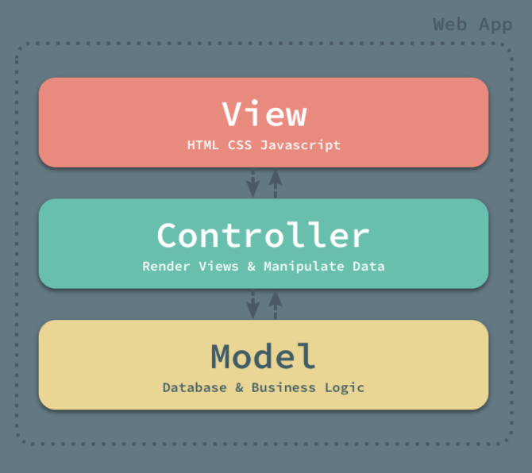
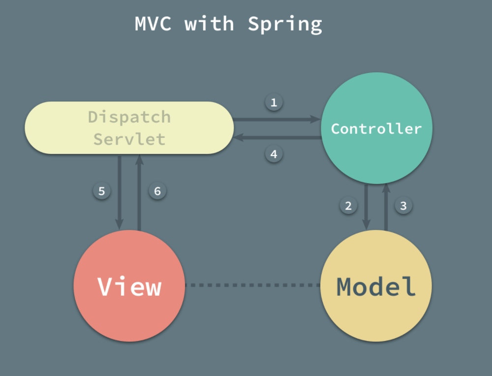
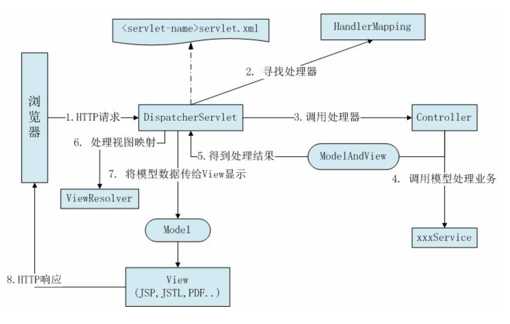
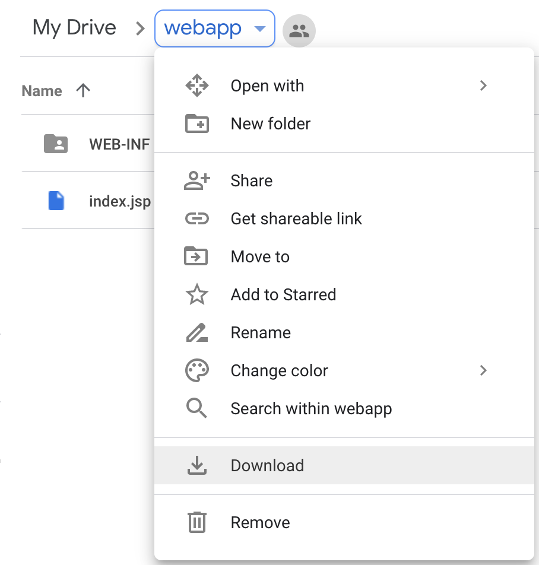
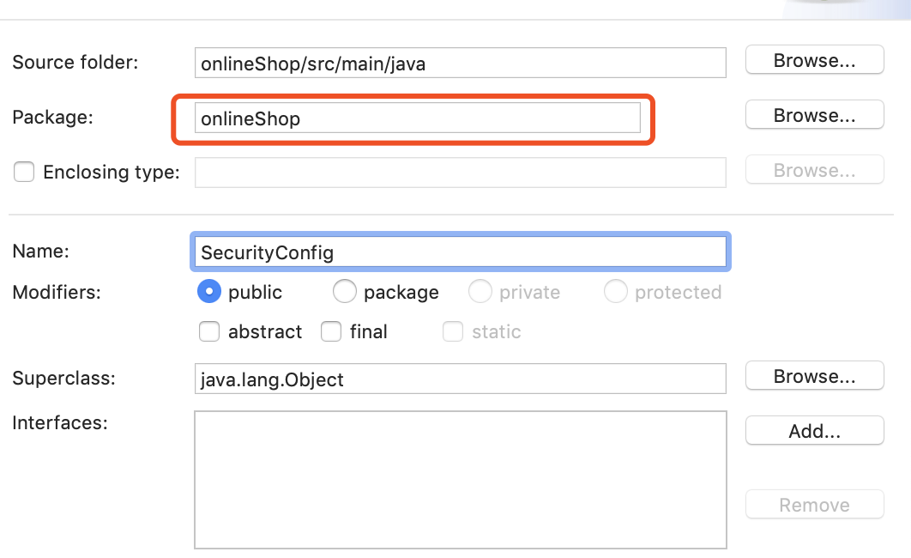
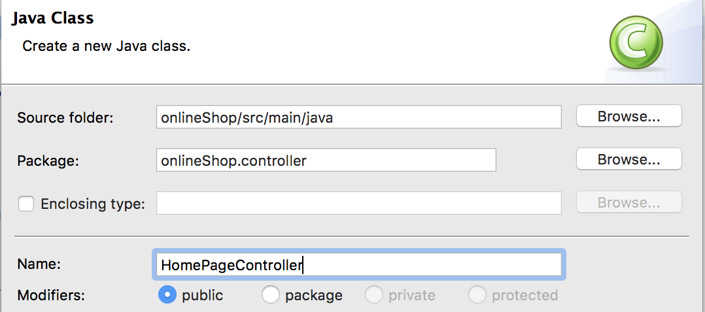

## What is MVC?

* M 即Model(模型层): 主要负责业务逻辑以及数据库的交互
* V 即View(视图层): 主要用于显示数据和提交数据
* C 即Controller(控制层): 主要用作捕获请求并控制请求转发

> MVC要实现的目标是将软件用户界面和业务逻辑分离以使代码可扩展、可复用、可维护. MVC的核心是模型层, 它将具体的需求抽象成java类然后对用户从视图层传递进来的请求作相应的处理, 最后把处理结果返回给用户. 模型层和视图层之间通过控制层来进行交互. 


> MVC有利于开发中的分工, 在MVC模式中, 由于按层把系统分开, 那么就能更好的实现开发中的分工.前端工程师可以进行视图层的开发, 对业务熟悉的开发人员可以开发模型层.



### What is Spring Web MVC?



> Spring Web MVC是一种基于Java的实现了MVC架构模式的Web框架, 它围绕一个DispatcherServlet来设计的. 前端无论是以何种方式请求, 都会通过个DispatcherServlet进行处理、转发以及调度后端的处理器(controller)进行处理.

### Spring MVC 的五大组件

* 前端控制器 (DispatcherServlet) Framework provided
* 映射处理器(HandlerMapping) Framework provided
* 处理器(Controller) do ourselves
* 模型和视图(ModelAndView) do ourselves
* 视图解析器(ViewResolver) Framework provided



1. 首先用户发送请求-->前端控制器(DispatcherServlet), 前端控制器根据请求信息(如URL)来决定选择哪一个控制器进行处理并把请求委托给它. 
2. 控制器(controller)接收到请求后, 首先它会在自己内部寻找一个合适的方法来处理请求(用@RequestMapping将方法映射到请求上), 然后传入收到的请求并且调用业务对象进行处理; 处理完毕后返回一个ModelAndView(模型数据和逻辑视图名). 
3. 前端控制器根据返回的逻辑视图名, 选择相应的视图进行渲染, 并把模型数据传入以便视图渲染. 
4. 前端控制器再次收回控制权, 将响应返回给用户.

### @Controller

作用于类上, 使用它标记的类就是一个Spring MVC Controller, 映射处理器(HandlerMapping)将会扫描使用了该annotation的类的方法, 并检测该方法是否使用了@RequestMapping.

### @RequestMapping来映射请求路径

使用@RequestMapping将请求URL映射到某个特定的方法上. 一般来说, 通过方法级别的注解来细化映射, 即根据特定的HTTP请求方法(“GET” “POST”方法等)将请求映射到匹配的方法上.

### @RequestParam来获得url上参数的值

RequestParam存放了http请求中所指定的参数. 参数的值会被转换成方法参数所声明的类型. http://www.example.com/pets?petId=1

```java
@Controller
public class EditPetForm {
    // request.getParameter(“petId”).
    @RequestMapping(value = "/pets", method = RequestMapping.GET)
    public String setupForm(@RequestParam("petId") int petId) {
        Pet pet = this.clinic.loadPet(petId);
        return "petForm";
    }
}
```

### @PathVariable用于URL中的模板变量映射到方法的参数上

http://www.example.com/owners/1/pets/2

```java
@GetMapping("/owners/{ownerId}/pets/{petId}")
public Pet findPet(@PathVariable Long ownerId, @PathVariable Long petId) {
    ...
}
```

### @RequestBody来获得request body

http请求的body会被deserialized成某一个java对象

```java
@RequestMapping(path = "/something", method = RequestMethod.PUT)
public void handle(@RequestBody Object body) throws IOException {}
```

### @ModelAttribute将表单属性绑定到模型对象

```java
public String registerCustomer(@ModelAttribute(value = "customer") Customer customer, Model model, BindingResult result) {
...
}
```

### Return types

1. ModelAndView: 用来存储处理完后的结果数据, 以及显示该数据的视图. 从名字上看ModelAndView中的Model代表模型, View代表视图, 这个名字就很好地解释了该类的作用. 处理器(controller)调用模型层处理完用户请求后, 把结果数据存储在该类的model属性中, 把要返回的视图信息存储在该类的view属性中, 然后把ModelAndView返回给Spring MVC框架. 框架通过调用配置文件中定义的视图解析器,对该对象进行解析, 最后把结果数据显示在指定的页面上.
2. void: 如果处理器方法中已经对response响应数据进行了处理(比如在方法参数中定义一个ServletResponse或HttpServletResponse类型的参数并直接向其响应体中写东西), 那么方法可以返回void
3. String: 视图名
4. @ResponseBody: 直接将请求结果以json的format返回给客户端

### Supported controller method arguments and return values

https://docs.spring.io/spring/docs/current/spring-framework-reference/web.html#mvc-ann-arguments

### Spring MVC的优势

1. 清晰的角色划分: 前端控制器(DispatcherServlet), 视图解析器(ViewResolver), 处理器(Controller). 通过 DispatchServlet 将控制器层和视图层完全解耦.
2. SpringMVC既可以返回合适的页面, 也可以响应RESTful请求.

## Implementation

### Copy the content into “src/main/webapp”

https://drive.google.com/drive/folders/1_jolRBv0YTtcJfguO5lYjjdA8vStBPfE?usp=sharing



### Add SecurityConfig.java under onlineShop package



```java
package onlineShop;

import javax.sql.DataSource;
import org.springframework.beans.factory.annotation.Autowired;
import org.springframework.security.config.annotation.authentication.builders.AuthenticationManagerBuilder;
import org.springframework.security.config.annotation.web.builders.HttpSecurity;
import org.springframework.security.config.annotation.web.configuration.EnableWebSecurity;
import org.springframework.security.config.annotation.web.configuration.WebSecurityConfigurerAdapter;

@EnableWebSecurity
public class SecurityConfig extends WebSecurityConfigurerAdapter {

	@Autowired
	private DataSource dataSource;
	
	protected void configure(HttpSecurity http) throws Exception {
		http
			.csrf().disable()
			.formLogin()
				.loginPage("/login")
				
			.and()
			.authorizeRequests()
			.antMatchers("/cart/**").hasAuthority("ROLE_USER")
			.antMatchers("/get*/**").hasAnyAuthority("ROLE_USER", "ROLE_ADMIN")
			.antMatchers("/admin*/**").hasAuthority("ROLE_ADMIN")
			.anyRequest().permitAll()
			.and()
			.logout()
				.logoutUrl("/logout");
			
	}
	
	protected void configure(AuthenticationManagerBuilder auth) throws Exception {
		auth
			.inMemoryAuthentication().withUser("stefanlaioffer@gmail.com").password("123").authorities("ROLE_ADMIN");
		
		auth
			.jdbcAuthentication()
			.dataSource(dataSource)
			.usersByUsernameQuery("SELECT emailId, password, enabled FROM users WHERE emailId=?")
			.authoritiesByUsernameQuery("SELECT emailId, authorities FROM authorities WHERE emailId=?");
		
	}
	
}
```

### Add HomePageController.java under controller folder



```java
package onlineShop.controller;

import org.springframework.stereotype.Controller;
import org.springframework.web.bind.annotation.RequestMapping;
import org.springframework.web.bind.annotation.RequestMethod;
import org.springframework.web.bind.annotation.RequestParam;
import org.springframework.web.servlet.ModelAndView;

@Controller
public class HomePageController {

	@RequestMapping(value = "/index", method = RequestMethod.GET)
	public String sayIndex() {
		return "index";
	}

	@RequestMapping("/login")
	public ModelAndView login(@RequestParam(value = "error", required = false) String error,
			@RequestParam(value = "logout", required = false) String logout) {
		ModelAndView modelAndView = new ModelAndView();
		modelAndView.setViewName("login");
		
		if (error != null) {
			modelAndView.addObject("error", "Invalid username and Password");
		}

		if (logout != null) {
			modelAndView.addObject("logout", "You have logged out successfully");
		}
		return modelAndView;
	}

	@RequestMapping(value = "/aboutus", method = RequestMethod.GET)
	public String sayAbout() {
		return "aboutUs";
	}
}
```

### Open your browser, enter

http://localhost:8080/onlineShop/