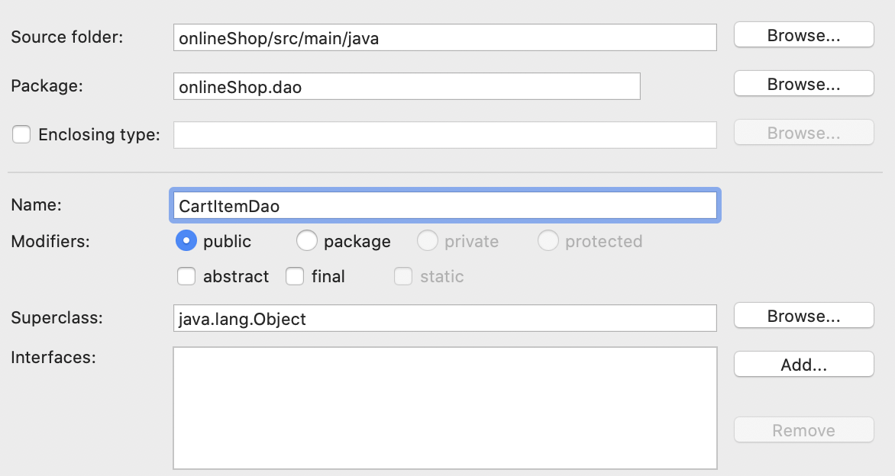

## Update SecurityConfig.java

```java
package onlineShop;

import javax.sql.DataSource;

import org.springframework.beans.factory.annotation.Autowired;
import org.springframework.context.annotation.Bean;
import org.springframework.security.config.annotation.authentication.builders.AuthenticationManagerBuilder;
import org.springframework.security.config.annotation.web.builders.HttpSecurity;
import org.springframework.security.config.annotation.web.configuration.EnableWebSecurity;
import org.springframework.security.config.annotation.web.configuration.WebSecurityConfigurerAdapter;
import org.springframework.security.crypto.password.NoOpPasswordEncoder;

@EnableWebSecurity
public class SecurityConfig extends WebSecurityConfigurerAdapter {

	@Autowired
	private DataSource dataSource;
	
	protected void configure(HttpSecurity http) throws Exception {
		http
			.csrf().disable()
			.formLogin()
				.loginPage("/login")
				
			.and()
			.authorizeRequests()
			.antMatchers("/cart/**").hasAuthority("ROLE_USER")
			.antMatchers("/get*/**").hasAnyAuthority("ROLE_USER", "ROLE_ADMIN")
			.antMatchers("/admin*/**").hasAuthority("ROLE_ADMIN")
			.anyRequest().permitAll()
			.and()
			.logout()
				.logoutUrl("/logout");
			
	}
	
	protected void configure(AuthenticationManagerBuilder auth) throws Exception {
		auth
			.inMemoryAuthentication().withUser("stefanlaioffer@gmail.com").password("123").authorities("ROLE_ADMIN");
		
		auth
			.jdbcAuthentication()
			.dataSource(dataSource)
			.usersByUsernameQuery("SELECT emailId, password, enabled FROM users WHERE emailId=?")
			.authoritiesByUsernameQuery("SELECT emailId, authorities FROM authorities WHERE emailId=?");
		
	}
	
	@SuppressWarnings("deprecation")
	@Bean
	public static NoOpPasswordEncoder passwordEncoder() {
	    return (NoOpPasswordEncoder) NoOpPasswordEncoder.getInstance();
	}
	
}
```

## Registration(注册功能)

1. Create CustomerDao.java


```java
package onlineShop.dao;

import javax.persistence.criteria.CriteriaBuilder;
import javax.persistence.criteria.CriteriaQuery;
import javax.persistence.criteria.Root;

import org.hibernate.Session;
import org.hibernate.SessionFactory;
import org.springframework.beans.factory.annotation.Autowired;
import org.springframework.stereotype.Repository;

import onlineShop.model.Authorities;
import onlineShop.model.Cart;
import onlineShop.model.Customer;
import onlineShop.model.User;

@Repository
public class CustomerDao {

	@Autowired
	private SessionFactory sessionFactory;

	public void addCustomer(Customer customer) {
		customer.getUser().setEnabled(true);

		Authorities authorities = new Authorities();
		authorities.setAuthorities("ROLE_USER");
		authorities.setEmailId(customer.getUser().getEmailId());

		Cart cart = new Cart();
		cart.setCustomer(customer);
		customer.setCart(cart);
		
		Session session = null;

		try {
			session = sessionFactory.openSession();
			session.beginTransaction();
			session.save(authorities);
			session.save(customer);
			session.getTransaction().commit();
		} catch (Exception e) {
			e.printStackTrace();
			session.getTransaction().rollback();
		} finally {
			if (session != null) {
				session.close();
			}
		}
	}

	public Customer getCustomerByUserName(String userName) {
		User user = null;
		try (Session session = sessionFactory.openSession()) {
			CriteriaBuilder builder = session.getCriteriaBuilder();
			CriteriaQuery<User> criteriaQuery = builder.createQuery(User.class);
			Root<User> root = criteriaQuery.from(User.class);
			criteriaQuery.select(root).where(builder.equal(root.get("emailId"), userName));
			user = session.createQuery(criteriaQuery).getSingleResult();
		} catch (Exception e) {
			e.printStackTrace();
		}
		if (user != null)
			return user.getCustomer();
		return null;
	}
}
```

2. Create CustomerService.java


```java
package onlineShop.service;

import org.springframework.beans.factory.annotation.Autowired;
import org.springframework.stereotype.Service;

import onlineShop.dao.CustomerDao;
import onlineShop.model.Customer;

@Service
public class CustomerService {
    
    @Autowired
    private CustomerDao customerDao;

    public void addCustomer(Customer customer) {   	 
   	 customerDao.addCustomer(customer);
    }

    public Customer getCustomerByUserName(String userName) {
   	 return customerDao.getCustomerByUserName(userName);
    }
}
```

3. Create RegistrationController.java


```java
package onlineShop.controller;

import org.springframework.beans.factory.annotation.Autowired;
import org.springframework.stereotype.Controller;
import org.springframework.validation.BindingResult;
import org.springframework.web.bind.annotation.ModelAttribute;
import org.springframework.web.bind.annotation.RequestMapping;
import org.springframework.web.bind.annotation.RequestMethod;
import org.springframework.web.servlet.ModelAndView;

import onlineShop.model.Customer;
import onlineShop.service.CustomerService;

@Controller
public class RegistrationController {
	
	@Autowired
	private CustomerService customerService;

	@RequestMapping(value = "/customer/registration", method = RequestMethod.GET)
	public ModelAndView getRegistrationForm() {
		Customer customer = new Customer();
		return new ModelAndView("register", "customer", customer);
	}

	@RequestMapping(value = "/customer/registration", method = RequestMethod.POST)
	public ModelAndView registerCustomer(@ModelAttribute(value = "customer") Customer customer,
			BindingResult result) {
		ModelAndView modelAndView = new ModelAndView();
		if (result.hasErrors()) {
			modelAndView.setViewName("register");
			return modelAndView;
		}
		customerService.addCustomer(customer);
		modelAndView.setViewName("login");
		modelAndView.addObject("registrationSuccess", "Registered Successfully. Login using username and password");
		return modelAndView;
	}
}
```

## CRUD for product(商品添加删除修改)

1. Create ProductDao.java


```java
package onlineShop.dao;

import java.util.ArrayList;
import java.util.List;

import javax.persistence.criteria.CriteriaBuilder;
import javax.persistence.criteria.CriteriaQuery;
import javax.persistence.criteria.Root;

import org.hibernate.Session;
import org.hibernate.SessionFactory;
import org.springframework.beans.factory.annotation.Autowired;
import org.springframework.stereotype.Repository;

import onlineShop.model.Product;

@Repository
public class ProductDao {

	@Autowired
	private SessionFactory sessionFactory;

	public void addProduct(Product product) {
		Session session = null;
		try {
			session = sessionFactory.openSession();
			session.beginTransaction();
			session.save(product);
			session.getTransaction().commit();
		} catch (Exception e) {
			e.printStackTrace();
			session.getTransaction().rollback();
		} finally {
			if (session != null) {
				session.close();
			}
		}
	}

	public void deleteProduct(int productId) {
		Session session = null;
		try {
			session = sessionFactory.openSession();
			session.beginTransaction();
			Product product = (Product) session.get(Product.class, productId);
			session.delete(product);
			session.getTransaction().commit();
		} catch (Exception e) {
			e.printStackTrace();
			session.getTransaction().rollback();
		} finally {
			if (session != null) {
				session.close();
			}
		}

	}

	public void updateProduct(Product product) {
		Session session = null;
		try {
			session = sessionFactory.openSession();
			session.beginTransaction();
			session.saveOrUpdate(product);
			session.getTransaction().commit();
		} catch (Exception e) {
			e.printStackTrace();
			session.getTransaction().rollback();
		} finally {
			if (session != null) {
				session.close();
			}
		}

	}

	public Product getProductById(int productId) {
		try (Session session = sessionFactory.openSession()) {
			session.beginTransaction();
			Product product = (Product) session.get(Product.class, productId);
			session.getTransaction().commit();
			return product;
		} catch (Exception e) {
			e.printStackTrace();
		}
		return null;
	}

	public List<Product> getAllProducts() {
		List<Product> products = new ArrayList<Product>();
		try (Session session = sessionFactory.openSession()) {
			session.beginTransaction();
			CriteriaBuilder criteriaBuilder = session.getCriteriaBuilder();
			CriteriaQuery<Product> criteriaQuery = criteriaBuilder.createQuery(Product.class);
			Root<Product> root = criteriaQuery.from(Product.class);
			criteriaQuery.select(root);
			products = session.createQuery(criteriaQuery).getResultList();
			session.getTransaction().commit();
		} catch (Exception e) {
			e.printStackTrace();
		}

		return products;
	}
}
```

2. Create ProductService.java


```java
package onlineShop.service;

import java.util.List;

import org.springframework.beans.factory.annotation.Autowired;
import org.springframework.stereotype.Service;

import onlineShop.dao.ProductDao;
import onlineShop.model.Product;

@Service
public class ProductService {

    @Autowired
    private ProductDao productDao;

    public List<Product> getAllProducts() {
   	 return productDao.getAllProducts();
    }

    public Product getProductById(int productId) {
   	 return productDao.getProductById(productId);
    }
    
    public void deleteProduct(int productId) {
   	 productDao.deleteProduct(productId);
    }
    
    public void addProduct(Product product){
   	 productDao.addProduct(product);
    }
    
    public void updateProduct(Product product){
   	 productDao.updateProduct(product);
    }
}
```

3. Create ProductController.java


```java
package onlineShop.controller;

import java.io.File;
import java.io.IOException;
import java.nio.file.Files;
import java.nio.file.Path;
import java.nio.file.Paths;
import java.util.List;

import org.springframework.beans.factory.annotation.Autowired;
import org.springframework.stereotype.Controller;
import org.springframework.validation.BindingResult;
import org.springframework.web.bind.annotation.ModelAttribute;
import org.springframework.web.bind.annotation.PathVariable;
import org.springframework.web.bind.annotation.RequestMapping;
import org.springframework.web.bind.annotation.RequestMethod;
import org.springframework.web.multipart.MultipartFile;
import org.springframework.web.servlet.ModelAndView;

import onlineShop.model.Product;
import onlineShop.service.ProductService;

@Controller
public class ProductController {

	@Autowired
	private ProductService productService;

	@RequestMapping(value = "/getAllProducts", method = RequestMethod.GET)
	public ModelAndView getAllProducts() {
		List<Product> products = productService.getAllProducts();
		return new ModelAndView("productList", "products", products);
	}

	@RequestMapping(value = "/getProductById/{productId}", method = RequestMethod.GET)
	public ModelAndView getProductById(@PathVariable(value = "productId") int productId) {
		Product product = productService.getProductById(productId);
		return new ModelAndView("productPage", "product", product);
	}

	@RequestMapping(value = "/admin/product/addProduct", method = RequestMethod.GET)
	public ModelAndView getProductForm() {
		return new ModelAndView("addProduct", "productForm", new Product());
	}

	@RequestMapping(value = "/admin/product/addProduct", method = RequestMethod.POST)
	public String addProduct(@ModelAttribute(value = "productForm") Product product, BindingResult result) {

		if (result.hasErrors()) {
			return "addProduct";
		}
		productService.addProduct(product);
		MultipartFile image = product.getProductImage();
		if (image != null && !image.isEmpty()) {
			// Mac
			// Path path = Paths.get("/Users/xxx/products/" + product.getId() + ".jpg");
			Path path = Paths.get("/Users/xxx/products/" + product.getId() + ".jpg");

			// windows
//			Path path = Paths.get("C:\\products\\" + product.getId() + ".jpg");
			try {
				image.transferTo(new File(path.toString()));
			} catch (IllegalStateException | IOException e) {
				e.printStackTrace();
			}
		}
		return "redirect:/getAllProducts";
	}
	
	@RequestMapping(value = "/admin/delete/{productId}")
	public String deleteProduct(@PathVariable(value = "productId") int productId) {
		// for MAC : Path path = Paths.get("/Users/xxx/products/" + productId + ".jpg");
		// For windows
		Path path = Paths.get("C:\\products\\" + productId + ".jpg");

		if (Files.exists(path)) {
			try {
				Files.delete(path);
			} catch (IOException e) {
				e.printStackTrace();
			}
		}

		productService.deleteProduct(productId);
		return "redirect:/getAllProducts";
	}

	@RequestMapping(value = "/admin/product/editProduct/{productId}", method = RequestMethod.GET)
	public ModelAndView getEditForm(@PathVariable(value = "productId") int productId) {
		Product product = productService.getProductById(productId);
		ModelAndView modelAndView = new ModelAndView();
		modelAndView.setViewName("editProduct");
		modelAndView.addObject("editProductObj", product);
		modelAndView.addObject("productId", productId);

		return modelAndView;
	}

	@RequestMapping(value = "/admin/product/editProduct/{productId}", method = RequestMethod.POST)
	public String editProduct(@ModelAttribute(value = "editProductObj") Product product,
			@PathVariable(value = "productId") int productId) {
		product.setId(productId);
		productService.updateProduct(product);
		return "redirect:/getAllProducts";
	}
}
```

## Cart(购物车)

1. Create CartDao.java


```java
package onlineShop.dao;

import java.io.IOException;
import java.util.List;
import org.hibernate.Session;
import org.hibernate.SessionFactory;
import org.springframework.beans.factory.annotation.Autowired;
import org.springframework.stereotype.Repository;

import onlineShop.model.Cart;
import onlineShop.model.CartItem;

@Repository
public class CartDao {

	@Autowired
	private SessionFactory sessionFactory;

	public Cart getCartById(int cartId) {
		Cart cart = null;
		try (Session session = sessionFactory.openSession()) {
			session.beginTransaction();
			cart = (Cart) session.get(Cart.class, cartId);
			session.getTransaction().commit();
		} catch (Exception e) {
			e.printStackTrace();
		}
		return cart;
	}
}
```

2. Create CartService.java


```java
package onlineShop.service;

import org.springframework.beans.factory.annotation.Autowired;
import org.springframework.stereotype.Service;

import onlineShop.dao.CartDao;
import onlineShop.model.Cart;

@Service
public class CartService {

    @Autowired
    private CartDao cartDao;

    public Cart getCartById(int cartId) {
   	 return cartDao.getCartById(cartId);
    }
}
```

3. Create CartController.java


```java
package onlineShop.controller;

import org.springframework.beans.factory.annotation.Autowired;
import org.springframework.security.core.Authentication;
import org.springframework.security.core.context.SecurityContextHolder;
import org.springframework.stereotype.Controller;
import org.springframework.web.bind.annotation.PathVariable;
import org.springframework.web.bind.annotation.RequestMapping;
import org.springframework.web.bind.annotation.RequestMethod;
import org.springframework.web.bind.annotation.ResponseBody;
import org.springframework.web.servlet.ModelAndView;

import onlineShop.model.Cart;
import onlineShop.model.Customer;
import onlineShop.service.CartService;
import onlineShop.service.CustomerService;

@Controller
public class CartController {
	@Autowired
	private CustomerService customerService;
	
	@Autowired
	private CartService cartService;
	
	@RequestMapping(value = "/cart/getCartById", method = RequestMethod.GET)
	public ModelAndView getCartId(){
		ModelAndView modelAndView = new ModelAndView("cart");
		Authentication loggedInUser = SecurityContextHolder.getContext().getAuthentication();
		String username = loggedInUser.getName();
		Customer customer = customerService.getCustomerByUserName(username);
		modelAndView.addObject("cartId", customer.getCart().getId());
		return modelAndView;
	}
	
	@RequestMapping(value = "/cart/getCart/{cartId}", method = RequestMethod.GET)
	@ResponseBody
	public Cart getCartItems(@PathVariable(value="cartId")int cartId){
		return cartService.getCartById(cartId);
	}
}
```

## CartItem(购物车添加/删除商品)

1. Create CartItemDao.java



```java
package onlineShop.dao;

import java.util.List;

import org.hibernate.Session;
import org.hibernate.SessionFactory;
import org.springframework.beans.factory.annotation.Autowired;
import org.springframework.stereotype.Repository;

import onlineShop.model.Cart;
import onlineShop.model.CartItem;

@Repository
public class CartItemDao {
	@Autowired
	private SessionFactory sessionFactory;

	public void addCartItem(CartItem cartItem) {
		Session session = null;
		try {
			session = sessionFactory.openSession();
			session.beginTransaction();
			session.saveOrUpdate(cartItem);
			session.getTransaction().commit();
		} catch (Exception e) {
			e.printStackTrace();
			session.getTransaction().rollback();
		} finally {
			if (session != null) {
				session.close();
			}
		}
	}

	public void removeCartItem(int cartItemId) {
		Session session = null;
		try {
			session = sessionFactory.openSession();
			CartItem cartItem = (CartItem) session.get(CartItem.class, cartItemId);
			Cart cart = cartItem.getCart();
			List<CartItem> cartItems = cart.getCartItem();
			cartItems.remove(cartItem);
			session.beginTransaction();
			session.delete(cartItem);
			session.getTransaction().commit();
		} catch (Exception e) {
			e.printStackTrace();
			session.getTransaction().rollback();
		} finally {
			if (session != null) {
				session.close();
			}
		}
	}

	public void removeAllCartItems(Cart cart) {
		List<CartItem> cartItems = cart.getCartItem();
		for (CartItem cartItem : cartItems) {
			removeCartItem(cartItem.getId());
		}
	}
}
```

2. Create CartItemService.java


```java
package onlineShop.service;

import org.springframework.beans.factory.annotation.Autowired;
import org.springframework.stereotype.Service;

import onlineShop.dao.CartItemDao;
import onlineShop.model.Cart;
import onlineShop.model.CartItem;

@Service
public class CartItemService {

    @Autowired
    private CartItemDao cartItemDao;

    public void addCartItem(CartItem cartItem) {
   	 cartItemDao.addCartItem(cartItem);

    }

    public void removeCartItem(int cartItemId) {
   	 cartItemDao.removeCartItem(cartItemId);
    }

    public void removeAllCartItems(Cart cart) {
   	 cartItemDao.removeAllCartItems(cart);
    }
}
```

3. Create CartItemController.java


```java
package onlineShop.controller;

import java.util.List;

import org.springframework.beans.factory.annotation.Autowired;
import org.springframework.http.HttpStatus;
import org.springframework.security.core.Authentication;
import org.springframework.security.core.context.SecurityContextHolder;
import org.springframework.stereotype.Controller;
import org.springframework.web.bind.annotation.PathVariable;
import org.springframework.web.bind.annotation.RequestMapping;
import org.springframework.web.bind.annotation.RequestMethod;
import org.springframework.web.bind.annotation.ResponseStatus;

import onlineShop.model.Cart;
import onlineShop.model.CartItem;
import onlineShop.model.Customer;
import onlineShop.model.Product;
import onlineShop.service.CartItemService;
import onlineShop.service.CartService;
import onlineShop.service.CustomerService;
import onlineShop.service.ProductService;

@Controller
public class CartItemController {
    @Autowired
    private CartService cartService;

    @Autowired
    private CartItemService cartItemService;

    @Autowired
    private CustomerService customerService;

    @Autowired
    private ProductService productService;

    @RequestMapping("/cart/add/{productId}")
    @ResponseStatus(value = HttpStatus.CREATED)
    public void addCartItem(@PathVariable(value = "productId") int productId) {
   	 Authentication loggedInUser = SecurityContextHolder.getContext().getAuthentication();
   	 String username = loggedInUser.getName();
   	 Customer customer = customerService.getCustomerByUserName(username);

   	 Cart cart = customer.getCart();
   	 List<CartItem> cartItems = cart.getCartItem();
   	 Product product = productService.getProductById(productId);
   	 
   	 for (int i = 0; i < cartItems.size(); i++) {
   		 CartItem cartItem = cartItems.get(i);
   		 if (product.getId() == (cartItem.getProduct().getId())) {
   			 cartItem.setQuantity(cartItem.getQuantity() + 1);
   			 cartItem.setPrice(cartItem.getQuantity() * cartItem.getProduct().getProductPrice());
   			 cartItemService.addCartItem(cartItem);
   			 return;
   		 }
   	 }
   	 
   	 CartItem cartItem = new CartItem();
   	 cartItem.setQuantity(1);
   	 cartItem.setProduct(product);
   	 cartItem.setPrice(product.getProductPrice());
   	 cartItem.setCart(cart);
   	 cartItemService.addCartItem(cartItem);
    }

    @RequestMapping(value = "/cart/removeCartItem/{cartItemId}", method = RequestMethod.DELETE)
    @ResponseStatus(value = HttpStatus.NO_CONTENT)
    public void removeCartItem(@PathVariable(value = "cartItemId") int cartItemId) {
   	 cartItemService.removeCartItem(cartItemId);
    }

    @RequestMapping(value = "/cart/removeAllItems/{cartId}", method = RequestMethod.DELETE)
    @ResponseStatus(value = HttpStatus.NO_CONTENT)
    public void removeAllCartItems(@PathVariable(value = "cartId") int cartId) {
   	 Cart cart = cartService.getCartById(cartId);
   	 cartItemService.removeAllCartItems(cart);
    }

}
```

