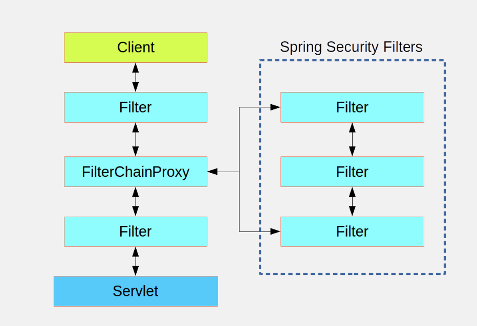
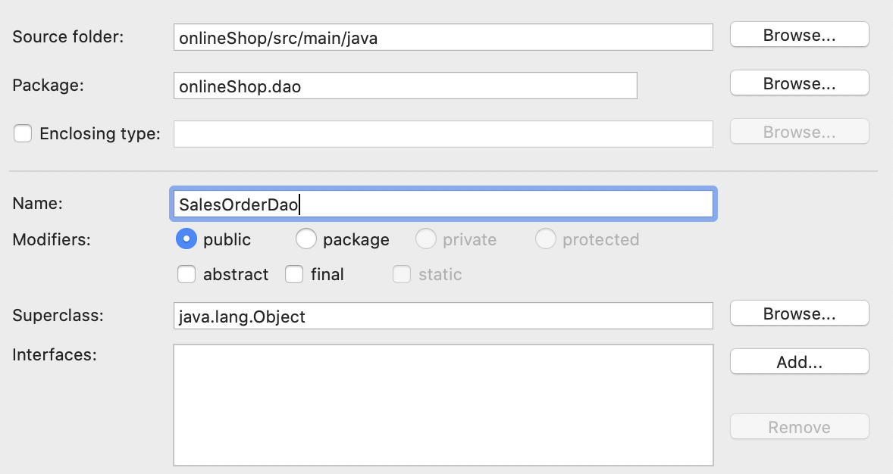
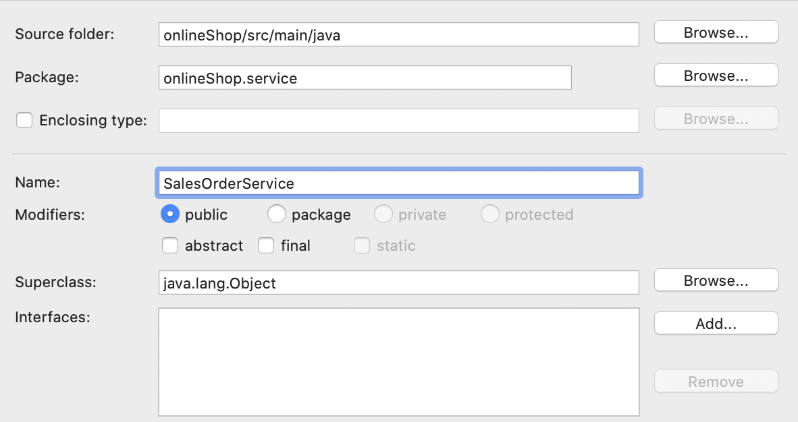
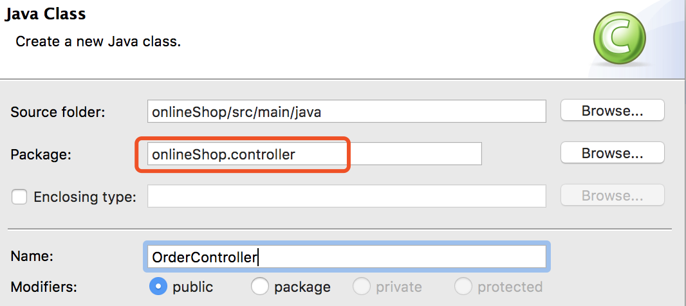

## What is Spring Security?

Spring Security provides security services for Java EE-based enterprise software applications. There is a particular emphasis on Spring based applications.

## Authentication

The process of checking credentials and making sure the current logged user is who they claim to be.

## Authorization

The process of deciding whether a current logged user is allowed to perform an action within your application.

## Enable Spring Security

The first thing you need to do is add the following filter declaration to your web.xml file

```xml
<filter>
  <filter-name>springSecurityFilterChain</filter-name>
  <filter-class>org.springframework.web.filter.DelegatingFilterProxy</filter-class>
</filter>

<filter-mapping>
  <filter-name>springSecurityFilterChain</filter-name>
  <url-pattern>/*</url-pattern>
</filter-mapping>
```



# Spring Web Flow

## What is a flow?

A flow encapsulates a sequence of steps that guide users through the execution of some business logic.

## What web flow try to solve?

Web flow defines the page navigation rules, manage navigation and conversational state.

## What a flow is made up of?

In Spring Web Flow, a flow consists of a series of steps called "states". Entering a state typically results in a view being displayed to the user or some backend logic be performed. The result of one state can trigger transitions to other states.

## How to compose a flow?

Flows are authored by using a simple XML-based flow definition language

## Configuring a flow registry

```xml
<webflow-config:flow-registry id="flowRegistry">
	<webflow-config:flow-location path="/WEB-INF/flow/checkout/checkout-flow.xml" id="checkout" />
</webflow-config:flow-registry>
```

A flow registry’s job is to load flow definitions and make them available to the flow executor.

## Wiring a flow executor

```xml
<webflow-config:flow-executor id="flowExecutor" flow-registry="flowRegistry">
</webflow-config:flow-executor>
```

The flow executor drives the execution of a flow. When a user enters a flow, the flow executor creates an instance of the flow execution for that user.

Spring web flow是建立在spring mvc上的, 所有的请求都会经过Dispatcherservlet. 其中也包含flow request, 所以需要一些特殊的bean来处理flow request和执行flow

## Handling flow requests

```xml
<bean id="flowHandlerMapping"
	class="org.springframework.webflow.mvc.servlet.FlowHandlerMapping">
		<property name="flowRegistry" ref="flowRegistry"></property>
</bean>

<bean id="flowHandlerAdapter"
	class="org.springframework.webflow.mvc.servlet.FlowHandlerAdapter">
		<property name="flowExecutor" ref="flowExecutor"></property>
</bean>
```

1. 对于flow而言, 需要一个FlowHandlerMapping来帮助DispatcherServlet将flow请求发送给Spring Web Flow.
2. 而FlowHandlerMapping的工作仅仅是将flow请求定向到Spring Web Flow, 响应请求的是FlowHandlerAdapter, 它会响应发送的flow请求并对其进行处理.
3. 一个完整的flow请求响应过程:
   * 首先flow处理请求由DispatcherServlet转发给FlowHandlerMapping开始处理;
   * FlowHandlerMapping读取flow registry, 知道flow是如何定义、在哪里定义的, 这相当于一种映射过程；
   * FlowHandlerMapping将具体的处理工作交给FlowHandlerAdapter, FlowHandlerAdapter调用请求执行器执行具体的flow请求.

## The components of a flow

In Spring Web Flow, flow is defined by three primary elements: states, transitions, and flow data.

States-- states are points in a flow where something happens.

Transitions-- transitions connect the states within a flow.

Flow data-- the current condition of the flow.


## States

| 状态类型        | 作用                                                         |
| --------------- | ------------------------------------------------------------ |
| 视图(View)      | A view state pauses the flow and invites the user to participate in the flow. |
| 行为(Action)    | Action states are where the business logic of a flow takes place. |
| 子流程(Subflow) | A subflow state starts a new flow in the context of a flow that is already underway. |
| 结束(End)       | The end state is the last stop for a flow. Once a flow has reached its end state, the flow is terminated. |

### View State

View states are used to display information to the user and to offer the user an opportunity to play an active role in the flow.

### How to define a view state?

```xml
<view-state id="welcome" view="greeting.jsp" model=”xxx” />
```

The id identifies the state in the flow, the view name specifies the page to be rendered. If a flow presents a form to the user, you may want to specify the object to which the form will be bound. To do that, set the model attribute.

### Action State

Action states typically invoke some methods on a Spring-managed bean and then transition to another state depending on the outcome of the method call.

### How to define an action state?

```xml
<action-state id="addCartToOrder">
    <evaluate expression="cartDao.validate(requestParameters.cartId)" result="order.cart" />
    <transition to="invalidCartWarning" on-exception="java.io.IOException" />
    <transition to="collectCustomerInfo" />
</action-state>
```

<action-state> elements usually have an <evaluate> element as a child. The <evaluate> element gives an action state something to do. The expression  attribute is given an expression that is evaluated when the state is entered.

### Subflow State

The <subflow-state> element lets you call another flow within an executing flow. It’s analogous to calling a method within another method.

### How to define a subflow state?

```xml
<subflow-state id="order" subflow="subflowId">
    <input name="order" value="order"/>
    <transition on="orderCreated" to="payment" />
</subflow-state>
```

The <input> element is used to pass the order object as input to the subflow. Similar with we pass an argument to another method.

### End State

The <end-state> element designates the end of a flow and typically appears like this <end-state id=”endState" />


What happens next depends on a few factors:

1. If the flow that’s ending is a subflow, the calling flow will proceed from the <subflow-state> . The <end-state> ’s ID will be used as an event to trigger the transition away from the <subflow-state>
2. If the ending flow isn’t a subflow, the flow ends.  The browser lands on the flow’s base URL.


## Transitions

Transitions connect the states within a flow, every state in a flow, without end states, should have at least one transition so that the flow will know where to go once that state has been completed.

### How to define transition?

```xml
<transition on="customerInfoCollected" to="collectShippingDetail" />
```

Commonly, transitions are defined to take place on some event. In a view state, the event is usually an action taken by the user. In an action state, theevent is the result of evaluating an expression. In the case of a subflow state, the event is determined by the result of the subflow’s end state.

The flow can also transition to another state in response to some exceptions being thrown.

```xml
<transition to="invalidCartWarning" on-exception="java.io.IOException" />
```

The on-exception attribute is much like the on attribute, except that it specifies an exception to transition on instead of an event

## Flow data

Flow data is stored in variables that can be referenced at various points in the flow.

### How to declare variables?

1. The simplest way to create a variable in a flow is by using the <var> element

```xml
<var name="order" class="onlineShop.model.SalesOrder" />
```

SalesOrder order = new SalesOrder()a new instance of a SalesOrder object is created and placed into the variablewhose name is order. This variable is available to all states in a flow.

2. As part of an action state, you can perform some backend logic via the <evaluate> element and store the result somewhere

```xml
<evaluate expression="cartDao.validate(requestParameters.cartId)" result="order.cart" />
```

In this case, the <evaluate> element evaluates an expression (a SpEL expression) and places the result in order.cart


## Implementation

Update checkout-flow.xml

```xml
<?xml version="1.0" encoding="UTF-8"?>
<flow xmlns="http://www.springframework.org/schema/webflow"
      xmlns:xsi="http://www.w3.org/2001/XMLSchema-instance"
      xsi:schemaLocation="http://www.springframework.org/schema/webflow
						  http://www.springframework.org/schema/webflow/spring-webflow.xsd">

    <var name="order" class="onlineShop.model.SalesOrder" />
    
    <action-state id="addCartToOrder">
        <evaluate expression="cartDao.validate(requestParameters.cartId)" result="order.cart" />
        <transition to="invalidCartWarning" on-exception="java.io.IOException" />
        <transition to="collectCustomerInfo" />
    </action-state>
 
    <view-state id="collectCustomerInfo" view="collectCustomerInfo.jsp" model="order">
        <transition on="customerInfoCollected" to="collectShippingDetail" />
    </view-state>

    <view-state id="collectShippingDetail" view="collectShippingDetail.jsp" model="order">
        <transition on="shippingDetailCollected" to="orderConfirmation" />
        <transition on="backToCollectCustomerInfo" to="collectCustomerInfo" />
    </view-state>

     <view-state id="orderConfirmation" view = "orderConfirmation.jsp"> 
         <transition on="orderConfirmed" to="processOrder" /> 
         <transition on="backToCollectShippingDetail" to="collectShippingDetail" /> 
     </view-state> 

    <action-state id="processOrder">
        <evaluate expression="cartItemDao.removeAllCartItems(order.cart)" />
        <transition to="thankCustomer" />
    </action-state>


    <view-state id="thankCustomer" model="order">
        <transition to="endState" />
    </view-state>

    <end-state id="endState" />

    <view-state id="invalidCartWarning">
        <transition to="endState" />
    </view-state>

    <end-state id="cancelCheckout" view="checkOutCancelled.jsp" />

    <global-transitions>
        <transition on="cancel" to="cancelCheckout" />
    </global-transitions>

</flow>
```


1. Update the CartDao.java

```java
package onlineShop.dao;

import java.io.IOException;
import java.util.List;
import org.hibernate.Session;
import org.hibernate.SessionFactory;
import org.springframework.beans.factory.annotation.Autowired;
import org.springframework.stereotype.Repository;

import onlineShop.model.Cart;
import onlineShop.model.CartItem;

@Repository
public class CartDao {

	@Autowired
	private SessionFactory sessionFactory;

	public Cart getCartById(int cartId) {
		Cart cart = null;
		try (Session session = sessionFactory.openSession()) {
			session.beginTransaction();
			cart = (Cart) session.get(Cart.class, cartId);
			session.getTransaction().commit();
		} catch (Exception e) {
			e.printStackTrace();
		}
		return cart;
	}

	public Cart validate(int cartId) throws IOException {
		Cart cart = getCartById(cartId);
		if (cart == null || cart.getCartItem().size() == 0) {
			throw new IOException(cartId + "");
		}
		update(cart);
		return cart;
	}

	private void update(Cart cart) {
		double total = getSalesOrderTotal(cart);
		cart.setTotalPrice(total);

		try (Session session = sessionFactory.openSession()) {
			session.beginTransaction();
			session.saveOrUpdate(cart);
			session.getTransaction().commit();
		} catch (Exception e) {
			e.printStackTrace();
		}
	}

	private double getSalesOrderTotal(Cart cart) {
		double total = 0;
		List<CartItem> cartItems = cart.getCartItem();

		for (CartItem item : cartItems) {
			total += item.getPrice();
		}
		return total;
	}

}
```

2. Create SalesOrderDao.java



```java
package onlineShop.dao;

import org.hibernate.Session;
import org.hibernate.SessionFactory;
import org.springframework.beans.factory.annotation.Autowired;
import org.springframework.stereotype.Repository;

import onlineShop.model.SalesOrder;

@Repository
public class SalesOrderDao {

	@Autowired
	private SessionFactory sessionFactory;

	public void addSalesOrder(SalesOrder salesOrder) {
		Session session = null;
		try {
			session = sessionFactory.openSession();
			session.beginTransaction();
			session.saveOrUpdate(salesOrder);
			session.getTransaction().commit();
		} catch (Exception e) {
			e.printStackTrace();
			session.getTransaction().rollback();
		} finally {
			if (session != null) {
				session.close();
			}
		}
	}
}
```

3. Create SalesOrderService.java



```java
package onlineShop.service;

import org.springframework.beans.factory.annotation.Autowired;
import org.springframework.stereotype.Service;

import onlineShop.dao.SalesOrderDao;
import onlineShop.model.SalesOrder;

@Service
public class SalesOrderService {

    @Autowired
    private SalesOrderDao salesOrderDao;
    
    public void addSalesOrder(SalesOrder salesOrder) {
   	 salesOrderDao.addSalesOrder(salesOrder);
    }
}
```

4. Create OrderController.java



```java
package onlineShop.controller;

import org.springframework.beans.factory.annotation.Autowired;
import org.springframework.stereotype.Controller;
import org.springframework.web.bind.annotation.PathVariable;
import org.springframework.web.bind.annotation.RequestMapping;
import org.springframework.web.bind.annotation.RequestMethod;

import onlineShop.model.Cart;
import onlineShop.model.Customer;
import onlineShop.model.SalesOrder;
import onlineShop.service.CartService;
import onlineShop.service.SalesOrderService;

@Controller
public class OrderController {

	@Autowired
	private CartService cartService;

	@Autowired
	private SalesOrderService customerOrderService;

	@RequestMapping(value = "/order/{cartId}", method = RequestMethod.GET)
	public String createOrder(@PathVariable("cartId") int cartId) {

		SalesOrder salesOrder = new SalesOrder();
		Cart cart = cartService.getCartById(cartId);
		salesOrder.setCart(cart);

		Customer customer = cart.getCustomer();
		salesOrder.setCustomer(customer);
		salesOrder.setShippingAddress(customer.getShippingAddress());
		salesOrder.setBillingAddress(customer.getBillingAddress());
		customerOrderService.addSalesOrder(salesOrder);
		return "redirect:/checkout?cartId=" + cartId;
	}
}
```

