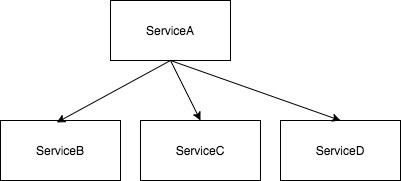

# Goal

* Understand what is “OnlineShop Ordering System”
* Understand what is “Orchestration”
* Understand Severless
* Have hands-on experience on building fulfillment system by leveraging AWS Step Functions and AWS Lambda


### Fulfillment System


Fulfillment could be physical fulfillment, digital fulfillment(e.g. Games in Appstore) or any other services. 


In the context of “OnlineShop project”, fulfillment is triggered by order checkout and completed when order is fulfilled(e.g. items get shipped by carrier or items get delivered to customers). 

A “Fulfillment System” is a collection of components / services which facilitates fulfillment.

### What happens after checkout?

#### A few questions need to be answered:

1. What is the payment instrument? Is the receivable secured?
2. Is it sold by first  party(1P) sellers or third party(3P) sellers?
3. If it’s sold by a 1P seller, what is the ShipFrom warehouse?
4. If it’s sold by a 3P selller, who will take care of fulfillment? The 3P seller or the onlineShop?
5. If it’s sold by a 3P seller, what is the fee to charge the 3P seller?
6. What are the required invoices to be generated?

#### More open questions:

1. Is the buyer a business?
2. What is the Tax for this transaction?
3. Is the transaction applicable for tax exemption?
4. What is the Tax rate at the fulfillment time and what is the Tax rate at the checkout time? Are they different?
5. Is the transaction applicable for promotion?
6. Is it a cross border transaction?
7. What is the currency to be charged to the buyer? Is currency exchange needed?
8. How currency exchange impacts invoicing?
9. What are the required reports and data for various customers including end customers, sellers, buyers, legal department, sales, recommendation systems?
10. Can 3P sellers use OnlineShop’s fulfillment infrastructure? 
11. How to book the right amount in the right account?

### Functional Requirements

As a buyer, I’m able to place an order at the website and get the order fulfilled in a reasonable service-level agreement(SLA) e.g. 2 days shipping, standards shipping(3-5days) and FREE shipping (5-7 days). 

As a buyer, I’m able to track the progress of fulfillment through the website

As a buyer I’m able to get invoice once I get charged

As a 3P seller, I’m able to list products via a website

As a 3P seller, I’m able to get invoices of Seller Fee for every single transaction

As a 1P seller, the items in an order located in multiple warehouses should be shipped to buyers with the lowest shipping cost.  

### Orchestration

Orchestration is a way of handling interactions among different services and widely used for fulfillment systems.

#### Why Orchestration?

Point to point integration is a traditional approach that services are glued together by using synchronized API calls without a centralized orchestrator. In the diagram below based on internal state(condition1 or condition2) ServiceA calls ServiceB or both ServiceC and ServiceD.



Point-to-point integration always leads to a complex tangle of application dependencies (often referred to as "spaghetti code") that is very hard to manage, monitor and maintain. 


With orchestration, there is typically one controller that acts as the “orchestrator” of the overall service interactions. Orchestration is the process of integrating two or more applications and/or services together to automate a process or synchronize data. 


Orchestration provides

1. An approach to integration that decouples applications from each other
2. Capabilities for message routing, security, transformation and reliability and
3. Most importantly, a way to manage and monitor your integrations centrally.


#### Key takeaways

1. Orchestrator is a state machine, it's an abstraction whereby the machine can have different states, but at a given time only one of them is active.
2. [Pro] Provides a good way for controlling the flow of the application when there is synchronous processing - race condition issues are addressed by the state machine. 
3. [Pro] Visibility & maintainability - Orchestrator is the centralized place which has the information on how Service A, B, C and any other service is integrated.
4. [Pro] Easy to troubleshoot - if exceptions get thrown by a service(e.g. ServiceB) there is a corresponding state in the Orchestrator.
5. [Pro] Decoupling Orchestration from business logic

### Serverless

#### Serverless computing ([reference](https://en.wikipedia.org/wiki/Serverless_computing)) 

* a cloud-computing execution model in which the cloud provider runs the server, and dynamically manages the allocation of machine resources. Pricing is based on the actual amount of resources consumed by an application, rather than on pre-purchased units of capacity
* E.g. AWS Lambda: $0.20 per 1M requests ([reference](https://aws.amazon.com/lambda/pricing/))


#### Mainstream serverless solutions:


#### Why serverless?

1. Low cost (both infrastructure and operational cost can be reduced)
2. Fine-grain microservices
3. Scalable by default
4. Developer can focus on system architecture instead of backend infrastructure


## Workshop - AWS Step Functions & AWS Lambda

### Decision flow diagram


### Component diagram


#### Step #1. 

Open browser, login to https://console.aws.amazon.com/ and search Step Functions


#### Step #2.

Click "Get Started"


#### Step #3.

Click "State Machine"


#### Step #4.

Create State Machine


#### Step #5.

Define State Machine

Definition:

```
{
  "Comment": "An Orchestration based Fulfillment System",
  "StartAt": "PaymentAuthorization",
  "States": {
    "PaymentAuthorization": {
      "Comment": "",
      "Type": "Pass",
      "Next": "Invoicing"
    },
    "Invoicing": {
      "Type": "Pass",
       "End": true
    }
  }
}
```


#### Step #6.

create demo state machine


#### Step #7.

test demo state machine

Client "start execution"


#### Step #8.

Create "Lambda" Function PaymentAuthorization


```javascript
import json

def lambda_handler(event, context):
    if event.has_key('Input'):
        input = event['Input']
    else:
        raise Exception('invalid input')
    input['paymentAuthorized'] = input.has_key('paymentInstrumentType') and input['paymentInstrumentType'] == "creditCard"
    if not input['paymentAuthorized']:
        raise Exception('Payment Authorization Failed') 
    return input
```

Create test case:


Test case - Credit Card

```json
{
    "Input" : {
          "paymentInstrumentType": "creditCard"
    }
}
```

Test Case - Cash

```json
{
    "Input" : {
          "paymentInstrumentType": "cash"
    }
}
```

#### Step #9.

Create "Lambda" Function Invoicing

Invoicing

```javascript
import json
import time
def lambda_handler(event, context):
    if event.has_key('Input'):
        input = event['Input']
    else:
        raise Exception('invalid input')
    input['isInvoiceGenerationDone'] = True
    return input
```

#### Step #10.

Permission Configuration

Attach policies to step functions demo role


Delete existing policies


Add needed policies


#### Step #11.

Invoke Lambda via Step Functions

Update demo state machine

```
{
  "Comment": "An Orchestration based Fulfillment System",
  "StartAt": "PaymentAuthorization",
  "States": {
    "PaymentAuthorization": {
      "Comment": "",
      "Type": "Task",
      "Resource": "arn:aws:states:::lambda:invoke",
      "OutputPath": "$.Payload",
      "Parameters": {
        "FunctionName": "arn:aws:lambda:us-east-2:231418552723:function:PaymentAuthorization:$LATEST",
        "Payload" : {
          "Input.$" : "$"
        }
      },
      "Next": "Invoicing"
    },
    "Invoicing": {
      "Type": "Pass",
       "End": true
    }
  }
}
```


Test - credit Card

```json
{
    "paymentInstrumentType": "creditCard"
}
```


#### Step #12.

Invoke Lambda via Step Functions with Invoicing

```json
{
  "Comment": "An Orchestration based Fulfillment System",
  "StartAt": "PaymentAuthorization",
  "States": {
    "PaymentAuthorization": {
      "Comment": "",
      "Type": "Task",
      "Resource": "arn:aws:states:::lambda:invoke",
      "OutputPath": "$.Payload",
      "Parameters": {
        "FunctionName": "arn:aws:lambda:us-east-2:231418552723:function:PaymentAuthorization:$LATEST",
        "Payload" : {
          "Input.$" : "$"
        }
      },
      "Next": "Invoicing"
    },
    "Invoicing": {
      "Type": "Task",
      "Resource": "arn:aws:states:::lambda:invoke",
      "OutputPath": "$.Payload",
      "Parameters": {
        "FunctionName": "arn:aws:lambda:us-east-2:231418552723:function:Invoicing:$LATEST",
        "Payload" : {
          "Input.$" : "$"
        }
      },
       "End": true
    }
  }
}
```

Test - credit Card

```json
{
    "paymentInstrumentType": "creditCard"
}
```


Test - cash

```json
{
    "paymentInstrumentType": "cash"
}
```


#### Step #13

debugging from cloudWatch


```json
import json

def lambda_handler(event, context):
    if event.has_key('Input'):
        input = event['Input']
    else:
        raise Exception('invalid input')
    input['isInvoiceGenerationDone'] = True
    print json.dumps(input)
    return input
```


## Homework


```json
{
  "Comment": "An Orchestration based Fulfillment System",
  "StartAt": "PaymentAuthorization",
  "States": {
    "PaymentAuthorization": {
      "Comment": "",
      "Type": "Task",
      "Resource": "arn:aws:states:::lambda:invoke",
      "OutputPath": "$.Payload",
      "Parameters": {
        "FunctionName": "arn:aws:lambda:us-east-2:231418552723:function:PaymentAuthorization:$LATEST",
        "Payload" : {
          "Input.$" : "$"
        }
      },
      "Next": "Is3PSeller"
    },
    "Is3PSeller": {
      "Comment": "",
      "Type": "Task",
      "Resource": "arn:aws:states:::lambda:invoke",
      "OutputPath": "$.Payload",
      "Parameters": {
        "FunctionName": "arn:aws:lambda:us-east-2:231418552723:function:Is3PSeller:$LATEST",
        "Payload" : {
          "Input.$": "$"
        }
      },
      "Next": "Is3PSellerChoice"
    },
    "Is3PSellerChoice": {
      "Type": "Choice",
      "Choices": [
        {
          "Variable": "$.is3PSeller",
          "BooleanEquals": false,
          "Next": "FulfillmentPlanningExecution"
        },
        {
          "Variable": "$.is3PSeller",
          "BooleanEquals": true,
          "Next": "FeeCalculation"
        }
      ]
    },
    "FeeCalculation": {
      "Type": "Task",
      "Resource": "arn:aws:states:::lambda:invoke",
      "OutputPath": "$.Payload",
      "Parameters": {
        "FunctionName": "arn:aws:lambda:us-east-2:231418552723:function:FeeCalculation",
        "Payload" : {
          "Input.$": "$"
        }
      },
      "Next": "Invoicing"
    },
    "FulfillmentPlanningExecution": {
      "Type": "Task",
      "Resource": "arn:aws:states:::lambda:invoke",
      "OutputPath": "$.Payload",
      "Parameters": {
        "FunctionName": "arn:aws:lambda:us-east-2:231418552723:function:FulfillmentExecution",
        "Payload" : {
          "Input.$": "$"
        }
      },
      "Next": "PaymentSettlement"
    },
    "PaymentSettlement": {
      "Type": "Task",
      "Resource": "arn:aws:states:::lambda:invoke",
      "OutputPath": "$.Payload",
      "Parameters": {
        "FunctionName": "arn:aws:lambda:us-east-2:231418552723:function:PaymentSettlement",
        "Payload" : {
          "Input.$": "$"
        }
      },
      "Next": "Invoicing"
    },
    "Invoicing": {
      "Type": "Task",
      "Resource": "arn:aws:states:::lambda:invoke",
      "OutputPath": "$.Payload",
      "Parameters": {
        "FunctionName": "arn:aws:lambda:us-east-2:231418552723:function:InvoiceGenerator",
        "Payload" : {
          "Input.$": "$"
        }
      },
       "End": true
    }
  }
}
```

### Test Cases(Step Functions)

#### 1P Transaction

```json
{
    "buyerId": "123",
    "sellerId" : "456",
    "sellerType" : 0,
    "shippingAddress" : "24 Cleveland St.Carpentersville, IL 60110",
    "billingAddress" : "24 Cleveland St.Carpentersville, IL 60110",
    "paymentInstrumentType" : "creditCard",
    "paymentInstrumentDetails" : {
      "cardHolderNumber" : "123456",
      "cardHolderFirstName" : "Richard",
      "cardHolderFamilyName" : "Brown",
      "ExpirationDate" : "11/20",
      "cvv" : "123"
    } 
}
```

#### 3P Transaction

```json
{
    "buyerId": "123",
    "sellerId" : "456",
    "sellerType" : 1,
    "shippingAddress" : "24 Cleveland St.Carpentersville, IL 60110",
    "billingAddress" : "24 Cleveland St.Carpentersville, IL 60110",
    "paymentInstrumentType" : "creditCard",
    "paymentInstrumentDetails" : {
      "cardHolderNumber" : "123456",
      "cardHolderFirstName" : "Richard",
      "cardHolderFamilyName" : "Brown",
      "ExpirationDate" : "11/20",
      "cvv" : "123"
    } 
}
```

#### Payment Authorization Failure

```json
{
    
    "buyerId": "123",
    "sellerId" : "456",
    "sellerType" : 1,
    "shippingAddress" : "24 Cleveland St.Carpentersville, IL 60110",
    "billingAddress" : "24 Cleveland St.Carpentersville, IL 60110",
    "paymentInstrumentType" : "Other",
    "paymentInstrumentDetails" : {
      "cardHolderNumber" : "123456",
      "cardHolderFirstName" : "Richard",
      "cardHolderFamilyName" : "Brown",
      "ExpirationDate" : "11/20",
      "cvv" : "123"
    } 
}
```

#### Lambda Definition

Payment Authorization

```json
import json

def lambda_handler(event, context):
    if event.has_key('Input'):
        input = event['Input']
    else:
        raise Exception('invalid input')
    input['paymentAuthorized'] = input.has_key('paymentInstrumentType') and input['paymentInstrumentType'] == "creditCard"
    if not input['paymentAuthorized']:
        raise Exception('Payment Authorization Failed') 
    return input
```

Is3PSeller

```json
import json

def lambda_handler(event, context):
    input = event['Input']
    input['is3PSeller'] = input.has_key('sellerType') and input['sellerType'] == 1
    return input
```

FeeCalculation

```json
import json

def lambda_handler(event, context):
    if event.has_key('Input'):
        input = event['Input']
    else:
        raise Exception('invalid input')
    input['isFulfillmentExecutionDone'] = True
    print input
    return input
```

FulfillmentExecution

```json
import json
import time
def lambda_handler(event, context):
    if event.has_key('Input'):
        input = event['Input']
    else:
        raise Exception('invalid input')
    input['isFulfillmentExecutionDone'] = True
    print input
    return input
```

PaymentSettlement

```json
import json

def lambda_handler(event, context):
    if event.has_key('Input'):
        input = event['Input']
    else:
        raise Exception('invalid input')
    input['isPaymentSettlementDone'] = True
    print input
    return input
```

Invoicing

```json
import json
import time
def lambda_handler(event, context):
    if event.has_key('Input'):
        input = event['Input']
    else:
        raise Exception('invalid input')
    input['isInvoiceGenerationDone'] = True
    return input
```

## Summary

1. A “Fulfillment System” is a collection of components / services which facilitates fulfillment.
2. A production Fulfillment System is super complicated and could be a collection of hundreds of services.
3. Step Functions, Lambda and IAM

### Reference

Application / Service Orchestration:

1. https://www.mulesoft.com/resources/esb/what-application-orchestration

Workflow Wikipedia:

1. https://en.wikipedia.org/wiki/Workflow

Step Functions & Lambda

1. https://aws.amazon.com/premiumsupport/knowledge-center/lambda-state-change-step-functions/
2. https://docs.amazonaws.cn/en_us/step-functions/latest/dg/connect-lambda.html
3. https://docs.aws.amazon.com/step-functions/latest/dg/concepts-input-output-filtering.html
4. https://docs.aws.amazon.com/step-functions/latest/dg/amazon-states-language-choice-state.html
5. https://forums.aws.amazon.com/thread.jspa?threadID=220021