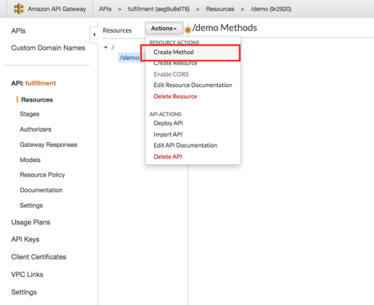

## Goal

- Understand how fulfillment system integrate with OnlineShop website
- Understand what is “event”
- Understand what is “event driven architecture”
- Understand Pros and Cons of Orchestration and Event Driven Architecture
- Have hands-on experience on building fulfillment system by leveraging AWS EventBridge and AWS Lambda

## Online Shop Website Integration

### Component Diagram


#### Step#1.

Search "API gateway" and build a REST API


API name: fulfillment


#### Step#2.

 Create Resource


#### Step#3.

Create Method




Action Name: StartExecution

Execution Role: the step-function role created in the last lesson


#### Step#4.

Permission config

IAM


```json
{
  "Version": "2012-10-17",
  "Statement": [
    {
      "Effect": "Allow",
      "Principal": {
        "Service": "states.amazonaws.com"
      },
      "Action": "sts:AssumeRole"
    },
    {
      "Sid": "",
      "Effect": "Allow",
      "Principal": {
        "Service": "apigateway.amazonaws.com"
      },
      "Action": "sts:AssumeRole"
    }
  ]
}
```


#### Step#5

Test


```json
{
   "input": "{\"paymentInstrumentType\":\"creditCard\"}",
   "stateMachineArn": "arn:aws:states:us-east-2:231418552723:stateMachine:demo"
}
```

JSON to string tool:https://tools.knowledgewalls.com/jsontostring


The work item invoked by API Gateway testing


#### Step#6.

Deploy


#### Step#7.

Test Alpha Stage

https://chrome.google.com/webstore/detail/postman/fhbjgbiflinjbdggehcddcbncdddomop/related?hl=en

注意： URL为API gateway的 end-point/demo - demo为resource name


OPEN Question： 如何让OnlineShop的网站调用这个Rest API？

### Event Driven Architecture

An event-driven architecture uses events to trigger and communicate between decoupled services and is common in modern applications built with microservices.

### What is an event?


An event can be defined as "**a significant change in** [**state**](https://en.wikipedia.org/wiki/State_(computer_science))".Events can either carry the state (the item purchased, its price, and a delivery address) or events can be identifiers (a notification that an order was shipped). 

For example, when a consumer purchases a car, the car's state changes from "for sale" to "sold". A car dealer's system architecture may treat this state change as an event whose occurrence can be made known to other applications within the architecture.

### How to interpret an event?


The publisher needs to communicate clearly without ambiguity (**if possible**) and it’s up to the subscriber to interpret and react.


#### Example


### Key takeaways:

1. No centralized Orchestration system which glues systems together.
2. [Pro] High throughput - ServiceC and ServiceD can listen to the same event bus(condition2 event bus) and execute simultaneously as ServiceD doesn’t rely on the output of ServiceC. There is no logical dependency between ServiceC and ServiceD.
3. [Pro] Fire and forget - Whenever there is a change in ServiceA internal status that external system may need to know, ServiceA publishes a message to corresponding event bus. ServiceA and its message subscriber are logically decoupled.
4. [Con] Losing sight when the architecture becomes complicated
5. [Con] Circular dependency risk
6. [Con] Hard to manage SLA and troubleshoot

#### AWS X-Ray

##### Orchestration VS Event Driven Architecture


|                              | Orchestration | Event Driven Architecture      |
| ---------------------------- | ------------- | ------------------------------ |
| Scalability / Sustainability | MEDIUM        | HIGH                           |
| Performance                  | MEDIUM        | HIGH                           |
| Maintainability              | HIGH          | MEDIUM                         |
| Misinterpretation risk       | MEDIUM        | LOW (fewer integration points) |

## Tiered Software Development Skill Sets (personal thoughts)


### Event Driven Architecture Demo - EventBridge


#### Step#1.

setup EventBridge rule


#### Step#2.

Permission config


#### Step#3 .

Let PaymentAuthorization send notification

AWS Lambda -> update your Lambda PaymentAuthorization

```json
import json
import boto3
import time
from datetime import datetime

def lambda_handler(event, context):
    if event.has_key('Input'):
        input = event['Input']
    else:
        raise Exception('invalid input')
    input['paymentAuthorized'] = input.has_key('paymentInstrumentType') and input['paymentInstrumentType'] == "creditCard"
    if not input['paymentAuthorized']:
        raise Exception('Payment Authorization Failed') 
    client = boto3.client('events')
    respond = client.put_events(
            Entries=[
        {
            'Time': datetime(2020, 2, 20),
            'Source': 'string',
            'Resources': ['arn:aws:events:us-east-2:231418552723:event-bus/default'],
            'DetailType': 'PaymentAuthorizationIsDone',
            'Detail': json.dumps(input),
            'EventBusName' : 'default'
        }
    ])
    return input
```

#### Step#4.

Testing


#### Step#5.

```json
{"detail":"$.detail"}
```

```json
{
 "Input" : <detail>
}
```


#### Step#6.

Add filtering


## Homework

1. Online Shop website & fulfillment system end to end integration **website -> API gateway**-> step functions

2. Watch videos:

3. 1. https://www.youtube.com/watch?v=TXh5oU_yo9M&feature=youtu.be
   2. https://www.youtube.com/watch?v=h46IquqjF3E&t=606s

4. What is the most important skill sets your target position requires?

5. How does your career growth planning fit this tiered software development skill set?

6. Should tech architecture aligns with team architecture or the way around?

## Q&A

**Q: Complexity of the project:**

A:

Tech side:

The Online Shop website is a typical MVC JavaEE implementation based on Spring, Hibernate frameworks. [You can add more for the website part]


Apart from the online shop website, the fulfillment system which is triggered after checkout is also considered in this project to make the OnlineShop work end to end.


I did an investigation on how to integrate multiple services including: payment services, 3rd party seller determination services, 3rd party seller fee calculation service and invoicing service. Based on AWS services, I evaluated Step Functions and EventBridge. And Step Functions was preferred because of higher maintainability and visibility. EventBridge would be better if more tools to be developed to address the maintainability and visibility issues. 


Business side:

A lot business questions need to be answered after when orders are placed:

1. What is the payment instrument? Is the receivable secured?
2. Is it sold by first party(1P) sellers or third party(3P) sellers?
3. If it’s sold by a 1P seller, what is the ShipFrom warehouse?
4. If it’s sold by a 3P seller, who will take care of fulfillment? The 3P seller or the onlineShop?
5. If it’s sold by a 3P seller, what is the fee to charge the 3P seller?
6. What are the required invoices to be generated?


**Q: How did you come to that conclusion?**

A:

1. Reading Orchestration vs Event Driven Architecture materials
2. Implemented demos with Step Functions and EventBridge


**Q: Could you tell me more about the demos you implemented?**

A:

[you can go through the logical flow and how you implemented the demo with Step Functions and Eventbridge]

Appendix

Reference

https://docs.aws.amazon.com/step-functions/latest/dg/tutorial-api-gateway.html

Filtering examples:

https://docs.aws.amazon.com/eventbridge/latest/userguide/filtering-examples-structure.html

https://boto3.amazonaws.com/v1/documentation/api/latest/reference/services/events.html#EventBridge.Client.put_events


Orchestration vs Event driven architecture

1. https://medium.com/capital-one-tech/microservices-when-to-react-vs-orchestrate-c6b18308a14c
2. https://blog.bernd-ruecker.com/how-to-tame-event-driven-microservices-5b30a6b98f86
3. https://www.oreilly.com/library/view/software-architecture-patterns/9781491971437/ch02.html
4. https://www.youtube.com/watch?v=h46IquqjF3E