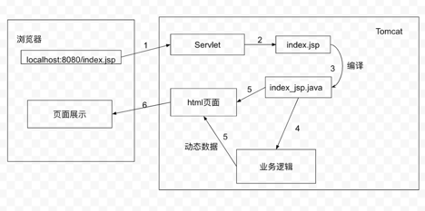
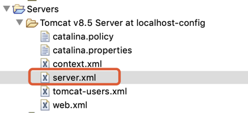
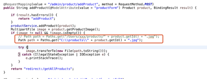

## What is the JSP?

JavaServer Pages (JSP) is a Java standard technology that enables you to write dynamic, data-driven pages for your Java web applications and it is built on top of the Java Servlet Specification(https://javaee.github.io/servlet-spec/

## Why do we use JSP?

What happens after you type an url in the browser?

```java
public class HelloWorld extends HttpServlet {
	private static final long serialVersionUID = 1L;

	public HelloWorld() {
		super();
		// TODO Auto-generated constructor stub
	}

	protected void doGet(HttpServletRequest request, HttpServletResponse response)
			throws ServletException, IOException {
		// TODO Auto-generated method stub
		response.setContentType("text/html");

		PrintWriter out = response.getWriter();
		out.println("<html>")
		out.println("<head>");
		out.println("<title>Hello World!</title>");
		out.println("</head>");
		out.println("<body>");
		out.println("<h1>Hello World!</h1>");
		out.println("</body>")
		out.println("</html>");
	}
}
```

缺点: 按这种方式, 要想拼接数据并完整输出一个html页面, 需要几百上千行的out.println().

我们的主要目的就是希望在最终输出的html的代码中嵌入后台数据. 除了把html语句拿出来放在Servlet里拼接好再输出这种方式外, 我们有没有可能直接在html语句中写入动态数据呢? 


## What does JSP look like?

```java
<%@ page language="java" contentType="text/html; charset=utf-8"
	pageEncoding="utf-8"%>
<!DOCTYPE html PUBLIC "-//W3C//DTD HTML 4.01 Transitional//EN" "https://www.w3.org/TR/html4/loose.dtd">
<html>
<head>
<title>First JSP</title>
</head>
<%@ page import="java.util.Date"%>
<body>
	<h3>Hi Stefan</h3>
	<br>
	<strong>Current Time is</strong>:
	<%=new Date()%>

</body>
</html>
```

Q: Does JSP belong to the frontend or backend technology? 

A: Backend


## JSP Workflow



1. 用户从浏览器发送一个http request
2. tomcat 的一个servlet拦截该请求并找到相应的jsp页面
3. Jsp文件会被编译成一个java class(该class本质上是一个servlet)
4. 调用后端业务逻辑取得数据
5. 将取得的数据和html markup拼接成html页面
6. 返回给浏览器


## How to write a JSP file

JSP在传统的网页HTML文件中插入JSP脚本(Scriptlet), JSP指令和JSP标签(tag), 从而形成JSP文件.

### JSP脚本

JSP脚本就是JSP页面中的java代码, 也叫做scriptlet. JSP脚本必须使用<%%>括起来, 不然会被当成是html.

- <%%>: 定义局部变量, 编写语句
- <%!%>: 定义类或方法
- <%=%>: 输出各种类型的变量, int、double、String、Object等.

```java
<%@ page language="java" contentType="text/html; charset=utf-8"
	pageEncoding="utf-8"%>
<!DOCTYPE html PUBLIC "-//W3C//DTD HTML 4.01 Transitional//EN" "https://www.w3.org/TR/html4/loose.dtd">
<html>
<head>
<title>First JSP</title>
</head>
<%! public int print(int a, int b) {
	return a + b;
} %>
<body>
	<% int a = 100;%>
	<% int b = 10;%>

	<br> The sum of a + b = <%=a + b%>
</body>
</html>
```

### JSP指令 

#### page指令: 

用来声明JSP页面的相关属性, 例如编码方式、文档类型.

import属性: 与java中的import 作用相同, 用于引入其他代码.

<%@ page import=*"java.util.Date"*%>


contentType属性: 定义网络文件的类型以及编码格式

<%@ page contentType=*"text/html; charset=*utf-8*" >*


errorPage属性: 当页面出现异常时, 则跳转到 errorPage指定页面。

<%@page errorPage="b.jsp"%>, 表示当前页面发生异常错误时, 自动跳转到 b.jsp


language属性: 定义在jsp页面中使用哪一种编程语言


#### include指令：

include指令用于在编译阶段包括一个文件. 这个指令告诉容器在编译阶段将其他外部文件的内容合并到当前JSP文件中. 可在JSP页面的任何位置使用include指令.

```java
<%@ include file=”xxx.jsp" %>
```

#### taglib指令：

JSP支持标签技术, 要使用标签技术就先得声明标签库和标签前缀. taglib指令就是用来指明JSP页面内使用标签库技术.

```java
<%@ taglib uri="http://java.sun.com/jsp/jstl/core" prefix="c" %>
```

https://www.runoob.com/jsp/jsp-directives.html

#### EL表达式

表达式语言(Expression Language, EL), EL表达式是用"${}"括起来的脚本, 用来更方便的读取对象.


语法:

${标识符}


home.jsp

```java
<%@ page language="java" contentType="text/html; charset=US-ASCII"
	pageEncoding="US-ASCII"%>
<!DOCTYPE html PUBLIC "-//W3C//DTD HTML 4.01 Transitional//EN" "https://www.w3.org/TR/html4/loose.dtd">
<html>
<head>
<meta http-equiv="Content-Type" content="text/html; charset=US-ASCII">
<title>First JSP</title>
</head>
<body>
	<%
		session.setAttribute("name", "stefan");
	%>

	<jsp:forward page="display.jsp" />
</body>
</html>
```

display.jsp

```java
<%@ page language="java" contentType="text/html; charset=UTF-8"
	pageEncoding="UTF-8"%>
<!DOCTYPE html>
<html>
<head>
<meta charset="UTF-8">
<title>Insert title here</title>
</head>
<body>
	${name}
</body>
</html>
```

EL表达式支持简单的运算符: 加减乘除取摸, 逻辑运算符. empty运算符(判断是否为null), 三目运算符.

### JSP标签

JSTL全称为 JSP Standard Tag Library 即JSP标准标签库. JSTL作为最基本的标签库, 提供了一系列的JSP标签, 实现了基本的功能: 集合的遍历、数据的输出、字符串的处理、数据的格式化等等.core标签库是JSTL的核心标签库, 前缀一般是c.

#### 为什么要使用JSTL

1. EL表达式相对比较局限, 它不能遍历集合, 做逻辑的控制, 这时需要JSTL的支持.

2. Scriptlet的可读性, 维护性, 重用性都十分差. JSTL与HTML代码十分类似, 遵循着XML标签语法, 使用JSTL让JSP页面显得整洁, 可读性非常好, 重用性非常高, 可以完成复杂的功能.

   

<c:if>标签. 判断表达式的值, 如果表达式的值为 true 则执行其主体内容, test属性是不可或缺的

```java
语法:
<c:if test="${...}">
```

<c:forEach>为循环标签, 相当于Java中的while和for.

```java
<c:forEach var="list" items="${list}" >
        ${list}<br>
</c:forEach>
```

<c:url>标签将URL格式化为一个字符串，然后存储在一个变量中. var属性用于存储格式化后的URL.

```java
<c:url value="display.jsp" var="url">
</c:url>
<a href="${url}">我经过了URL地址重写！</a>
```

https://www.runoob.com/jsp/jsp-jstl.html


## Why do we not use JSP now?

1. 动态资源和静态资源全部耦合在一起, 无法做到真正的动静分离. 服务器压力大, 因为服务器会收到各种http请求, 例如css的http请求, js的, 图片的, 动态代码的等等. 一旦服务器出现问题, 用户将无法访问网站.
2. 前端工程师做好html后, 需要由java工程师来将html修改成jsp页面, 出错率较高(因为页面中经常会出现大量的js代码), 修改问题时需要双方协同开发, 效率低下.
3. jsp必须要在支持java的web服务器里运行(例如tomcat等), 性能不高.
4. 每次请求jsp都是访问servlet再用输出流输出html页面, 效率没有直接使用html高.
5. 如果jsp中的内容很多, 页面响应会很慢, 因为是同步加载.

## How do we decouple the frontend and backend now?

1. 浏览器发送请求
2. web服务器集群(nginx)
3. html页面负责调用服务端接口产生数据(通过ajax等等, 后台返回json格式数据)
4. 填充html, 展现动态效果, 在页面上进行解析并操作DOM.

### Summary

并发浏览器请求 -> web服务器集群(nginx) -> 应用服务器集群(tomcat) -> 文件/数据库/缓存/消息队列服务器集群


### What’s the benefits of decoupling frontend and backend?

1. 前端/WEB服务器(nginx)存放的是html, css, js, 图片等一系列静态资源, 前端页面异步调用后端的接口, 后端/应用服务器(tomcat) 提供请求所需要的数据, 加快整体响应速度.
2. 减少后端服务器的并发/ 负载压力. 除了接口以外的其他所有http请求全部转移到前端nginx上, 接口的请求调用tomcat. 且除了第一次页面请求外, 浏览器会大量调用本地缓存.
3. 在大并发情况下, 可以同时水平扩展前后端服务器.
4. 增加代码的维护性&易读性(前后端耦在一起的代码读起来相当费劲), 提升开发效率，因为可以前后端并行开发.


#### JSP页面图片img路径配置

https://blog.csdn.net/YuanMxy/article/details/78644378

1. 在本地电脑上创建一个新的文件夹
   * 如果是Windows, 在C盘下创建一个文件夹products, 路径C:\products
   * 如果是mac, 在你的home directory下创建一个products, 路径 /Users/xxx/products, replace “xxx” with your own name

2. 在server.xml里添加

   


把红色部分换成你自己的路径

```java
<Context docBase="/Users/xxx/products" path="/products" reloadable="true" />
```

3. 更新ProductController里 addProduct和deleteProduct方法里的path. 记得在最后加上'/'



