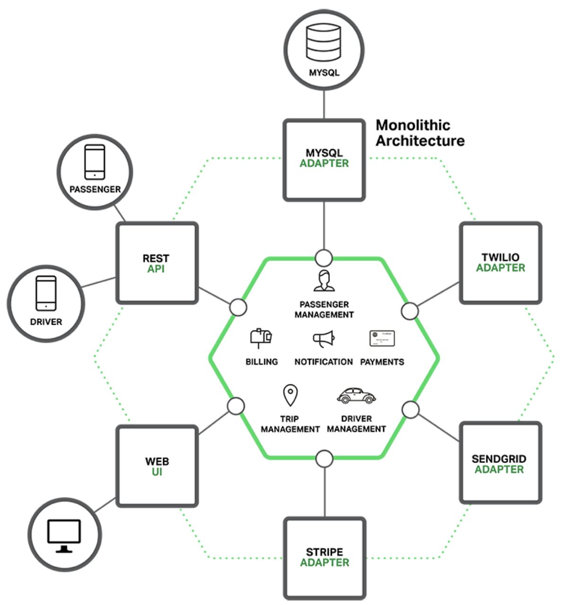
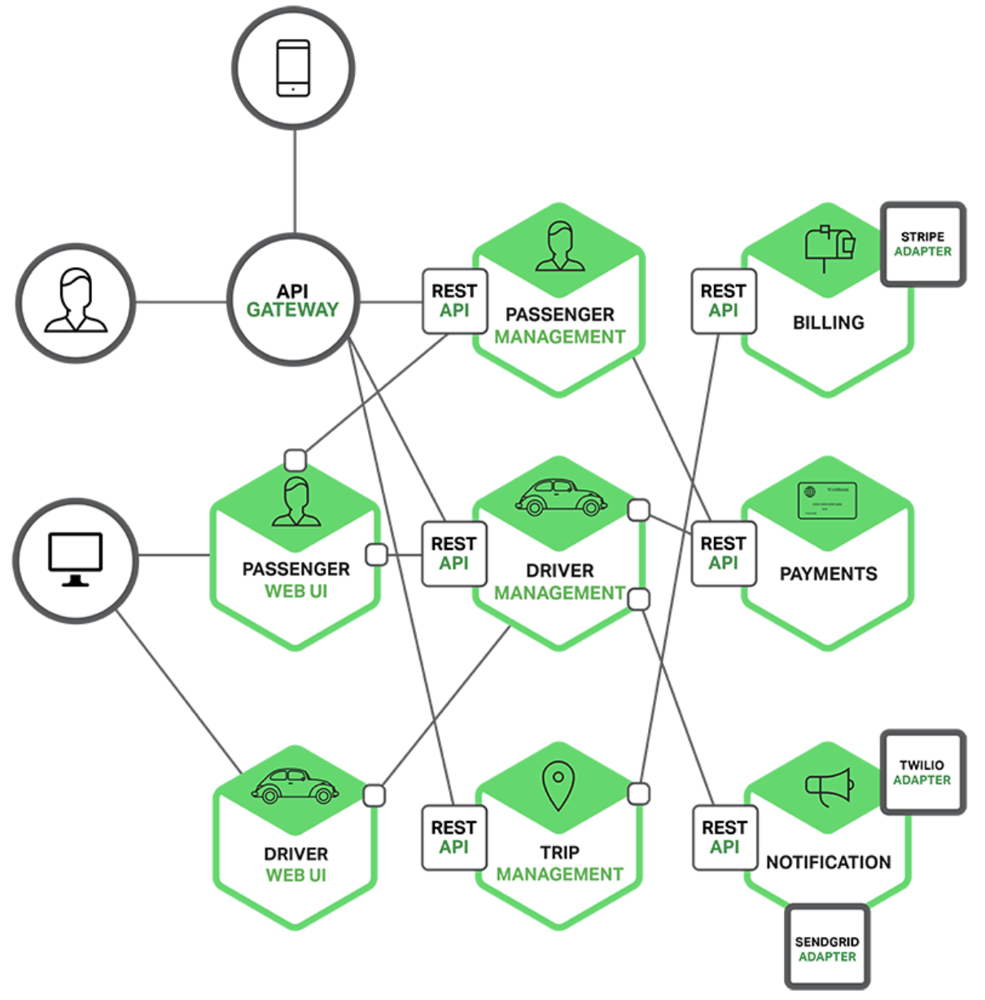
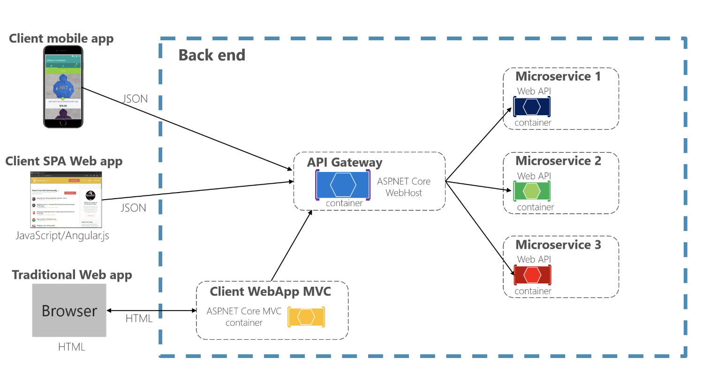
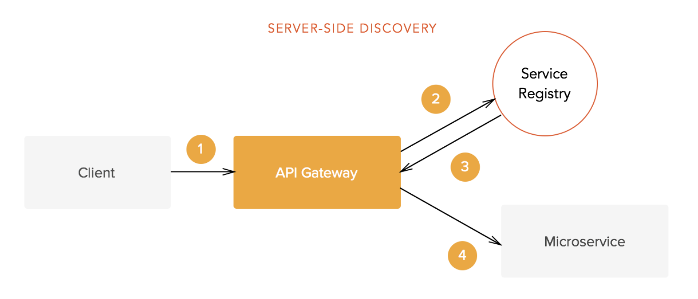
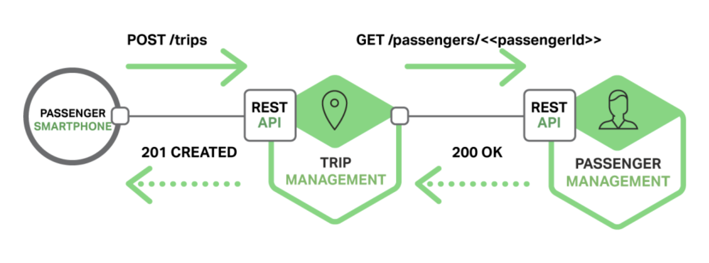
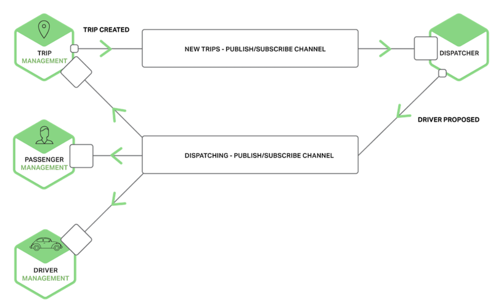
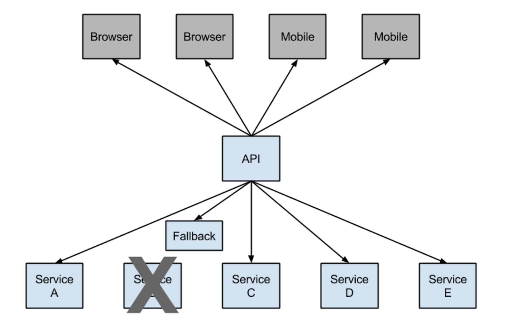
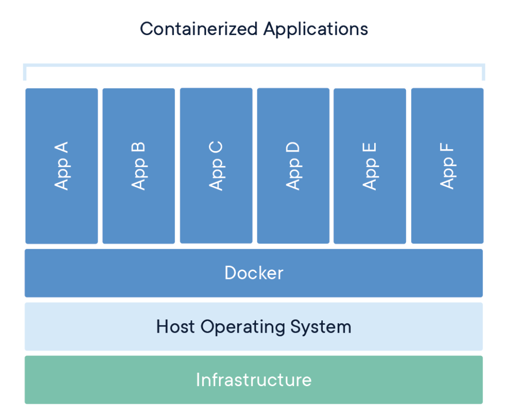

## What is the Spring framework?
Spring framework is an open source development framework for Enterprise Java. The core features of the Spring Framework can be used in developing any Java application, but there are extensions for building web applications on top of the Java EE platform.


## What is the spring ioc container?

The Spring IoC is responsible for creating the objects, managing and wiring them together, configuring them, and also managing their complete lifecycle.


## What is the inversion of control/Dependency Injection in Spring?

控制反转是相对于正向而言的，那么什么算是正向的呢？考虑一下常规情况下的应用程序，如果要在A里面使用B，你会怎么做呢？当然是直接去创建B的对象，也就是说，是在A类中主动去获取所需要的外部资源B，这种情况被称为正向的。那么什么是反向呢？就是A类不再主动去获取B，而是被动等待，等待IoC的容器获取一个B的实例，然后反向的注入到A类中.


## What are Spring bean & scopes?

The Spring **beans** are java objects that are instantiated, assembled, and managed by the Spring IoC container.

In **singleton** scope, it defines a class only has one single instance in Spring IoC container.

In **prototype** scope, it defines a class that has any number of object instances in Spring loc container.


## How do you provide configuration metadata to the Spring Container?

XML based configuration file

Annotation-based configuration: @Component

Java-based configuration


## What is Spring Java-Based Configuration?

Java based configuration enables you to write most of you Spring configuration without XML but with the help of few Java-based annotations.

Example is the @Bean annotated method that will return an object that should be registered as a bean in the Spring container.


## Differentiate @Component, @Repository and @Service and @Controller

Typically a web application is developed in layers like the controller (which is the initial point of client communication), bussiness (where the actual code or logic of the application is written) and DAO (where the database connections and interaction happens). In such an architecture web application, @Component can be used in any of the layers. Whereas, the @Controller is used in the controller/web layer. @Service is used in the business layer and @Repository is used in the DAO layer.


## What is @Autowired?

The @Autowired annotation  can be used with fields or methods for injecting a bean by type.


## What are the benefits of using Spring?

1. It gives good support for IoC and Dependency Injection results in loose coupling.
2. It facilitates good programming practice such as programming using interfaces instead of classes.


## What is the Spring MVC framework?

Spring comes with a full-featured MVC framework for building web applications. Spring’s MVC framework uses IoC to provide a clean separation of controller logic from business objects.


## DispatcherServlet

The Spring Web MVC framework is designed around a DispatcherServlet that handles all the HTTP requests and responses.


## What is Controller in Spring MVC framework?

Controller handles navigation logic and transfer to service layer


## @Controller annotation

The @Controller annotation indicates that a particular class serves the role of a controller. Spring does not require you to extend any controller base class or reference the Servlet API.


## @RequestMapping annotation

@RequestMapping annotation is used to map a URL to either an entire class or a particular handler method.


## @PathVariable/@RequestParam annotation

We can use the @PathVariable annotation as a handler method parameter in order to extract the value of a URI template variable.


```
For example, if we want to fetch a user by id from the www.xxx.com/user/123, we should map our method in the controller as /user/{id}:

/user/1
@RequestMapping("/user/{id}")
public String handleRequest(@PathVariable("id") String userId) {}

/user?id=1
@RequestMapping("/user")
public String handleRequest(@RequestParam("id") String userId) {}

```

## What is ModelAndView?

**ModelAndView** contains the view name and model, it allows us to pass all the information required by Spring MVC in one return.


# Microservices

## What is monolithic?

In software engineering, a monolithic application describes a single-tiered software application in which the user interface and data access code are combined into a single program.

优点：

* 开发简单直接，集中式管理
* 功能都在本地，没有分布式的管理开销和调用开销

缺点：

* 构建时间长，任何小修改必须重新构建整个项目，这个过程往往很长。
* 一个微不足道的小问题，可以导致整个应用挂掉。
* 无法满足高并发情况下的业务需求：单体应用只能作为一个整体进行扩展，无法根据业务模块的需要进行伸缩。例如，应用中有的模块是计算密集型的，它需要强劲的CPU；有的模块则是IO密集型的，需要更大的内存。由于这些模块部署在一起，不得不在硬件的选择上作出妥协。



## What is microservice?

The microservice architectural style is an approach to devloping a single application as **a suite of small services,** each running in its own process and communicating with lightweight mechanisms, often a HTTP resource API. These services are built around business capabilities and independently deployable by fully automated deployment machinery.

* 一系列独立的服务共同组成系统
* 单独部署，跑在自己的进程里
* 每个服务为单独的业务开发



## How to compose microservices?

## How client intearact with it: 

**API Gateway:**(Spring cloud Gateway)



**Service discovery:** Zookeeper, Spring Cloud eureka



**Communication in microservices:** 

Synchronous: RESTful, RPC(Dubbo)



Asynchronous: Kafka



**Falut tolerance:** Circuit breaker(Netflix hystrix)



**Service deployment:** Docker



## Advantages and disadvantages of microservices?

优点：

* 服务独立无依赖
* 独立按需扩展
* 可用性高

缺点：

* 服务间通信成本
* 数据一致性
* 多服务运维难度
* 系统集成测试

https://medium.com/pixelpoint/microservices-vs-monolith-architecture-c7e43455994f