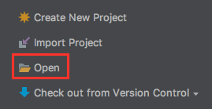
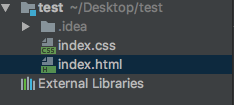
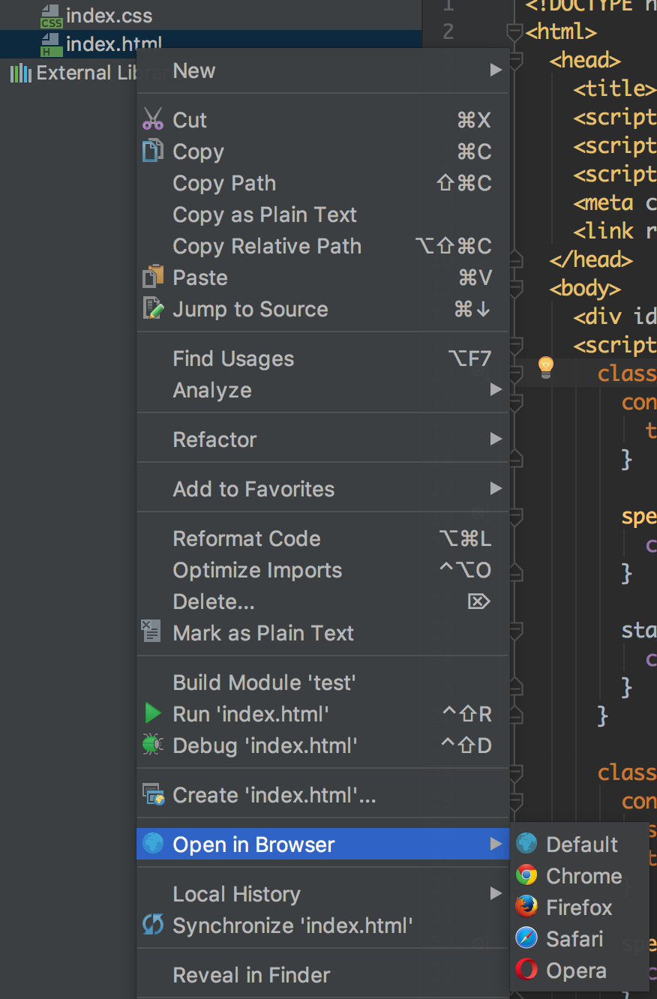

# Introduction

ECMAScript is the scripting language standardized by ECMA International in the ECMA-262 specification and ISO/IEC 16262. The language is widely used for client-side scripting on the web, in the form of several well-known dialects such as JavaScript, JScript, and ActionScript.

ECMAScript 6, also known as ECMAScript 2015, is the latest version of the ECMAScript standard. ES6 is a significant update to the language, and the first update to the language since ES5 was standardized in 2009. Implementation of these features in major JavaScript engines is [underway now](http://kangax.github.io/es5-compat-table/es6/).

Babel  https://babeljs.io/

Full list of ES6 feature examples http://es6-features.org/


See the [ES6 standard](http://www.ecma-international.org/ecma-262/6.0/) for full specification of the ECMAScript 6 language.

Can I Use https://caniuse.com/


## Standalone Starter Set Up

Create a test folder at the directory of your preference, add 2 files index.html and index.css

```bash
mkdir test
cd test
touch index.html
touch index.css
```

Open Intellij, select "Open" and then find the test folder you just created



You will end up with a project in Intellij like below:



Copy the content below to index.html

```html
<!DOCTYPE html>
<html>
<head>
 <meta charset="UTF-8">
 <title>Test</title>
 <script src="https://cdnjs.cloudflare.com/ajax/libs/react/15.4.2/react.js"></script>
 <script src="https://cdnjs.cloudflare.com/ajax/libs/react/15.4.2/react-dom.js"></script>
 <script src="https://cdnjs.cloudflare.com/ajax/libs/babel-standalone/6.21.1/babel.min.js"></script>
 <link rel="stylesheet" href="index.css">
</head>
<body>
 <div id="root"></div>
 <script type="text/babel">
   // ES6 / React / JSX code from here
 </script>
</body>
</html>
```

****

## Let + Const

Block-scoped binding constructs. **let** is the new **var**. **const** is single-assignment. Static restrictions prevent use before assignment.

```javascript
function ex1_var() {
 if (true) {
   var a = 2;
 }
 console.log(a); // 2
}
function ex1_let() {
 if (true) {
   let a = 2;
 }
 console.log(a); // undefined
}

function ex2_var() {
 for (var i = 0; i < 10; i++) {
   console.log(i); // 0 - 9
 }
 console.log(i); // 10
}
function ex2_let() {
 for (let i = 0; i < 10; i++) {
   console.log(i);
 }
 console.log(i); // undefined
}

function ex3() {
 const a = 1;
 a = 2; // error: a is read only
}
```

## Template Strings

Template strings provide syntatic sugar for constructing strings. This is similar to string interpolation features in Perl, Python and more.

```javascript
function ex1() {
 const firstName = 'John';
 const lastName = 'Doe';
 const fullName = `${firstName} ${lastName}`;
 console.log(fullName); // John Doe
}

function ex2() {
 const str = `multiple line
string`;
 console.log(str); // multiple line
                   // string
}
```

More info: [MDN Template Strings](https://developer.mozilla.org/en-US/docs/Web/JavaScript/Reference/template_strings)

## Enhanced Object Properties

ECMAScript 6 makes declaring object literals even more succinct by providing shorthand syntaxx for **initializing properties from variables** and **defining function methods.** It also enables the ability to have **computed property keys** in an object literal definition.

```javascript
function getCar(make, model, price) {
 return {
   make: make,
   model: model,
   price: price,
 };
}
console.log(getCar('BMW', 'X5', 60000));

function getCar2(make, model, price) {
 return {
   make,
   model,
   price,
 };
}
console.log(getCar2('BMW', 'X5', 60000));

function getCar3(make, model, price) {
 return {
   make,
   model,
   price,
   [`madeBy${make}`]: true,
 };
}
console.log(getCar3('BMW', 'X5', 60000));

function getCar4(make, model, price) {
 return {
   make,
   model,
   price,
   [`madeBy${make}`]: true,
   depreciate() { this.price -= 1000; }
 };
}

const car = getCar4('BMW', 'X5', 60000)
car.depreciate();
console.log(car);
```

## Default + Rest + Spread

Callee-evaluated default parameter values. Turn an array into consecutive arguments in a function call. Bind trailing parameters to an array. Rest replaces the need for **arguments** and addresses common cases more directly.


## Default + Rest Parameter

```javascript
// y is 12 if not passed (or passed as undefined)
function f(x, y=12) {
 return x + y;
}
f(3)

// y is an Array
function f(x, ...y) {
 return x * y.length;
}
f(3, "hello", true)
```

## Spread Operator

```javascript
// spread array ex1
const arr1 = [1, 2, 3];
const arr2 = [4, 5, 6];
const arr = [...arr1, ...arr2];
console.log(arr); // [1, 2, 3, 4, 5, 6]

// spread array ex2
const arr = [1, 2, 3, 4];
const arr1 = [5, 6, 7, 8];
const arr2 = [...arr, 111, 222, ...arr1];
console.log(arr2); // [1, 2, 3, 4, 111, 222, 5, 6, 7, 8]

// spread object ex1
const desc1 = {
 name: 'richard',
 age: 20,
}
const desc2 = {
 job: 'software engineer',
 from: 'china',
}
const person = {...desc1, ...desc2, other: 'other'};
console.log(person);

// spread object ex2
const obj1 = {a: 1, b: 2};
const obj2 = {...obj1, c: 3};
console.log(obj2); // {a: 1, b: 2, c: 3}

// pass each elem of array as argument
const f = function(x, y, z) {
 return x + y + z;
};
const arr = [1, 2, 3];
console.log(f(...arr)); // 6
console.log(f(...[1,2,3])) // 6
```

More MDN info: [Default parameters](https://developer.mozilla.org/en-US/docs/Web/JavaScript/Reference/Functions/Default_parameters), [Rest parameters](https://developer.mozilla.org/en-US/docs/Web/JavaScript/Reference/Functions/rest_parameters), [Spread Operator](https://developer.mozilla.org/en-US/docs/Web/JavaScript/Reference/Operators/Spread_operator)

## Destructuring

Destructuring allows binding using pattern matching, with support for matching arrays and objects. Destructuring is fail-soft, similar to standard object lookup **foo["bar"]**, producing **undefined** values when not found.

```javascript
// list matching
let a, b, rest;
[a, ,b] = [1,2,3];
console.log(a); // 1
console.log(b); // 3

[a, b, ...rest] = [10, 20, 30, 40, 50];
console.log(a); // 10
console.log(b); // 20
console.log(rest); // [30, 40, 50]


// object destructuring
let { a, b } = { a: 10, b: 20 };
console.log(a); // 10
console.log(b); // 20

// Reassignment
let { a: c, b: d } = { a: 10, b: 20 };
console.log(c); // 10
console.log(d); // 20

let { x, y, ...z } = { x: 1, y: 2, a: 3, b: 4 };
console.log(z) // {a: 3, b: 4}

// Can be used in parameter
function g({name}) {
  console.log(name);
}
// renaming
function g1({name: x}) {
  console.log(x);
}
g({name: 5}) // 5
g1({name: 5}) // 5
```

More info: [MDN Destructuring assignment](https://developer.mozilla.org/en-US/docs/Web/JavaScript/Reference/Operators/Destructuring_assignment)

## Arrows and Lexical ’this'

Arrows are a function shorthand using the => syntax. They are syntactically similar to the related feature in C#, Java 8 and CoffeeScript. They support both statement block bodies as well as expression bodies which return the value of the expression. Unlike normal functions, **arrows functions share the same lexical this as their surrounding code.**


## Arrow Function

```javascript
// add, add1, add2 are equivalent
const add = function(a, b) {
 return a + b;
}

const add1 = (a, b) => {
 return a + b;
}

const add2 = (a, b) => a + b;

// double, double1, double2, double3 are equivalent
const arr = [1, 2, 3, 4];
const double = arr.map(function(n) {
 return n * 2;
});

const double1 = arr.map((n) => {
 return n * 2
});

const double2 = arr.map((n) => n * 2);
const double3 = arr.map(n => n * 2);
```

## Lexical ’this'

```javascript
const person = {
 name: 'John',
 likes: ['apple', 'banana', 'orange'],
 sayName: function() {
   console.log(`My name is ${this.name}`);
 },
 sayName1() {
   console.log(`My name is ${this.name}`);
 },
 sayLikes() {
   this.likes.forEach(function(like) {
     console.log(`${this.name} like ${like}`);
   });
 },
 sayLikes1() {
   let self = this;
   this.likes.forEach(function(like) {
     console.log(`${self.name} like ${like}`);
   });
 },
 sayLikes2() {
   this.likes.forEach((like) => {
     console.log(`${this.name} like ${like}`);
   });
 }
}

person.sayName(); 
person.sayName1();
person.sayLikes();
person.sayLikes1();
person.sayLikes2();
```

More info: [MDN Arrow Functions](https://developer.mozilla.org/en/docs/Web/JavaScript/Reference/Functions/Arrow_functions)

## Classes

**ES6 classes are a simple sugar over the prototype-based OO patern.** Having a single convenient declarative form makes class patterns easier to use, and encourages interoperability. Classes support prototype-based inheritance, super calls, instance and static methids and constructors.

```javascript
class Animal { 
  constructor(name) {
    this.name = name;
  }
  
  speak() {
    console.log(this.name + ' makes a noise.');
  }
  
  static walk() {
    console.log('walk');
  }
}

class Dog extends Animal {
  constructor(name, age) {
    super(name);
    this.age = age;
  }
  
  speak() {
    console.log(this.name + ' barks at age ' + this.age);
  }
}

const d = new Dog('Mitzie', 10);
d.speak(); // Mitzie barks.
Dog.walk(); // walk
Animal.walk(); // walk
d.walk(); // d.walk is not a function 
```

More info: [MDN Classes](https://developer.mozilla.org/en/docs/Web/JavaScript/Reference/Classes)