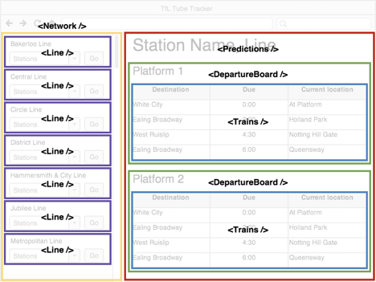
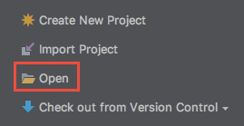
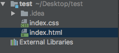
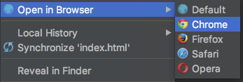
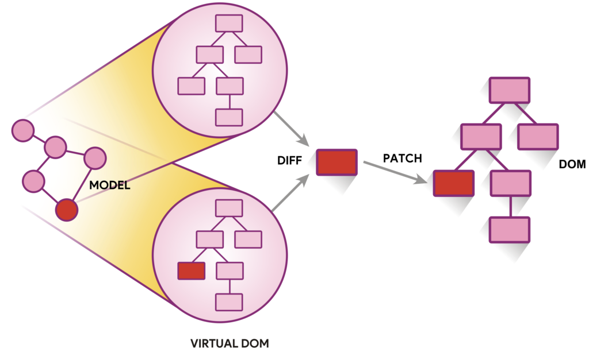
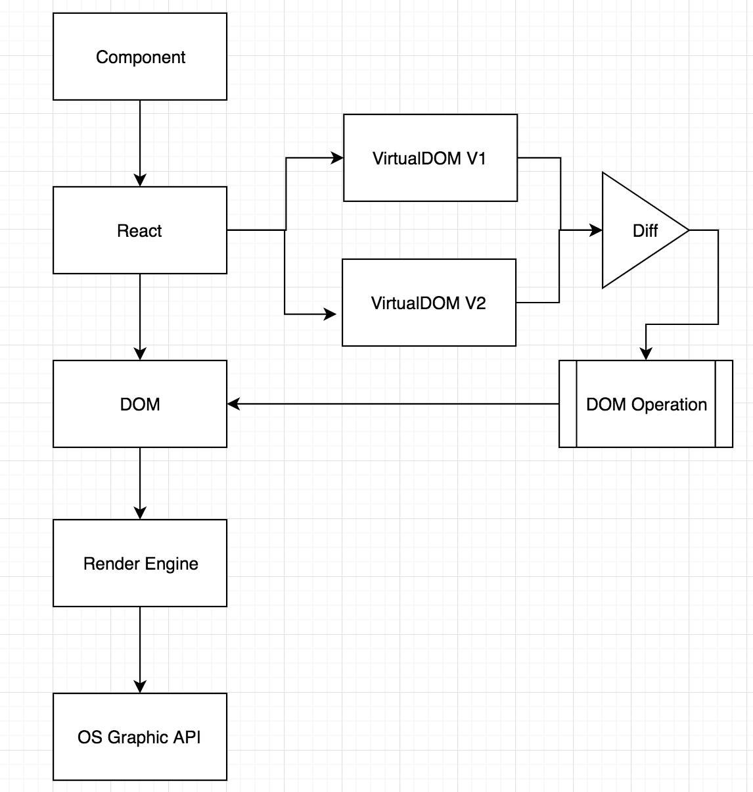

# Introduction to React


**React** is a JavaScript library for building **user interfaces**. It is maintained by **Facebook**, **Instagram** and a community of individual developers and corporations It aims primarily to provide speed, simplicity, and scalability. React was created by **Jordan Walke**, a software engineer at Facebook. It was first deployed on Facebook's newsfeed in 2011 and later on Instagram.com in 2012. It was open-sourced at JSConf US in May 2013.

### Component-Based


Build encapsulated components that manage their own state, then compose them to make complex UIs. Since component logic is written in JavaScript instead of templates, you can easily pass rich data through your app and keep state out of the DOM.


### Declaritive



React makes it painless to create interactive UIs. Design simple views for each state in your application, and React will efficiently update and render just the right components when your data changes. Declarative views make your code more predictable and easier to debug.

### Learn Once, Write Anywhere


We don’t make assumptions about the rest of your technology stack, so you can develop new features in React without rewriting existing code. React can also render on the server using Node and power mobile apps using React Native.

#### Standalone Starter Set Up

Create a test folder at the directory of your preference, add 2 files index.html and index.css

```bash
mkdir test
cd test
touch index.html
touch index.css
```

**Download Intellij Idea Ultimate**

[Download Link](https://www.jetbrains.com/idea/download/#section=mac)

Open Intellij, select "Open" and then find the test folder you just created



You will end up with a project in intellij like below:



Copy the content below to index.html

```html
<!DOCTYPE html>
<html>
<head>
 <title>Test</title>
 <script src="https://cdnjs.cloudflare.com/ajax/libs/react/15.4.2/react.js"></script>
 <script src="https://cdnjs.cloudflare.com/ajax/libs/react/15.4.2/react-dom.js"></script>
 <script src="https://cdnjs.cloudflare.com/ajax/libs/babel-standalone/6.21.1/babel.min.js"></script>
 <link rel="stylesheet" href="./index.css">
 <meta charset="utf-8" />
</head>
<body>
 <div id="root"></div>
 <script type="text/babel">
   // ES6 / React / JSX code from here
 </script>
</body>
</html>
```

Finally, **right click on index.html**, select "Open in Browser" then select "Chrome". You should see a blank browser tab lauched.



You may notice that you are visiting some URL like below


This address is pointing to a simple http server intellij create for conveniently serving html.


### **Component & Props**

**Component** let you split the UI into **independent**, **reusable** pieces, and think about each piece in isolation. Conceptually, components are like JavaScript **functions**. They accept arbitrary inputs (called “**props**”) and return React elements describing what should appear on the screen.

### **Functional and Class Components**

The simplest way to define a component is to write a JavaScript function:

```java
function Welcome(props) { 
  return <h1>Hello, {props.name}</h1>; 
}
```

This function is a valid React component because it accepts a single “props” (which stands for properties) object argument with data and returns a React element. We call such components “functional” because they are literally JavaScript functions. 

You can also use an ES6 class to define a component:

```java
class Welcome extends React.Component {
  render() {
    return <h1>Hello, {this.props.name}</h1>;
  }
}
```

### Rendering a Component

When React sees an element representing a user-defined component, it passes JSX attributes to this component as a single object. We call this object **“props”**. For example, this code renders “Hello, Sara” on the page:

```javascript
function Welcome(props) {
  return; <h1>Hello, {props.name}</h1>;
}

const element =; <Welcome; name="Sara" />;
ReactDOM.render(
  element,
  document.getElementById('root')
);
```

Let’s recap what happens in this example: 

* We call ReactDOM.render() with the <Welcome name="Sara" /> element. 
* React calls the Welcome component with {name: 'Sara'} as the props. 
* Our Welcome component returns a <h1>Hello, Sara</h1> element as the result. 
* React DOM efficiently updates the DOM to match <h1>Hello, Sara</h1>.

### JSX in Depth

Consider this variable declaration:

```javascript
const element =; <h1>Hello, world;!</h1>;
```

This funny tag syntax is neither a string nor HTML. It is called **JSX**, and it is a syntax extension to JavaScript. We recommend using it with React to describe what the UI should look like. JSX may remind you of a template language, but it comes with the full power of JavaScript.

JSX produces React “elements”. To render this react element:

```javascript
ReactDOM.render(element, document.getElementById('root'));
```

### JSX Represents Objects

Babel compiles JSX down to React.createElement() calls. These two examples are identical:

```javascript
const element =; <h1; className="greeting">Hello, world;!</h1>;
```

```javascript
const element = React.createElement(
 'h1',
 {className: 'greeting'},
 'Hello, world!'
);
```

React.createElement essentially it creates an object like this:

```javascript
const element = {
  type: 'h1',
  props: {
    className: 'greeting',
    children: 'Hello, world'
  }
};
```

These objects are called “React elements”. You can think of them as descriptions of what you want to see on the screen. React reads these objects and uses them to construct the DOM and keep it up to date.

#### Embedding Expressions in JSX

You can embed any JavaScript expression in JSX by wrapping it in **curly braces.**

```javascript
function formatName(user) {
 return user.firstName + ' ' + user.lastName;
}

const user = {
 firstName: 'Harper',
 lastName: 'Perez'
};

const element = (
 <h1>
   Hello, {formatName;(user);}!
 </h1>;
)

ReactDOM.render(
 element,
 document.getElementById('root')
);
```

#### JSX is an Expression Too

After compilation, JSX expressions become regular JavaScript function calls and evaluate to JavaScript objects. This means that you can use JSX inside of **if** statements and **for** loops, assign it to **variables**, accept it as **arguments**, and **return** it from functions:

```javascript
function getGreeting(user) {
 if (user) {
   return; <h1>Hello, {formatName(user)};!</h1>;
 }
 return; <h1>Hello, Stranger.</h1>;
}

const element1 = getGreeting();
ReactDOM.render(element1, document.getElementById('root'));
```

#### Inline Style

```javascript
const divStyle = { color: 'blue' };
const element =; <div; style={divStyle}>Hello; World;!</div>;
```

#### Boolean, Null, and Undefined Are Ignored

false, null, undefined, and true are valid children. They simply don’t render. These JSX expressions will all render to the same thing:

```javascript
<div />
<div></div>
<div>{false}</div>
<div>{null}</div>
<div>{undefined}</div>
<div>{true}</div>
```

#### Virtual DOM

##### DOM

DOM stands for *Document Object Model* which is an abstraction of a structured text. For web developers, this text is HTML, and the DOM is simply called HTML DOM. Elements of HTML become nodes in the DOM. So, while HTML is a text, the DOM is an in-memory representation of this text.

The HTML DOM provides an interface (API) to traverse and modify the nodes. It contains methods like **getElementById, .innerHTML** and **createElement**.


##### Virtual DOM

When a change occurs, a new virtual DOM is created from scratch. That new virtual DOM will reflect the new state of the data model. React now has two virtual DOM data structures at hand: The new one and the old one. It then runs a **diffing algorithm** on the two virtual DOMs, to get the **set of changes between** them. Those changes, and only those changes, are applied to the real DOM: This element was added, this attribute's value changed, etc. Every node in React’s Virtual DOM tree is a **ReactElement**.



****

#### Component Props are Read-Only

Whether you declare a component as a function or a class, it must never modify its own props. Consider this sum function:

```javascript
function sum(a, b) {
  return a + b;
}
```

Such functions are called “pure” because they do not attempt to change their inputs, and always return the same result for the same inputs. 

In contrast, this function is impure because it changes its own input:

```javascript
function withdraw(account, amount) {
  account.total -= amount;
}
```

React is pretty flexible but it has a single strict rule:

**All React components must act like pure functions with respect to their props.** 

Of course, application UIs are dynamic and change over time. In the next section, we will introduce a new concept of “state”. State allows React components to change their output over time in response to user actions, network responses, and anything else, without violating this rule.

##### Conditional Rendering

```javascript
// conditional rendering
function TodoList4(props) {
 return (
   <ul>
     {props.todos && props.todos.length > 0 ?
       props.todos.map((message, index) => <Item key={index} message={message}; />);
     : 'Nothing todo!!!'}
   </ul>;
 )
}
ReactDOM.render(<TodoList4; todos={[]};/>, document.getElementById('root'));
```

##### Loop Generation

```javascript
function Item(props) {
 return; <li>{props.message}</li>;
}
// hardcode
function TodoList1() {
 return (
   <ul>
     <Item; message="first task"/>
     <Item; message="second task"/>
     <Item; message="third task"/>
   </ul>;
 )
}
ReactDOM.render(<TodoList1/>, document.getElementById('root');)

// loop insert, imperative
function TodoList2(props) {
 let todoItems = [];
 for (let i = 0; i < props.todos.length; i++) {
   todoItems.push(<Item; key={i}; message={props.todos[i]};/>);
 }
 return; <ul>{todoItems}</ul>;
}
const data = ['first task', 'second task', 'third task'];
ReactDOM.render(<TodoList2; todos={data};/>, document.getElementById('root'));

// use map, declaritive
function TodoList3(props) {
 return (
   <ul>
     {props.todos.map((message, index) => <Item key={index} message={message}; />)}
   </ul>;
 )
}
const data = ['first task', 'second task', 'third task'];
ReactDOM.render(<TodoList3; todos={data}/>, document.getElementById('root'));;

function TodoList4(props) {
 return (
   <ul>
     {props.todos.map((message, index) => <Item key={message} message={message}; />)}
   </ul>;
 )
}
const data1 = ['first task', 'second task', 'third task'];
const data2 = ['original task', 'first task', 'second task', 'third task'];
let useData1 = true;
function test() {
 const finalData = useData1 ? data1 : data2;
 useData1 = !useData1;
 ReactDOM.render(<TodoList4; todos={finalData};/>, document.getElementById('root'));
}
setInterval(test, 1000);
```

**Keys** help React identify which items have changed, are added, or are removed. Keys should be given to the elements inside the array to give the elements a stable identity.