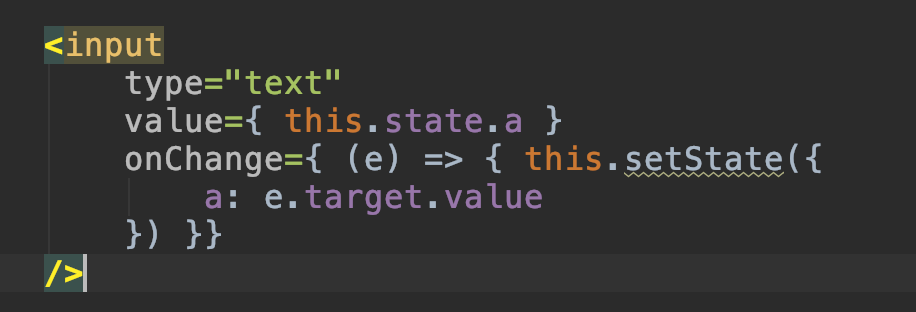

## 1. State

What is state? How to use state?

```javascript
class App extends React.Component{
   constructor() {
       super();
       // 1. add state
       this.state = {
           a : 20
       }
   }

   render() {
       return (
           // 2. use state
           <div>
               <div>
                   <button; onClick={
                       (); => {this.setState({a : this.state.a+10})}
                   }>click; me</button>
                   <button; onClick={this.change.bind(this, 10)}>click; me</button>;
                   {this.state.a}
               </div>
           </div>;
       )
   }

   change(arg) {
       this.setState({a : 999})
   }
}

ReactDOM.render(
 <App/>,
 document.getElementById('root');
)
```

## 2. What does setState do?

setState() schedules an update to a component’s state object. When state changes, the component responds by re-rendering.

## 3. Handling Events

Handling events with React elements is very similar to handling events on DOM elements. There are some syntactic differences:

* React events are named using camelCase, rather than lowercase.
* With JSX you pass a function as the event handler, rather than a string.

For example, the HTML:

```javascript
<button; onclick="clickFn()">
  Click; me
</button>
```

is slightly different in React:

```javascript
<button; onClick={clickFn}>
  Click; me
</button>
```

How to write event handling function in React:

```javascript
<button; onClick={this.handleClick.bind(this, 10)}>click; me</button>;

Or

<button; onClick={ (); => {this.handClick() }}>click; me</button>
```

You have to be careful about the meaning of this in JSX callbacks. In JavaScript, class methods are not bound by default. If you forget to bind this.handleClick and pass it to onClick, this will be undefined when the function is actually called.

This is not React-specific behavior; it is a part of how functions work in JavaScript. Generally, if you refer to a method without () after it, such as onClick={this.handleClick}, you should bind that method.

If calling bind annoys you, you can use arrow-function in the callback.

#### Passing Arguments to Event Handler

Inside a loop it is common to want to pass an extra parameter to an event handler. For example, if id is the row ID, either of the following would work:

## 4. Forms(Controlled Components)

In HTML, form elements such as <input>, <textarea>, and <select> typically maintain their own state and update it based on user input. In React, mutable state is typically kept in the state property of components, and only updated with setState().

We can combine the two by making the React state be the “single source of truth”. Then the React component that renders a form also controls what happens in that form on subsequent user input. An input form element whose value is controlled by React in this way is called a “controlled component”.

Example 1:

****

```html
<!DOCTYPE html>
<html lang="en">
<head>
   <meta charset="UTF-8">
   <title>Title</title>
   <script src="//cdnjs.cloudflare.com/ajax/libs/react/15.4.2/react.min.js"></script>
   <script src="//cdnjs.cloudflare.com/ajax/libs/react/15.4.2/react-dom.min.js"></script>
   <script src="https://cdnjs.cloudflare.com/ajax/libs/babel-standalone/7.0.0-beta.3/babel.min.js"></script>
</head>
<body>
   <div id="root"></div>

   <script type="text/babel">
       class App extends React.Component {
           constructor() {
               super();
               this.state = {
                   r: 100,
                   g : 120,
                   b : 160
               }
           }

           render() {
               return (
                   <div>
                       <div style={{
                           "backgroundColor" : `rgb(${this.state.r}, ${this.state.g}, ${this.state.b}`,
                           "width" : "200px",
                           "height" : "200px"
                       }}>box</div>

                       <p>
                           red :
                           <input type="range" min="0" max="255" value={ this.state.r } onChange={
                               (e) => {
                                   console.log(e.target);
                                   this.setState({
                                       r : e.target.value
                                   });
                               }
                           }/>
                           { this.state.r}
                       </p>
                       <p>
                           green :
                           <input type="range" min="0" max="255" value={ this.state.g } onChange={
                               (e) => {
                                   console.log(e.target);
                                   this.setState({
                                       g : e.target.value
                                   });
                               }
                           }/>
                           { this.state.g}
                       </p>
                       <p>
                           blue :
                           <input type="range" min="0" max="255" value={ this.state.b } onChange={
                               (e) => {
                                   console.log(e.target);
                                   this.setState({
                                       b : e.target.value
                                   });
                               }
                           }/>
                           { this.state.b }
                       </p>
                   </div>
               )
           }
       }

       ReactDOM.render(
           <App/>,
           document.getElementById('root')
       );
   </script>
</body>
</html>
```

```html
<!DOCTYPE html>
<html lang="en">
<head>
   <meta charset="UTF-8">
   <title>Title</title>
   <script src="//cdnjs.cloudflare.com/ajax/libs/react/15.4.2/react.min.js"></script>
   <script src="//cdnjs.cloudflare.com/ajax/libs/react/15.4.2/react-dom.min.js"></script>
   <script src="https://cdnjs.cloudflare.com/ajax/libs/babel-standalone/7.0.0-beta.3/babel.min.js"></script>
</head>
<body>
   <div id="root"></div>

   <script type="text/babel">
       class App extends React.Component {
           constructor() {
               super();
               this.state = {
                   gender : 'male',
                   hobbies: ['swimming', 'football']
               }
           }

           addItem(item) {
               console.log('add');
               this.setState({
                   hobbies: [...this.state.hobbies, item]
               })
           }

           removeItem(item) {
               console.log('remove');
               this.setState({
                   hobbies : this.state.hobbies.filter(hobby => item !== hobby)
               })
           }

           render() {
               return (
                   <div>
                       <div>
                           <p>Gender</p>
                           <p>
                               <label>
                                   male
                                   <input type="radio"
                                          name="gender"
                                          checked={this.state.gender === 'male'}
                                          onChange={ () => { this.setState({ gender : 'male' })}}
                                   />
                               </label>

                               <label>
                                   female
                                   <input type="radio"
                                          name="gender"
                                          checked={this.state.gender === 'female'}
                                          onChange={ () => { this.setState({ gender : 'female' })}}
                                   />
                               </label>

                               <label>
                                   secret
                                   <input type="radio"
                                          name="gender"
                                          checked={this.state.gender === 'secret'}
                                          onChange={ e => { this.setState({ gender : 'secret' })}}
                                   />
                               </label>
                           </p>

                           <p>your gender is { this.state.gender }</p>
                       </div>

                       <hr/>
                       { /* 与数组受控 */}
                       <div>
                           <p>your hobbies:</p>
                           <p>
                               <label>
                                   swimming
                                   <input type="checkbox"
                                          checked={this.state.hobbies.includes("swimming")}
                                          onChange={e => {
                                              if(e.target.checked) {
                                                  this.addItem('swimming')
                                              } else {
                                                  this.removeItem('swimming')
                                              }
                                          }}
                                   />
                               </label>

                               <label>
                                   running
                                   <input type="checkbox"
                                          checked={this.state.hobbies.includes("running")}
                                          onChange={e => {
                                              if(e.target.checked) {
                                                  this.addItem('running')
                                              } else {
                                                  this.removeItem('running')
                                              }
                                          }}
                                   />
                               </label>

                               <label>
                                   baseball
                                   <input type="checkbox"
                                          checked={this.state.hobbies.includes("baseball")}
                                          onChange={e => {
                                              if(e.target.checked) {
                                                  this.addItem('baseball')
                                              } else {
                                                  this.removeItem('baseball')
                                              }
                                          }}
                                   />
                               </label>

                               <label>
                                   football
                                   <input type="checkbox"
                                          checked={this.state.hobbies.includes("football")}
                                          onChange={e => {
                                              if(e.target.checked) {
                                                  this.addItem('football')
                                              } else {
                                                  this.removeItem('football')
                                              }
                                          }}
                                   />
                               </label>
                           </p>
                           <p>{this.state.hobbies.join(', ')}</p>
                       </div>
                   </div>
               )
           }
       }

       ReactDOM.render(
           <App/>,
           document.getElementById('root')
       );
   </script>
</body>
</html>
```

